# 关于 JavaScript 中的析构，你需要知道的一切

> 原文：<https://javascript.plainenglish.io/everything-you-need-to-know-about-destructuring-in-javascript-5e9fde6e86ff?source=collection_archive---------12----------------------->

## 让你的代码更具可读性


Photo by [Ferenc Almasi](https://unsplash.com/@flowforfrank?utm_source=medium&utm_medium=referral) on [Unsplash](https://unsplash.com?utm_source=medium&utm_medium=referral)

析构赋值是 ES6 附带的一个很酷的特性。析构是一个 JavaScript 表达式，它可以将数组中的值或对象中的属性解包到不同的变量中。也就是说，我们可以从对象和数组中提取数据，并将它们赋给变量。

# 对象析构

首先，让我们看看为什么需要对象析构。

假设我们想从一个对象中提取数据，并将它们赋给新的变量。在 ES6 之前，这是如何实现的？

```
var person = {name: "Tom", country: "Canada", age: 35};var name = person.name;
var country = person.country;
var age = person.age;console.log(name);
console.log(country);
console.log(age);
```

看提取所有数据有多繁琐。我们不得不反复做同样的事情。ES6 解构真的拯救了世界。让我们直接开始吧。

## 基本对象析构

让我们用 ES6 重复上面的例子。我们可以使用左边的对象提取数据，而不是逐个赋值:

```
var person = {name: "Tom", country: "Canada", age: 35};var {name, country, age} = person;console.log(name);
console.log(country);
console.log(age);
```

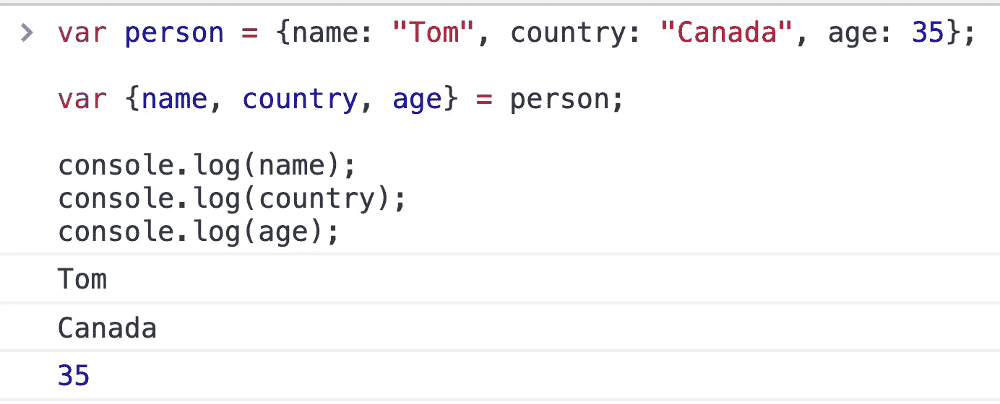

你会得到同样的结果。将变量赋给未声明的对象也是有效的:

```
var {name, country, age} = {name: "Tom", country: "Canada", age: 35};console.log(name);
console.log(country);
console.log(age);
```

## 赋值前声明的变量

对象中的变量可以在用析构赋值之前声明。让我们试试:

```
var person = {name: "Tom", country: "Canada", age: 35};var name, country, age;{name, country, age} = person;console.log(name);
console.log(country);
console.log(age);
```

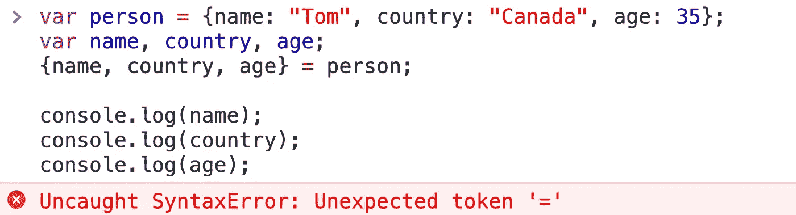

等等，刚刚发生了什么？！哦，我们忘了在花括号前加`()`。

赋值周围的`( )`，在没有声明的情况下使用 object literal 析构赋值时，该语句是必需的语法。这是因为左边的`{}`被认为是一个块，而不是一个对象文字。所以正确的做法是这样的:

```
var person = {name: "Tom", country: "Canada", age: 35};var name, country, age;({name, country, age} = person);console.log(name);
console.log(country);
console.log(age);
```

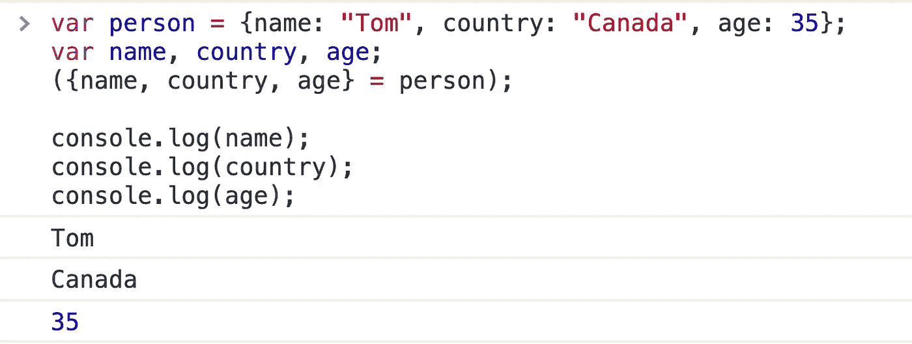

同样需要注意的是，当使用这种语法时，`()`应该以分号开头。否则，它可能用于执行前一行中的函数。

注意，左侧对象中的变量应该与对象`person`中的属性键同名。如果名称不同，我们将得到`undefined`:

```
var person = {name: "Tom", country: "Canada", age: 35};
var name, country, age;
({name, Country, Age} = person);console.log(name);
console.log(country);
console.log(age);
```

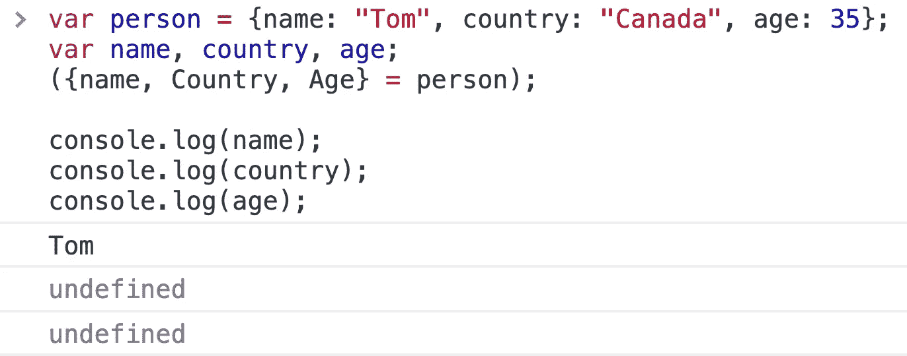

但是如果我们想使用一个新的变量名，我们可以。

## 使用新的变量名

如果我们想将一个对象的值赋给一个新变量，而不是使用属性的名称，我们可以这样做:

```
var person = {name: "Tom", country: "Canada", age: 35};var {name, country: Country, age: Age} = person;console.log(name);
console.log(Country);
console.log(Age);
```

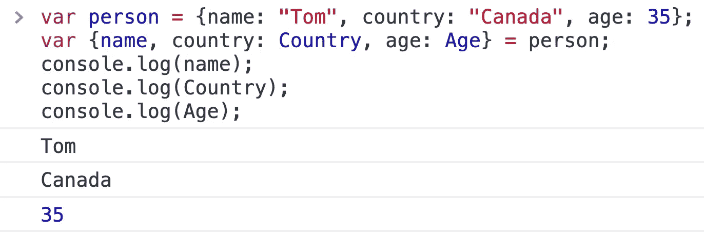

因此提取的值被传递给新变量`foo`和`bar`。

## 使用默认值

默认值也可以在对象析构中使用，以防变量`undefined`在它想要从中提取数据的对象中:

```
var person = {name: "Tom", country: "Canada", age: 35};var {name, sex = "male"} = person;console.log(name);
console.log(sex);
```

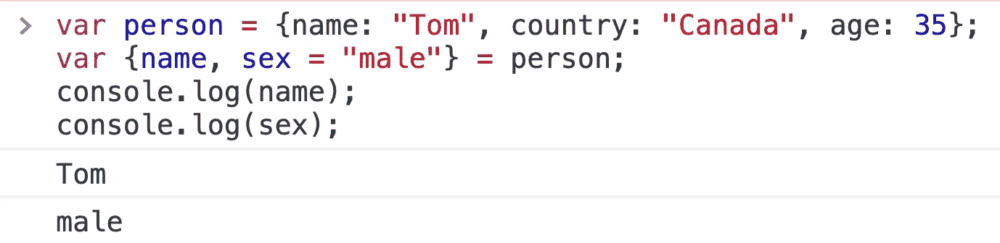

因此，如果值不是未定义的，变量存储从对象中提取的值，就像`name`的情况一样。否则，它会像对`sex`一样使用默认值。

## 计算属性名

计算属性名是另一个对象文字特性，也适用于析构。如果将属性放在方括号中，则可以通过表达式指定属性的名称:

```
var foo = "name";var {[foo]: bar} = {name: "Tom", country: "Canada", age: 35};console.log(bar);
```

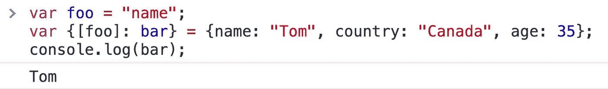

## 对象析构中的嵌套

析构时对象也可以嵌套:

```
let person = {
    name: "Sarah",
    place: {
        country: "Nigeria", 
        city: "Lagos" }, 
    friends : ["Annie", "Becky"]
};let {name:foo,
     place: {
         country : bar,
         city : x}
    } = person;console.log(foo);//"Sarah"
console.log(bar);//"Nigeria"
```

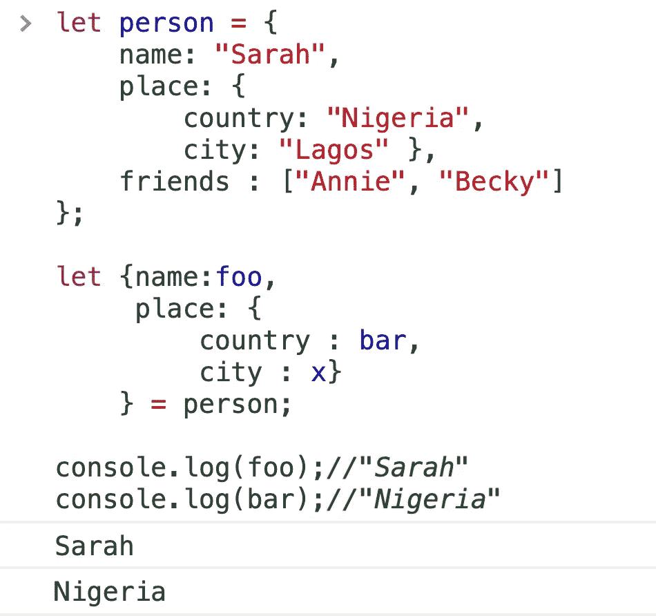

# 数组析构

如果我们想从数组中提取数据，使用析构赋值是非常简单的。

```
var human= ["Tom", 35, "Canada"];var [name, age, country] = human;console.log(name);
console.log(age);
console.log(country);
```

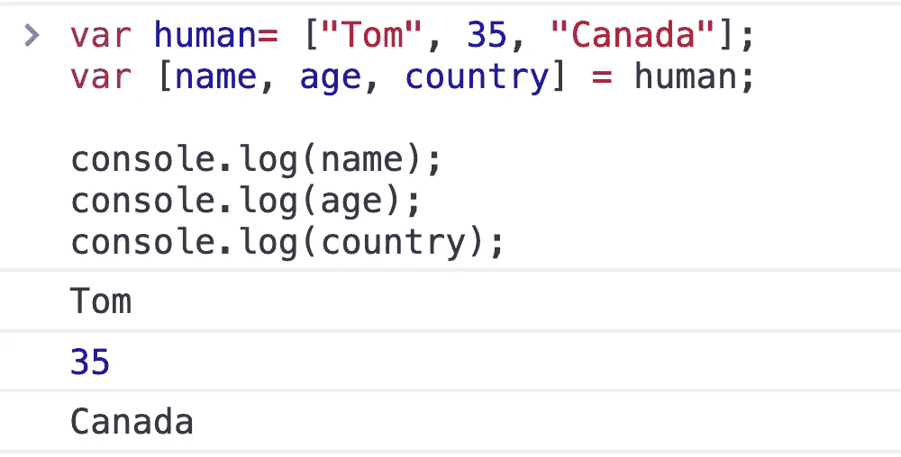

我们也可以用同样的结果来做这件事。

```
var [name, age, country] = ["Tom", 35, "Canada"];console.log(name);
console.log(age);
console.log(country);
```

## 赋值前声明变量

变量可以在赋值前声明，如下所示:

```
var name, age, country;
[name, age, country] = ["Tom", 35, "Canada"];console.log(name);
console.log(age);
console.log(country);
```

请注意，变量是从左到右设置的。所以第一个变量得到数组中的第一项，第二个变量得到数组中的第二个变量，依此类推。

## 跳过数组中的项目

如果我们想得到数组中的第一个和最后一个项，而不是第一个和第二个项，并且我们只想给两个变量赋值，那该怎么办呢？这也可以做到。请看下面的例子:

```
var name, age, country;
[name, , country] = ["Tom", 35, "Canada"];console.log(name);
console.log(country);
```

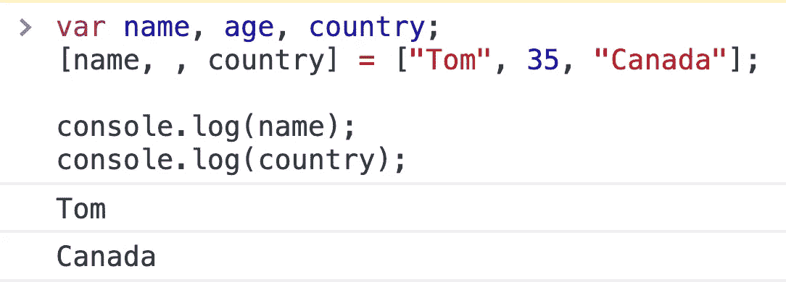

逗号分隔符用于跳过数组中的值。

## 分配数组的其余部分

如果我们想将数组的一部分赋给变量，将数组中的其余项赋给一个特定的变量呢？在这种情况下，我们会这样做:

```
var [name, ...info] = ["Tom", 35, "Canada"];console.log(name);
console.log(info);
```

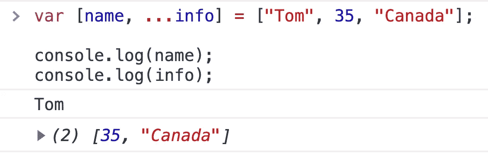

使用这种模式，您可以将数组的剩余部分解包并赋给一个变量。

## 使用默认值

如果从数组中提取的值是`undefined`，则可以将默认值分配给变量:

```
var [name, age = 18, country = "US"] = ["Tom"];console.log(name);
console.log(age);
console.log(country);
```

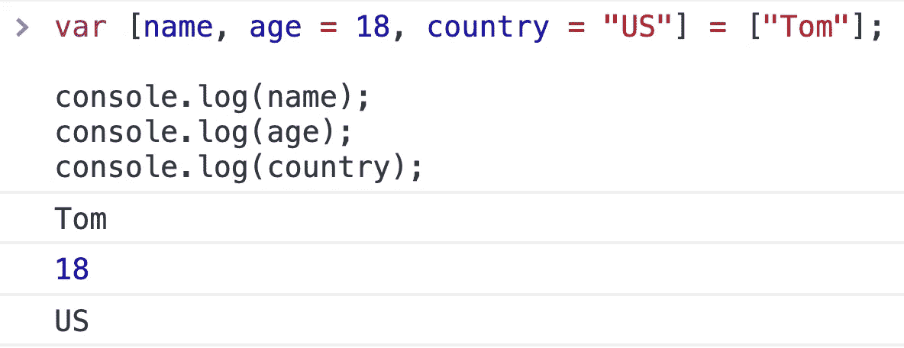

所以`age`回落到 18，因为它没有在数组中定义。

## 使用析构赋值交换值

还有一件事。我们可以使用析构赋值来交换变量的值:

```
var a = 1;
var b = 0;[a,b] = [b,a];console.log(a); // 0
console.log(b); // 1
```

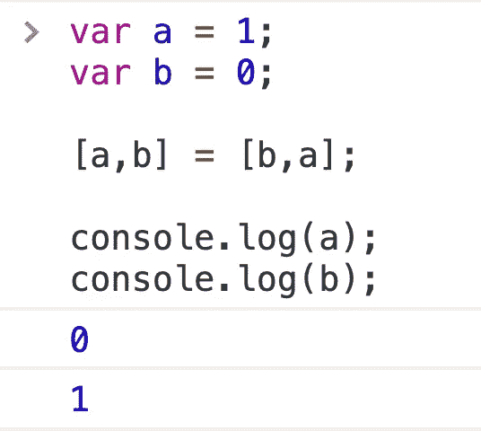

## **用简单英语写的 JavaScript 笔记**

我们已经推出了三种新的出版物！请关注我们的新出版物: [**AI in Plain English**](https://medium.com/ai-in-plain-english) ，[**UX in Plain English**](https://medium.com/ux-in-plain-english)，[**Python in Plain English**](https://medium.com/python-in-plain-english)**——谢谢，继续学习！**

**我们也一直有兴趣帮助推广高质量的内容。如果您有一篇文章想要提交给我们的任何出版物，请发送电子邮件至[**submissions @ plain English . io**](mailto:submissions@plainenglish.io)**，使用您的 Medium 用户名，我们会将您添加为作者。另外，请让我们知道您想加入哪个/哪些出版物。****