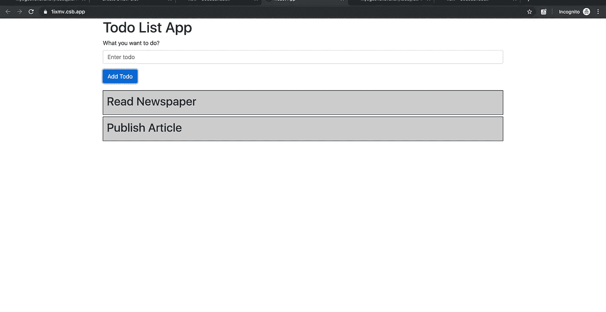
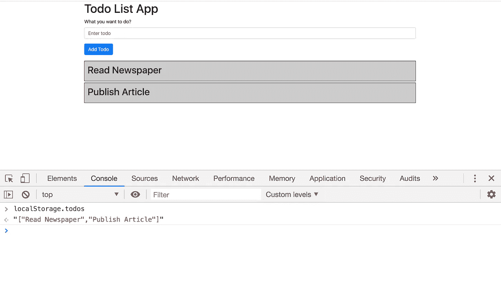
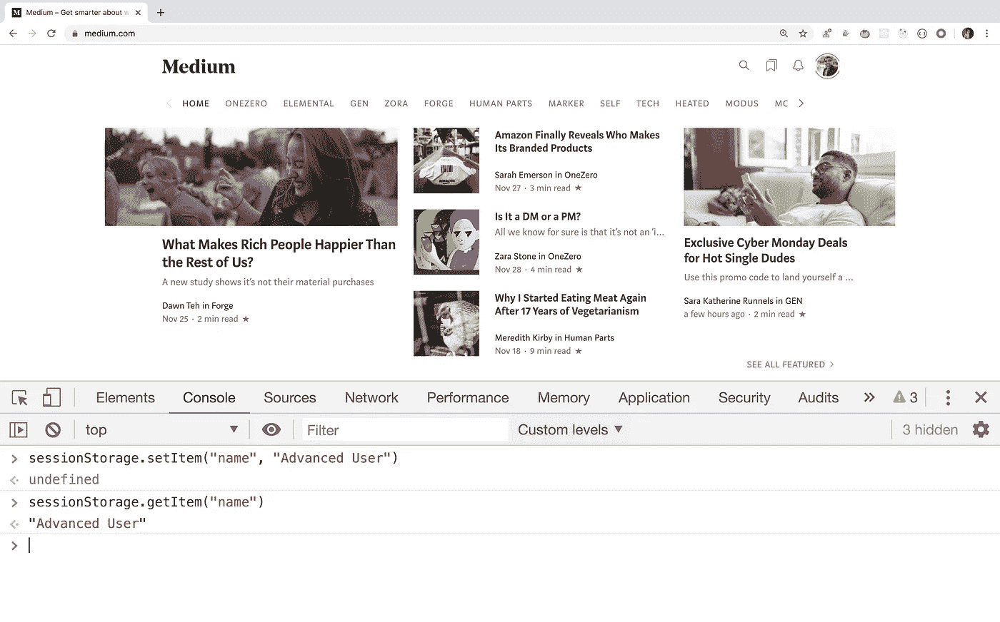
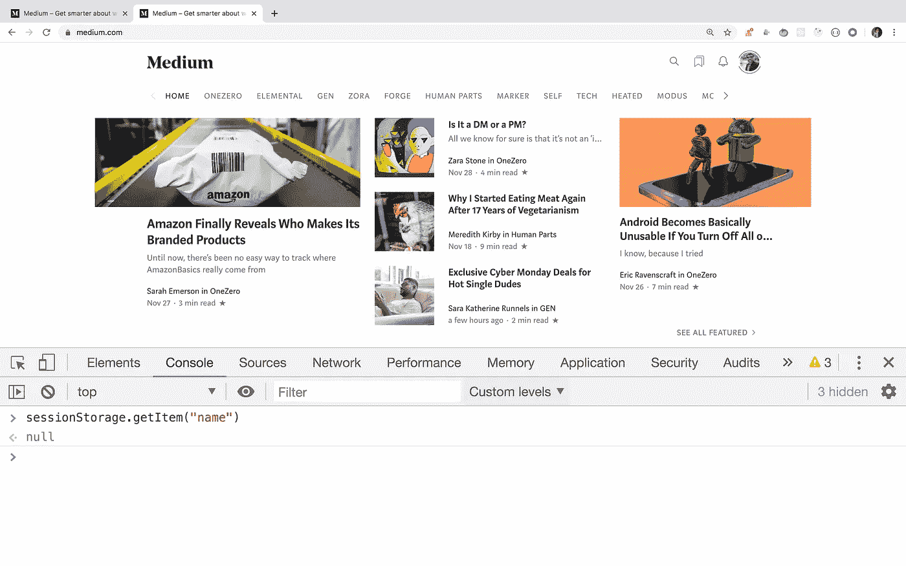
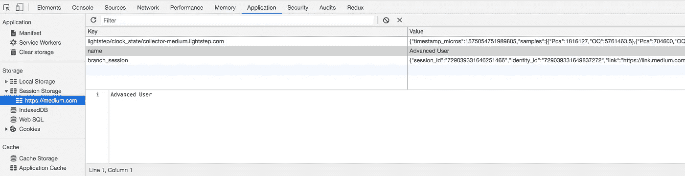

# 关于 HTML5 本地存储和会话存储您需要知道的一切

> 原文：<https://javascript.plainenglish.io/everything-you-need-to-know-about-html5-local-storage-and-session-storage-479c63415c0a?source=collection_archive---------0----------------------->

## 通过构建实际的应用程序来理解它


Photo by [Caspar Camille Rubin](https://unsplash.com/@casparrubin?utm_source=medium&utm_medium=referral) on [Unsplash](https://unsplash.com?utm_source=medium&utm_medium=referral)

您可能听说过本地存储或会话存储术语，但从未有机会探究它。这篇文章将澄清你对它的所有概念。

本地和会话存储属于 HTML5 Web 存储的范畴。

**如果你来自一个会话存储在服务器端的 Java 后台，这和你可能熟悉的会话存储是不一样的。**

**当我们一起讨论会话和本地存储时，我们将使用术语 Web 存储。**

**Web 存储用于在客户端存储数据。因此，即使页面被刷新，数据也是可用的。**

在 Web 存储出现之前，在客户端存储数据的唯一方式是使用`cookies`。

`Cookies`仍在使用，但使用 cookies 有一些缺点

1.Cookies 存储在客户端，并在每次向服务器发送请求时传输到服务器。这使得 cookies 不太安全
2。Cookies 有存储限制。超过一定的限制后，我们无法将更多的数据存储到 cookies 中。可以通过使用一些浏览器扩展工具
4 来禁用 Cookies。在 cookies 中存储数据需要一些额外的代码

**现在让我们来探索一下网络存储**

**会话存储:**

1.  会话存储用于每个浏览器选项卡。因此，存储在一个浏览器选项卡中的数据将无法在另一个选项卡中访问
2.  每个浏览器选项卡都有单独的会话存储数据
3.  当我们关闭该选项卡时，会话存储数据将被清除
4.  当我们关闭浏览器时，它也会被清除

**本地存储:**

1.  本地存储用于存储整个应用程序中的数据
2.  存储在本地存储器中的数据只能在该域的所有标签或页面上访问(如[www.google.com](http://www.google.com/)、[www.medium.com](http://www.medium.com/)等)
3.  即使您在同一浏览器上打开另一个浏览器窗口(Control + n 或 Command + n (Mac))，也可以访问为特定域存储的本地存储数据
4.  当您在私人浏览或匿名模式下打开浏览器时，存储在正常浏览会话中的本地存储数据将不可用。
5.  即使关闭浏览器，本地存储数据也不会被清除。因为它存储在你机器的浏览器缓存中。
6.  只有在使用 Control + Shift + Delete 或 Command + Shift + Delete (Mac)清除浏览器缓存时，才会清除本地存储数据
7.  我们还可以通过编程来清除本地存储数据。我们将很快看到如何去做

**本地存储和会话存储都有 5MB 的存储限制。**

所有现代浏览器都支持网络存储。关于 IE 浏览器，IE 版及以上都支持。

**您可以通过访问**[**http://dev-test.nemikor.com/web-storage/support-test/**](http://dev-test.nemikor.com/web-storage/support-test/)**并运行网络存储测试来检查您的浏览器存储限制。**

***细节够了。现在让我们深入了解如何使用它***

本地存储和会话存储具有相同的语法

**将数据添加到本地存储器**

```
localStorage.setItem(key, value)
```

**从本地存储器中删除数据**

```
localStorage.removeItem(key)
```

**向会话存储器添加数据**

```
sessionStorage.setItem(key, value)
```

**从会话存储器中删除数据**

```
sessionStorage.removeItem(key)
```

**键和值都必须是字符串。但是我们也可以通过使用** `**JSON.stringify**` **方法来存储 JSON 对象。**

**本地存储:本地存储:**

让我们使用 React 查看一个简单的 todo list 应用程序，以便理解 web 存储概念。

点击查看待办事项列表[的现场演示](https://codesandbox.io/s/github/myogeshchavan97/todo_list)

Github 源代码:[https://github.com/myogeshchavan97/todo_list](https://github.com/myogeshchavan97/todo_list)

这不是一个完整的具有所有待办事项功能的应用程序。我只是为这个演示做的。尝试在应用程序中添加一些 todos，你会看到类似这样的东西



Todo List App

现在，如果您刷新页面，所有待办事项都将丢失，您必须重新输入。

为了解决这个问题，我们将在这里添加 localStorage 功能，以保留 todos，即使我们在任何选项卡中访问应用程序。
正如你在组件目录内的`TodoList.js`中看到的，`todos`是一个声明为

```
state = {
  todos: []
}
```

为了将它保存到 localStorage，我们需要使用`JSON.stringify`将其转换成一个字符串，因为本地和会话存储只允许存储字符串。

我们将这样做，如下所示

```
const { todos } = this.state;
const json = JSON.stringify(todos);
localStorage.setItem("todos", json);
```

现在，如果我们打印保存的数据，您将看到如下所示的输出



Todo local Storage

为了读回数据，我们需要解析它，因为它是作为 JSON 字符串存储的

```
const todos = localStorage.getItem("todos");
if(todos) {
 const parsedJSON = JSON.parse(todos);
 this.setState({ todos: parsedJSON });
}
```

完整的代码将如下所示

演示:[https://code sandbox . io/s/github/myogeshchavan 97/todo _ list _ with _ local storage](https://codesandbox.io/s/github/myogeshchavan97/todo_list_with_localstorage)

让我们从`componentDidMount`和`componentDidUpdate`来理解上面的代码

1.每当我们将项目添加到 todo 时，状态 todos 数组都会改变，因此这是将 todos 存储在本地存储中的最佳时机

2.我们正在用`componentDidUpdate`方法做这件事

当状态或属性改变时，调用这个方法。在这种方法中，我们检查先前的 todos 数组和当前的 todos 数组长度是否不同，然后才存储在本地存储中

3.在`componentDidMount`中，我们从 localStorage 中读取并添加回状态

所以每次组件被渲染时，我们都从本地存储器中读取数据。

这将确保即使我们刷新页面，待办事项也不会丢失。

Github 更新源代码:[https://github . com/myogeshchavan 97/todo _ list _ with _ local storage](https://github.com/myogeshchavan97/todo_list_with_localstorage)

**使用本地存储的另一个用例是存储购物车商品，即使在页面刷新后，添加到购物车的商品也不会丢失。**

***会话存储:*** 转到任何一个类似[medium.com](http://medium.com/)的网站，在控制台中粘贴下面一行并点击回车

```
sessionStorage.setItem("name", "Advanced User")
```

现在，一个新的条目将被添加到 medium.com 域的 sessionStorage 中。

现在，如果您使用`sessionStorage.getItem("name")`检查该值，您将会看到我们如下所示设置的文本`"Advanced User"`



Session Storage Example

现在，在同一个浏览器窗口的另一个选项卡中打开[medium.com](http://medium.com/)，检查`sessionStorage.getItem("name")`的值

您将看到空打印，而不是如下所示的`"Advanced User"`



Session Storage in new tab

**这是因为即使在相同的域中，每个标签也具有单独的会话存储数据，但是对于每个新标签，本地存储数据在相同的域中是可用的。在 chrome 开发者工具的`Application`标签下，你可以看到每个站点的所有本地和会话存储数据，如下所示**



Web Storage Data

**现在考虑下面的场景。**

**假设您在页面上有一个模态，显示一些长表单来输入细节。这种情况经常发生，用户在表单中输入一些数据，然后不小心点击了模态之外的地方，模态就关闭了。因此他丢失了所有输入的数据。**

**为了避免数据丢失，我们可以使用 sessionStorage，这样存储在 modal 中的数据将只适用于当前选项卡。**

**演示:[https://codepen.io/myogeshchavan97/pen/rNaBONm](https://codepen.io/myogeshchavan97/pen/rNaBONm)**

**这里我们有一个打开模态的按钮。当我们单击模式中的关闭按钮时，我们将所有输入的数据保存在 sessionStorage 中，当用户再次打开模式时，我们用先前输入的值填充输入字段。**

**另外，请注意，我们在页面加载时清除会话数据，因此在初始加载时，表单将是空的。**

**放在一起，**

**我们构建的所有应用程序的 Github 源代码:
1。[https://github.com/myogeshchavan97/todo_list](https://github.com/myogeshchavan97/todo_list)2
。[https://github . com/myogeshchavan 97/todo _ list _ with _ local storage](https://github.com/myogeshchavan97/todo_list_with_localstorage)**

**Codepen 源代码:
[https://codepen.io/myogeshchavan97/pen/rNaBONm](https://codepen.io/myogeshchavan97/pen/rNaBONm)**

**今天到此为止。我希望你今天学到了新东西。**

****别忘了直接在你的收件箱** [**这里**](https://yogeshchavan.dev) **订阅我的每周简讯，里面有惊人的技巧、窍门和文章。****