# JavaScript 中关于 NaN 的所有知识

> 原文：<https://javascript.plainenglish.io/everything-you-need-to-know-about-nan-in-javascript-1ae9e74cbefe?source=collection_archive---------3----------------------->

## 此外，为什么你应该停止使用 isNaN 和用什么来代替


Photo by [John Matychuk](https://unsplash.com/@john_matychuk?utm_source=medium&utm_medium=referral) on [Unsplash](https://unsplash.com?utm_source=medium&utm_medium=referral)

`NaN`是一个全局属性，表示非数字的值，因此得名。当进行算术运算或将某个值强制转换为数字时，可能会返回值`NaN`。下面是一些导致`NaN`的操作

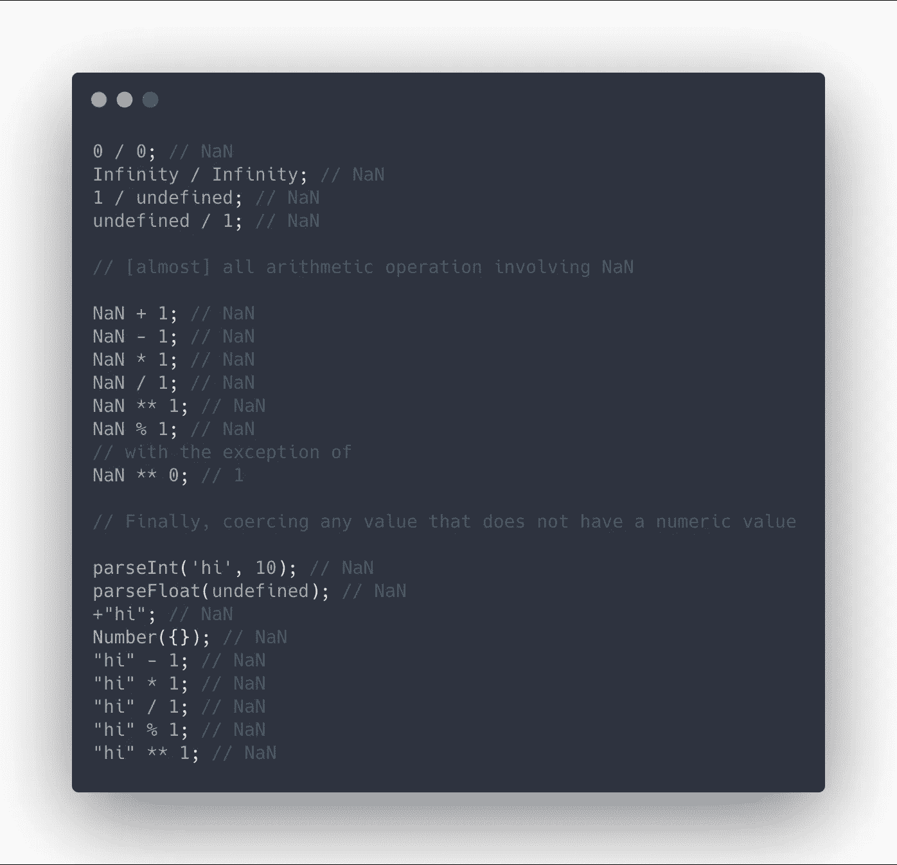

值得一提的是，关于`NaN`的大部分困惑来自于将非数值强制转换为数值的行为，这导致了`NaN`。出于这个原因，我建议您熟悉一下上面代码中的最后几个例子，更好地了解一下为什么有些值，如布尔值、`[1]`和`‘’`不会产生`NaN`

## 关于`NaN`的有趣事实

`NaN`以狡猾著称，然而，如果你熟悉以下几个事实，你将能够毫无问题地与`NaN`合作。

`NaN`不像它的名字实际上是来自于类型号

```
typeof NaN; // 'number'
```

`NaN`具有虚假值

```
Boolean(NaN); // false
```

`NaN`是 JavaScript 中唯一不等于自身的值。提示:这将在以后变得有用。

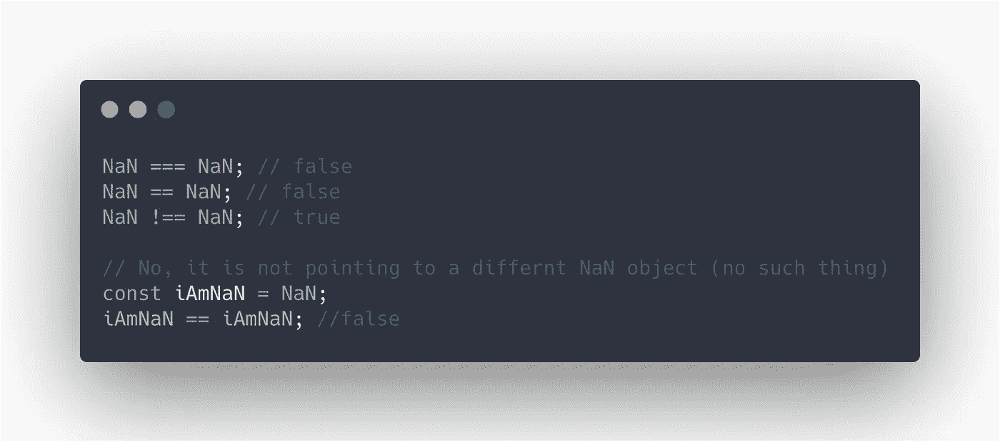

您可以通过四种不同的方式访问`NaN`

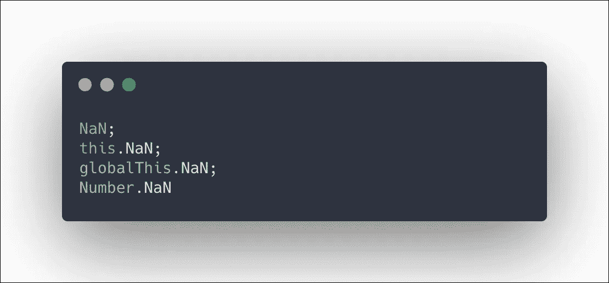

避免与`NaN`进行比较

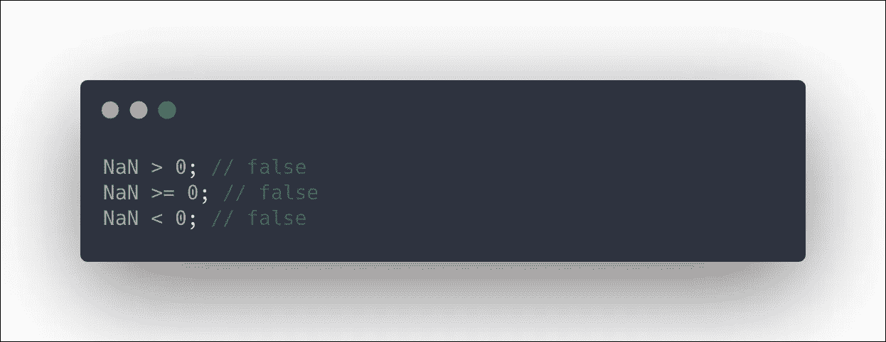

## 让我们看一个例子

假设我们有一个函数，它接受一个参数并按`10`递增。我们希望接受数字和代表数字的字符串，所以我们将使用`parseFloat`

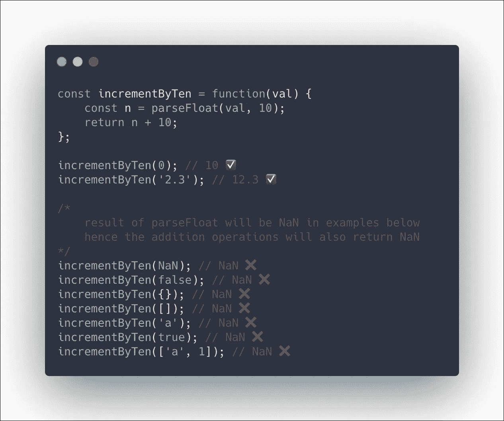

我们刚刚了解到有很多论点会导致`NaN`。也许更好的处理方法是在这些情况下抛出一个错误。然而，正如我们之前了解到的，通常的比较对`NaN`不起作用，如下所示。为此，我们将使用全局函数`isNaN`。

```
typeof NaN === NaN; // false
NaN === NaN; // false
```

# 什么是`isNaN`，它是如何工作的？

`isNaN`是一个全局函数，接受一个参数并返回一个布尔值，表明传递的参数是否是`NaN`。

> *函数[* `*isNaN*` *]应该被解释为回答这样一个问题:“当这个值被强制为一个数值时，它是一个 IEEE-754‘非数字’值吗？”*
> 
> *— MDN*

我们现在用`isNaN`编写函数，当`parseFloat`的结果是`NaN`时抛出一个错误。

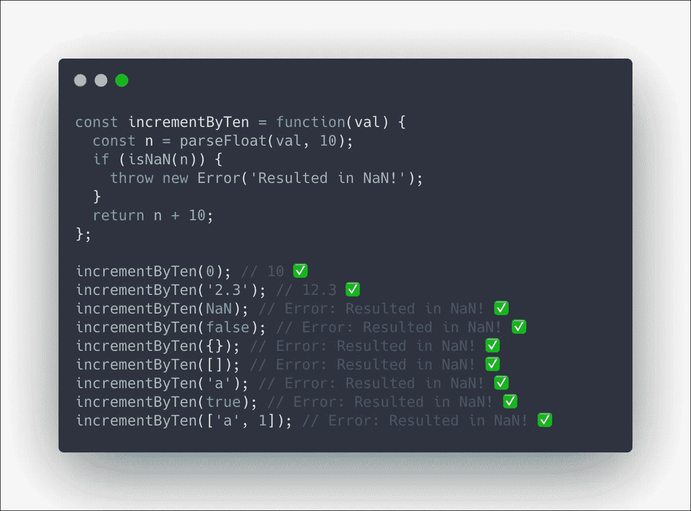

太好了，我们的功能正常工作。现在让我们了解更多关于`isNaN`的信息。理解`isNaN`如何工作的最好方法是为它创建我们自己的【基本版本】polyfill。Polyfill 不用`isNaN`了，超级老...IE 3 老！👴🏽

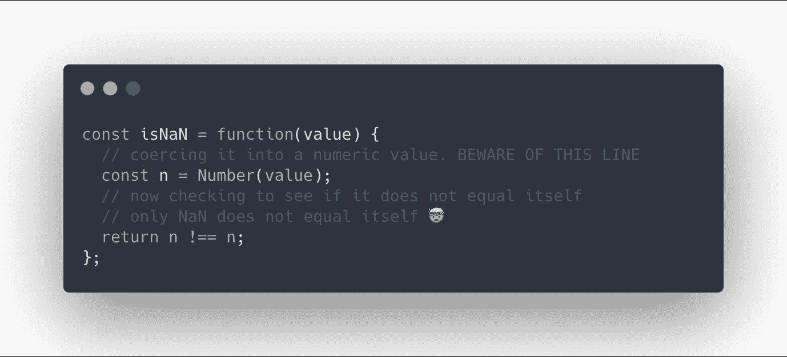

当使用`isNaN`时，你需要注意值到数值的强制。请记住，有些值不能被强制为数值，会产生`NaN`，所以即使你对`isNaN`的参数可能不是`NaN`，它也会变成一个。

这里有几个发生这种情况的例子，并且`isNaN`不像我们预期的那样工作:

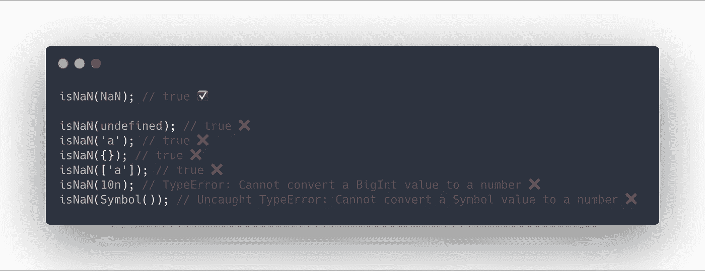

# `Number.isNaN`去营救🦸🏻‍♀️

由于上述原因，使用`isNaN`并不理想。这就是为什么从 ES6 开始在 JavaScript 中加入了`Number.isNaN`的原因。这两个函数的主要区别在于`Number.isNaN`在确定其是否为`NaN`之前不会将其参数转换为数值。

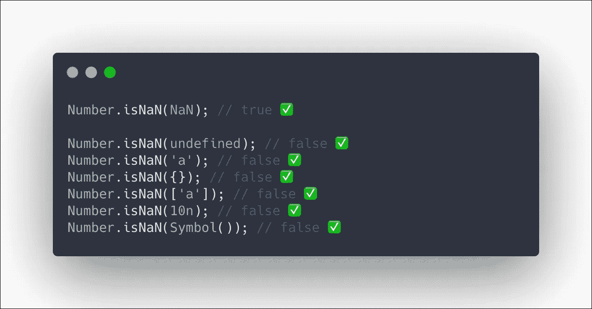

太好了，它像预期的那样工作。

我推荐一直用`Number.isNaN`。即使你想把这个值强制转换成一个数字值，你也可以自己做，然后用`Number.isNaN`来清楚地表达你的意图。

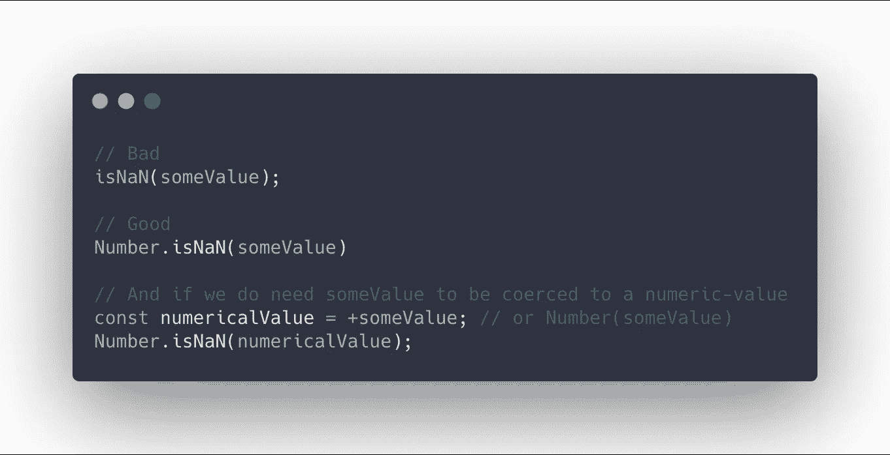

# 本机`isNaN`和`Number.isNaN`的替代品

正如你可以想象的那样，在`Number.isNaN`推出之前，我们有一些变通办法来处理这个问题，这些办法可能不再需要，但值得注意。

# 写你自己的

如果你不打算使用`Number.isNaN`，这可能是最快的方法。理解这个函数的关键是`isNaN`是唯一不等于自身的值。

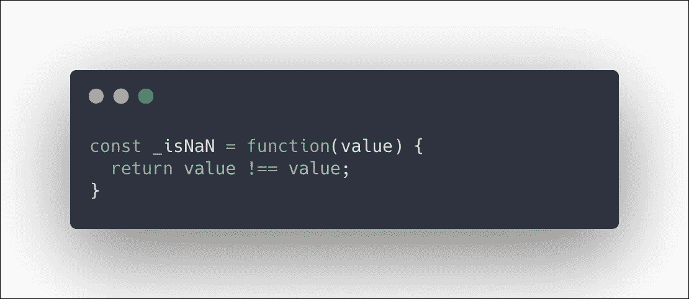

# Lodash 和下划线

这两个流行的实用程序库都有自己的功能版本，工作方式类似于`Number.isNaN`

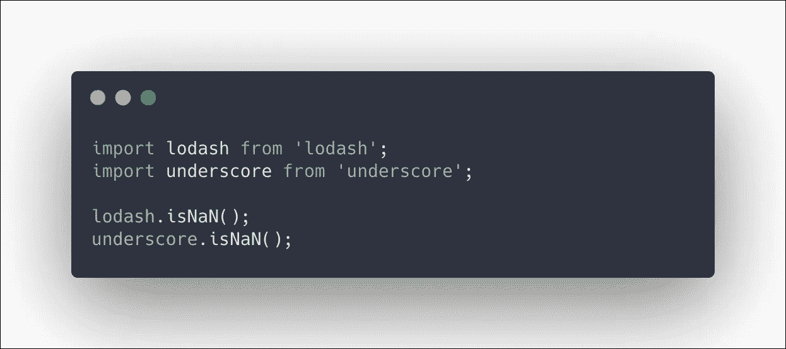

# 资源和引用

*   MDN[https://developer . Mozilla . org/en-US/docs/Web/JavaScript/Reference/Global _ Objects/NaN](https://developer.mozilla.org/en-US/docs/Web/JavaScript/Reference/Global_Objects/NaN)
*   ECMAScript 规范[https://tc39 . es/ECMA 262/# sec-value-properties-of-the-global-object-nan](https://tc39.es/ecma262/#sec-value-properties-of-the-global-object-nan)

`isNaN`

*   MDN:[https://developer . Mozilla . org/en-US/docs/Web/JavaScript/Reference/Global _ Objects/isNaN](https://developer.mozilla.org/en-US/docs/Web/JavaScript/Reference/Global_Objects/isNaN)
*   ECMAScript 规范[https://tc39.es/ecma262/#sec-isnan-number](https://tc39.es/ecma262/#sec-isnan-number)
*   洛达什[https://lodash.com/docs/4.17.15#isNaN](https://lodash.com/docs/4.17.15#isNaN)
*   下划线[https://underscorejs.org/#isNaN](https://underscorejs.org/#isNaN)

`Number.isNaN`

*   MDN[https://developer . Mozilla . org/en-US/docs/Web/JavaScript/Reference/Global _ Objects/Number/isNaN](https://developer.mozilla.org/en-US/docs/Web/JavaScript/Reference/Global_Objects/Number/isNaN)
*   ECMAScript 规范[https://tc39.es/ecma262/#sec-number.isnan](https://tc39.es/ecma262/#sec-number.isnan)

相关主题

*   freeCodeCamp: JavaScript 类型强制解释[https://www . freeCodeCamp . org/news/js-type-construction-explained-27ba 3d 9a 2839/](https://www.freecodecamp.org/news/js-type-coercion-explained-27ba3d9a2839/)
*   SitePoint ES6 新编号方法[https://www.sitepoint.com/es6-number-methods/](https://www.sitepoint.com/es6-number-methods/)