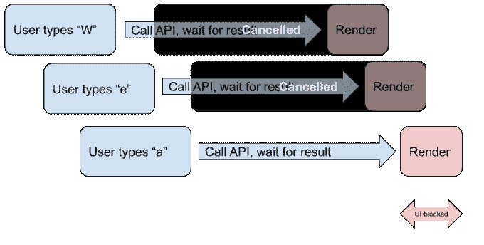

# 关于 2020 年的 React 并发模式，你需要知道的一切

> 原文：<https://javascript.plainenglish.io/everything-you-need-to-know-about-react-concurrent-mode-in-2020-826af48c1f37?source=collection_archive---------0----------------------->

## 一些激动人心的变化即将到来


React 不断发展，你必须跟上它才能在市场上有价值。在这篇文章中，我将告诉你 React 并发模式，这是一个尚未被采用的新特性。

> *在任何情况下都不要将本建议用于生产(截至 2020 年 5 月)。并发模式是实验性的，充满了错误，在您阅读本文时，可能会也可能不会引入突破性的变化。*

# 什么是并发模式？

React 有一个复杂的机制来处理组件的更新。并发模式是对该算法的一系列更改，本质上是让 React 同时渲染多个树，中断、延迟或消除正在进行的渲染并推迟状态更新。

你可以把它想象成一个版本控制系统:在任何时间点，用户都可以看到“主”分支。React 在后台渲染不同的分支。一旦到了将它呈现给用户的时候，它们就被合并到“主”中。如果不再需要某个分支，它就会被拆除，永远不会被合并。

# 为什么我们需要并发模式？

主要还是为了用户体验。我想你们大多数人在使用 React 应用程序时都经历过口吃和奇怪的死机。特别是，您可以在自动完成的异步文本字段(搜索建议)中输入时注意到它。有很多方法可以解决这个问题，但直到现在都没有解决。


这张图应该会更清楚。一旦 API 请求返回自动完成数据(不再有效)，UI 就会被阻止更新它。在 React 并发模式下，UI 永远不会被同步操作阻塞。一旦您更改了文本字段中的值，React 就会停止正在做的任何事情，并立即开始传播这些更改，而无需等待旧的自动完成调用和呈现完成。

当然，这个特殊的问题可以通过去抖动和节流来解决。但是这些都不是很优雅，在网速低的情况下仍然会导致口吃。React 并发模式是针对所有环境中所有类似问题的综合解决方案。



最重要的是，如果更多的相关数据已经到达，渲染可以中途中断。这将带来前所未有的性能提升。

# 如何使用并发模式？

我再次强调，不要把它用在敏感的生产项目上。尽管这些特性目前还比较稳定，但开发团队可能会随时彻底改变它们。

目前，并发模式只针对 ReactDOM(传统的 HTML React)实现，而不是 React Native。通过使用自定义入口脚本，您可以在 React Native 中仅在 web 构建中使用它。对于常规的 React，已经包含了这个脚本。您需要将行`ReactDOM.render(<App />, rootNode)`改为:

```
ReactDOM.createRoot(rootNode).render(<App />)
```

就是这样。这将为您的应用程序启用完全并发模式。但是，您应该不会立即注意到任何变化。唯一可能发生的事情是，如果您使用与并发模式不兼容的第三方依赖项，您的应用程序将不再工作。

现在，并发模式本身几乎毫无用处。为了使用，我们将参考 React 推出的另外两个特性以及并发模式:`Suspense`和`useTransition`。

# 焦虑

悬念不仅是加快你申请速度的一种方式，而且也使申请变得更简单。“暂停”允许您等待组件完全渲染，并在渲染时显示加载器。考虑这个例子:

在第 3 行，我们*开始*从远程服务器装载汽车，假设这个调用可能需要一段时间。然后，`App`渲染，`Suspense`试图渲染`CarDetails`。`CarDetails`调用`cars.read()`，一直阻塞到装车。`Suspense`看到组件还不能渲染，转而渲染`fallback`。一旦汽车数据准备就绪，`Suspense`将用`CarDetails`替换`fallback`。注意，我使用的是任意的 API，只是为了向您展示`Suspense`是如何工作的。`Suspense`需要库支持，还不能直接使用`fetch`。脸书的 GraphQL 客户端， [Relay](https://relay.dev/) ，目前支持`Suspense`。

# 使用过渡

`useTransition`与`Suspense`密切相关，但让您对过程有更多的控制。简而言之，`useTransition`是一个钩子，如果数据还不存在，它允许您延迟状态更新。例如，在按下按钮导航到下一个屏幕后，您可能希望等待一秒钟，这样下一个页面就可以加载，而用户不会看到任何白屏或加载微调器。`useTransition`是这样使用的:

同样，我们使用任意的 API 实现，非常接近中继。最初用的是`initialResource`，没有车。用户可以通过按下按钮来装载汽车。stare 会更新使用`carResource`，`CarView`会有一些车展示。但是，它们必须先被加载。

这就是`useTransition`发挥作用的地方。它返回两个值:一个是`startTransition`，它是一个启动转换的函数，另一个是`isPending`，它是一个布尔值，让您知道转换是否正在进行。在传递给`useTransition`的配置对象中，我们指定了`timeoutMs`属性。这是`useTransition`可以等待延迟状态更新的最大时间。如果 1 秒钟后数据仍不存在，状态将被更新，并且`CarView`将重新出现在主屏幕上。

在第 9 行你可以看到`startTransition`的用法。我们传递一个更新状态的函数来使用`carResource`。React 将制作一个`CarView`的副本，传入更新后的`resource`并等待它重新呈现。如果在一秒钟内获取数据，`CarView`将完成渲染，React】将合并到主 UI 树中。如果 1 秒钟后它不存在，React 仍然会合并它，所以您需要自己在`CarView`中实现一个加载微调器。

# 结束语

感谢您的阅读，我希望您和我一样对并发模式感兴趣。敬请关注更多文章！

# 资源

*   [采用并发模式](https://reactjs.org/docs/concurrent-mode-adoption.html)
*   [继电器](https://relay.dev/)
*   [React 对账算法](https://everyday.codes/javascript/how-react-reconciliation-algorithm-works/)

[](http://eepurl.com/gYiA29)

## **简明英语团队的笔记**

你知道我们有四种出版物吗？给他们一个 follow 来表达爱意:[**JavaScript in Plain English**](https://medium.com/javascript-in-plain-english)[**AI in Plain English**](https://medium.com/ai-in-plain-english)[**UX in Plain English**](https://medium.com/ux-in-plain-english)[**Python in Plain English****—谢谢，继续学习！**](https://medium.com/python-in-plain-english)

**我们还推出了一个 YouTube，希望你们支持我们，通过 [**订阅我们的简明英语频道**](https://www.youtube.com/channel/UCtipWUghju290NWcn8jhyAw)**

**一如既往,“简明英语”希望帮助推广好的内容。如果您有一篇文章想要提交给我们的任何出版物，请发送电子邮件至[**submissions @ plain English . io**](mailto:submissions@plainenglish.io)**并附上您的媒体用户名和您感兴趣的内容，我们将会回复您！****