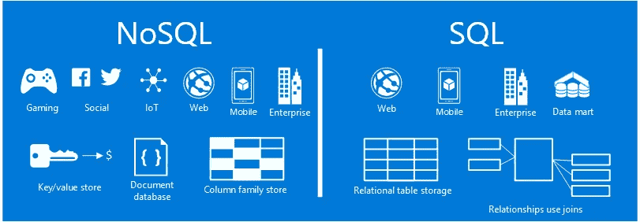
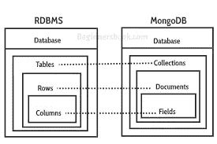

# 关于 2020 年的网络开发，你需要知道的一切

> 原文：<https://javascript.plainenglish.io/everything-you-need-to-know-about-web-development-2020-fb1e7cd0b180?source=collection_archive---------6----------------------->

## 你对学习 Web 开发感兴趣但不确定如何开始？

Photo credit to [Omar Prestwich](https://unsplash.com/photos/D7_Bu5-MfkE)

为了理解 Web 开发如何工作以及如何开始，我们将回答这几个问题。

在这篇文章的结尾，我们将能够大体上理解这些重要的主题，当然，对你来说阅读更多并进一步理解它们是很重要的，因为你将能够把这些点连接起来并理解它们是如何一起工作的，包括它们的依赖性，这是至关重要的。

*   Web 开发
*   前端开发
*   后端开发
*   超文本标记语言
*   半铸钢ˌ钢性铸铁(Cast Semi-Steel)
*   Java Script 语言
*   计算机网络服务器
*   数据库ˌ资料库
*   计算机编程语言
*   Ruby/Ruby on Rails
*   Java 语言(一种计算机语言，尤用于创建网站)
*   服务器端编程语言（Professional Hypertext Preprocessor 的缩写）
*   结构化查询语言
*   关系型数据库
*   NoSQL
*   MongoDB
*   代码编辑器
*   虚拟代码
*   JavaScript 框架
*   反应堆
*   有角的
*   某视频剪辑软件
*   免费和付费教程网站
*   开源代码库
*   引导程序
*   Stackoverflow
*   厚颜无耻
*   响应式设计

# 什么是 Web 开发

让我们从不同的角度来定义 web 开发，web 开发可以分为两个部分，我们称之为前端开发和后端开发。

让我们想象一个网站，一个网站只是一堆文件或数据，存储在一台叫做**服务器**的电脑里。这台我们称之为服务器的电脑连接到互联网上，你可以在其中使用你的电脑或手机查看、使用或打开你的网络浏览器，如谷歌浏览器、火狐浏览器、Safari 浏览器，你可以看到并与之互动的浏览器被称为**客户端**。

所以服务器和客户端之间的连接是这样的，任何你能看到的，你能交互的东西，都是客户端，所以，举例来说，你想看一张狗的照片，所以就像在谷歌网站上，当你在你的浏览器上键入 dog，这是**客户端**，一旦你点击搜索按钮，它就会与**服务器**通信，请求关于狗的数据， 然后，服务器会将一些数据加载回你的浏览器或客户端，例如谷歌网站，这就是互联网的工作方式，来来回回，来来回回。

所以，在客户端工作的开发人员被称为前端开发人员，他们负责前端开发，而在服务器端工作的开发人员被称为后端开发人员，他们负责后端开发，你可以猜到，我希望你现在可以清楚地了解他们的联系。

# 什么是前端和后端，它们有什么不同？

## 前端开发

Web 开发的基本结构由 HTML、CSS 和 JavaScript 组成。

这就是我们前面提到的客户端发生的地方。

网上有一些资源可以让你开始学习编程的基础知识。一个很好的起点是 CodeAcademy 和 Udemy，它们提供了从初学者到专家的大量教程，Udemy 尤其提供了广泛的学习范围，涉及到计算机科学、计算机工程、数据科学等每一个领域。

我真的建议你从一开始就开始，不要走捷径，从长远来看好处会很明显。通过使用 HTML、CSS 和 JavaScript，你可以开始构建网站，然后是静态网站，然后是响应式网站。

一旦你最终能够熟练使用这 3 个基础知识，你就可以开始探索 Ajax、JQuery，如果你想进一步了解 JavaScript，你可以选择你想要的框架或库，比如 Reactjs、Angular、Vue、Nodejs、MongoDB，我们将在后面的部分进一步讨论。

**代码编辑器**

让我们首先讨论代码编辑器，当你开始构建你的网站时，要使用的最重要的工具之一就是你的代码编辑器，或者被称为 **IDE 或者集成开发环境。**这将是您编写代码时使用的工具，它会将您的代码编译并转换为机器代码，这是计算机唯一能理解的语言。

有几个代码编辑器可供选择，我们将只列出几个和今天流行的编辑器，VSCode 是全世界开发人员的最爱，它是轻量级的，非常快，而且是免费的。您可以探索的其他代码编辑器有 **Sublime Text、Atom、**，对于高级开发人员，他们有时会使用 **VIM** 。

如果您想了解关于 VSCode 的更多信息，请查阅本文，在这篇文章中，我们将进一步讨论如何充分利用 VSCode。链接此处

这里有一个很好的入门课程，让你了解更多关于 HTML 和 CSS 的知识。

**HTML**

HTML 或者我们所说的超文本标记语言是你在互联网上看到的每一个网站的基础。它包含了一个网站页面的所有内容，它建立了一个非常主要的结构，如果你把它比作一个房子，HTML 是墙和砖，这是作为第一个基础，然而，HTML 是非常基本的。

## 半铸钢ˌ钢性铸铁(Cast Semi-Steel)

CSS 或者层叠样式表是你在设计你的网站、颜色、字体、大小等等时会用到的工具。你也可以开始创建动画，形状，甚至是网站的屏幕尺寸，这样你的网站不仅在笔记本电脑上看起来很好，而且在用户通过手机查看你的网站时也很好，所以这有点棘手，但非常有用和聪明，一旦你明白它是如何工作的，一切都会很容易。

## Java Script 语言

JavaScript 是浏览器的编程语言。通过使用这个工具，你可以使你的网站更具交互性和动态性，你也可以通过 JavaScript 制作动画，比如使用 Ajax 和 JQuery。

你可以在网站上多次看到的一个很好的例子是“返回顶部”按钮，一旦你能够触及页面的底部，就很难或者需要很长时间才能再次滚动，这样你就可以回到页面的顶部，但是只要点击那个按钮，它就会自动为你完成，没有麻烦，一个快乐的用户是好设计的一个很好的标志。

随着时间的推移，你可以开始深入研究 JavaScript，你可以开始学习它的框架和库，比如 Reactjs、Angular 等。但是你必须首先真正习惯使用 JavaScript，并且花时间学习普通的 JavaScript。

# 后端开发

后端开发可以是面向对象编程或面向对象编程，或功能编程。Java。NET 和 Python 是当今最流行的面向对象语言。

虽然函数式编程使用声明性语言，但它仅仅意味着语句甚至可以以不同的顺序执行，这现在常用于数据科学，您可以使用的语言是 SQL 和 r。

## 计算机网络服务器

如前所述，服务器只是网站的后端。它是一台存储数据和文件的计算机。这是客户端或前端通信并请求您需要的一些数据的地方。

让我们把服务器分成两部分，传统的和无服务器的。

传统服务器的一个例子是通过 Windows 和 Linux 运行的，这些服务器是集中的，因为网站需要的所有东西都存储在这里。

虽然无服务器体系结构正好相反，但它们是分散的，这意味着所有的东西都被分开，一些数据或文件由第三方无服务器供应商处理，比如亚马逊网络服务或 AWS。

无服务器体系结构在今天越来越受欢迎，因为它更便宜、更快，而且维护起来也更简单。

## 数据库ˌ资料库

数据库可以分为两部分，关系数据库和非关系数据库。

关系数据库表将结构化数据字段组织到定义的列中。非关系数据库不实践或使用表、模型，相反，所有数据都可以存储在一个文档中。

# 后端编程语言

**PHP —** 是另一种很好的学习语言，特别是对于想从事后端开发的初学者。

PHP 比其他编程语言对初学者更友好，它对错误更宽容，有非常广泛的社区支持，这一点非常重要，因此您可以在网上找到一些资源，您可以在遇到问题时使用，比如教程和论坛。最后，与 Rails 上的 Ruby 相比，使用 PHP 的环境设置要简单得多，甚至在您开始编写第一段代码之前，Rails 上的 Ruby 就已经让您头疼了。

**红宝石与铁轨上的红宝石**

Ruby on Rails 是一种使用 Ruby 编程语言构建的 Web 开发语言。Ruby on Rails 包含几个工具，您可以使用它们来创建基本的操作或任务，比如只需使用一行代码就可以创建一个博客。

Ruby 是开源的，这也意味着广泛的社区支持。你可以用 ruby 做的一些事情是你可以自动化重复的任务，你可以构建 web 和移动应用，创建原型等等。

**Python**

python 今天已经获得了很大的吸引力，并且它每天都在以越来越快的速度增长，许多大学现在都在转向学习 Python，Python 是为构建 Web 和桌面应用程序开发而构建的。

与其他编程语言相比，python 的一个优点是易于理解，非常优雅，可读性强，语法简洁明了。

Python 和 Ruby 有很多相似之处，它是开源的、面向对象的、简单明了的。

**Java**

Java 是世界上最流行的编程语言，也是最古老的语言之一，因为它已经被成千上万的开发人员使用了 20 多年，它被称为最流行是有原因的。Java 有能力扩展到移动电话，甚至智能卡，即使在桌面和商业软件中得到所有的流行。

如果你想学习 Java，一个令人兴奋的方法是，这种语言用于 Android 开发移动应用程序，如果你想成为原生 Android 开发者，那么开始学习 Java。

## 数据库的类型

Photo credit to [DZone](https://www.google.com/url?sa=i&url=https%3A%2F%2Fdzone.com%2Farticles%2Fa-comparison-of-sql-and-nosql-to-simplify-your-dat&psig=AOvVaw0G_e34fVe87b7AhGXdINC-&ust=1586532556580000&source=images&cd=vfe&ved=0CAIQjRxqFwoTCKjagYzU2-gCFQAAAAAdAAAAABAD)

## **SQL**

结构化查询语言或 SQL 是最流行的查询语言。它只是用来与数据库进行交互和通信。

幸运的是，对于初学者来说，SQL 是一种很好的入门语言，它是一种声明性语言，允许开发人员声明他们想要看到的结果，即使没有构建上述参数的步骤或过程。

如果您对学习数据库感兴趣，如果您想探索并充分利用任何原始数据可能是出于商业目的，那么 SQL 是一个很好的起点。

您可以用 SQL 做的事情只是构造、设计和操作数据库上的数据。

**MySQL**

Mysql 是当今最受欢迎的技术之一，尤其是在管理大数据方面。MySQL 是一种关系数据库，即使在非关系数据库越来越流行的今天，MySQL 仍然是今天最容易识别的查询语言。

这里有一个快速教程来了解更多关于 MySQL 的知识

 [## 关系型数据库

### Oracle MySQL 云服务构建于 MySQL 企业版之上，由 Oracle 云提供支持，可提供简单的…

www.mysql.com](https://www.mysql.com/) 

## **NoSQL**

NoSQL 或非 SQL 是非关系数据库。

随着企业和一些组织寻找更好的方法来管理他们的大数据，非关系数据库系统或 NoSQL 进入了视野，尤其是 MongoDB。

**MongoDB**

在 MongoDB 中，行和列不再存在，关系数据库是在其中构建的。

Photo credit to [BeginnersBook](https://www.google.com/url?sa=i&url=https%3A%2F%2Fbeginnersbook.com%2F2017%2F09%2Fmapping-relational-databases-to-mongodb%2F&psig=AOvVaw2ZjOFj4zMqm7szkab0Ezrj&ust=1586532136438000&source=images&cd=vfe&ved=0CAIQjRxqFwoTCJj38cLS2-gCFQAAAAAdAAAAABAD)

关系数据库(SQL)是基于表的，而像 MongoDB 这样面向文档的数据库(NoSQL)是基于包含键/值属性的文档集合的。MongoDB 中的单个文档相当于关系数据库表上的一行，其中每个键值都类似于行值。

最后，与关系数据库相比，MongoDB 提供了更好的性能，MongoDB 优于几个传统数据库，尤其是它的灵活性。

要进一步了解 MongoDB 是如何工作的，请查看这个速成班。

 [## 现代应用程序最流行的数据库

### MongoDB 是一个通用的、基于文档的分布式数据库，为现代应用程序开发人员和

www.mongodb.com](https://www.mongodb.com/) 

# 免费和付费教程网站

**树屋**

 [## 开始在树屋免费学习

### 灵活学习一项新技能不一定要打断你繁忙的日程。我们的点播视频和互动代码…

teamtreehouse.com](https://teamtreehouse.com/) 

**Udemy**

 [## 在线课程-按照您的时间表学习任何内容

### Udemy 是一个在线学习和教学市场，拥有超过 100，000 门课程和 2400 万名学生。学习…

www.udemy.com](https://www.udemy.com/) 

**Mozilla 开发者网络**

 [## MDN Web 文档

### MDN Web Docs 站点提供了关于开放 Web 技术的信息，包括 HTML、CSS 和用于这两个网站的 APIs

developer.mozilla.org](https://developer.mozilla.org/en-US/) 

**CSS 招数**

 [## CSS-技巧

### 使用 CSS grid 来制作一个网格，这就是重点。但是，如果您希望所有这些网格项目都保持一个…

css-tricks.com](https://css-tricks.com/) 

**代码学院**

 [## 免费学习编码| Codecademy

### 学习你想要的工作所需要的技能。作为在线教育和学习编码的领导者，我们…

www.codecademy.com](https://www.codecademy.com/) 

# 每个开发人员都使用的其他工具和资源

**Github —版本控制**

要理解 Github，你还需要先知道 Git 是什么。Git 基本上是一个开源的版本控制系统。

作为一个版本控制系统，Git 就像开发人员创建一个应用程序时，他们可以不断地对代码进行更改，例如，具有新功能的代码只是成为该应用程序的新版本，等等，所以基本上 git 就像跟踪开发人员创建的每个版本。

它将允许开发人员轻松协作，它将跟踪谁更改了内容，还将确保团队中的每个人都获得了最新版本。现在 Github 来了。Github 的功能就像一个存储库或 repo，它是一个存储所有文件的位置，每个项目或应用程序都有自己的存储库，可以通过唯一的 URL 访问。

从那时起，在同一个项目中工作的每一个开发人员都可以很容易地下载最新版本，可以很容易地添加新版本或围绕它贡献新功能。

 [## 一起打造更好的软件

### GitHub 汇集了世界上最大的开发人员社区来发现、共享和构建更好的软件。来自…

github.com](http://github.com/) 

**堆栈溢出**

StackOverflow 就像一个每个开发人员都会去的论坛，许多开发人员会发布关于编程错误或疑问的问题和答案。它涵盖了从计算机科学到计算机工程的广泛主题。

如果您的代码有问题，您可以访问网站并搜索任何相关问题。

 [## 堆栈溢出-开发者学习、分享和建立职业生涯的地方

### 我们开发产品，为开发人员提供支持，并为他们提供解决方案，帮助他们提高工作效率、促进发展和…

stackoverflow.com](https://stackoverflow.com/) 

**萨斯**

Sass 基本上是 CSS 的一个扩展，使您的样式偏好变得更加高级和灵活。灵活意味着您可以轻松地将您的样式拆分成多个文件，以获得更精确的文件文档，更好的组织，这将有利于您的开发伙伴。

使用 Sass，您可以轻松地创建具有特定设计和属性的变量，只需使用 mixins 和占位符就可以在不同的页面和组件中重用这些变量。

Sass 非常适合重用变量和进行嵌套，而不会使事情变得复杂。

 [## Sass:语法上很棒的样式表

### 语法很棒的样式表

sass-lang.com](https://sass-lang.com/) 

**响应式设计**

响应式设计是确保你的网站在手机和平板电脑上使用时是适用的，或者看起来像在网站上一样漂亮。

响应式设计的主要功能包括跨不同屏幕尺寸、利用的媒体查询及其宽度的灵活设计。

以移动为先的方法建立你的网站不再是一个特色，而是现在需要的，因为大多数人更依赖他们的手机，不是每个人都有笔记本电脑或台式机，但几乎每个人都有手机。因此，企业现在正在考虑将响应式设计作为整个应用程序开发的一部分。

**自举**

Bootstrap 是当今非常流行的前端框架，它提供了许多特性和能力，可以轻松高效地创建和构建响应式设计。

使用 Bootstrap，你将学会建立一个更好的网站，即使是很短的时间，这是一个很好的工具，尤其是对初学者来说。

 [## 介绍

### 开始使用 Bootstrap，这是世界上最受欢迎的用于构建响应迅速、移动优先的站点的框架，包括…

getbootstrap.com](https://getbootstrap.com/docs/4.1/getting-started/introduction/) 

在学习了基本的基础知识之后，你可以开始学习更高级的技术。

## JavaScript 框架

**做出反应**

React 是一个 JavaScript 库，由脸书创建，现在用于脸书网站，而脸书应用程序和 Instagram 应用程序也是通过 React Native 构建的。

“反应”是当今最受欢迎的品牌之一，并且每天都在持续增长。

 [## 开始-做出反应

### 一个用于构建用户界面的 JavaScript 库

reactjs.org](https://reactjs.org/docs/getting-started.html) 

**角度**

Angular 是一个 JavaScript 框架，由谷歌创建。它在 React 旁边也很受欢迎，它已经被 React 超越了，因为它的学习曲线比 React 高一点。

 [## 有角的

### Angular 是一个构建移动和桌面网络应用的平台。加入数百万开发者的社区…

angular.io](https://angular.io/) 

**武**

Vue 是该系列的第三个，由前 Angular 开发者尤雨溪创建。一些开发人员说，与 React 和 Angular 相比，Vue 是最容易学的。

 [## Vue.js

### 已经知道 HTML、CSS 和 JavaScript 了吗？阅读指南，马上开始建造！一种可增量采用的…

vuejs.org](https://vuejs.org/) 

谢谢你的阅读！

## **来自 JavaScript 的普通英语注释**

我们推出了三种新的出版物！通过以下方式表达对我们新出版物的热爱: [**通俗易懂的 AI**](https://medium.com/ai-in-plain-english)、[、**通俗易懂的 UX**、](https://medium.com/ux-in-plain-english)、[、**通俗易懂的 Python**、](https://medium.com/python-in-plain-english)、**、**——谢谢大家，继续学习！

我们也一直对帮助推广高质量内容感兴趣。如果您有一篇文章想提交给我们的任何出版物，请通过电子邮件发送至[**submissions @ plain English . io**](mailto:submissions@plainenglish.io)**并使用您的 Medium 用户名，我们会将您添加为作者。另外，请告诉我们您想添加到哪个出版物中。**