# 你想知道的关于 JavaScript 作用域的一切

> 原文：<https://javascript.plainenglish.io/everything-you-wanted-to-know-about-javascript-scope-e991a8288bc?source=collection_archive---------0----------------------->

JavaScript 语言有几个“作用域”的概念，对于一个新的 JavaScript 开发人员(甚至一些有经验的 JavaScript 开发人员)来说，没有一个是简单易懂的。这篇文章是针对那些在听到了诸如`scope`、`closure`、`this`、`namespace`、`function scope`、`global scope`、`lexical scope`和`public/private scope`这样的词之后，想要了解 JavaScript 的许多深度的人。

希望通过阅读这篇文章，你能知道以下问题的答案:

*   什么是范围？
*   什么是全局范围？
*   什么是本地范围？
*   什么是名称空间，它与范围有何不同？
*   什么是 this 关键字，作用域如何影响它？
*   什么是函数作用域？
*   什么是词法范围？
*   什么是闭包？
*   什么是公共/私有范围？
*   我如何理解/创造/做以上所有的事情？

# 什么是范围？

在 JavaScript 中，范围是指代码的当前上下文。范围可以是全局定义的，也可以是局部定义的。理解 JavaScript 范围是编写防弹代码和成为更好的开发人员的关键。您将了解变量/函数在哪里是可访问的，能够改变代码上下文的范围，能够编写更快、更易维护的代码，以及更快地调试。

思考范围很容易，我们是在`Scope A`还是`Scope B`里面？

# 什么是全局范围？

在你写一行 JavaScript 之前，你在我们称之为`Global Scope`的地方。如果我们声明一个变量，它是全局定义的:

全局作用域是你最好的朋友，也是你最坏的噩梦，学习控制你的作用域很容易，这样做的话，你将不会遇到全局作用域问题(通常是名称空间冲突)。你会经常听到人们说“全局范围不好”，但从来没有真正证明为什么。全局作用域并不坏，你需要它来创建跨作用域可访问的模块/API，你必须利用它，不要引起问题。

每个人以前都用过 jQuery，只要你这样做…

…我们在全局范围内访问 jQuery，我们可以将这种访问称为`namespace`。名称空间有时是范围的可互换词，但通常是指最高级别的范围。在这种情况下，`jQuery`在全局范围内，也是我们的名称空间。`jQuery`名称空间在全局范围中定义，它充当 jQuery 库的名称空间，因为其中的所有内容都成为该名称空间的后代。

# 什么是本地范围？

局部作用域是指在全局作用域之外定义的任何作用域。通常有一个全局作用域，每个定义的函数都有自己的(嵌套的)局部作用域。任何在另一个函数中定义的函数都有一个链接到外部函数的局部作用域。

如果我定义了一个函数并在其中创建了变量，这些变量就变成了局部变量。举个例子:

任何局部作用域的项在全局作用域中都是不可见的——除非暴露出来，这意味着如果我在一个新的作用域中定义函数或变量，那么在当前作用域之外是不可访问的。下面是一个简单的例子:

变量`name`的作用域是局部的，它没有暴露给父作用域，因此是未定义的。

# 功能范围

JavaScript 中的所有作用域都是用`Function Scope`创建的，它们不是由`for`或`while`循环或像`if`或`switch`这样的表达式语句创建的。新功能=新范围——这是规则。演示此范围创建的简单示例:

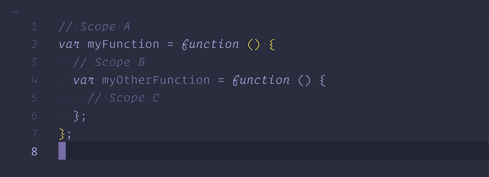

创建新的作用域和创建局部变量/函数/对象很容易。

# 词汇范围

每当你在一个函数中看到另一个函数时，内部函数可以访问外部函数的作用域，这被称为词法作用域或闭包，也称为静态作用域。再次证明这一点的最简单方法是:

你会注意到`myOtherFunction`在这里没有被调用，它只是被简单地定义了。它的调用顺序也会影响作用域变量的反应，这里我定义了我的函数，并在另一个`console`语句下调用它:

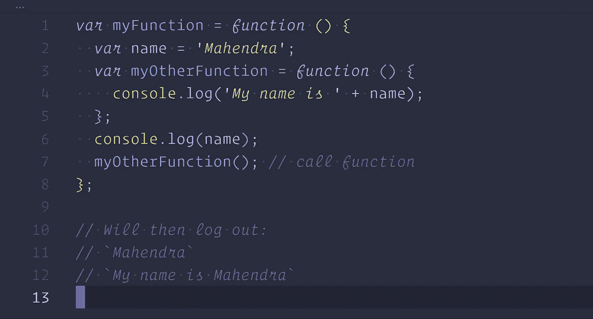

词法作用域很容易使用，在它的父作用域中定义的任何变量/对象/函数，在作用域链中都是可用的。例如:

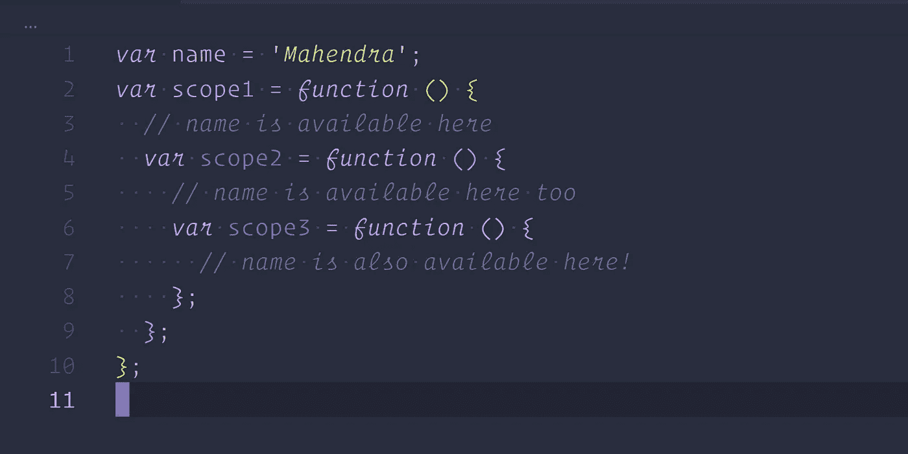

要记住的唯一重要的事情是词法范围不能向后工作。这里我们可以看到词法范围是如何不起作用的:

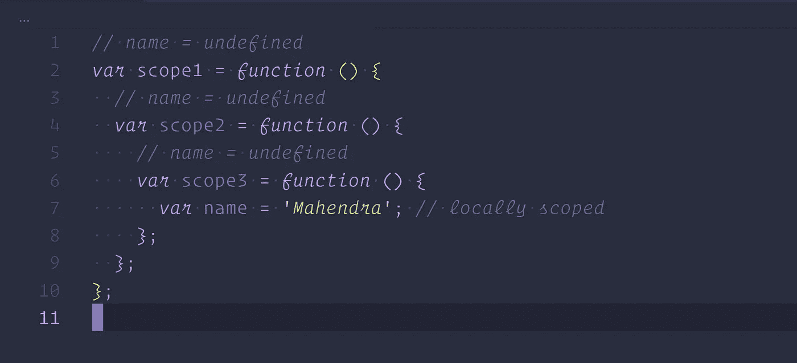

我总是可以返回对`name`的引用，但不能返回变量本身。

# 范围链

范围链为给定的函数建立范围。正如我们所知，每个定义的函数都有自己的嵌套作用域，并且在另一个函数中定义的任何函数都有一个链接到外部函数的局部作用域，这种链接称为链。定义范围的总是代码中的位置。当解析一个变量时，JavaScript 从最里面的范围开始向外搜索，直到找到它要寻找的变量/对象/函数。

# 关闭

闭包与词法范围联系非常紧密。在返回函数引用时，可以看到一个更好的例子，说明闭包是如何工作的——这是一种更实际的用法。在我们的作用域中，我们可以返回一些东西，这样它们就可以在父作用域中使用:

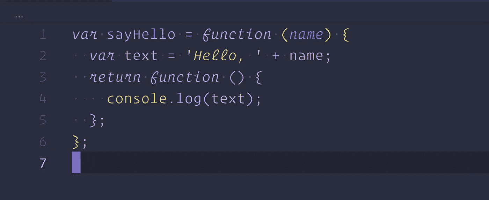

我们在这里使用的`closure`概念使得我们在`sayHello`内部的作用域对于公共作用域是不可访问的。单独调用函数不会有任何作用，因为它会返回一个函数:

函数返回一个函数，这意味着它需要赋值，然后调用:

好吧，我撒谎了，你可以调用它，你可能见过这样的函数，但这将调用你的闭包:

AngularJS 将上述技术用于它的`$compile`方法，将当前的作用域引用传递给闭包:

这意味着我们可以猜测他们的代码(过度简化)如下所示:

不过，函数不一定要返回才能被称为闭包。简单地访问直接词法范围之外的变量会创建一个闭包。

# 范围和“这”

根据调用函数的方式，每个作用域绑定不同的值`this`。我们都使用过`this`关键字，但并不是所有人都理解它，以及它在被调用时有什么不同。默认情况下，`this`指的是最外面的全局对象，`window`。我们可以很容易地展示以不同方式调用函数如何不同地绑定`this`值:

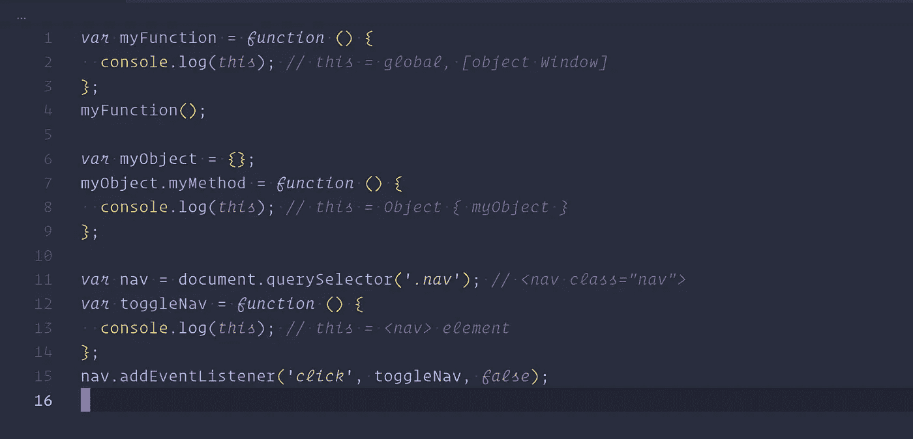

在处理`this`值时，我们还会遇到一些问题，例如，如果我这样做，即使在同一个函数内部，作用域也可能改变，而`this`值也可能改变:

这里发生了什么？我们已经创建了新的作用域，它不是从我们的事件处理程序调用的，所以它默认为预期的`window`对象。如果我们想要访问不受新范围影响的正确的`this`值，我们可以做几件事情。您可能以前见过这种情况，我们可以使用一个`that`变量缓存对`this`值的引用，并引用词法绑定:

这是一个巧妙的小技巧，能够使用正确的`this`值并解决新创建的作用域的问题。

# 使用更改范围。调用()，。应用()和。绑定()

有时，您需要根据您要做的事情来操纵 JavaScript 的作用域。循环时如何改变作用域的简单演示:

这里的`this`值不引用我们的元素，我们没有调用任何东西或改变范围。让我们看看如何改变作用域(看起来我们改变了作用域，但我们真正做的是改变函数调用的上下文)。

## 。调用()和。应用()

`.call()`和`.apply()`方法真的很棒，它们允许你传递一个作用域给一个函数，这个函数绑定了正确的`this`值。让我们操作上面的函数，使我们的`this`值是数组中的每个元素:

您可以看到我在数组迭代中传递当前元素`links[i]`，这改变了函数的范围，因此`this`值成为迭代的元素。如果需要，我们可以使用`this`绑定。我们可以使用`.call()`或`.apply()`来改变范围，但是任何进一步的参数都是两者的不同之处:`.call(scope, arg1, arg2, arg3)`接受单个参数，用逗号分隔，而`.apply(scope, [arg1, arg2])`接受一个参数数组。

重要的是要记住，使用`.call()`或`.apply()`实际上会调用您的函数，所以不要这样做:

您将让`.call()`处理它并链接该方法:

## 。绑定()

与上面不同，使用`.bind()`并不调用函数，它只是在调用函数之前绑定值。很遗憾这是在 ECMAScript 5 中引入的，而不是更早，因为这个方法太棒了。如你所知，我们不能将参数传递给函数引用，就像这样:

我们可以通过在其中创建一个新函数来解决这个问题:

但是这又一次改变了作用域，我们又一次创建了一个不必要的函数，如果我们在一个循环中并绑定事件侦听器，这将会在性能上付出代价。这就是`.bind()`的亮点，因为我们可以传入参数，但函数不会被调用:

函数不会被调用，如果需要的话，作用域可以改变，但是参数会等待被传入。

# 私有和公共范围

在许多编程语言中，你会听到`public`和`private`范围，在 JavaScript 中没有这种东西。然而，我们可以通过闭包之类的东西来模拟公共和私有范围。

通过使用 JavaScript 设计模式，例如`Module`模式，我们可以创建`public`和`private`范围。创建私有作用域的一个简单方法是将我们的函数包装在一个函数中。正如我们所了解的，函数创建范围，从而将事物排除在全局范围之外:

然后，我们可能会在应用程序中添加一些功能:

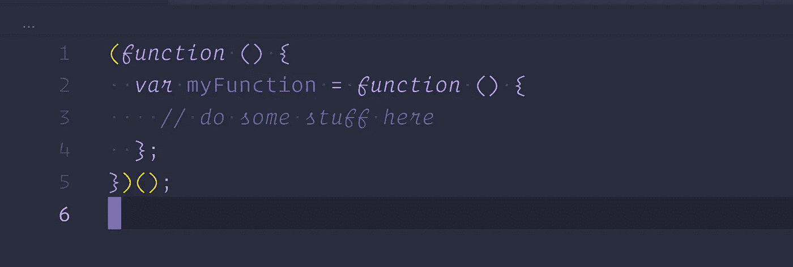

但是当我们开始调用我们的函数时，它将超出范围:

成功！我们创造了私人范围。但是如果我希望函数是公共的呢？有一个很好的模式(称为模块模式[和显示模块模式])，它允许我们使用私有和公共范围以及一个`Object`来正确地确定函数的范围。在这里，我获取了我的全局名称空间，名为`Module`，它包含了我的模块的所有相关代码:

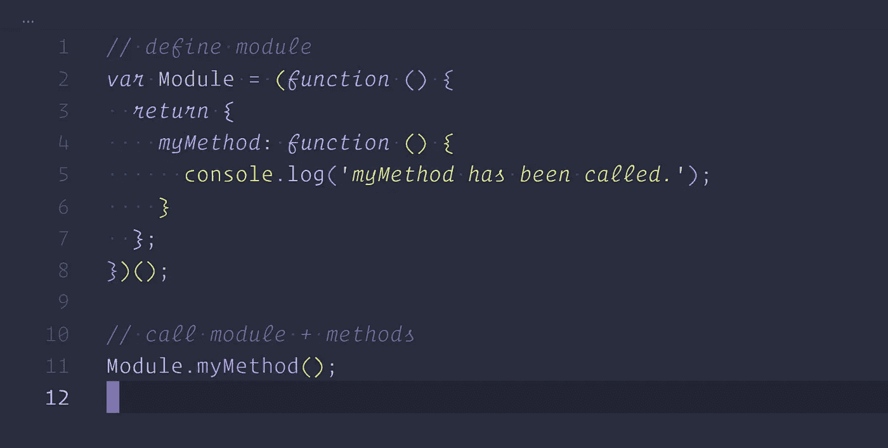

这里的`return`语句返回我们的`public`方法，这些方法在全局范围内是可访问的——但却是`namespaced`。这意味着我们的模块负责我们的名称空间，并且可以包含我们想要的任意多的方法。我们可以随意扩展模块:

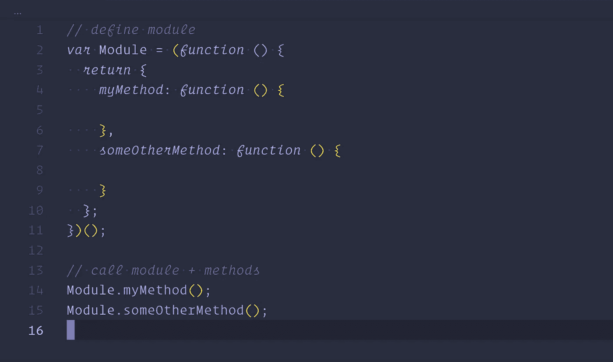

那么私有方法呢？这就是许多开发人员出错的地方，他们将所有的函数都放在全局范围内，从而污染了全局名称空间。帮助我们代码工作的函数不需要在全局范围内，只有 API 调用才需要——需要全局访问才能工作的东西。下面是我们如何通过不返回函数来创建私有作用域:

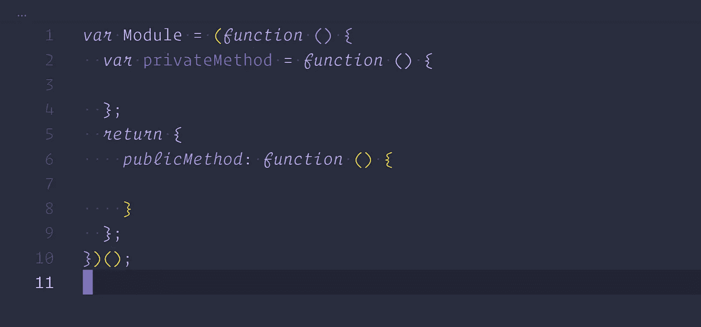

这意味着`publicMethod`可以被调用，但是`privateMethod`不能，因为它是私有的！这些私有作用域的函数是像 helpers，addClass，removeClass，Ajax/XHR 调用，数组，对象，任何你能想到的东西。

这里有一个有趣的转折，在同一个作用域中的任何东西都可以访问同一个作用域中的任何东西，甚至在函数被返回之后。这意味着，我们的`public`方法可以访问我们的`private`方法，所以它们仍然可以交互，但是在全局范围内是不可访问的。

这提供了非常强大的交互性和代码安全性。JavaScript 的一个非常重要的部分是确保安全性，这就是为什么我们不能把所有的函数都放在全局范围内，因为它们会被公开，这使它们容易受到攻击。

下面是一个使用`public`和`private`方法返回对象的例子:

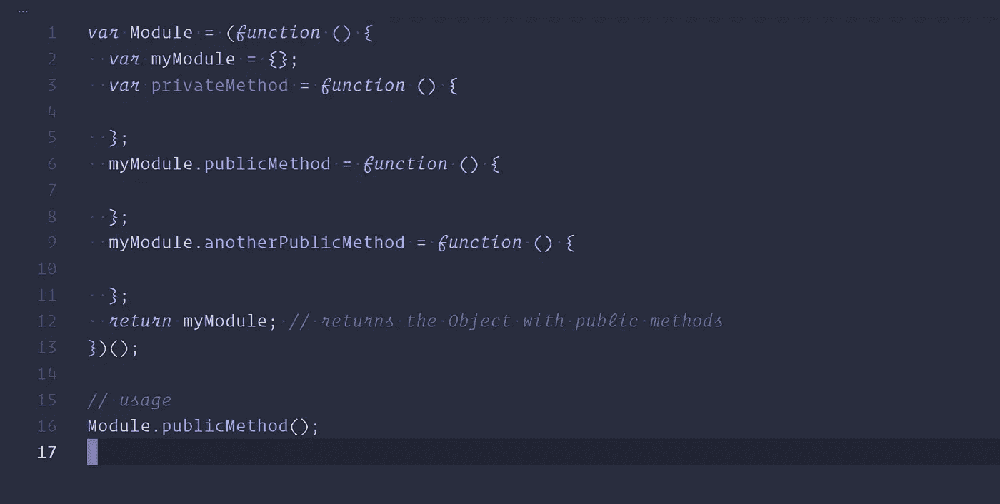

一个简洁的命名约定是以下划线开始`private`方法，这在视觉上有助于区分公共和私有:

这有助于我们返回一个匿名的`Object`，模块可以以对象的方式使用它，因为我们可以简单地分配函数引用:

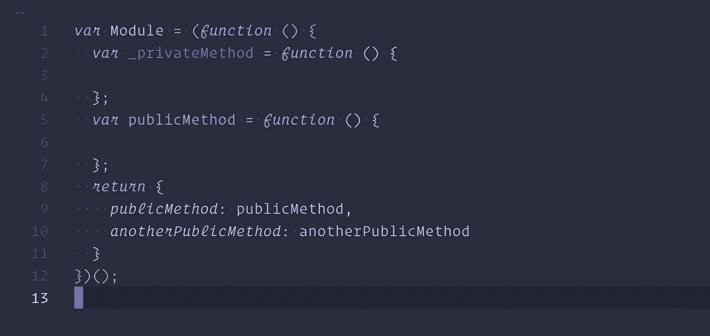

快乐的范围界定！