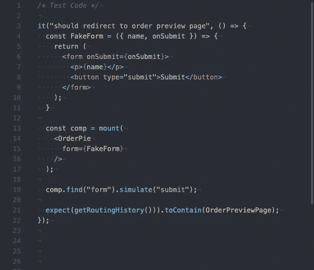
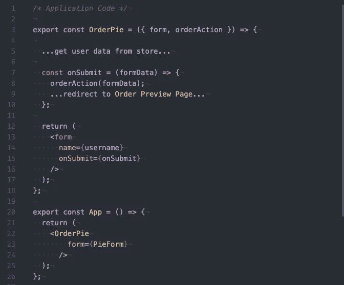
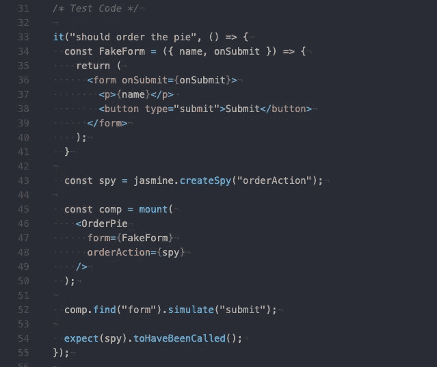
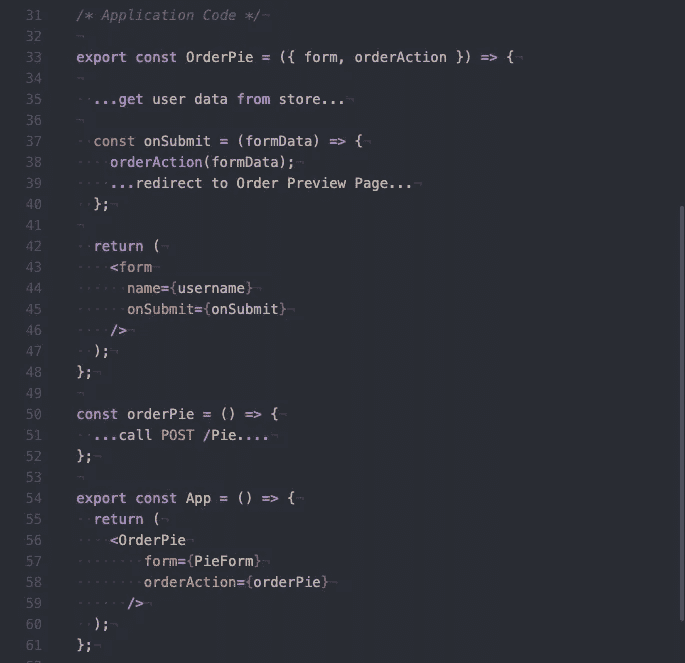
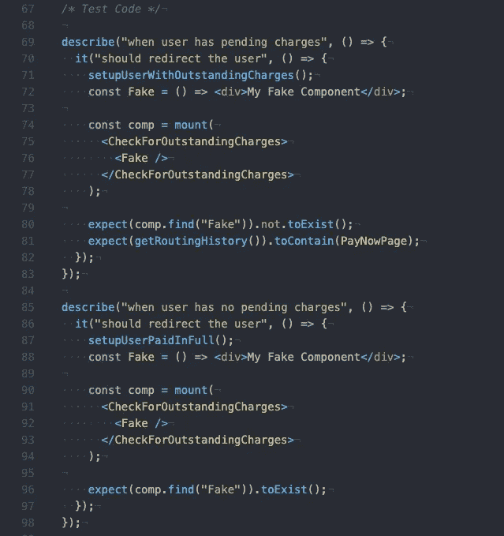
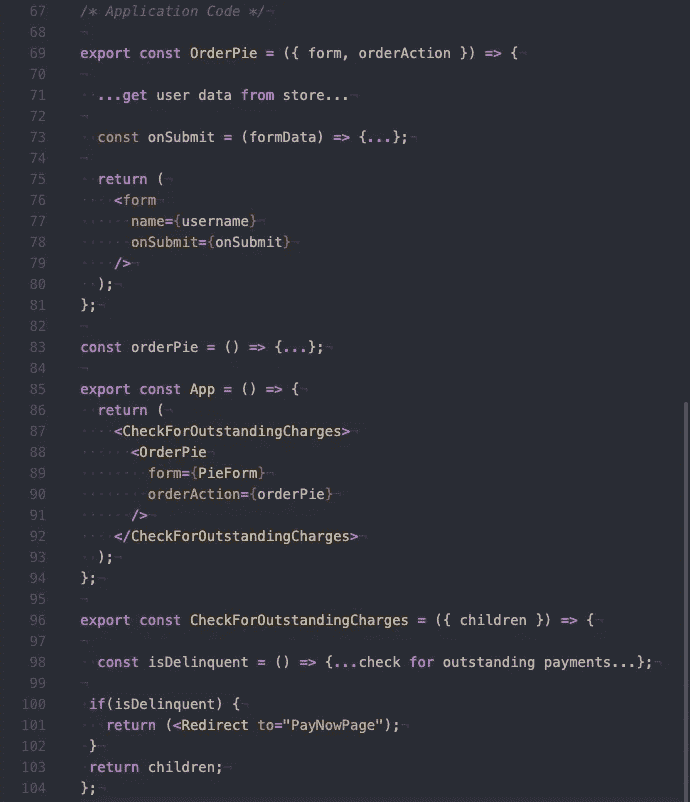

# React 中依赖注入的具体例子

> 原文：<https://javascript.plainenglish.io/examples-of-dependency-injection-in-react-73b5f7a9f407?source=collection_archive---------5----------------------->

依赖注入是控制反转的一种形式。组件依赖关系的创建不是组件内部的一部分。它们是在组件的公共接口上定义的。它们允许解耦设计，并使测试更容易。

这些接缝允许用一个具体实现替换另一个具体实现。它们还允许在测试过程中用模仿或伪造来替代依赖。

这篇文章是关于在 React 中使用依赖注入的经验教训。

## **吸取的经验教训**

我学到的最大教训是，面向公众的 React 接缝是组件的道具和子组件。

Props 定义了组件将在其内部引用和利用的特定依赖关系。家长将确定这些道具的具体实现。可以在子组件中默认一个属性，而不通过父组件传递任何东西，但是，这仍然意味着这些属性是在面向公众的接口中定义的，而不是隐藏在组件本身的内部。

组件的子组件是另一个接缝。当使用 composition 构造组件时，您可以定义为给定的父组件呈现哪些子组件。当您需要重新组织结构并将一个多态子组件替换为另一个多态子组件时，您不需要改变父组件的内部来实现这一点。

## **案例分析**

让我们来谈谈这是如何使测试变得更容易的。假设我们有一个馅饼公司的 web 应用程序。在我们的应用程序中，我们有一个用户可以填写来订购馅饼的表单。

在我们的代码中，我们希望构建一个名为 OrderPie 的组件，它连接到数据存储并在页面上显示用户名，另一个名为 PieForm 的组件显示表单并允许用户提交订单详细信息。该表单有各种验证，以确保用户提供所有必需的信息。

请注意，示例中有一些伪代码，用于隐藏与数据存储、路由和端点调用相关的无关实现细节。这将允许我们关注 React 组件本身的结构。

## **例 1:表单解耦**

现在，假设我们正在测试 OrderPie 组件，确保用户在提交表单时被重定向到订单预览页面。这个测试不关心用户点了什么或者用户是否输入了所有需要的数据。它只想确保用户在提交表单时被发送到正确的页面。

将表单作为道具传递给组件允许我们定义一个协作者。

TestForm 和 PieForm 组件也是多态的。它们在数量、命名和类型方面包含相同的道具，并且可以在不破坏任何功能的情况下相互替换。

The test injects a fake form that has no validation rules for form submission

The application code injects a different form with rules for validating data

这允许我们在产品代码中使用真实的表单，在测试代码中使用虚假的表单。这也允许我们对这个特性进行单元测试，而不需要处理真实表单及其验证的昂贵的集成测试。

## **示例 2:解耦端点动作**

假设我们还需要测试 OrderPie 组件调用端点来发布/Pie 的能力。这个测试不涉及实际的端点调用本身，而只是在表单提交时进行。

如果我们在 OrderPie 组件本身中直接调用这个动作，它将是组件内部工作的一部分。我们不能窥探这个函数来确保它被调用的原因与私有函数不能被测试和类中的具体实现不能被替换的原因是一样的。

The test injects a spy for the orderAction prop

The application code injects an orderPie function that makes real http calls

当我们反转控件并通过道具传递这个动作时，我们现在可以监视它并确保它在该调用的时候被调用。我们也可以用一个假的动作来代替，这样单元测试就不会在表单提交时进行真正的端点调用。

## **示例 3:分离组件的渲染**

在最后一个例子中，假设我们还需要测试应用程序的能力，以防止用户在账单拖欠时订购馅饼。该应用程序将显示待处理费用页面，而不是显示饼状图订单。

为了遵守组合和单一责任原则，我们将构建一个名为 CheckForOutstandingCharges 的组件，它的唯一职责是从商店获取用户的账单历史，并决定是否重定向到待处理费用页面。该测试并不关心当没有拖欠时确切地显示什么组件，只关心它们确实显示了。

我们希望能够在产品代码中呈现实际的 OrderPie 组件，并在单元测试中呈现一个假组件。

The tests injects a fake child component to see if it renders when a user has pending charges

The application code injects a real component in the children

当测试 CheckForOutstandingCharges 组件时，我们可以隔离我们的范围，以确保该组件的行为是独立的。我们可以检查当没有拖欠时它的孩子被呈现，当有拖欠时用户被重定向到期望的页面。应用程序的结构和孩子到底是什么，不是我们所关心的。

## **总之**

这种设计的好处是，您可以避免对特性进行集成测试。由于组件中定义良好、面向公众的接缝，您可以利用解耦的、粒度的、更快、更容易的单元测试。