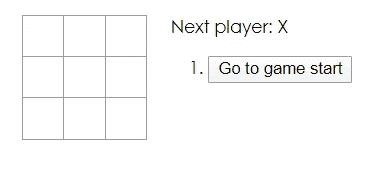
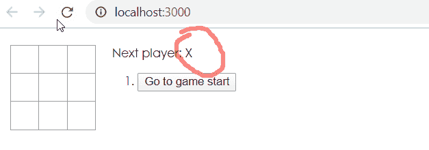

# 专家 Angular Developer 得知 React 后，立刻后悔了

> 原文：<https://javascript.plainenglish.io/expert-angular-developer-learns-react-immediately-regrets-it-691216742136?source=collection_archive---------1----------------------->

## 两种最流行的前端框架之间的“诚实”比较

嗨，伙计们，

我想详细介绍一下我学习 React 的经历，并给你一个 React 和 Angular 之间的真实比较。

在我开始之前，我应该建立一些信誉。我从 2017 年左右开始与 Angular 合作，在它突然出现并迅速成为前端框架之王后不久。在此之前，我曾与之前最好的前端框架 AngularJS 合作过几年。

至于 React，我刚刚完成了官方[教程](https://reactjs.org/tutorial/tutorial.html)并且读了[这篇](https://medium.com/javascript-in-plain-english/state-management-with-react-hooks-no-redux-or-context-api-8b3035ceecf8)由[安德烈·盖迪](https://medium.com/u/70bf576cbb96?source=post_page-----691216742136--------------------------------)写的关于 React 钩子的文章。

这是一篇精彩的文章，Andre，只是遗憾的是你使用了错误的框架。

无论如何，可以相当有把握地说，我是这两种产品的权威，非常有资格对这两者进行客观的比较。

我还应该提到，Angular 和 React 都没有付钱给我做这篇评论，除非你认为 Angular 给了我一个使用起来如此愉快的框架。

首先，我将跳入使用 React 的陷阱。

# 使用 React 的缺陷

## #1 React 只是一个库

根据地球上最重要的知识库维基百科的说法，React 是一个“用于构建用户界面的 JavaScript 库…”

与来自同一网站的 [Angular 的](https://en.wikipedia.org/wiki/Angular_(web_framework))描述相比:“是一个基于类型脚本的开源 web 应用*框架……”*

我不确定 React 的开发人员为什么选择只构建一个库，而他们本可以构建一个框架，但这并不需要数学天才来知道谁会赢得这个类别。

显然，框架>库。

## #2 教程有偏见

对于那些以前没有看过的人，本教程将带您了解在浏览器中制作井字游戏的过程。在你开始之前，他们没有告诉你的是，它对操作系统有严重的偏见，如果不是彻底的偏见的话。每次 X 先启动*。*

不相信我？看一看。

Prejudiced tic-tac-toe game

是的，当我第一次看到它的时候，我想这一定是个错误。很明显 X 每次都会赢。所以我想如果我刷新页面的话可能会有所改变。

Nope, still hatin’

对我来说，这是一个巨大的危险信号。

## #3 React 使用了一种奇怪的语言

进入教程，当我开始使用 CLI 创建我的应用程序时，我以为我回到了令人敬畏的前端框架的土地上。当它旋转它的小圆圈时，我在期待中变得眩晕，等不及让我有一个漂亮的小打字文件盯着我，我可以咬紧牙关。

天哪，我真失望。

不仅没有类型脚本文件，而且它给我的 *JavaScript* (ugh)文件包含一些奇怪的、陌生的语法，让我有点想吐。根据教程，这种语言叫做“jsx”。

我查了一下，只有 60%的浏览器支持 jsx，而 100%支持 Angular 提供的 TypeScript。去想想。

## #4 React 使用*单条*括号来表示绑定

说真的，谁会这么做？

## #5 反应是旧的

2013 年出的。Angular 是 2016 年出的。再说一遍，你自己算算。

当你可以拥有一个四年前的*框架*时，为什么还要用一个七年前的*库*？

## #6 React 由脸书制造

就是这个暴徒制造了其他一些不知名的工具，如 [GraphQL](https://graphql.org/) 、 [Yarn](https://engineering.fb.com/web/yarn-a-new-package-manager-for-javascript/) 、 [Jest](https://jestjs.io/) 和 [Flow](https://flow.org/) 。我想不出这些项目给 web 开发增加了什么，如果有的话。

React 可能拥有市场份额，在开发人员中的受欢迎程度，大量的文章，教程和其他资源来支持开发人员，以及一个超级简单的[工具](https://reactnative.dev/)来使用 React 代码库创建原生 Android 和 iOS 应用程序，但由于太旧了，React 2.0 还要多久才能发布，并且您必须在一个新的不熟悉的环境中重写所有的应用程序？

Photo by [NeONBRAND](https://unsplash.com/@neonbrand?utm_source=medium&utm_medium=referral) on [Unsplash](https://unsplash.com?utm_source=medium&utm_medium=referral)

# 棱角分明的乐趣

我们已经讨论了使用 React 的陷阱，所以为了公平起见，我们将看看使用 Angular 的乐趣。

## #1 它是由谷歌制造的

你可以肯定它会长期存在，因为他们的项目没有一个失败过。

## #2 Angular 提供了开箱即用的成熟应用程序所需的一切。

作为一个框架，而不仅仅是一个*库*，有了 Angular，你就有了完整的东西:

*   [路由器](https://angular.io/guide/router)
*   CLI
*   [HTTP 客户端](https://angular.io/guide/http)
*   [组件和样式库](https://material.angular.io/)
*   [组件开发套件](https://blog.angular.io/a-component-dev-kit-for-angular-9f06e3b4b3b4)
*   [动画](https://angular.io/guide/animations)

我可以永远继续下去。如果您想在 React 项目中包含相同类型的内容，您必须自己安装它们。如果不是因为 JavaScript 生态系统缺少某种像样的包管理器，这不会是一个问题。

## #3 Angular 为您创建的每个项目生成单元测试和端到端测试

它还为每个组件和每个服务生成单元测试。这很神奇，因为它消除了设置测试的痛苦，所以所有开发人员必须做的就是填写测试他们特定应用程序/组件/服务的细节。

正因为如此，我所知道的每一个 Angular 开发人员都实践 TDD 或 BDD，并保持他们的单元测试和端到端测试与他们的代码库完全同步。

# 结论

你可能听说过“为什么他们称它为 Xbox 360？因为当你看到它时，你会 360 度转身离开。”

我的建议？帮自己一个忙，360 度大转弯，投入 Angular 的怀抱。

感谢阅读

## 附笔

一些棱角分明的开发者可能会对 React 感到不满，因为它拥有更大的市场份额。他们也可能会感到有点恼火，因为他们所在地区几乎所有的招聘广告都在招聘 React 开发人员，他们不会接受已经完成(比如说)教程和阅读过一两篇文章的人。

当然不是我。出于上述原因，我绝不会降低身份去 React 找工作。但是，如果你碰巧收到一个有棱角的开发者的申请，想要打入 React 市场，给他们点甜头…你不会后悔的。

## 后附言

Vue.js 也是一样。

## 后-后-后记

这是讽刺。