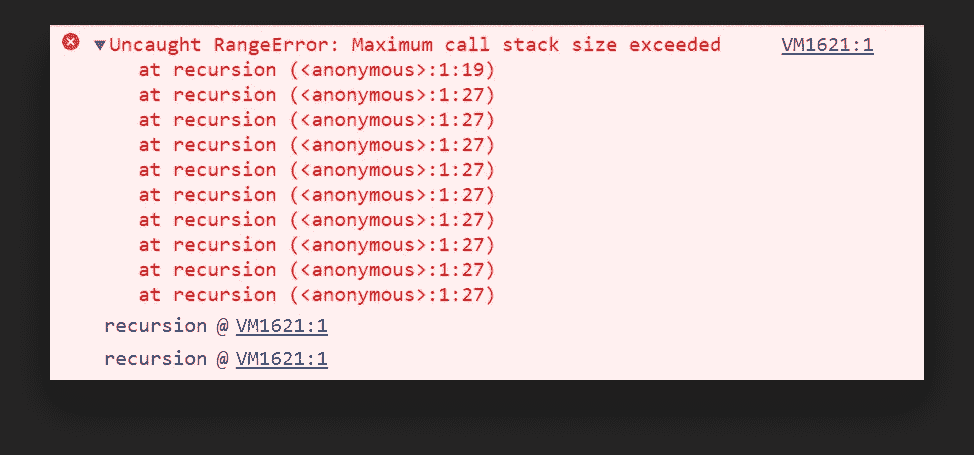

# JavaScript 中的事件循环是什么？

> 原文：<https://javascript.plainenglish.io/explaining-the-event-loop-to-hamsters-f18be93956d6?source=collection_archive---------3----------------------->

## 通过 setTimeout 的例子解释事件循环

[](https://www.webtips.dev/what-is-the-event-loop-in-javascript)

Photo by [Tine Ivanič](https://unsplash.com/@tine999?utm_source=medium&utm_medium=referral) on [Unsplash](https://unsplash.com?utm_source=medium&utm_medium=referral)

[](https://www.webtips.dev/what-is-the-event-loop-in-javascript)

你可能听说过 JavaScript 有个东西叫“*事件循环*”。但是它实际上是什么，它真正的含义是什么？为什么了解它很重要，了解它有什么好处？在本教程中，我们将探讨这些问题，并简化一个看似复杂的想法。

**用一句话来定义什么是事件循环:**

> 将事件从任务队列移动到调用堆栈被称为“事件循环”

那么这个**任务队列**和**调用栈**是什么呢？它们是如何发挥作用的？让我们来看看浏览器架构的简化版本，以便更深入地理解执行 JavaScript 代码时会发生什么:


A simplified representation of a browser’s architecture

在浏览器中，我们有四个主要组件。我们感兴趣的是事件循环。但是为了理解事件循环的工作，我们需要澄清其他三个方面的迷雾:调用堆栈、web API 线程和任务队列。

# 调用堆栈

您可能已经知道，JavaScript 是一种单线程语言，这意味着它只有一个调用栈，不像其他多线程语言。这也意味着它一次只能执行一个代码。这段代码的执行顺序由调用堆栈处理。它保存了关于我们现在在代码中执行顺序的信息。为了充分理解它的工作原理，让我们通过一个例子来演示它:

我们都知道会发生什么，我们将在控制台中看到`Learning About The Event Loop`。但是调用栈内部会发生什么呢？让我们一行一行地分析它是如何处理的:

*   我们从第 1 行开始；我们将`console.log`推到调用堆栈的顶部，并在隐式返回时立即弹出它。
*   我们也为其他两条线这样做。我们将`console.log`推到堆栈上，一旦执行完毕就弹出它。

我们再看一个例子，你觉得会发生什么？

我们定义了一个名为`recursion`的函数，我们在第 5 行调用它。然后在函数内部，我们一次又一次地调用它…这会给我们一个错误:



Chrome throws an error when the maximum call stack size is exceeded

我们一直将`recursion`压入堆栈，从未弹出一个项目，导致`RangeError`，这防止了浏览器崩溃。

您还可以在错误消息下面看到堆栈跟踪信息，即代码执行的顺序。

这就是调用栈所做的一切。它将代码推到堆栈上，并在代码执行后弹出。它基本上是我们程序当前状态的快照；当 JavaScript 引擎执行我们的代码时我们在哪里。

那么，如果 JavaScript 是单线程的，我们一次只能运行一段代码，那么我们怎么会有异步功能呢？—意味着我们没有阻塞。这就是**浏览器或 web API**发挥作用的地方。

# Web API 线程

现在让我们来看看下面的例子:

您认为上述代码示例的输出会是什么样的？如果你猜到了:

```
🐹
🐹🐹🐹
🐹🐹
```

你要么是通过艰难的方式学会的，要么是你已经知道事件循环是如何工作的。也许两者都有。但是为什么不呢:

```
🐹
🐹🐹
🐹🐹🐹
```

即使我们用 0 毫秒调用`setTimeout`，它仍然被作为最后一件事执行。让我们再一次快速浏览一下调用堆栈是如何处理上面的代码的:

*   我们从第 1 行开始，我们将`console.log`推入调用堆栈，并立即将其弹出，这样我们就有了🐹在控制台里。
*   我们到达第 3 行，我们将`setTimeout`推入堆栈，但是我们不能执行它，因为`setTimeout`不是 V8 引擎的一部分。不是核心 JavaScript 函数，是浏览器 API。它通过浏览器添加到 JavaScript 中。这就是你需要填充浏览器提供的`Promise`对象或 DOM 内部节点的原因。这些 API 调用是在不同的线程中处理的，所以我们发起对 web API 线程的调用，并从堆栈中弹出`setTimeout`。这将在 JavaScript 世界之外的另一个线程池中启动一个计时器。
*   我们继续执行，将 line:5 上的另一个`console.log`推到堆栈上，然后弹出它，所以现在我们有了🐹🐹🐹'


这是我们浏览器的当前状态。我们有一个空的调用堆栈，但是我们有一个项目等待在处理 web API 调用的线程中执行。这是我们最后的`console.log`。

现在，每当对`setTimeout`的调用完成时(*在本例中是瞬时的，因为我们用了 0 毫秒*)，我们就想执行它。为此，我们需要将它移回堆栈。因为这可以在未来的任何时候完成，但我们不知道什么时候，我们不能只是把它推到堆栈上，因为这将意味着我们的代码是不确定的。它会在某个时间点随机出现。

想象一个网络请求。它可以在 300 毫秒内完成，或者从不完成，或者介于两者之间。因此，取而代之的是，它被推入**任务队列**。

# 任务队列

任务队列*通常称为回调队列或事件队列*，负责收集每个成功执行的 web API 调用的返回值。

每当我们的`setTimeout`完成时，它的回调就被移入任务队列。在我们的例子中，最后一个`console.log`。


所以现在我们有一个空的调用堆栈和一个空的 web API 线程。但是我们有`console.log`在任务队列中等待。如果我们有多个 web API 调用，我们会将它们一个接一个地推入任务队列。

那么我们如何将任务队列中的事件放入调用堆栈呢？这就是**事件循环**出现的地方，文章的主角。

# 事件循环

综上所述，事件循环可能是整个架构中最简单的部分:它的工作是查看任务队列和调用堆栈；

如果调用堆栈为空，并且任务队列中有等待执行的事件，它会将任务队列中的第一个事件推回到调用堆栈中。并且一直持续到任务队列为空。这就是事件循环所做的全部工作:

因此，现在我们的最后一个`console.log`被推回到调用堆栈中，再次被执行，因此我们得到:

```
🐹
🐹🐹🐹
🐹🐹
```

对于 0 毫秒的`setTimeout`，我们实际上是告诉 JavaScript 推迟调用，直到堆栈为空。

所以下次你参加面试时，面试官会问你这样的问题:什么是事件循环？或者说 JavaScript 怎么可能同时是异步和单线程的呢？—希望你回答这些问题没有问题。

# 建议

如果你仍然有疑问，但是这个教程对你没有任何意义，我真的不擅长分享知识。在任何情况下，如果你想更深入地研究上面提到的东西，并且你是视觉型的，我可以强烈推荐[菲利普·罗伯茨的](https://www.youtube.com/watch?v=8aGhZQkoFbQ)到底是什么事件循环。

他帮助我一劳永逸地理解了事件循环。这篇文章可能很大程度上反映了他的教导，因为他以这样一种可以理解的方式解释了它。他深入细致地解释了 JavaScript 运行时的内部工作方式，这种方式非常简单，即使是仓鼠也能很容易理解。🐹

[](https://medium.com/@ferencalmasi/membership)[](http://webtips.dev/)