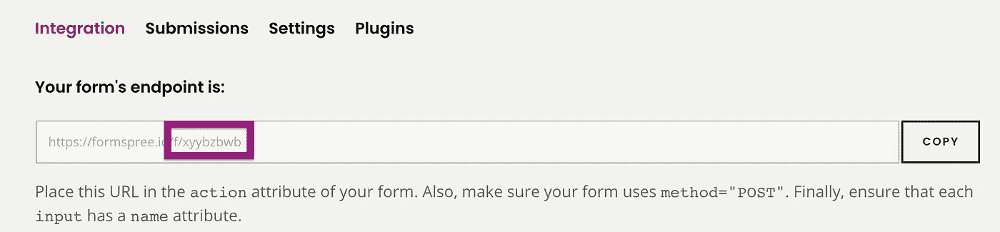
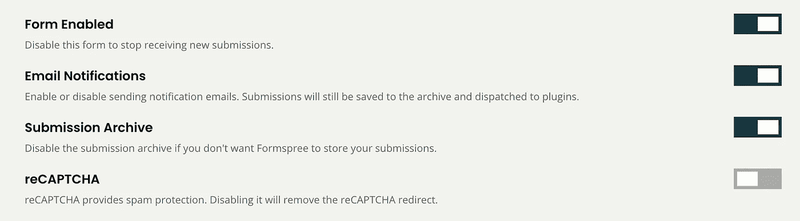
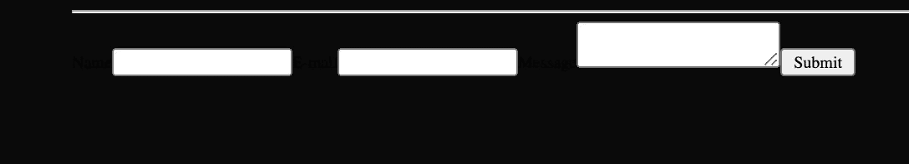
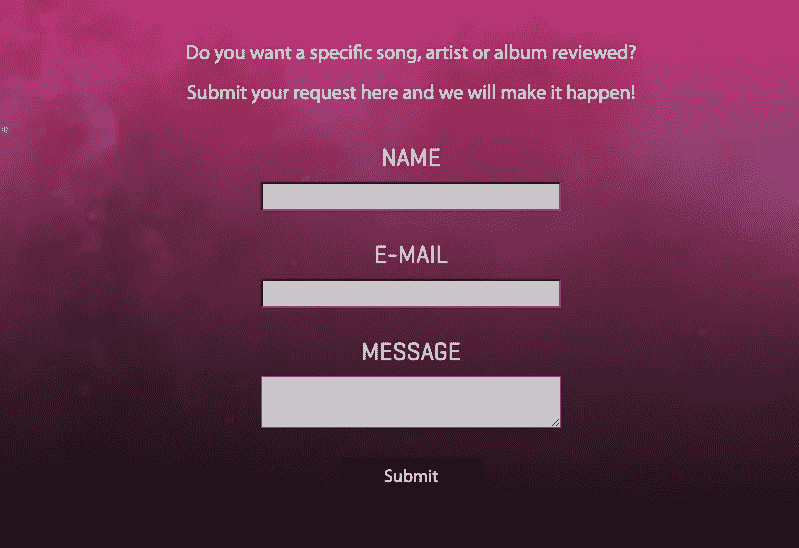
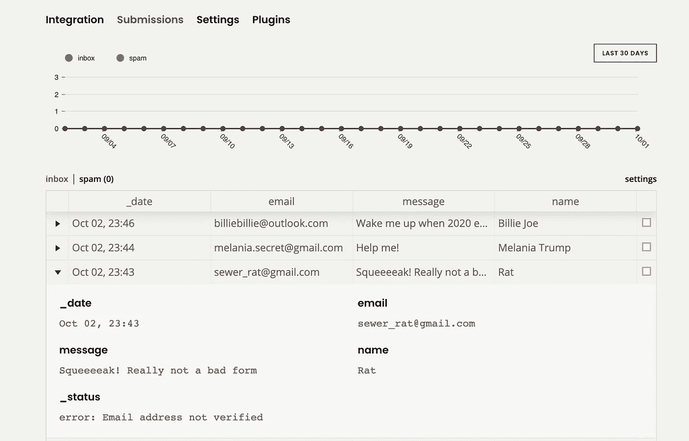

# 如何用 React 和 Formspree 创建快速表单

> 原文：<https://javascript.plainenglish.io/explainlikeim5-2-how-to-create-a-form-with-react-and-formspree-easy-5510947e6b88?source=collection_archive---------13----------------------->

## #ExplainLikeI'm5 [2]


Photo by [Vlada Karpovich](https://www.pexels.com/es-es/@vlada-karpovich?utm_content=attributionCopyText&utm_medium=referral&utm_source=pexels) on [Pexel](https://www.pexels.com/es-es/foto/hombre-persona-taza-relajacion-4050469/?utm_content=attributionCopyText&utm_medium=referral&utm_source=pexels)

> 这是《T4》系列的第二版。如果你想看一眼第一版，你可以在这里找到它。

让我感到惊讶的是，直到不久前我才知道 Formspree，这是一个简单而强大的表单管理器，为其免费计划提供了出色的功能。零费用，你可以在你的 React 网站上建立并运行你完全定制的表单。

Formspree 的好处在于，它会处理好您的所有数据，同时您可以完全控制表单的定制。你可以控制所有的 JavaScript、HTML 和 CSS，并且可以根据你的意愿设计和添加任意多的字段。

想在 15 分钟内收到网站访客的情书吗？那就带上你最好的键盘跟我来。


# 第一步:在 Formspree 上创建一个帐户

点击[此处](https://formspree.io/register)在 Formspree 上创建一个免费帐户，并发送电子邮件以接收从您网站的表单中收集的数据。

[Formspree](https://formspree.io/) 是一个通过电子邮件发送提交的表单后端，可以连接到几个第三方服务，如 Stripe、Slack、Trello(全部免费)和其他付费选项(Google Sheets、MailChimp、Zendesk)。Formspree 还提供了垃圾邮件缓解和过滤、文件上传、自动响应和其他工具来帮助您管理表单。

注册后，您将被重定向到一个仪表板，在那里您可以看到表单的端点。记住这一点。



Your form’s URL and the endpoint key you need to keep

转到表单的*设置*选项卡找到 reCAPTCHA 设置并确保其关闭。要在 Formspree 上使用 AJAX，必须禁用 reCAPTCHA 或者提供自己的 reCAPTCHA 键。



Settings > switch off the reCAPTCHA

# 步骤 2:设置依赖项和主代码

首先我们要安装`axios` 依赖项。要做到这一点，只需点击它:

```
npm install axios
```

`Axios`是一个 HTTP 客户端库，处理所有 HTTP 请求并管理其响应，我们正在使用它将 Formspree API 与我们的网站集成。

接下来，您将在`/src`目录下创建一个名为`ContactForm.js`的文件，并添加以下代码:

这个表单包含两个输入，用户电子邮件和消息，使用`axios`发出 [POST 请求](https://developer.mozilla.org/en-US/docs/Web/HTTP/Methods/POST)，然后将数据提交给前面接收到的 Formspree 端点。

**注意:**确保用**步骤 1** 中收到的端点替换`[your-formspree-endpoint]`。

# 步骤 3:将表单插入到您网站的页面中

现在我们已经配置了它的后端，我们必须将它添加到我们的页面。在您的页面上，只需导入您已经创建的新组件，然后您可以简单地使用标签`<ContactForm />`来插入它。

例如:

如果一切正常，您应该已经能够看到我们的表单了。在这一点上看起来不太好:



Not pretty


Not pretty either

# 步骤 4:设计表单样式

是时候美化我们的婴儿形象了。下面是一个简单的 CSS 示例，您可以从中了解如何设计不同的类并开始使用:

下面的图片是我从我的网站上获得的完成的表格，与上面的例子非常相似。现在继续发挥你的创造力吧！



Really not bad, if you ask me!

# 第五步:检查结果

现在来看看我们的访客给我们留下了什么可爱的信息吧！你只需要回到你的 Formspree 仪表板，检查你的*提交*标签。它应该是这样的:



Great traffic on my website

您还应该可以通过您注册 Formspree 时使用的电子邮件直接接收邮件。你的表格现在已经准备好了！

像往常一样，如果你有任何问题，建议，请求，或者只是想打声招呼——在下面的评论里留言吧！


With love,

黛比 x