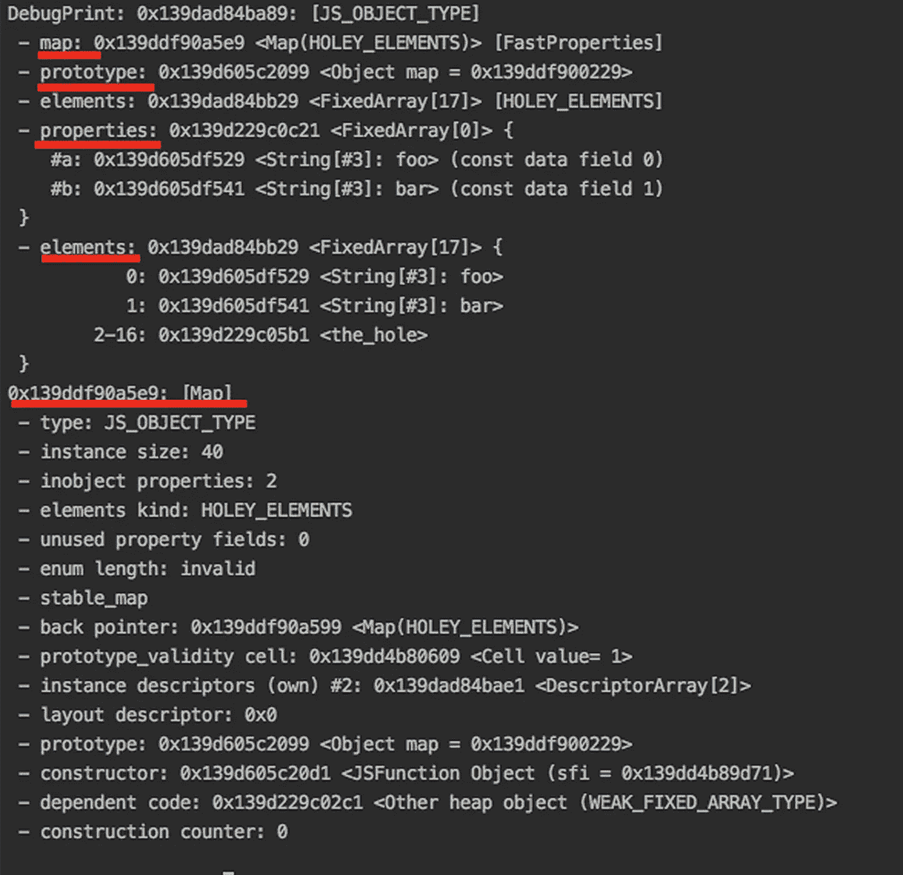
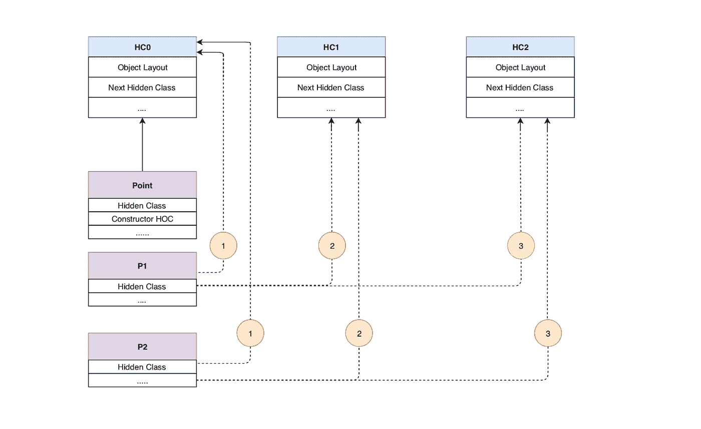
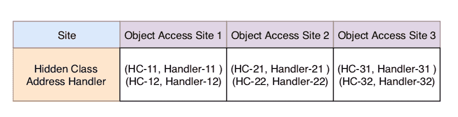
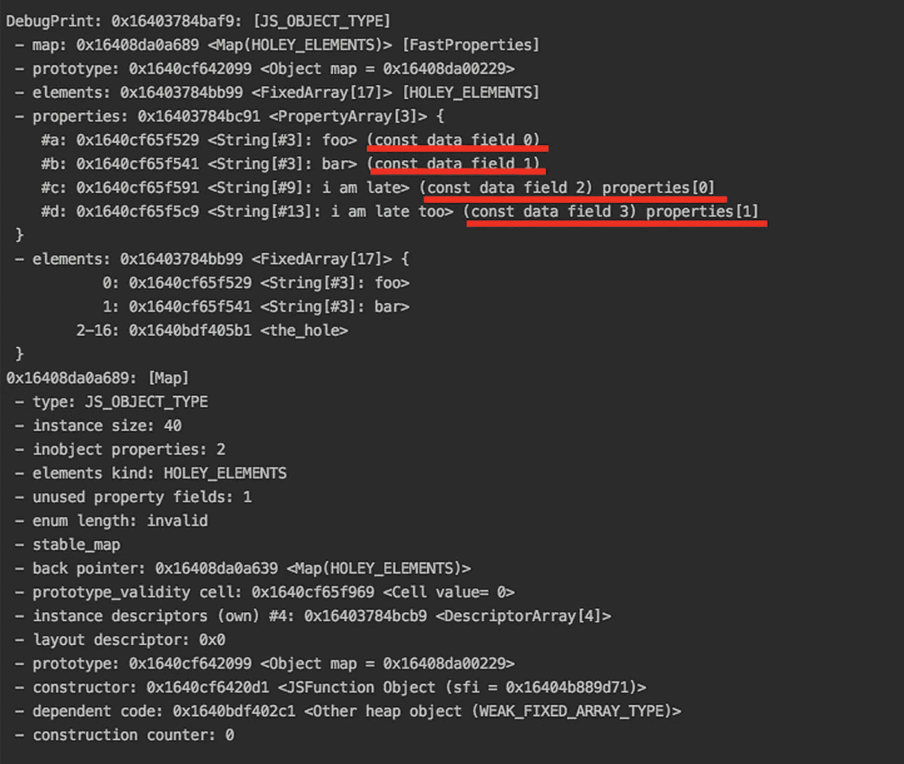
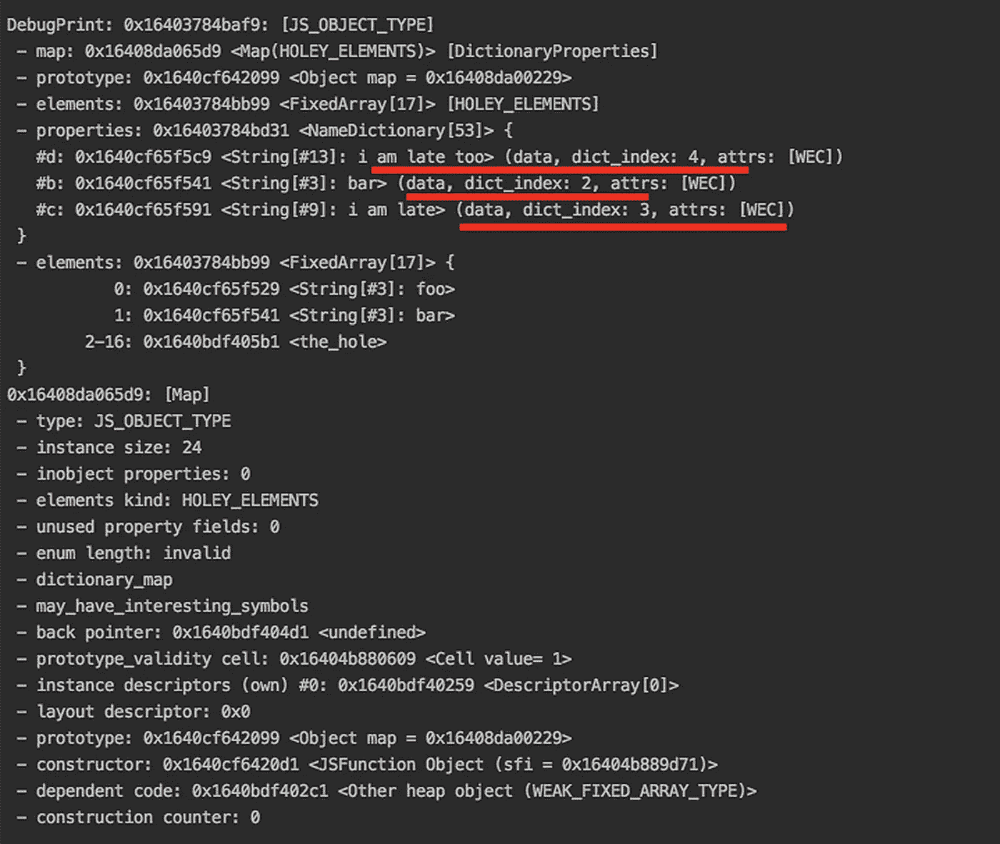
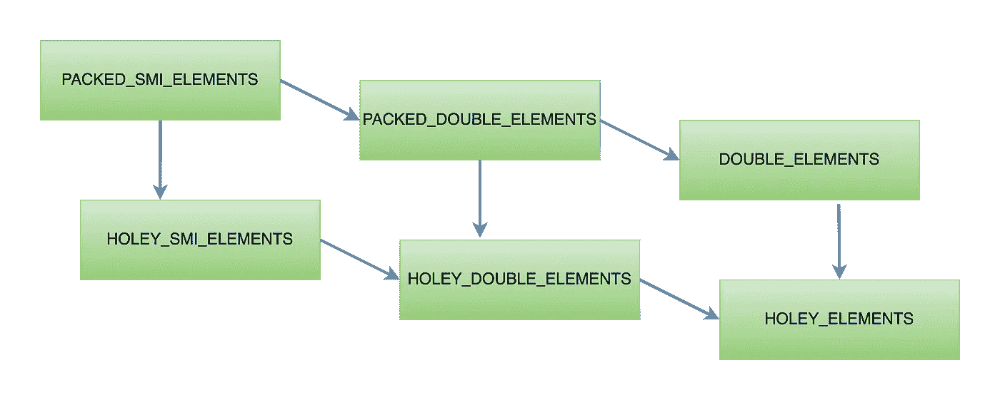

# JavaScript 对象优化性能的秘密

> 原文：<https://javascript.plainenglish.io/exploration-of-javascript-object-for-performance-optimization-70b20246ab9e?source=collection_archive---------2----------------------->


High-speed Aircraft (source: [Pixabay](https://pixabay.com/))

# JavaScript 中的原语和对象

JavaScript 包含两种基本的数据类型:**原语和对象**。定义不可变值(不能被改变)的数据类型是**原语**。它们没有方法，存储在堆栈中，通过值进行比较。有 7 种原始数据类型:字符串、数字、bigint、布尔、空、未定义、符号。

其余的都是**的对象**。它们是由文字创建的可变数据类型(可以改变),通过引用进行比较。它们是属性、对象和键之间的映射以及值的集合。键是字符串(或符号)，值可以是任何值。函数、**数组**、日期和其他一切都是对象。

# V8 和 d8

[**V8**](https://en.wikipedia.org/wiki/V8_(JavaScript_engine)) 是 Google 开源的高性能 JavaScript 和 WebAssembly 程序/解释器，用 C++编写。它在 Chrome 和 Node.js 中使用。分析和优化技术基于 V8 引擎，该引擎实现了隐藏类&内联缓存。其他 JavaScript 引擎实现了类似的方法或隐藏的类变体。Safari [JavaScriptCore](https://en.wikipedia.org/wiki/WebKit#JavaScriptCore) 有*结构*。[微软 Edge 的脉轮核心](https://en.wikipedia.org/wiki/Chakra_(JScript_engine))有 [*型*](http://abchatra.github.io/Type/) 。火狐的蜘蛛猴有*的形状。*

[**d8**](https://v8.dev/docs/d8) 是与 v8 JavaScript 引擎打包在一起的命令行环境。d8 对于在本地运行一些 JavaScript 或调试对 v8 的更改非常有用。在这篇博文中，用 d8 分析了 v8 中对象的全貌。

# 对象分析

让我们定义一个名为“test”的对象，并通过 d8 调试它。

```
var test = {
 a: “foo”,
 b: “bar”,
 0: “foo”,
 1: “bar”
}
```



Fig. Object details in d8 shell

## 调查的结果

*   **用值“foo”和“bar”分别命名属性 a** & **b** 。
*   **索引属性**称为**元素**从 0 到 16，其中 0 & 1 分别持有【foo】&【bar】。
*   **原型**信息。
*   **贴图**(指针指向**隐藏类**)。

JavaScript 中的命名属性和索引属性是分开处理的。它们有不同的使用模式，并存储在不同的存储位置。

# 性能因素-财产访问时间

在像 Java 这样具有强类型的低级编程语言中，对象的完整信息在编译时是已知的，因为对象属性在运行时不会改变。指向对象属性的指针可以存储在内存位置的连续缓冲区中，每个节点之间有固定的偏移量，并且可以知道对象的长度/大小。在这种情况下，属性访问并不昂贵，并且可以通过一条指令来完成:在给定的内存偏移量下，加载内容。

## 隐藏类

像 **JavaScript** 这样的动态类型语言中的属性访问机制不同于强类型语言，在强类型语言中，对象属性会在运行时发生变化。这需要计算量很大的动态查找。在 V8 中，该对象有一个与之相关的**隐藏类**，其工作方式类似于 Java 中的固定对象布局，只是它们是在运行时创建的，并随着对象的变化而动态更新。

隐藏类主要通过两种方式为 v8 引擎服务。首先，属性访问机制**不需要动态查找**。第二，隐藏类为对象的形状提供了一个标识符，这是 **V8 优化编译器和内联缓存**的一个非常重要的组成部分。

## 隐藏类转换

隐藏类取决于属性添加到对象的顺序。然而，添加数组索引属性并不会改变隐藏类。当属性改变时，隐藏类知道要引用哪个隐藏类。如果同一个属性被添加到共享同一个隐藏类的两个对象中，则两个对象都会接收同一个新的隐藏类以及与之相关的所有优化。如果对象的属性被更改，则检查对象隐藏类的转换信息。

让我们考虑一个名为 Point 的函数，并定义两个对象 p1 和 p2。隐藏类的转换是通过一系列的过程发生的。

```
1\. function Point(x, y) {
2\.   this.x = x;
3\.   this.y = y;
4\. }
5\. 
6\. p1 = new Point(1,2);
7\. p2 = new Point(3,4);
```

*   当一个函数被声明时，该函数的对象指针被形成，并且隐藏类 **HC0** (隐藏类 0)被创建。
*   第 6 行:当代码被执行形成对象 p1 时，它指向隐藏类 **HC0** 。
*   第 2 行:增加新属性 **x** 后，形成新的隐藏类 **HC1** 。同样，当属性 **y** 被添加时，另一个隐藏类 **HC2** 被创建。
*   第 7 行:在形成对象 p2 时，不创建新的隐藏类，但是隐藏类指针将依次指向 **HC0** 、 **HC1、**和 **HC2** 。



Fig. Hidden Class Transition

```
**Optimization Takeaways****Initialize objects member in the same order to avoid creating extra hidden class so that the same hidden class can be shared. It is inefficient to create hidden class whenever a property is added.****Adding properties to object after instantiation will cause hidden class transitions. Instead, assign all of the object properties during instantiation (as much as possible).**
```

## 内嵌缓存

v8 使用了另一种优化机制，称为[**内联缓存**](https://en.wikipedia.org/wiki/Inline_caching) 。 **对象访问位置**是程序中对象属性被访问(读或写)的任何位置。当需要访问一个对象属性时，v8 必须查找与之相关的隐藏类(对象)以确定偏移量。这是一个计算量很大的过程。

内联缓存的概念基于经验公式，即在任何站点访问的对象通常都有相同的隐藏类，并且相应的处理程序(用于访问对象属性)被缓存。在对同一个隐藏类的同一个方法的两次成功调用之后，它生成**处理程序例程**。V8 为内联高速缓存执行一种线外方法。它不是直接特殊化机器码，而是创建一个称为 IC Vector 的每函数数据结构。对于函数中的每个对象访问位置，IC Vector 包含一个或多个包含元组(HC Addr，HC Handler)的槽。HC Address 是指向隐藏类的指针，Handler 是为隐藏类执行操作的指针。



Fig. IC Vector with 3 different access sites

一开始，IC 向量是空的。随着执行的进行，只要遇到对象访问站点，IC 向量就会被填充。仅遇到单个隐藏类的对象的对象访问站点是**单态的。**如果站点遇到多个隐藏类的对象，那么它就是**多态**。

```
**Optimization Takeaway****Prefer monomorphic over the polymorphic object access site for better performance. Prefer function call with same type of objects.**
```

# Inobject、Normal 和字典属性

## InObject 属性

让我们重新审视一下我们之前调试的测试对象。

```
var test = {
 a: “foo”,
 b: “bar”,
 0: “foo”,
 1: “bar”
}
```

Inobject 属性直接存储在对象中。它们是 v8 中最快的属性，因为它们可以被直接访问。inobject 属性的数量由对象的初始大小预先确定。

## 正常/快速属性

让我们向“test”对象添加两个属性:c 和 d，并调试它。

```
test.c = 'i am late';
test.d = 'i am too late';
```



Fig. Object Details with Inobject and Normal properties

## 调查的结果

属性' c '和' d '在属性[0]和属性[1]中标记，这与' a '和' b '不同。

如果属性是在初始化之后添加的(比如我们例子中的 c 和 d)，它们会被附加到属性存储中。这些是**正常/快速属性**。属性存储增加了一个间接层，但可以独立增长。在这种情况下，必须查询描述符数组才能获得属性在属性存储中的实际位置。

## 字典属性

让我们从先前的“test”对象中删除命名属性“a ”,并再次调试它。

```
delete test[a];
```



Fig. Dictionary properties in d8 shell

## 调查的结果

对象中的属性“b”被转换为字典属性。DictionaryProperties 和 dict_index 存在于属性存储中。

如果从对象中添加和删除属性，会产生大量的时间和内存开销来维护描述符数组和隐藏类。它现在有一个自包含的字典作为属性存储。所有元信息不再存储在隐藏类的描述符数组中，而是直接存储在属性字典中。可以在不更新隐藏类的情况下添加和删除属性。由于内联缓存不处理字典属性，**字典属性通常比快速属性**慢。

```
**Optimization Takeaway****V8 tries to avoid the dictionary mode** **because they hamper the optimization such as inline caches**. **Inobject properties are the fastest one. Donot add or delete object property in the runtime if possible.**
```

# 阵列优化

## 元素—数组索引属性

**元素**在数组中最为突出，用于不同的数组原型方法。**它们存储在与命名属性不同的内存位置。**按键只是用来推断位置。JavaScript 中的属性名被隐式转换为字符串，即使我们使用它时它们被指定为数字。

V8 跟踪元素类型，这有助于数组优化。在引擎级别，进行了更精确的区分。有 [21 种不同的元素种类](https://cs.chromium.org/chromium/src/v8/src/elements-kind.h?l=14&rcl=ec37390b2ba2b4051f46f153a8cc179ed4656f5d)有它们自己特定的优化方法。

```
**Optmization Takeaway****Prefer array over array like objects. This can boost up performance. Avoid reading beyond the length of array which create expensive prtotype chain look up.**
```

## 包装与多孔

首先，v8 在对象后备存储保存元素的方式上有很大的区别，不管它是打包的还是有洞的。如果你删除或不定义，在对象后备存储器**中会产生空洞。在数组中创建漏洞会导致引擎在原型链中进行代价高昂的查表，这使得代价很高[此处解释](https://github.com/BibekShah09/javascript-object-analysis/tree/master/03_elements-access-procedure)。**

```
**Optimization Takeaway****Avoid loading uninitialized (null) elements. Donot delete elements from array which will create holes. v8 has to perform additional checks and can go through the expensive table lookup in prototype chain. Instead, remove the elements from arrary.**
```

## SMI、Double 和常规元素

SMI 代表一个小整数。Doubles 是浮点数和整数，不能用 SMI 表示。如果它不能用 SMI 和 Double 表示，那么它就是正则元素。

## 元素的过渡

元素转换总是单向的，在元素晶格中从更特定的类型转换到不太特定的类型。它不能反转为更具体的类型。

```
const array = [1, 2, 3]; // PACKED_SMI_ELEMENTS
array.push(4.44); // PACKED_DOUBLE_ELEMENTS
array.push('x'); // PACKED_ELEMENTSconst newArray = [1, 2, 3];
delete newArray[1]; // HOLEY_SMI_ELEMENTS
newArray.push(3.33); // HOLEY_DOUBLE_ELEMENTS
newArray.push('x'); // HOLEY_ELEMENTS
```



Fig. Element transition in v8 Engine

```
**Optimization Takeaway****SMI elements outperform Double and Regular elements. It is better to stick to a more specific type and avoid element transitions if possible.**
```

参考此 [Github Repo](https://github.com/BibekShah09/javascript-object-analysis) 了解完整的设置和结果。

# 参考

1.  [https://v8.dev](https://v8.dev/blog)
2.  [https://github . com/sq/JSIL/wiki/Optimizing-dynamic-JavaScript-with-inline-cache](https://github.com/sq/JSIL/wiki/Optimizing-dynamic-JavaScript-with-inline-caches)
3.  [https://courses . cs . Washington . edu/courses/CSE 501/15sp/papers/Ahn . pdf](https://courses.cs.washington.edu/courses/cse501/15sp/papers/ahn.pdf)
4.  【https://iacoma.cs.uiuc.edu/iacoma-papers/pldi19_2.pdf 
5.  [https://gist.github.com/twokul/9501770](https://gist.github.com/twokul/9501770)
6.  [https://github.com/danbev/learning-v8#object](https://github.com/danbev/learning-v8#object)
7.  [https://mathiasbynens.be/notes/shapes-ics](https://mathiasbynens.be/notes/shapes-ics)
8.  [https://erdem.pl/2019/08/v-8-function-optimization](https://erdem.pl/2019/08/v-8-function-optimization)
9.  [https://github.com/davidmarkclements/v8-perf](https://github.com/davidmarkclements/v8-perf)