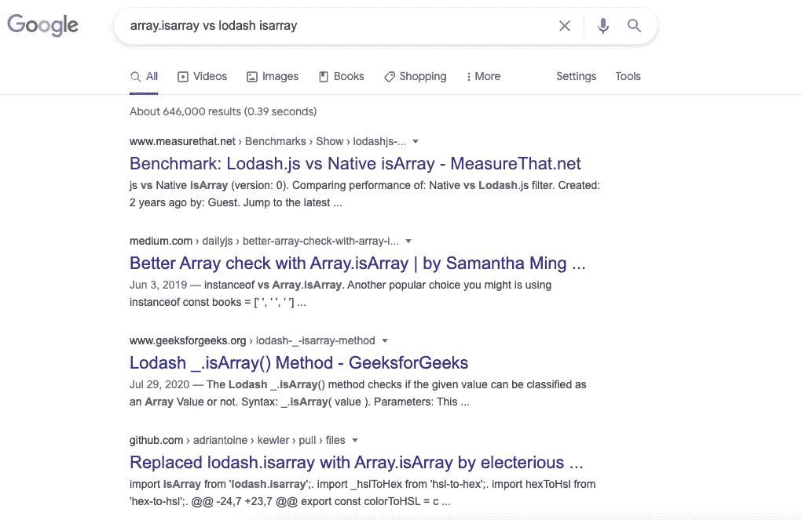
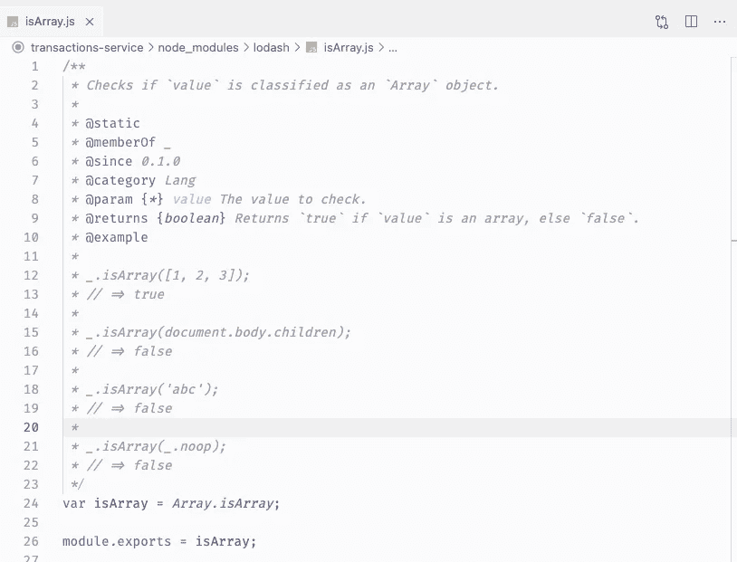

# 探索 Array.isArray vs Lodash.isArray

> 原文：<https://javascript.plainenglish.io/exploring-array-isarray-vs-lodash-isarray-1f03e5c2b6fd?source=collection_archive---------6----------------------->


Photo by [Christina Rumpf](https://unsplash.com/@punk_rock_vegan?utm_source=medium&utm_medium=referral) on [Unsplash](https://unsplash.com?utm_source=medium&utm_medium=referral)

这篇文章谈到了我在代码审查中的一次经历，最终引导我发现了`Array.isArray`和 Lodash `_.isArray`之间的区别。事不宜迟，我们开始故事吧。

# 介绍

故事从在 Gitlab 中发送合并请求开始。它类似于你在 Github 中知道的 pull 请求。

在代码本身中，我使用 lodash `isArray`来检查变量。参考下面的代码片段。

```
const { isArray } = require('lodash');​const requiredFields = getRequiredFields();​if (isArray(requiredFields)) {
  return requiredFields;
} else {
  // do something else
}
```

此时此刻，我在这里使用 lodash 的原因是

*   我首先想到的是——这是人类的本能。
*   其次，`lodash`当时已经在我的项目中安装使用了。

然而，当我的同事开始审查我的代码时，他提出了一个非常好的问题，我自己在那之前从未考虑过这个问题。

> *为什么用 lodash 代替原生数组检查* `*Array.isArray()*` *？*

正是这个问题让我有了后来的发现，我真的很感谢我的同伴提出的这个问题，它激励我去做后来的研究。

# isArray 的研究和调查

我首先尝试了关键字“Array.isArray vs lodash isArray”。显然，也有一群特殊的人和我有着同样的疑问。

下面的截图显示了搜索结果。你可以看到他们之间甚至有一个两年前建立的性能基准。



然而，我决定钻研 Lodash 的源代码，自己去发现真相。最后，我在 Lodash 中找到了下面的代码片段。从下面的代码片段中，我发现 Lodash 中的`isArray`函数实际上也在使用本机`Array.isArray`。

因此，这实际上告诉我们，在您的代码中使用 lodash `isArray`和`Array.isArray`没有区别，因为它们无论如何都会导致相同的实现。

在这个发现之后，我可以与那些正在为此奋斗的人分享，他们告诉我你不应该使用 lodash 的`isArray`，原生`Array.isArray`的性能要比优化的&好得多。**不！！！它们毕竟是一样的东西。**



# 结论

从发现来看，来自 lodash 库的`isArray`和本机内置的`Array.isArray`之间没有区别，因为它们都导致相同的实现。

然而，我想在这里强调一点。你不应该选择安装`lodash`只是为了使用`isArray`,即使他们正在使用相同的实现，因为这里更大的问题是你只是在你的项目中添加了一个依赖项，但是你可以不用安装它就使用那个功能。

感谢您的阅读，下一篇文章再见。