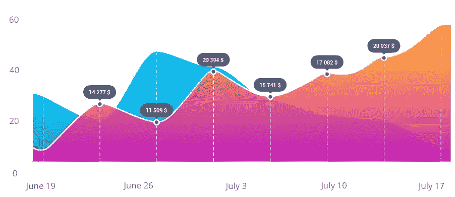
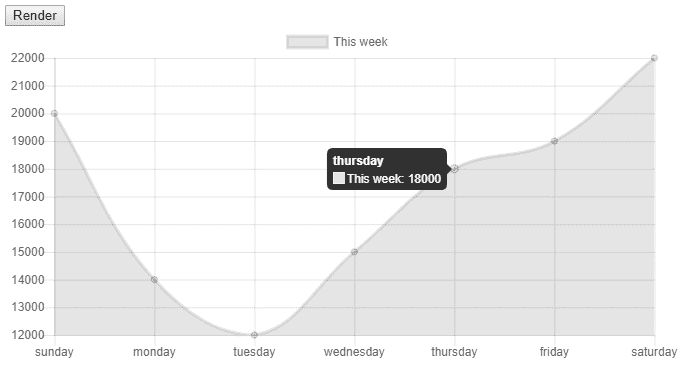
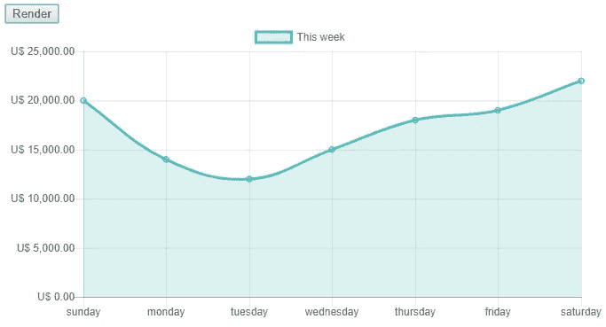
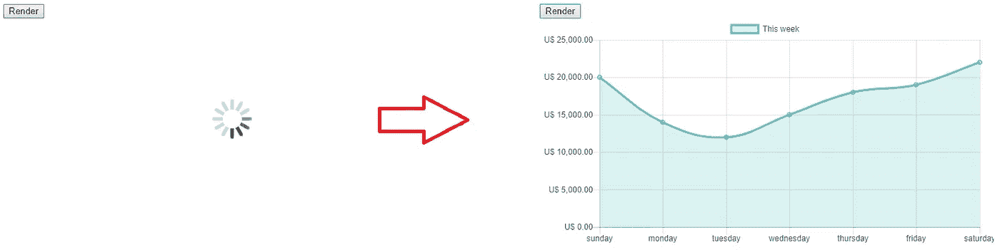
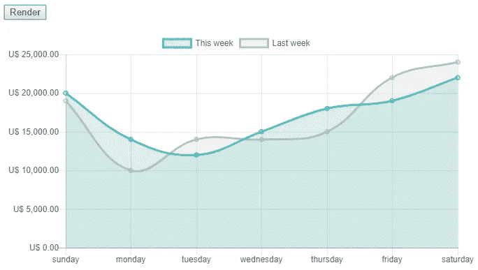
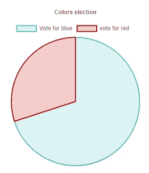
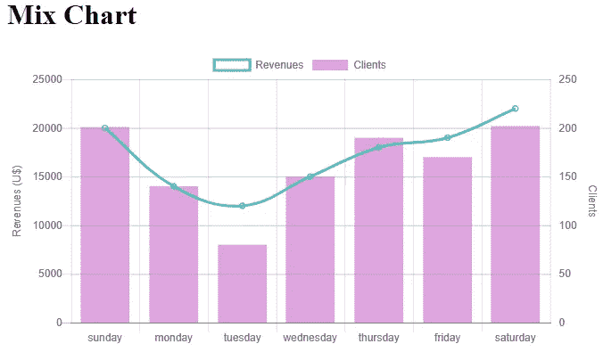

# 如何使用 Chart.js

> 原文：<https://javascript.plainenglish.io/exploring-chart-js-e3ba70b07aa4?source=collection_archive---------2----------------------->



[Chart.js](https://www.chartjs.org/) 是一个流行的开源库，帮助我们在 web 应用程序中绘制数据。它是高度可定制的，但是配置它的所有选项对一些人来说仍然是一个挑战。让我们从一个简单的例子开始，并在此基础上进行探索。

**基本实现:**
为了简单起见，我打算用 CDN 版的库。然而，如果你打算将它与 React 或 Angular 一起使用，我建议你使用 [npm 包](https://www.npmjs.com/package/chartjs)并通过`npm install chart.js --save`安装它。

我们还将使用 jQuery 来发出 ajax 请求。
我们的基本实现将绘制一家餐馆一周中每天的收入数据。

让我们从**index.html**开始

还有 **myChart.js**

设置`type` 变量，我们可以将折线图变成条形图，甚至饼图。所有不同类型的图表都可以在这里看到[。](http://www.chartjs.org/samples/latest/)

可以看到，`datasets`是一个数组。这意味着我们可以在同一个图表中绘制两个或更多的数据系列。我们将在本文的后面回到这种可能性。

到目前为止，我们项目的成果是:



**我不喜欢它的地方:**
-Y 轴不是从 0 开始的。它从 12000 开始，是系列中的最低值；
-是灰色，我想要其他颜色；
-不显示货币形式的数据:20000->20，000.00 美元

所以，我做了一些修改:

第 1 行:
`float2dollar`是一个函数，它将一个浮点数格式化成一个货币字符串:
18000 - > U$ 18，000.00

第 14 行:
`*boderColor*`和`backgroundColor` 是改变线条和区域颜色的属性。

第 22 行:
`*beginAtZero: true*`强制坐标轴从 0 开始，而不是从 12000 开始。

第 23 行:
`callback`轴的`ticks`在每次渲染一个刻度时被调用。`value`变量是显示的默认值。当我们覆盖这个回调时，我们可以改变显示在轴上的文本。在这里，我们调用我们的`float2dollar`函数。

我们已经可以看到变化:



**从 Ajax 请求中加载数据:**

为了有一个允许我们不做太多工作就发出 GET 请求的后端，我们将使用包 [json-server](https://www.npmjs.com/package/json-server) 。它可以从 JSON 文件模拟 REST 服务器。

```
npm install json-server -save
```

在我们的 node package.json 上，我们将 npm 启动脚本设置为以 2 秒的延迟运行 json-server。因为数据都是本地的，所以我们会有即时的响应。人工延迟将帮助我们模拟真实的互联网连接。

```
“start”: “json-server data.json --delay 2000”,
```

当我们运行 npm 启动脚本时，服务将在端口 3000 上可用。

为此，我们需要创建 data.json 文件。

我们还需要 html 上的一个新的 div 来显示一个“正在加载”的 gif 和一个错误消息。

为了使事情更有条理，我们将创建一个函数`getChartData()`来将 ajax 请求与按钮点击分开。

之后，我们有我们的加载 gif。



**现在，让我们试一个有两个数据系列的图表:**
假设我们想比较本周和上周的收入。让我们用蓝色显示本周的系列，用灰色显示上周的系列。

我们首先需要更新的是我们的 data.json

然后，我们需要更改 myChart.js 文件:

我们发送给 renderChart 函数的数据将是一个包含两个数组的数组。第一个(`data[0]`)是本周的收入数据，第二个(`data[1]`)是上周的数据。

最后，图表中的数据集将有第二个对象:上周的系列。

结果非常好，很容易直观地比较这两个星期。



**其他类型的图表:**
如前所述，Chart.js 提供了种类繁多的图表类型。

我们在这里研究的属性在不同类型的图形之间是共享的，只是有一些不同。例如，在饼图中，不是每个系列只传递一种颜色，而是传递一个颜色数组，因为饼图的不同部分应该有不同的颜色。

让我们使用`title`的`text`属性给图表添加一个标题。

结果是:



**混合图表类型**
Chart.js 允许我们在同一个画布上混合两种图表类型。让我们回到餐馆的例子。现在，我们希望分析我们每天有多少客户，但仍能看到收入。

在本例中，我们可以将客户的条形图与收入的折线图混合使用。

需要指出的是，在这种情况下，我们需要使用第二个 Y 轴。这是因为收入在数字上比客户多，因此条形在收入规模上非常小。

为此，我们将创建另一个文件， **mixChart.js**

要混合类型，您必须为图表定义一个主`type`，对于您想要更改的图表，您必须在单个数据集中重新定义变量`type`。对于我们的例子，我们将主类型设置为`type: “bar"`，但是在第一个数据集中，我们重新定义了`type: “line"`。

`yAxes`是`scales`的属性，是`options`的对象。这个`yAxes`实际上是一个数组，允许我们对不同的系列使用多个刻度。在这个例子中，我们使用两个 Y 轴。为此，我们需要为每一个都赋予一个`id`。第一个 Y 轴有`id:"revenues"`，第二个有`id:"clients"`。

我们在客户端轴上使用了`position: 'right'`来显示图表右侧的刻度。为了提高可读性，我们还在每个轴上添加了一个`labelString`，这样人们就可以知道左边的轴是收入，右边的轴是客户数量。



**现在怎么办？**
其实很多！正如你所看到的，Chart.js 是非常可定制的，我们仍然需要看到许多主题来涵盖所有的可能性。

一些例子有:
-显示堆叠数据；
-自定义图例；
-自定义工具提示；
-二维数据类型；
-交互事件(如点击)；
——对数标度；
还有更多…

还有就是改进 Chart.js 使用的插件，我觉得[**chart js-plugin-data labels**](https://github.com/chartjs/chartjs-plugin-datalabels)特别有用，推荐大家看看。

您可以在我们的 [GitHub 资源库](https://github.com/andregardi/exploring-chartjs)中查看本文使用的文件。

如果你想在未来阅读更多关于 chart.js 的内容，请在评论中告诉我们。