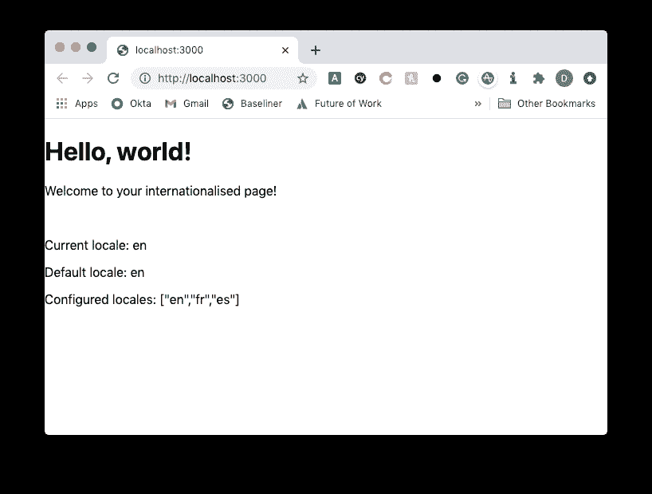

# 用 Nextjs 10 和 react-intl 探索国际化

> 原文：<https://javascript.plainenglish.io/exploring-internationalisation-with-nextjs-10-and-react-intl-b6b8ccac36c9?source=collection_archive---------4----------------------->

在这篇文章中，我们将深入探讨 Next.js 10 在[国际化路由](https://nextjs.org/docs/advanced-features/i18n-routing)中的一个新的高级特性，以及我们如何在 [react-intl](https://www.npmjs.com/package/react-intl) 中使用它。

## 入门指南

通过运行`npx create-next-app i18n-example`创建一个新的项目名称**i18n-示例**，创建一个新的 Next.js 10 项目。

我们将运行一些其他命令进行设置:

> 为了安装`react-intl`,我使用了`--legacy-peer-deps`,因为有一个`react@^16.3.0`的对等依赖，我运行的是 npm v7。

现在我们已经有了一些文件，让我们从一些基本内容开始吧！

## 设置 Next.js i18n

根据[开始](https://nextjs.org/docs/advanced-features/i18n-routing)的文档，我们需要更新`next.config.js`:

这里我们用[子路径路由](https://nextjs.org/docs/advanced-features/i18n-routing#sub-path-routing)，所以 TL；dr 是指`our-website.com`将是默认的语言环境(英语)，而`our-website.com/fr`和`our-website.com/es`将分别把我们导向法语和西班牙语网站。

现在我们已经解决了这个问题，让我们更新一下`pages/index.js`页面吧！

## 国际化我们的主页

我们可以使用下一个路由器来获取我们所处的位置。

从 Vercel 的 GitHub 中有一个[简单的例子](https://github.com/vercel/next.js/blob/canary/examples/i18n-routing/pages/index.js)，我们可以从中获得灵感。

替换`pages/index.js`如下图所示:

有了这个，我们就可以开始我们的应用程序，并看到结果。

运行`npm run dev`启动服务器，并转到本地主机特定端口(可能是`[http://localhost:3000](http://localhost:3000).)` [)。](http://localhost:3000).)

一旦你到了那里，你将会看到当前的英语语言环境以及配置了哪些语言环境！

考虑到我们之前提到的关于子路由的内容，我们现在可以转到`/fr`和`/es`并期待当前的语言环境发生变化。下图是`/fr`路线，展示我们的子路线工作。

太神奇了！现在我们在这里完成了，我们可以用`react-intl`来实现它。

## 使用 react-intl 切换拷贝

我们将使用`react-intl`运行一个简单的例子，但是我们首先需要做的是准备一些我们希望替换掉的内容！

在`content/locale/en.js`里面，让我们通过一些基本的 JSON 来代替我们的“Hello，world！”欢迎信息:

> 这些文件的结构由您决定，但是我现在使用页面名称的顶级键和字符串中的标识符。我以前工作过的地方把它保存为 JSON 上传到像 [Smartling](https://www.smartling.com/) 这样的地方，所以你可能想把 JSON 转换成我正在使用的上述 ES6 格式。

让我们复制粘贴到我们的西班牙语和法语文件，并使用一些可能不准确的谷歌翻译来帮助我们。

对法国人来说:

对于西班牙人:

最后，我们想要更新我们的桶文件`content/locale/index.js`:

太好了！现在我们在这里，让我们回到`pages/_app.js`来添加我们需要的提供者。

我们正在做一些事情:

1.  通过我们创建的桶文件导入所有的语言环境文件。
2.  从`react-intl`导入`IntlProvider`，作为应用程序的一部分用于我们的每个页面。
3.  使用 Next.js 路由器给出的`pathname`来根据页面确定使用哪个区域设置副本。

现在让我们回到`pages/index.js`并利用`react-intl`。

在这个页面上，我导入了`useIntl`钩子，从那个钩子中析构了`formatMessage`，创建了一个帮助器函数`f`，它抽象了总是传递一个带有 id 的对象的需求，并用我们在区域设置内容中的页面的键名替换了适当的代码。

让我们用`npm run dev`启动应用程序，看看会发生什么！

如果我们检查`/`、`/fr`和`/es`，我们分别得到以下结果:

成功！

作为一个额外的奖励，我们可以创建一个新的文件`pages/alt.js`并添加类似的内容，以展示其他语言环境页面如何使用我们放在语言环境文件中的`/alt` route 关键字:

打算分别给我们介绍一下`/fr/alt`和`/es/alt`:

请注意，我们在这个页面上也重复使用了`hello`键，但是由于我们设置了区域设置和`pages/_app.js`页面，所以没有发生冲突。非常方便。我不确定这是不是最好的布局方式(可能有一些问题我还没有大规模遇到)，但对于这个演示来说，它工作得相当好。

> 注意:如果你在终端弹出一个关于缺少多填充的错误，请参考[格式文档](https://formatjs.io/docs/react-intl/#runtime-requirements)。TL；dr 就是需要节点 v13+或者可以安装包。

## 摘要

总之，我们已经探索了 Next.js 国际化，并使用了`react-intl`包来帮助我们的语言环境变得生动起来！

这里看最终项目(虽然缺乏美感)[这里](https://hello-nextjs-i18n.vercel.app/)[看最终代码](https://github.com/okeeffed/hello-nextjs-i18n)。

## 资源和进一步阅读

1.  [反应国际](https://www.npmjs.com/package/react-intl)
2.  [Next.js 10 — i18n 路由](https://nextjs.org/docs/advanced-features/i18n-routing)
3.  [竣工工程](https://hello-nextjs-i18n.vercel.app/)
4.  [最终代码](https://github.com/okeeffed/hello-nextjs-i18n)
5.  [react-intl 运行时要求](https://formatjs.io/docs/react-intl/#runtime-requirements)
6.  [耍滑头](https://www.smartling.com/)

*图像功劳:* [*安德鲁·巴特勒*](https://unsplash.com/@drewbutler)

*原贴于我的* [*博客*](https://blog.dennisokeeffe.com/blog/2020-11-08-nextjs-intl-with-react-intl/) *。*