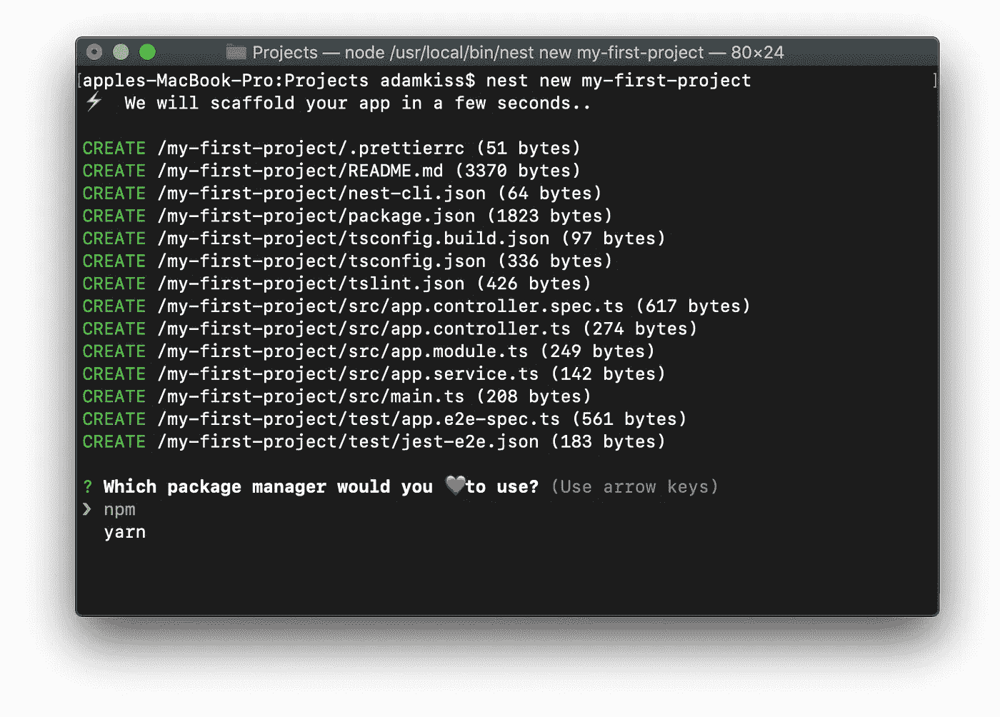
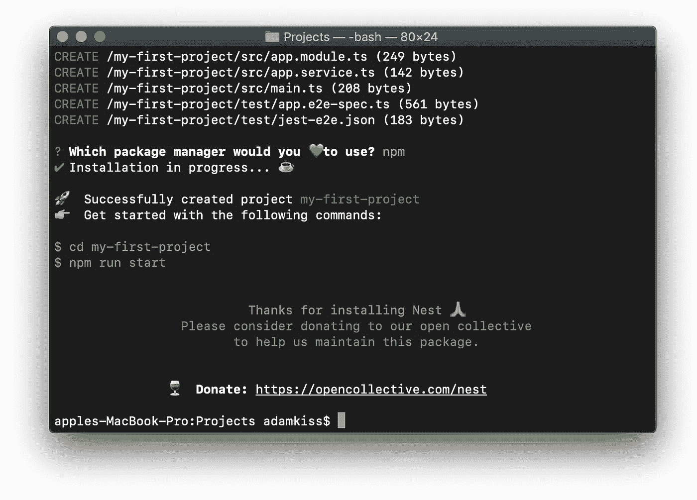
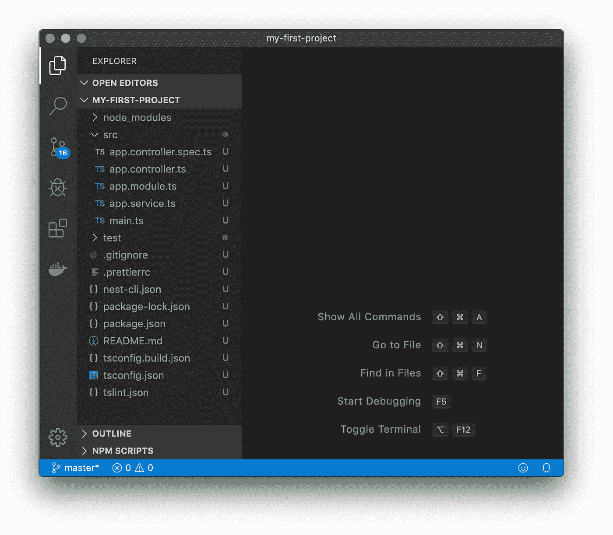
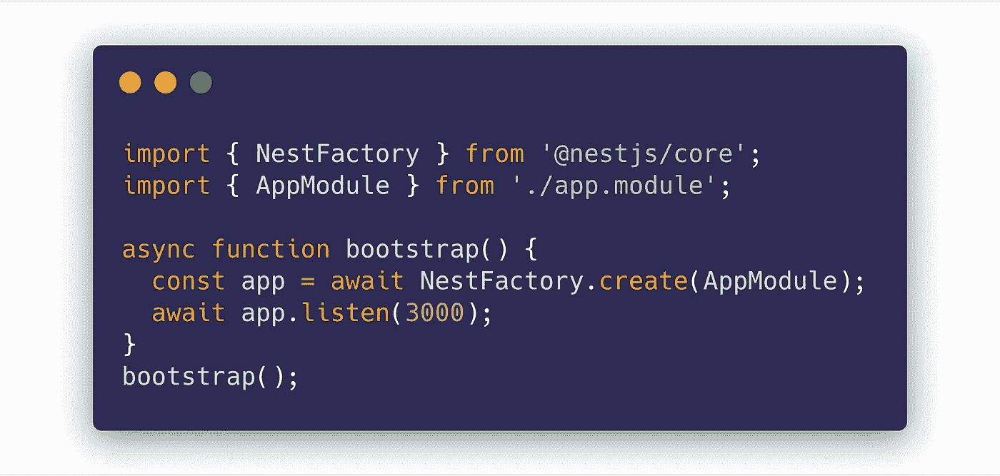
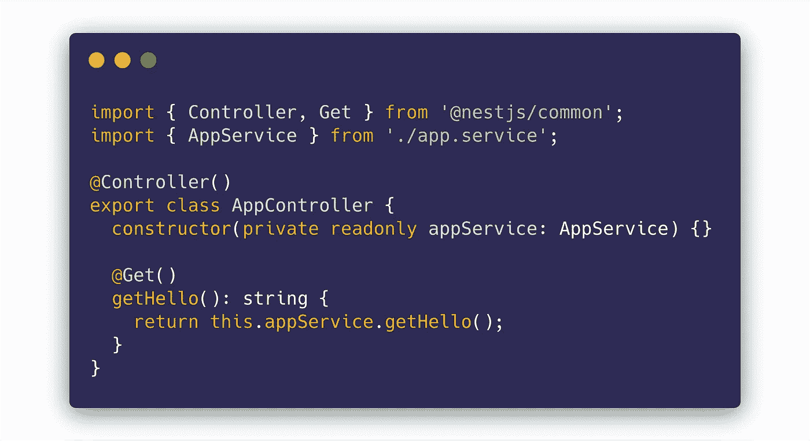
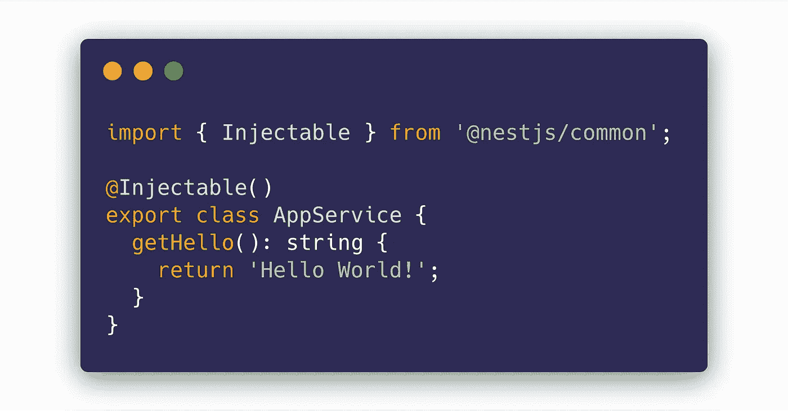
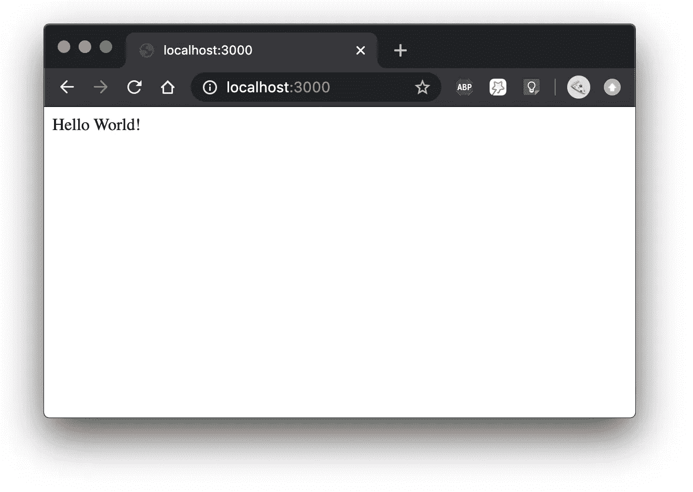

# 探索 nestj——安装 nestj 并开始使用

> 原文：<https://javascript.plainenglish.io/exploring-nestjs-installing-nestjs-and-getting-started-fb2e4f36b596?source=collection_archive---------3----------------------->


Photo by [Fabian Grohs](https://unsplash.com/@grohsfabian?utm_source=medium&utm_medium=referral) on [Unsplash](https://unsplash.com?utm_source=medium&utm_medium=referral)

这是“探索 NestJS”系列的第 1 部分🙌🏻。

我还写了一篇关于 NestJS 的介绍性文章，让您先睹为快。如果你愿意，你可以在这里查看: [" *你绝对应该为你的节点应用程序使用 NestJS "*](https://medium.com/javascript-in-plain-english/be-cool-get-started-with-nestjs-a-modern-web-framework-for-node-js-31b25e6348d5)*。*

NestJS 入门真的很简单，那就直接进入吧！

首先你的电脑上必须安装有 [Node.js](https://nodejs.org) (≥8.9.0)。

如果你以前没有使用过 Node，你必须知道它是一个 *JavaScript 运行时环境*(花哨的措辞，但基本上它只是运行你的 JavaScript 代码——就像你的浏览器在客户端运行它一样)。

安装 Node.js 之后，你必须使用它的包管理器:`npm` *，*来安装 NestJS 的 CLI。

> ***什么是 CLI？*** *这是一个小程序，命令行界面。通常 CLI 帮助你完成日常任务。NestJS CLI 帮助您引导 Nest 项目并快速入门。*

在操作系统中打开终端(命令行),键入以下命令:

```
npm i -g @nestjs/cli
```

这将全局安装(因此命令中的*" I "*)NestJS 的 CLI `npm`包。

成功安装后，您可以使用以下命令创建一个新的 NestJS 项目:

```
nest new your-project-name
```

您可以用任何您想要的项目名称替换`your-project-name`。

CLI 现在会询问您将使用哪个软件包管理器。如果您个人喜欢，选择`npm`或`yarn`:



安装完成后，您应该会看到类似的消息:



现在，您应该有一个以您的项目名命名的目录(当然，在您终端的当前工作目录中)，包含您新引导的 NestJS 项目。

恭喜👏🏻 🎆 🔥！

让我们快速探索一下项目中的内容。



我们可以看到我们得到了一个`src`文件夹，不同的文件以`.ts`结尾(TypeScript 文件的后缀)。

`main.ts`是每个 NestJS 项目的入口点。它引导应用程序，指定应用程序应该运行的端口，如果需要还需要额外的配置。



***main.ts*** — the entry point of every NestJS app

`app.module.ts`是我们默认的应用模块(`AppModule`)。我们将在 NestJS 系列的下一章讨论模块。

`app.controller.ts`是我们的`AppModule`的 HTTP 控制器。

它可以响应 HTTP 请求(如 GET、POST、PUT 等。).



**app.controller.ts** — the AppModule’s HTTP controller

`app.service.ts`是 AppModule 的可注入服务。它用在`app.controller.ts`中，它只有一个简单的函数，返回一个 *"Hello"* 字符串。



**app.service.ts** — the AppModule’s service class

太好了！让我们启动这个项目，看看它能做什么…

回到您的终端(或命令提示符)并切换到 NestJS 项目的当前工作目录:

```
cd your-project-name
```

现在，编写以下命令:

```
npm start
```

您应该会看到以下控制台消息:


完美！现在让我们在我们最喜欢的浏览器中访问`localhost:3000`。



这首《Hello world！消息来自我们的 NestJS 应用程序。更具体地说，它来自 AppModule 的控制器。哇哦。

恭喜你。您设法安装并引导了一个 NestJS 项目🔥 🌟。

请务必在本系列的第二部分中继续学习 NestJS 的模块系统，探索 NestJS:[https://medium . com/JavaScript-in-plain-English/Exploring-NestJS-nests-module-system-88 c6d 7 ad 0970](https://medium.com/javascript-in-plain-english/exploring-nestjs-nests-module-system-88c6d7ad0970)。

干杯！