# 探索 NestJS——Nest 的模块系统

> 原文：<https://javascript.plainenglish.io/exploring-nestjs-nests-module-system-88c6d7ad0970?source=collection_archive---------0----------------------->


Photo by [Jonas Smith](https://unsplash.com/@jonassmith?utm_source=medium&utm_medium=referral) on [Unsplash](https://unsplash.com?utm_source=medium&utm_medium=referral)

抬头！本文是探索 NestJS 系列的第二部分🙌🏻。

如果你愿意，你可以在这里找到第一部分:[https://medium . com/JavaScript-in-plain-English/exploring-nestjs-installing-nestjs-and-getting-started-FB 2 e 4 f 36 b 596](https://medium.com/javascript-in-plain-english/exploring-nestjs-installing-nestjs-and-getting-started-fb2e4f36b596)。

# 模块系统到底是什么？

NestJS 选择使用所谓的*“模块”。*

模块是应用程序的一个独立部分，它封装了属于一起的多种功能。

通常，一个模块包含一个业务领域所需的所有功能。

# 模块系统是如何工作的？

假设您正在构建一个有多个用户的应用程序，可能保存在数据库的某个地方。

显然，您必须访问数据本身(用户数据)，为此您需要一些文件，比如说 *User.entity.ts (* 描述用户实体的结构)和一个服务，通过它您可以进行 CRUD 操作(创建、读取、更新、删除): *Users.service.ts.*

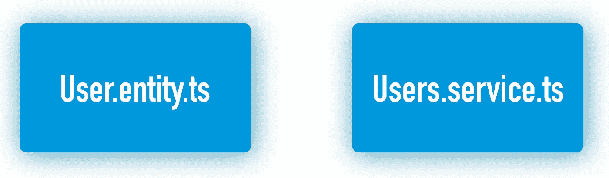

我们必须将这两个文件“放”在同一个模块中: *Users.module.ts，*，这样它们显然属于同一个模块。

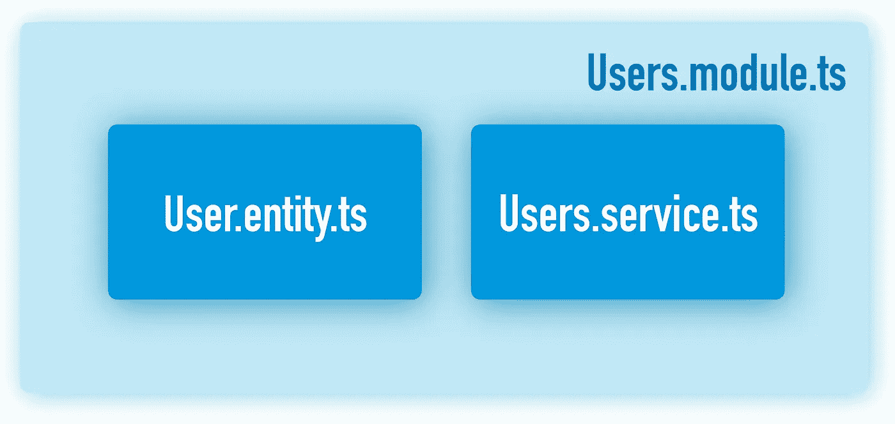

The User entity and the Users service will be encapsulated in the same module

当应用程序的另一部分(另一个模块)必须处理任何与用户相关的事情时，它知道*用户模块*是访问点。

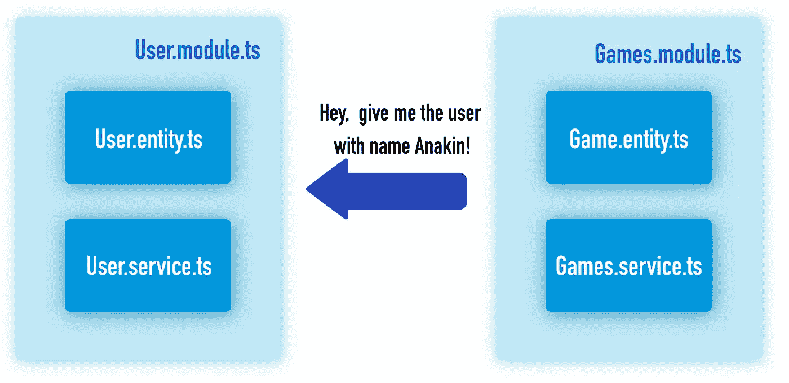

Example: Games module can access functionalities of the Users module (like getting user details)

# 根应用程序模块

每个 NestJS 应用程序都有一个根模块，称为应用程序模块。

在模块的依赖图中，所有其他模块都在这个模块的“下面”。

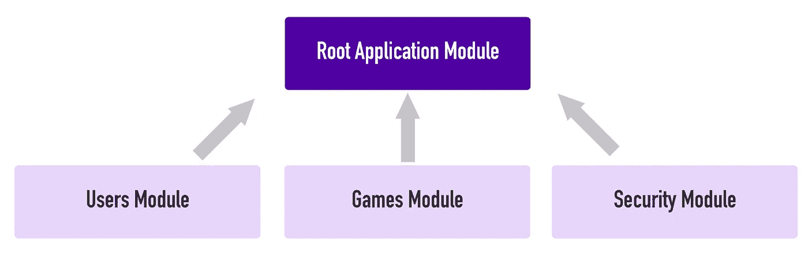

如果您没有在 Nest 应用程序中创建任何其他模块，您仍将拥有默认的“AppModule”，如下所示:

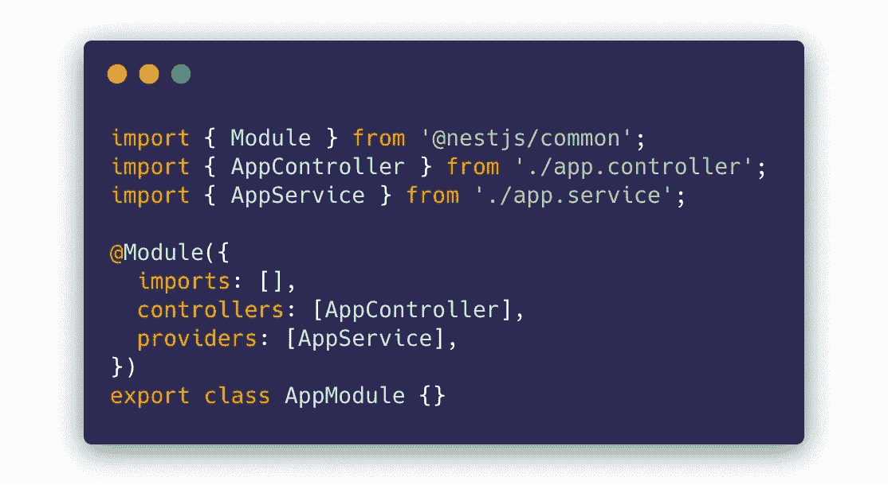

如您所见，模块是通过用 *@Module* decorator *修饰 TypeScript 类来定义的。*

一个模块由其*控制器*、*提供者*、*导出*和*导入*定义。

让我们来揭开这些是什么意思。

# 控制器

控制器是用 *@Controller* decorator 注释的简单类。

它可以响应 GET、POST、PUT 等类型的 HTTP 请求。

我们不会在这里深究它们(只在下面的文章中)，但这是一个人的样子:

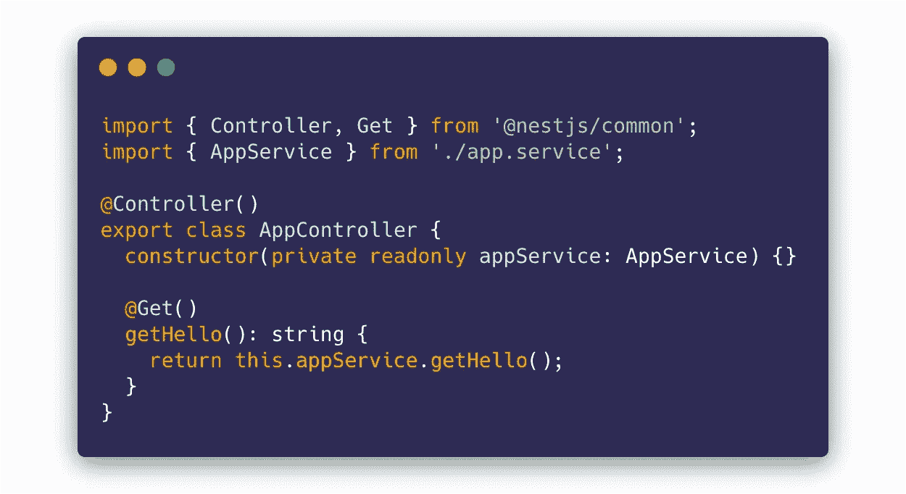

好的，假设我们已经定义了这个控制器，我们现在必须把它链接到我们想要的模块。

怎么会？我们只需将控制器添加到模块的“控制器”数组中:

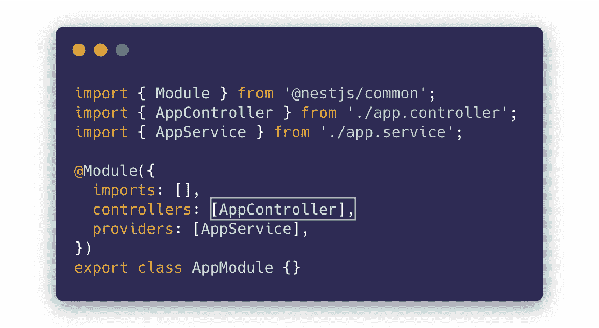

We import the controller and add it to the “controllers” array of our module

瞧啊。现在，我们的模块中有了一个控制器。

# 提供者

在 NestJS 中，一个非常重要的装饰器是*@ injectible。*

你把处理业务逻辑的代码(你的应用程序的所有逻辑，访问数据库，访问外部服务等等。)到服务类中。

服务类如下所示:

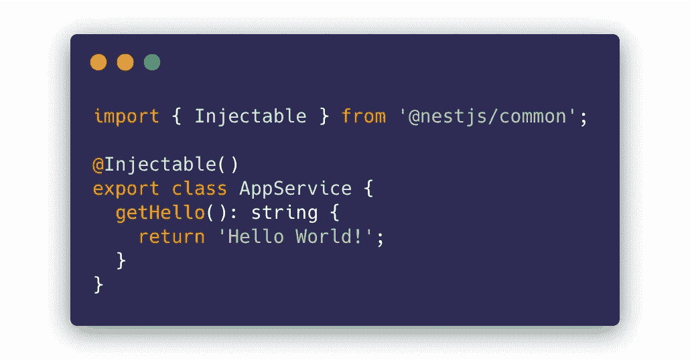

在这些服务类上使用了*@可注入的*装饰器。它支持将这些服务注入到其他地方，例如可能需要与之通信的其他服务。

回到我们的模块，我们将服务的名称放入我们的提供者数组中。现在我们的服务属于我们心爱的模块。耶！

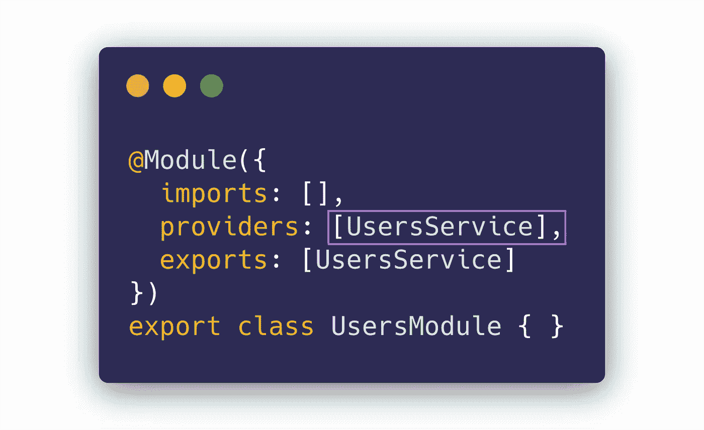

We must put all our services into the “providers” array so that they belong to the module

需要注意的是，提供商不仅仅是为了服务。

它们可以用于许多其他情况(与依赖注入相关)，比如交换实现(用于测试)等等。我们不会详细讨论，因为在开始时掌握这些知识并不重要。

# 出口

还记得上面的图表吗，一个模块使用另一个模块？

如果您想从一个模块中公开一个服务，您可以通过模块定义的" *exports* "数组来实现。

例如:考虑一个封装了所有用户相关功能的模块，姑且称之为 UsersModule。

该模块包含用户服务。

如果我们希望应用程序的其他部分访问 UsersService 并检索一些用户数据，我们必须将其从 UsersModule 中导出。

我们这样做:

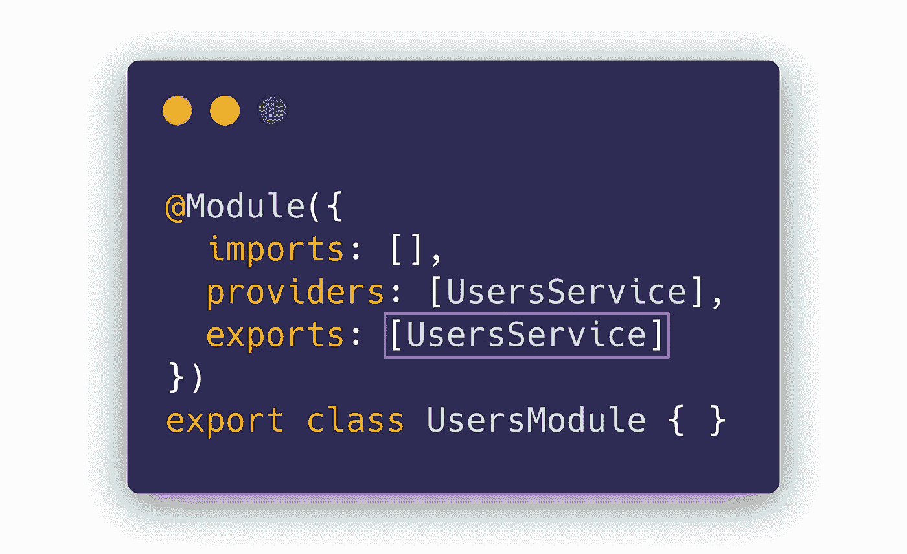

We use the “exports” array of the module to export a subset of the module’s providers

基本上， *exports* 数组是我们的 *providers* 数组的一个子集，指定了哪些提供者(比如服务)可以在其他模块中访问和使用。

现在，我们只有一件事需要澄清:我们如何在另一个模块中使用 UsersService？这就是*“进口”*的作用。

# 进口

您使用 *imports* 数组来指定您想要使用*服务*的其他模块(或其他提供者)。

示例:

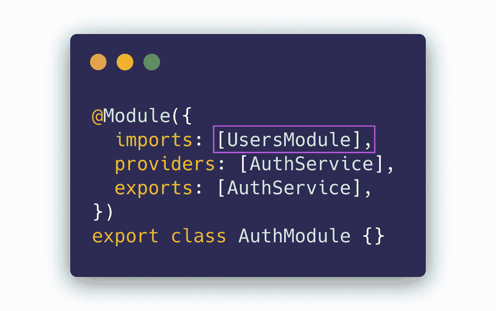

The “imports” array of a module defined which modules’ providers you’d like to use

在上面的示例中，我们在 AuthModule 中导入 UsersModule(一个处理身份验证/授权的模块——可能我们需要获取一些用户详细信息来查看用户是否有权访问某些资源)。

很好，但是我们如何实际使用从 UsersModule 导出的服务呢？答案是依赖注入:

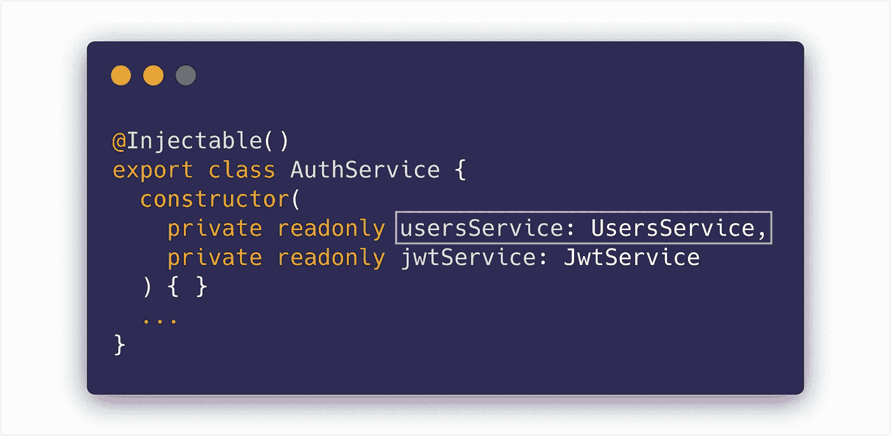

We use NestJS’ dependency injection to inject UsersService into AuthService

我们在 auth service(auth module 的一部分)的构造函数中放置了一个 UsersService 类型的新字段。这将通过 NestJS 的依赖注入自动连接。优雅！

在此之后，我们可以使用 UsersService 公开的函数:

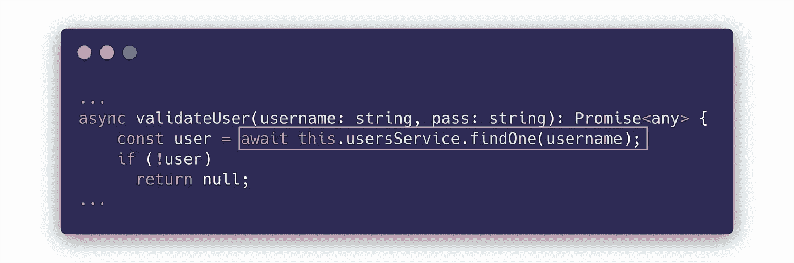

We can now use the functions of the UsersService class

# 我如何创建自己的模块？

你在第 1 章看到了如何引导一个 NestJS 项目。

使用 Nest CLI 在您的 Nest 应用程序中创建另一个模块非常容易。

当然，您可以手动完成所有的编码和连接，但是 CLI 简化了我们的工作。

在现有的 NestJS 项目目录中打开一个终端窗口(或命令提示符窗口),并编写以下内容:

```
nest generate module my-first-module
```

您应该会看到以下对话框:

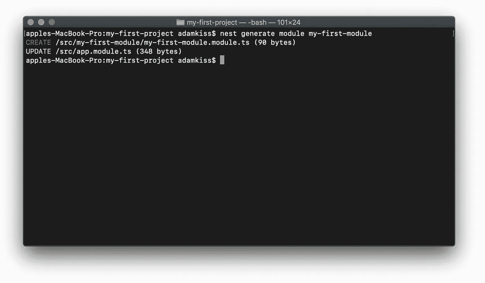

## 刚刚发生了什么？

Nest 的 CLI 用新模块的名称(“my-first-module”)和模块文件本身创建了一个新文件夹:`my-first-module.module.ts`:

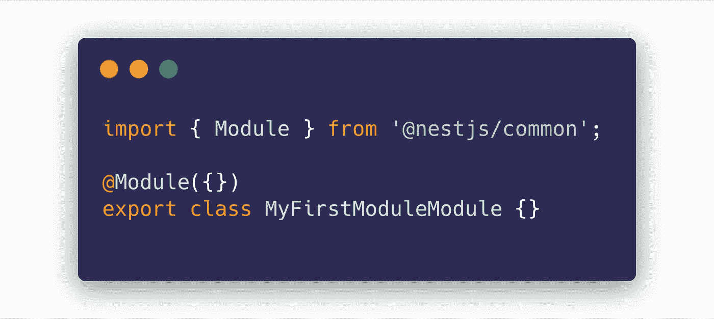

This module is currently quite empty

正如您所观察到的，这个模块相当空，但是我们将在本系列的下一章添加一些控制器和服务。

还需要注意的是，新模块是在 AppModule 中注册的:

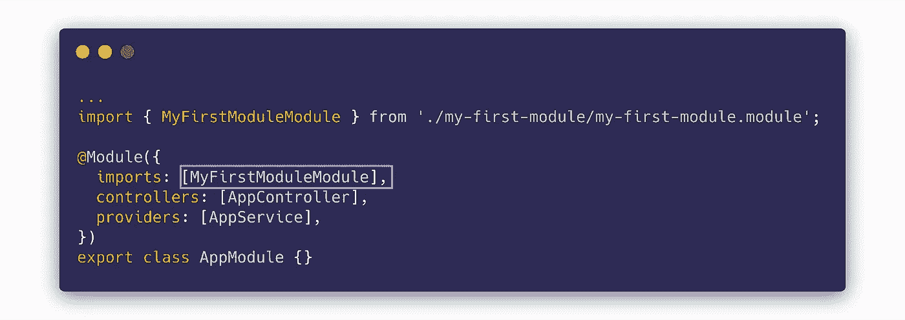

看起来很眼熟🤔？新模块的注册是通过在 AppModule 中导入它来完成的。

恭喜🎆！现在，您应该对 NestJS 中的结构有了清晰的了解。

干杯！