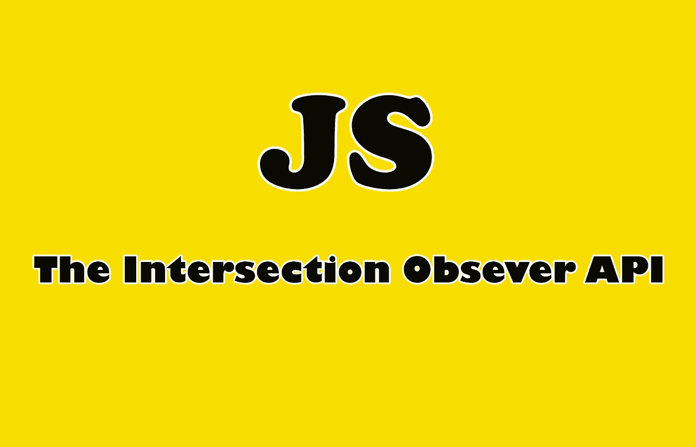

# 探索 JavaScript 中的交叉点观察器 API

> 原文：<https://javascript.plainenglish.io/exploring-the-intersection-observer-api-in-javascript-d1e80d6b97c4?source=collection_archive---------7----------------------->

## 通过实例了解交叉口观察者

Image Created with❤️️ By Mehdi Aoussiad.

# 介绍

对于开发人员来说，检测一个元素在网页上的可见性，或者两个元素之间的相对可见性是一项困难的任务。交叉点观察器 API 用一种简单的方法来解决这个问题。这个现代的浏览器 API 允许我们跟踪元素的可见性并创建强大的交互。

在本文中，我们将探索和学习 JavaScript 中的交叉点观察器 API。

# 什么是路口观察者？

交叉点观察器是一个浏览器 API，它让我们可以观察事物何时与视口相交。它提供了一种异步观察目标元素与祖先元素或顶级文档视窗的交集变化的方法。需要这个 API 的原因有很多，例如:

*   页面滚动时图像或其他内容的延迟加载。
*   实现“无限滚动”网站，加载越来越多的内容。
*   通过只实例化对用户可见的对象来提高性能。
*   实现视差效果等等。

# 创建交叉点观察点

我们可以通过调用它的构造函数并传递给它一个带有选项的回调函数来创建一个交叉点观察器。传递给`**intersectionObserver()**`构造函数的对象`**options**`允许您控制观察者回调被调用的环境。该对象包含一些属性，例如:

1.  **根:**用作检查目标可见性的视口的元素。
2.  **根部边缘:**根部周围的边缘。可以具有类似于 CSS margin 属性的值。
3.  **阈值:**阈值 1.0 意味着当目标的 100%在由`**root**`选项指定的元素内可见时。0.5 表示 50%(以此类推)。

让我们看看下面的例子:

The Intersection Observer.

每当目标达到为构造函数指定的阈值时，就会调用回调。回调接收条目对象和观察者的列表:

The Constructor’s Callback.

# 实际例子

在本例中，我们将使用交叉点观察器来检查网页上容器 div 的可见性。如果该元素在页面上可见，我们将在容器中显示一个文本(h1)。当元素不可见时，我们将在页面(h2)上显示另一个文本，告诉我们容器 div 不可见(不相交)。所有这些都使用 JavaScript 中的交集观察器。如果你想理解的话，你可以阅读我们的代码示例。

Practical Example.

您也可以在下面的 Codepen 中查看该代码的输出。运行它并开始滚动。

Codepen Example.

如您所见，这只是使用交叉点观察器 API 的一个简单示例。你可以用这个强大的 API 做很多其他的事情，你只需要一点点的练习。

# 结论

JavaScript 中的交叉点观察器 API 是检查网页上元素可见性的强大工具。这有助于完成更多其他任务，如图像的延迟加载，这有助于提高网页的性能。

## 进一步阅读

 [## 包裹——零配置网络包替代方案

### 为您的项目开始使用超级简单的 JavaScript Bundler

medium.com](https://medium.com/javascript-in-plain-english/parcel-the-zero-configuration-webpack-alternative-1bcd6704ab9f)