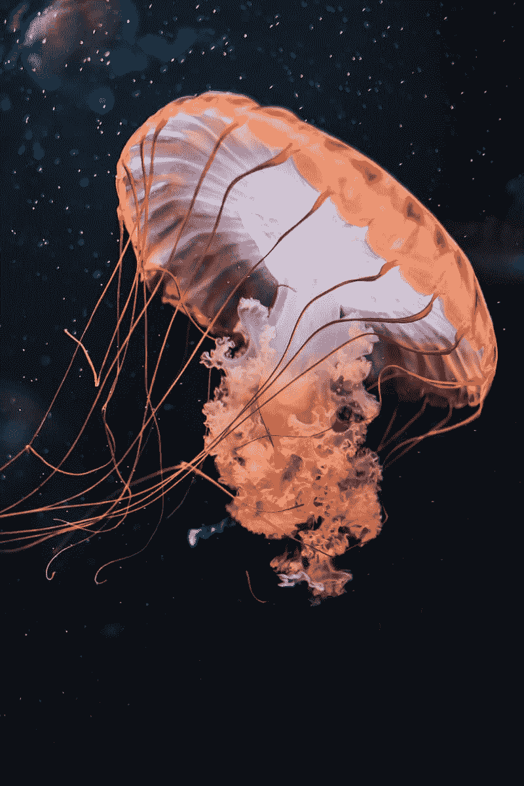
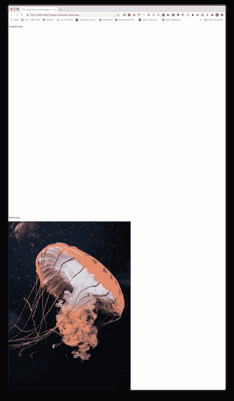
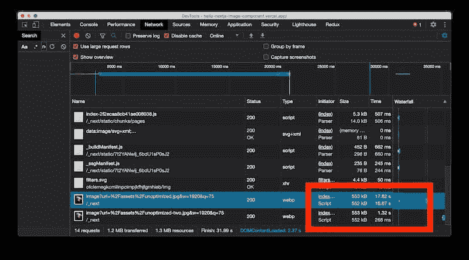
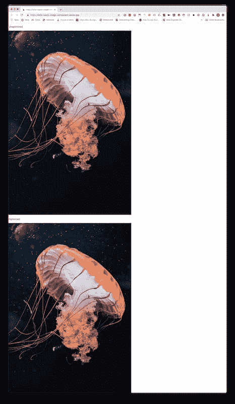
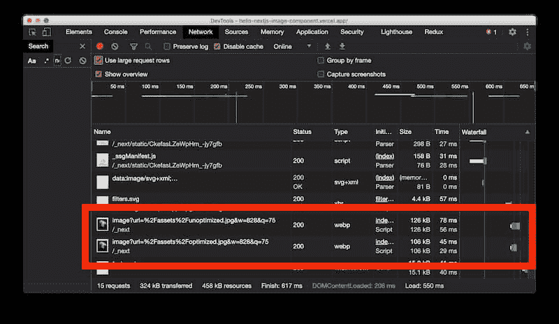

# 使用 Next.js 10 探索新的图像组件

> 原文：<https://javascript.plainenglish.io/exploring-the-new-image-component-with-next-js-10-cc0f70548886?source=collection_archive---------9----------------------->

Next.js 发布了一个优化的[图片组件](https://nextjs.org/docs/basic-features/image-optimization)，它优化了图片在 Next.js 网站上的加载方式。用他们自己的话说:*“图像总是以避免累积布局偏移的方式呈现，这是谷歌将在搜索排名中使用的一个至关重要的核心网站。”—* [*Next.js 图片文档*](https://nextjs.org/docs/basic-features/image-optimization)

在这篇文章中，我们将探索和尝试这个新组件，看看它是如何工作的。

## 入门指南

我们将使用`create-next-app`构建出项目:

## 选择图像

为了这次特别的探索，我去了 Unsplash，选择了一张我喜欢的图片。

在这种情况下，我选择了弗洛里安·奥利佛的水母形象。

之后，我去了在线工具 [Squoosh](https://squoosh.app/) 将图片的大小调整为 800x1199，并用基础设置进行了优化。

这创建了 78KB 的映像优化版本，而原始的未优化版本为 4.5MB

## 更新主页以放入两个版本

根据我在 Next.js 示例报告中看到的示例，我对其进行了修改，以显示优化和未优化的图像:

本质上，这就是我玩它所需要的！

我将这个例子部署到 [Vercel](https://vercel.com) 上，看看会有什么结果。

## 探索结果

第一次访问制作网站时，我注意到在加载图像时，有一个很好的空间供图像加载:

该空间与防止[累积布局偏移](https://web.dev/cls/)有关，如前所述，累积布局偏移是核心网的关键。

在第一次加载过程中，未优化的图像加载到页面需要大约 17 秒。这是因为 Next.js 在加载之前优化了图像。

我犯了一个菜鸟错误，在项目的第一次加载期间没有打开`Network`选项卡，因此时间本身并不完美，但在这里，我稍后重新部署了项目的网络选项卡，以显示与我的第一次加载类似的体验:

.

> 注意:你可以看到这里的图像是从原始 JPEG 的 4.5MB 优化下来的，它是以`webp`格式出现的，但优化后的大小远远大于后面显示的示例。我不能说为什么在重新部署项目时会发生这种情况，但鉴于图像针对设备和浏览器进行了优化，我会说这可能是由于在我的 MacBook 上重新部署和访问项目，分辨率比我的显示器高。

加载后，我们会看到如下所示的屏幕:

根据文档，缓存是这样工作的:*图像根据请求动态优化，并存储在* `*<distDir>/cache/images*` *目录中。优化的图像文件将为后续请求提供服务，直到到期。当发出的请求与缓存但已过期的文件匹配时，在生成新的优化映像和缓存新文件之前，缓存的文件将被删除。”*

*“过期(或者更确切地说是最大年龄)是由上游服务器的缓存控制头定义的。”*

*"如果在 Cache-Control 中找到 s-maxage，则使用它。如果没有找到 s-maxage，则使用 max-age。如果没有找到最大年龄，则使用 60 秒。”*

所以在我们的例子中，一旦图像在调用过程中被优化，它就会被缓存，随后的请求会非常快地加载我们需要的图像！这是我在重装时最初部署的网络:

## 最后

今天的帖子是关于在实际部署中使用未优化和优化的源映像来查看 Next.js 映像优化的效果。

虽然这只是一个表面现象，但是使用 Next.js 10 图像优化可以看到的东西是令人难以置信的，这无疑是朝着帮助开发人员的正确方向迈出的一大步。

自从几年前遇到[react-ideal-image package](https://github.com/stereobooster/react-ideal-image)以来，我一直渴望看到这一领域的其他解决方案，而这无疑是其中一个遥遥领先的解决方案。

## 资源和进一步阅读

1.  [Next.js 图像组件](https://nextjs.org/docs/basic-features/image-optimization)
2.  [弗洛里安·奥利佛——水母图片](https://unsplash.com/photos/GVe30cQ8CWU?utm_source=unsplash&utm_medium=referral&utm_content=creditShareLink)
3.  [Squoosh](https://squoosh.app/)
4.  [Next.js 图片示例](https://github.com/vercel/next.js/tree/canary/examples/image-component)
5.  [累计布局移位](https://web.dev/cls/)
6.  [反应-理想-图像包](https://github.com/stereobooster/react-ideal-image)

*形象功劳:*[bmarcel](https://unsplash.com/@bmarcel)

*原贴于我的* [*博客*](https://blog.dennisokeeffe.com/blog/2020-11-08-nextjs-10-image-component/) *。*