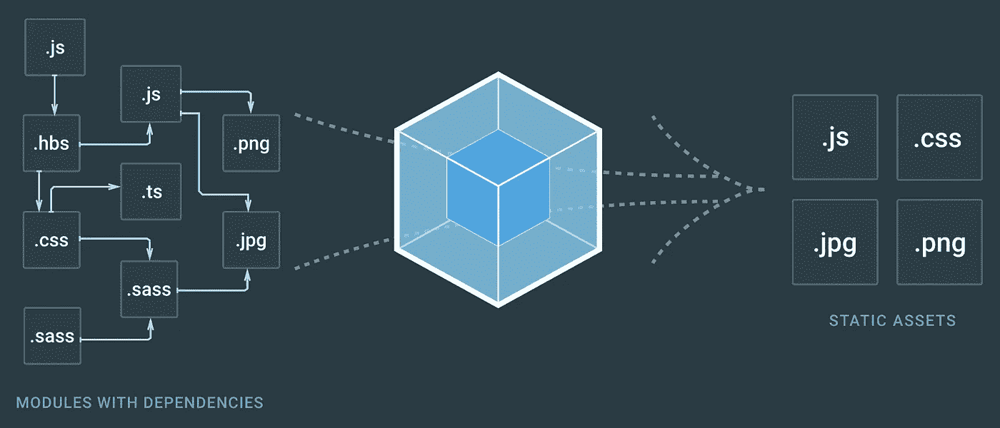

# 编写自己的 webpack 插件

> 原文：<https://javascript.plainenglish.io/exploring-webpacks-templateplugin-writing-webpack-plugin-8bb283fc82c0?source=collection_archive---------5----------------------->

如果您使用 webpack 来捆绑您的库，您很可能会在您的条目文件中导出一些内容:

如果你像那样用 webpack 构建它，开箱即用，你可能会惊讶，如果你尝试`require()`构建的文件，你会发现构建的文件没有导出任何东西。

如果你读过我以前写的一篇关于编写模块捆绑器的文章，你可以想象输出包看起来像这样:

*Everything should be familiar, except the fact that instead of calling* ***webpackStart*** *in a separate statement, I made it into a IIFE (Immediately Invoked Function Expression) for reasons that will be apparent later*

为了构建一个库，即:为了暴露条目文件导出的任何内容，webpack 提供了 3 个选项供您使用:

# Webpack 的 output.library*选项

要了解它们各自的工作原理，我们先从`output.libraryTarget`说起。

`output.libraryTarget`接受`string`作为值，您可以向`output.libraryTarget`选项提供 2 组主要值:

## 1.模块系统名称:`"commonjs"`、`"commonjs2"`、`"amd"`、`"umd"`，...

Webpack 允许您指定想要用来公开条目文件的导出值的模块系统的名称。

您可以指定一个不同于您在库中使用的模块系统。

让我们试着以`commonjs2`为例:

`commonjs2`使用`module.exports`从模块中导出值。在这个例子中，webpack 将 IIFE 的返回值分配给`module.exports`。

如果看捆绑的代码，和没有指定`output.libraryTarget`的没有太大区别。唯一不同的是捆绑代码的前缀是`module.exports =`；

> *对了，如果你好奇 commonjs 和 commonjs2 的区别，可以跟帖* [*本期*](https://github.com/webpack/webpack/issues/1114) *。*

另一方面，您可以指定导出对象所分配到的变量名，而不是通过模块系统公开库内容。

我们以`self`为例:

所有导出的值被分配给`self`。

再次观察捆绑代码，这一次我们在捆绑代码前面加上`Object.assign(self,`，后面加上`);`。

另一方面，将`output.libraryTarget`指定为`var`，允许您将它赋给一个变量名，这可以在`output.library`选项中提供:

如果您不想让`myApp`包含条目文件的所有导出值，您可以只在`output.libraryExport`选项中提供您想要导出的键:

同样，您可以观察到，通过播放不同的选项值`output.library`、`output.libraryTarget`、`output.libraryExport`，webpack 为捆绑代码添加了不同的前缀和后缀:

那么，如果我们想支持类似下面这样的自定义库目标，我们应该怎么做，而不是使用 webpack 内置库目标呢？

我在 [webpack 官方文档](https://webpack.js.org/configuration/output/)中搜索，没有找到允许这样做的选项。所以目前唯一的解决办法就是写一个 webpack 插件。

# 编写 webpack 插件

在挖掘了 [webpack 源代码](https://github.com/webpack/webpack)之后，我发现 [LibraryTemplatePlugin](https://github.com/webpack/webpack/blob/master/lib/LibraryTemplatePlugin.js) 基于`output.libraryTarget`选项的值实例化了不同的模板插件:

我去查看了其中一个模板插件，SetVarTemplatePlugin :

我不了解文件中发生的每一行，但我知道上面突出显示的行是 webpack 连接`varExpression =`(在`commonjs`的情况下，`varExpression`是`module.exports`，因此是`module.exports =`)和源代码(在本例中是捆绑代码)的地方。

所以，要有以下几点:

我们需要:

所以，我做了以下事情:

1.  创建一个新文件并粘贴来自[setvartemplateplugin . js](https://github.com/webpack/webpack/blob/master/lib/SetVarTemplatePlugin.js)的整个源代码
2.  Searched + replaced 将插件名称重命名为更合适的名称，(SetModuleTemplatePlugin)
3.  替换了相对导入，`require("./RuntimeGlobals")`以要求来自 webpack，`require("webpack/lib/RuntimeGlobals")`
4.  将`return new ConcatSource(prefix, source);`一行替换为以下内容:

5.从网络包配置中删除了`output.library`、`output.libraryTarget`

6.添加了我的新插件:

令我惊讶的是，它成功了！差不多了。

当我运行捆绑代码时，customRegistry 注册了一个空对象，没有从捆绑代码中导出任何内容。

我进入 [LibraryTemplatePlugin.js](https://github.com/webpack/webpack/blob/master/lib/LibraryTemplatePlugin.js) 进行查找，因为这是最明显的开始查找的地方，因为我已经从[setvartemplateplugin . js](https://github.com/webpack/webpack/blob/master/lib/SetVarTemplatePlugin.js)开始逐行复制。

我发现了一句很明显的话:

如果要我猜的话，我认为这一行的作用是将条目文件的导出标记为已用，这样 webpack 就不会 *treeshake 掉它们*。

> *其中，****treeshake****是一个很酷的词，意思是把它们去掉。*
> 
> *你可能会争辩说****treeshake****确实方式更多，只是去掉了入口出口，它去掉的东西只被入口出口使用，递归。*

我把这 2 行加到我的`SetModuleTemplatePlugin`里，成功了！这次很完美。🎉

如果你懒的话，我为完整的代码创建了一个要点。

最后，如果您注意到了，这个例子是基于最新的主 webpack 源代码(在撰写本文时)，即`webpack@5.0.0-beta.12`。

如果你想要一个类似的`webpack^4`插件，你可以相信我，这篇文章是你自己编写插件的一个很好的切入点。

我相信你能做到。😎

# 结束语

编写一个 webpack 插件不是不可能的。如果你很好地理解了 webpack 作为一个捆绑器是如何工作的，这将会变得特别容易。

*(插:想了解更多可以看我的* [*“什么是模块捆绑器，它是怎么工作的？”*](https://lihautan.com/what-is-module-bundler-and-how-does-it-work/)

**原贴于*[*lihautan.com*](https://lihautan.com/webpack-plugin-main-template/)*。**

*[在 twitter 上关注我](https://twitter.com/lihautan)，我会在那里发布更多与前端相关的内容。*