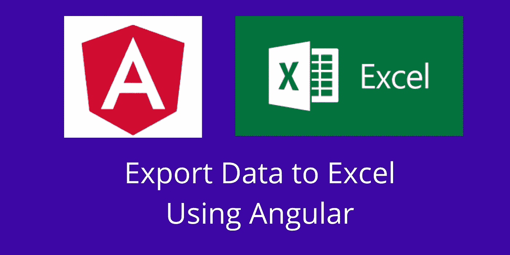

# 使用 ExcelJS 在 Angular 中将数据导出到 Excel

> 原文：<https://javascript.plainenglish.io/export-data-to-excel-in-angular-using-exceljs-305ba8c5dece?source=collection_archive---------1----------------------->



当我们使用任何技术开发一个简单的应用程序或复杂的企业应用程序时，最终用户总是需要一个 **Excel** 文件中的报告数据。为什么因为大多数人依赖 excel 文件。我和各种 **Angular** 企业**应用**合作过。在所有应用中，客户要求我们使用各种过滤器给出一个**可下载的 excel** 文件。

在本教程中，您将学习如何使用 **Angular** 下载 excel 文件。我将展示一个使用 **ExcelJS** 和文件保护插件下载 excel 文件的演示。如果你是一个 Angular 开发者，并且正在寻找将数据导出到 excel，那么这篇文章将会给你更多的帮助。我们将一个一个地看到他们。

# **第一步。创建新的角度项目**

使用下面的命令创建一个新的角度项目。

```
ng new angular-excel-example
```

初始设置完成后，使用 VS 代码编辑器打开项目文件夹。

# **第二步。安装 ExcelJS 插件**

ExcelJS 插件是用来读写 excel 文件的。它功能丰富。您可以设置行和列的样式。甚至你可以在 excel 文件中添加图片。这就是为什么许多人使用这个图书馆。

使用下面的命令安装 ExcelJS。

```
npm install exceljs --save
```

# **步骤三。安装文件保护程序**

js 是在客户端保存文件的解决方案，非常适合在客户端生成文件的 web 应用程序。

使用下面的命令安装文件保护插件。

```
npm install file-saver --save
```

# **第四步。创建带有点击事件的按钮**

用 click 事件在**app.component.html**文件上创建一个按钮。

app.component.html file

# **第五步。导入 ExcelJS 和文件保存插件**

打开 **app.component.ts** 文件，使用下面的代码导入 ExcelJS 和 File Saver 插件。

# **步骤六。创建一个可下载的 Excel 文件**

在这里，我将一步一步地解释每一段代码。

1.  首先，我们需要 JSON 格式的数据。你可以像我一样为测试目的创建虚拟数据，也可以从服务器获取数据。

这里我用一些名字和年龄数据创建了一个变量。

2.接下来，使用创建一个工作簿 excel 工作簿

3.从工作簿中，我们可以使用 **addWorksheet()** 函数创建一个新的工作表。在此给出一个工作表名称

4.使用 **addRow()** 函数添加列标题。在 JSON 数据中，我只有两列。这就是为什么我只创建了两列。

5.现在使用 for 循环将 JSON 数据添加到工作表中。

6.设置文件名并调用 write 函数来创建一个可下载的 excel 文件。

仅此而已。现在，您可以将数据导出到 excel 文件。

# 摘要

在任何应用程序中，将数据导出到 excel 文件总是一项必需的功能。尤其是如果你采用任何 **CRM、ERP、**和任何复杂的 web 应用程序，最终用户需要数据在 **excel 文件中。如果你正在使用 **Angular** 寻找一个可下载的 excel 文件，这篇文章会非常有帮助。ExcelJS** 插件提供了样式化的行和列，甚至你也可以添加图片。它还有许多其他功能。你可以使用下面的链接来查看。

[](https://www.npmjs.com/package/exceljs) [## exceljs

### 读取、操作和写入电子表格数据和样式到 XLSX 和 JSON。从 Excel 电子表格反向工程…

www.npmjs.com](https://www.npmjs.com/package/exceljs) 

项目回购:

[](https://github.com/bharathirajatut/angular-examples/tree/master/angular-excel-example) [## bharathirajatu/angular-示例

### 此项目是使用 Angular CLI 版本 8.3.5 生成的。为开发服务器运行 ng serve。导航到…

github.com](https://github.com/bharathirajatut/angular-examples/tree/master/angular-excel-example) 

您可以简单地下载上面提到的项目，并在您的本地机器上尝试。

## 简单英语的 JavaScript

喜欢这篇文章吗？如果有，通过 [**订阅获取更多类似内容解码，我们的 YouTube 频道**](https://www.youtube.com/channel/UCtipWUghju290NWcn8jhyAw) **！**