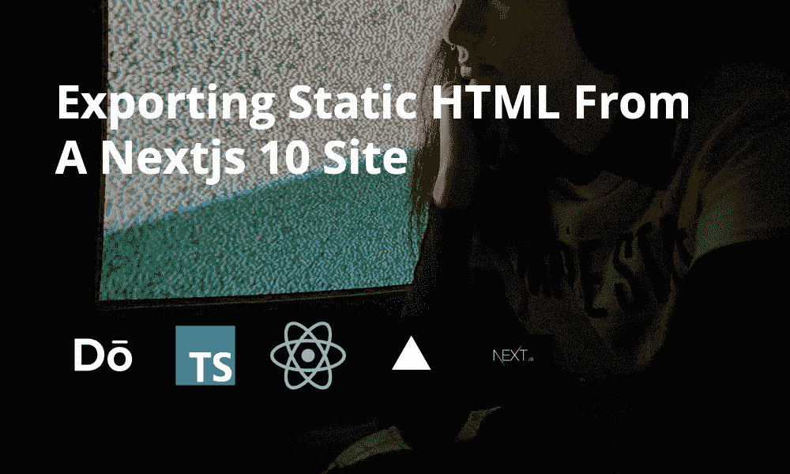
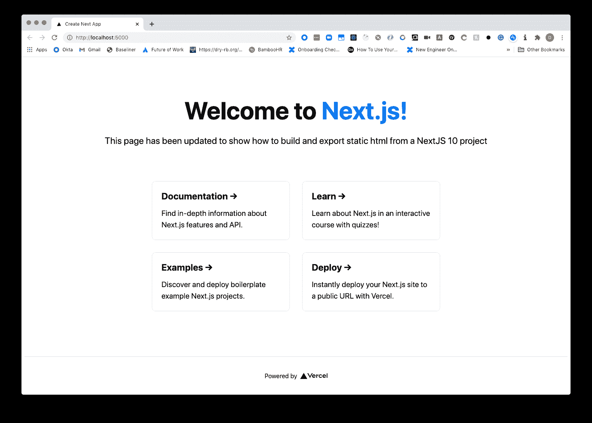

# 从 Next.js 10 站点导出静态 HTML

> 原文：<https://javascript.plainenglish.io/exporting-static-html-from-a-nextjs-10-site-93da6db3457c?source=collection_archive---------11----------------------->

在这篇博文中，我们将从 Next.js 10 开始，导出一个可以在 S3 托管的静态站点。

如果你想让网站在你的 AWS 账户上运行，这篇文章与合作伙伴关于使用 AWS TypeScript CDK[在 S3 部署静态网站的文章一起发表。](https://blog.dennisokeeffe.com/blog/2020-11-04-deploying-websites-to-aws-s3-with-the-cdk/)

*注意:对于为 NextJS 应用程序导出静态 HTML，有支持和反对的理由。这些需求可能因人而异。关于使用静态导出特性的最新注意事项，请参见 NextJS 关于静态 HTML 导出的文档。*

## 入门指南

我们将使用最新的`create-next-app`部署让事情运转起来。

一旦运行，在`next-10-static-export`中将会有一个新的文件夹来存放您的 NextJS 10 应用程序。

## 构建应用程序

调整您的应用程序的`package.json`文件，以添加一个新的导出脚本:

## 构建和导出网站

在`pages/index.js`下，我将对项目做一些小的调整，并添加一小段，说明**该页面已经更新，以显示如何从 NextJS 10 项目**中构建和导出静态 HTML。

在进行任何您想要的调整后，从根目录运行以下命令:

一旦运行了这两个命令，您会注意到现在已经创建了一个`_next`和`out`目录。

`out`目录是`next export`将资产移动到的地方。

## 看到最终产品

我们现在可以在本地提供这些资产，以查看构建的运行情况。

如果你还没有的话，我推荐你在全球范围内安装 [Vercel 的 Serve 包](https://github.com/vercel/serve)来支持`out`目录。这可以用`npm i -g serve`来完成。

现在，从根目录运行`serve out`,您将看到一个发布到终端的 URL，向您显示网站是从哪里提供服务的(通常是 localhost 端口 5000，除非繁忙)。

前往该网站，您将看到以下内容:

恭喜你。您已经有了静态导出的站点。

## 下一步是什么？

如果您想了解如何使用 AWS TypeScript CDK 将您的网站部署到 AWS S3，请前往[合作伙伴帖子](https://blog.dennisokeeffe.com/blog/2020-11-04-deploying-websites-to-aws-s3-with-the-cdk/)并继续。

## 资源

1.  [维尔塞尔的发球包](https://github.com/vercel/serve)
2.  [NextJS 静态出口警告](https://nextjs.org/docs/advanced-features/static-html-export#caveats)
3.  [使用 AWS 类型脚本 CDK 将 NextJS 部署到 AWS S3](https://blog.dennisokeeffe.com/blog/2020-11-04-deploying-websites-to-aws-s3-with-the-cdk/)
4.  [最后，通过部署博客进行实时网站部署](https://nextjs-10-static-example.dennisokeeffe.com)
5.  [最终代码](https://github.com/okeeffed/nextjs-10-static-deployment-with-typescript-aws-cdk)

*图片来源:*[*Isi Parente*](https://unsplash.com/@isiparente)

*原贴于我的* [*博客*](https://blog.dennisokeeffe.com/blog/2020-11-04-exporting-static-nextjs-10-websites/) *。*