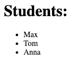

# Express.js 和把手——3 个有用的功能

> 原文：<https://javascript.plainenglish.io/express-handlebars-dd2fb85e265d?source=collection_archive---------3----------------------->

## HTML 变得更加高效和有趣


Source: the author

**模板引擎已经是一项伟大的发明**——这是我最近用 handlebars.js 和 Express 做个人项目时再次注意到的。

特别是具有动态特性和大量内容的大型网站，如果你只是开始用原始的方式编写 HTML 代码，维护起来会非常复杂。

要解决这个问题，你不必使用前端框架将所有东西分解成可重用的组件。

下面是 handlebars.js 的一些实用特性，它们与 Express.js 结合在一起，非常有趣——并且使开发网站更加舒适。

# 什么是后端模板引擎？

*如果你已经知道了，当然，你可以跳过这个介绍，直接跳到我们的设置安装。*

模板引擎主要是从前端知道的。例如，车把通常与 Mustache.js 联系在一起，也可以用在前端。有了像 Express.js 这样的现代后端平台，你也可以进入 Node.js 的世界。

这种引擎为服务器提供了一个模板，必须用具体的数据来填充这个模板，以完成应用程序。当用户请求服务器时，服务器将处理模板并填写它。用户不会注意到任何事情；他只接收完成的网页。

因此，模板引擎是创建动态网站的理想选择，这些网站不必向用户发送大量的 JS 代码，例如，前端可以用来进行 API 调用。

计算负载放在服务器上。此外，模板引擎使得开发 web 应用程序变得非常容易和高效。您可以将这些部分分解成组件，就像您使用 React 或 Angular 这样的前端框架一样。

有足够的理由来看看我们如何利用 handlebars.js 让我们的生活变得更轻松。

# 让我们为 Express.js 安装 handlebars.js

首先为我们的项目创建一个新的目录。然后安装需要的东西:

```
npm install -y npm install express express-handlebars
```

然后，创建一个/ *视图*目录。
这是默认情况下 express-handlebar 将搜索模板的文件夹。

在视图文件夹中，我们创建布局文件夹，默认情况下，快速手柄也使用该文件夹。在这个文件夹中，我们创建了*main . handlebar*——它作为一个包装器组件。

我们在那里写的所有东西都将显示在我们最终的 web 应用程序的每个路径下——因此，它非常适合嵌入 SEO 标签和导入 CSS 和 JS 之类的文件。

像这样离开*主把手【T11:`{{{body}}}`*

这意味着我们想在这里包含手柄实际提供的所有代码。

最终的文件结构:

```
├── app.js
├── package-lock.json
└── views
    ├── index.handlebars
    └── layouts
        └── main.handlebars
```

*app.js:*

```
const express = require(‘express’);const exphbs = require(‘express-handlebars’);const app = express();app.engine(‘handlebars’, exphbs());app.set(‘view engine’, ‘handlebars’);app.get(‘/’, function (req, res) {
  res.render(“index”);
});app.listen(8080);
```

在 *index.handlebars* 中写一些东西，启动服务器，您应该会看到一个工作项目。

让我们来看看第一个让开发变得更容易的很酷的特性。

# 传递数据并在其中循环

将数据从 Express 传递到 handlebars 真的很容易。
express-handlebar 的 render 函数获得一个对象作为第二个参数，其中包含我们想要提供的所有数据。

```
let names = ["Max", "Tom", "Anna"]app.get(‘/’, function (req, res) {
  res.render(“index”, {
    students: names
  });
});
```

*索引.车把:*

```
<h1>Students:</h1>
<ul>
  {{*#each* students}}
    <li>{{this}}</li>
  {{*/each*}}
</ul>
```

**结果:**



基本的东西。但是更复杂的对象呢？

让我们提供一些关于我们学生的更多细节:

```
let people = [
  {name: “Max”, age: 21},
  {name: “Tom”, age: 19},
  {name: “Anna”, age: 25}
]
```

更换后的*索引把手*:

```
<ul>
  {{*#each* students}}
    <li>{{this.name}}, {{this.age}}</li>
  {{*/each*}}
</ul>
```

**结果:**


# 情况

在我目前的娱乐性项目中，我遇到的问题是，我不仅想在真实条件下显示某些东西，而且，如果这个条件为假，则必须在另一个地方显示其他东西。

是的，这听起来很复杂，但实际上并不复杂，下面是一个真实的例子:


Source: [codingcheats.io](https://codingcheats.io/javascript)

在左边和右边，在 JavaScript 代码下，您可以看到相同的信息框——当然，两个框有相同的 CSS 样式。

但是在左侧，盒子的顶角仍然是圆形的。由于车把中的条件，我不需要为两者创建一个单独的组件，但可以通过以下方式解决它:

*   如果传递了一些源代码进行显示，它会自动显示在信息框的上方。
*   如果没有传递源代码，则单独显示信息框。
*   圆角怎么解决？此外，在 infobox 组件本身中，检查是否提供了用于显示的源代码。
*   在没有传递源代码的情况下，另一个 CSS 类被提供给 infobox，它对上面的角进行舍入。

因此，我可以在任何地方使用相同的 infobox 组件，在特殊情况下，可以通过检查自动使用手柄。
当然，你需要使用条件句；以下是如何用车把做到这一点:

## 检查条件的真实性—如果

因此，我们对 app.js 做了一点修改:

```
let person = {
  name: “Max”,
  adult: false
}app.get(‘/’, function (req, res) {
  res.render(“index”, {
    person: person
  });
});
```

*索引.车把:*

```
{{*#if* person.adult}}
  <p>person is an adult</p>
{{*/if*}}
```

而现在，你应该什么也没看见，因为一个成年人是假的。问题是，在车把上，没有真正的别的东西。我们需要使用的是 unless，它是这种模板语言中 if 的逆运算:

```
{{*#unless* person.adult}}
  <p>not an adult.</p>
{{*/unless*}}
```

现在你应该看到“不是成年人。”在网站上。

# “{{ }}”和“{{{ }}”之间的区别

这是很多车把初学者常犯的错误。如果我们想将带把手的东西传递到模板中，我们可以用两种方法:

*   提供内容，然后显示在我们的 HTML 标签之间。
*   HTML 结构，也能正确呈现。

这里有一个例子来说明这一点:

```
let content = “<b>I am bold text</b>”app.get(‘/’, function (req, res) {
  res.render(“index”, {
    content: content
  });
});
```

*索引.车把* : `{{content}}`

这将导致显示为文本:


3 个花括号而不是 2 个花括号会强制把手将内容视为有效的 HTML 代码:

`{{{content}}}`:


在我的兼职项目中，当我想用斜体或粗体字显示代码备忘单的标题时，我会使用这个。

## 感谢您的阅读！

[加入我的邮件列表，与我保持联系](http://eepurl.com/hacY0v)

## **用简单英语写的 JavaScript**

喜欢这篇文章吗？如果有，通过 [**订阅获取更多类似内容解码，我们的 YouTube 频道**](https://www.youtube.com/channel/UCtipWUghju290NWcn8jhyAw) **！**