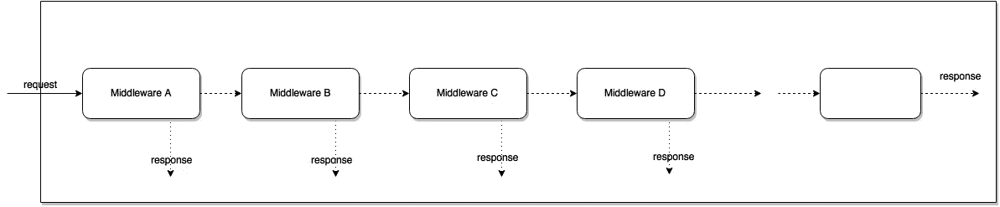
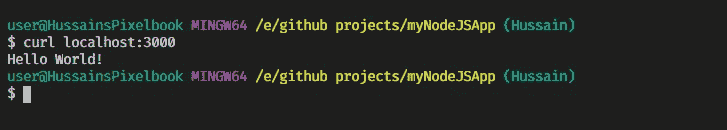
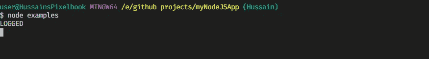
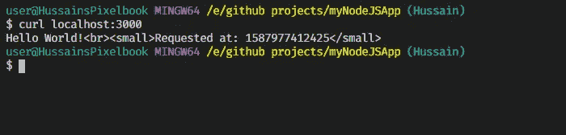
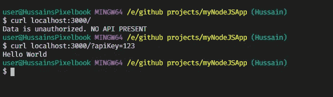
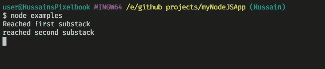
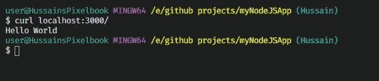
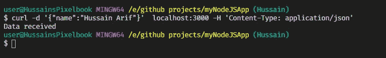
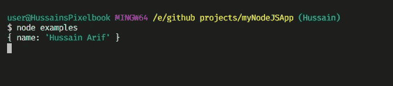

# 如何用 Express.js 创建中间件

> 原文：<https://javascript.plainenglish.io/express-js-middleware-ddcc79d98dc9?source=collection_archive---------8----------------------->


Source: [Negative Space on pexels.com](https://www.pexels.com/photo/grayscale-photo-of-computer-laptop-near-white-notebook-and-ceramic-mug-on-table-169573/)

> 在本文中，我们将学习 Express 中的中间件方法。JS 框架以及如何在我们的代码中应用它们

# 基本思想:什么是中间件？

通俗地说，网络服务器是**输入请求**和**输出响应的功能。**这里，中间件是在传入请求之后在中间执行的功能，然后产生输出。该输出可以是

*   最终输出，或
*   由下一个中间件使用，直到周期完成。

这反过来意味着我们可以有一个以上的中间件功能，它们将按照声明的顺序执行(**链式顺序**)

因为它们是以链状顺序执行的，所以我们可以这样用图解法表示:



Middleware A is called first, so it will run first, then Middleware B, and so on and so forth

由于它们是`express`框架的一部分，它们可以访问请求对象(`req`)和响应对象(`res`),以及应用程序响应周期中的 `next`功能。有关在 Express 中处理请求的更多信息，请单击此处。

`next` 函数是 Express 中的一个函数，当被调用时，它执行当前中间件之后的中间件。简而言之，这意味着`next`函数将执行列表中的下一个中间件。

**此外，请记住，Express 应用程序本质上是一系列中间件调用。**

# 中间件的基本声明

为了声明一个中间件函数，

```
const MiddleWareFunction1 = **function(req,res,next)**=> {
//code to be executed , main logic located here, then 
**next()**
})
```

> 注意:请注意拨打`next()`。这里，这个函数调用应用程序中的下一个中间件函数。这个函数必须被调用，否则请求将被挂起。`next()`功能不是节点的一部分。JS 或 Express API，但这是传递给中间件函数的第三个参数。你可以随意命名这个函数，但是按照惯例它总是被命名为`next`。

# 使用中间件

要使用它，我们将使用名为:

```
app.use(middlewareFunction)
```

由于 Express 在路由方法中使用中间件，我们甚至可以像这样使用它

```
app.use(route, middlewareFunction)
```

这意味着如果用户导航到`route`路径，将调用`middlewareFunction()`。

# 链状订单

如开始所讨论的，如果首先调用`middlewareA`，那么它将首先执行，然后该行中的下一个中间件函数将执行。

我们可以用这样的代码形式来写:

```
app.use(middlewareFunctionA) //Will run first
app.use(middlewareFunctionB) //Will run second
app.use(middlewareFunctionC) //Will run second in line.
```

# 例子

## 1.MyLogger

在这里，只要有请求通过应用程序，我们就会打印“log”字样。

要运行它，请在终端上键入:`node middleware-basic`，然后在另一个终端上键入:`curl localhost:3000`。这可能是输出:

在客户端



client side output

在服务器端:



Server side output

## 2.请求时间函数

还记得我说过中间件函数可以访问`req`和`res`对象吗？我们可以给这些对象添加属性，然后将它们传递给下一个中间件，如下所示:

下面是一个简单的示例，显示了发送请求的日期和时间:

```
var requestTime= function((req,res,next)=>{
req.responseTime = Date.now() //add responseTime property to req
next()
})
```

要使用该函数，请编写代码:

`console.log`不习惯服务器端没有输出。在客户端(使用了`cURL`),输出为:



output at client side terminal window

## validateAPIKey 函数

在这个函数中，我们将检查 URL 中是否存在 API 键。如果不是，则应用程序将关闭，否则调用`next`(应用程序继续下一步)。

这样，我们甚至可以使用中间件来确保 URL 是正确的。这是中间件功能的一个常见用例。

要运行它，在第一个终端窗口中执行`node`命令，然后在第二个终端窗口中，像这样使用`curl`:



Application proceeds only if API key is found.

# 可配置中间件

假设您的中间件函数占用了许多行代码。因此，您希望它在另一个模块中。可以用`module.exports`。这也使得您的中间件可配置。要了解`module.exports`，点击[这里](https://medium.com/analytics-vidhya/node-js-modules-exports-80d9b1bc2acf)。

这方面的一个例子可以是:

在文件`my-middleware.js`中

```
module.exports = function (options) {
  return function (req, res, next) {
    // Implement the middleware function based on the options object
    next()
  }
}
```

在文件`main.js`中

```
var mw = require('./my-middleware.js')

app.use(mw({ option1: '1', option2: '2' }))
```

# 中间件子栈

您甚至可以在`app.use`中加载多个中间件功能，以节省更多时间并使您的程序看起来不那么复杂。

你可以这样做:

Here is an example of loading a series of middleware functions at a mount point, with a mount path.

输出如下所示



Server side output



Client side output

# 中间件中的错误处理

与具有三个参数的普通中间件功能不同，错误处理中间件功能将具有**四个**参数:

```
function (error, req, res, next) { console.log(error) //in case an error has occured.next()}
```

Express API 将搜索我们所有的中间件功能。如果它发现一个中间件有四个参数而不是三个。它将中间件表示为一个错误处理中间件，也就是说，它将允许您访问它之前的任何中间件抛出的任何错误。

# 使用外部中间件

编程社区还构建了其他类型的中间件来简化您的生产阶段或其他阶段，或者为您完成一些繁重的逻辑工作。它们被称为**外部中间件**，或**第三方中间件**

## 正文分析器

其中之一就是`body-parser`。我在之前的[教程](https://medium.com/easyread/introduction-to-express-js-246191ec05f2)里用过。它将请求体解析为 json、url 编码等。要使用它，您需要首先安装它:

```
npm install body-parser
```

这里有一个解析`json`数据的例子

首先在一个窗口运行`node`命令，然后在另一个窗口使用`curl`。输出如下所示



Client side output



Server side output

**注意** : `-H`表示我们必须指定标题。这很重要，否则`req.body`将返回一个空体，即`{}`。因此，表示一个标题是非常重要的。

注意 JSON 数据是如何被`body-parser`解析的

外部中间件的另一个例子是 [morgan](https://www.npmjs.com/package/morgan/v/1.1.1) ，它用于给出关于 HTTP 请求的简明日志。

# 到目前为止我们所学内容的回顾

*   要声明中间件:

```
const myMiddleware = function(**req,res,next**)=>{
// main logic code here
**next()** //absolutely necessary
})
```

*   使用它

```
app.use(myMiddleware)
```

*   链式订单可以用以下方式在代码中表示:

```
app.use(middlewareFunction1) //will run first
app.use(middlewareFunction2) //will run second
app.use(middlewareFunction3) //will run third
```

# 词汇表

**invoke-** 每当一个函数被调用，这意味着该函数已经被**调用**。

# 外部资源

*   [编写中间件](https://expressjs.com/en/guide/writing-middleware.html)
*   [使用快递中间件](https://expressjs.com/en/guide/using-middleware.html)
*   [快递第三方中间件](https://expressjs.com/en/resources/middleware.html)
*   [express js——中间件](https://www.youtube.com/watch?v=MIr1oxQ3pao)到底是什么？
*   [ExpressJS-中间件-教程点](https://www.tutorialspoint.com/expressjs/expressjs_middleware.htm)

今天到此为止。非常感谢你坚持到最后！我希望你从这篇文章中学到了很多。祝您愉快！

呆在家里，注意安全。

## **用简单英语写的 JavaScript 笔记**

我们已经推出了三种新的出版物！请关注我们的新出版物:[**AI in Plain English**](https://medium.com/ai-in-plain-english)[**UX in Plain English**](https://medium.com/ux-in-plain-english)[**Python in Plain English**](https://medium.com/python-in-plain-english)**——谢谢，继续学习！**

**我们也一直有兴趣帮助推广高质量的内容。如果您有一篇文章想要提交给我们的任何出版物，请发送电子邮件至[**submissions @ plain English . io**](mailto:submissions@plainenglish.io)**，并附上您的 Medium 用户名，我们会将您添加为作者。另外，请让我们知道您想加入哪个/哪些出版物。****