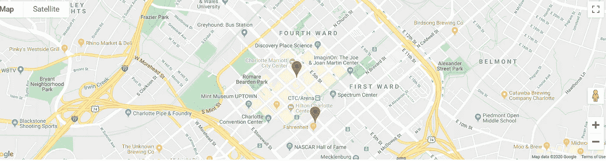

# 在 Angular 7+中扩展谷歌地图库

> 原文：<https://javascript.plainenglish.io/extend-google-map-library-in-angular-7-2720259cd19d?source=collection_archive---------7----------------------->

## 所有你需要知道的谷歌地图的角度

最近，我将谷歌地图整合到我的一个 Angular 项目中，我对结果非常满意。我想分享我从这个过程中学到的一些技巧。

本文中使用的例子基于 Jocelyn Keung 的一篇文章。这是我发现的将谷歌地图集成到 Angular 的最清晰的“hello world”教程。

为了演示如何扩展原始的 Google 地图库，我在她的例子上添加了一个简单的“清除标记”特性。



## 添加/清除标记

要添加一个标记，需要用 position 进行初始化，并使用 setMap 方法将其与地图相关联。

```
const marker = new google.maps.Marker({ position: new google.maps.LatLng(35.2271, -80.8431),
   map: this.map
});
marker.setMap(this.map);
```

清除一个标记并不像添加一个标记那么简单，因为出于性能考虑，Google Map Api v3 没有提供现成的标记。在谷歌地图官方示例中，建议将标记保存在一个全局变量数组中。清除/删除标记时，循环遍历数组并调用"。给定标记对象上的 setMap(null)”。基本步骤如下所示。

## 扩展谷歌地图库

然而，上述解决方案并不理想。如果有多个屏幕需要谷歌地图集成，代码将需要到处复制。我们需要一种更有效的方法来处理它。

更好的解决方案是通过扩展将该特性添加到 Google 地图库中，这样代码就可以在一个地方进行维护。

要扩展这个库，我们首先需要在类型定义中声明新的接口。在 Jocelyn 的“Hello world”示例中，有一个类型定义文件“index.d.ts”，其模块声明如下，这将使 angular 编译器能够工作。

```
declare module 'googlemaps';
```

但是，Google 地图库类型定义文件使用了名称空间而不是模块，所以要扩展它，我们需要扩展名称空间。

## 接口声明

为了添加新文件，我使用了“custom.d.ts”:

```
declare global {
   namespace google.maps {
    interface Map {
      markers: Array<any>;
      clearMarkers(): void;
    }
    interface Marker {
      _setMap(map: Map): void;
      setMap(map: Map): void;
     }
   }
}
export default global;
```

我们还需要添加配置，以允许 IDE 识别新的类型。在 tsconfig.json 文件中，我添加了以下内容

```
"typeRoots": [
   "node_modules/@types",
   "src/app"
]
```

请注意，“src/app”是本例中“custom.d.ts”文件的路径，您应该将它移动到实际项目中的正确文件夹路径。

## 履行

新接口在“custom-map.ts”中实现。

所以现在，当你需要清除地图上的标记时，你只需要写一行代码

```
this.map.clearMarkers();
```

现在，您可以将自己的功能添加到强大的谷歌地图 API 库中。

希望这篇文章有所帮助。你可以在这里找到完整的示例源代码[..为了让示例项目正常工作，您需要获得一个谷歌地图 API 密钥，并将其添加到 index.html 的脚本 Url 中。](https://github.com/sunnyy02/googlemapAngularIntegration.git)

编程快乐！

更新日期:2019 年 2 月 13 日

## Angular 9: GoogleMap 现在是一个角度组件

Angular 9 中引入了一个谷歌地图组件，使得它更容易使用。

```
<google-map></google-map>
```

新组件的 Github 库在这里是。

*如果您还不是 Medium 的付费会员，* [***您可以通过访问此链接***](https://sunnysun-5694.medium.com/membership) *进行注册。你可以无限制地阅读媒体上的所有报道。我会收你一部分会员费作为介绍费。*