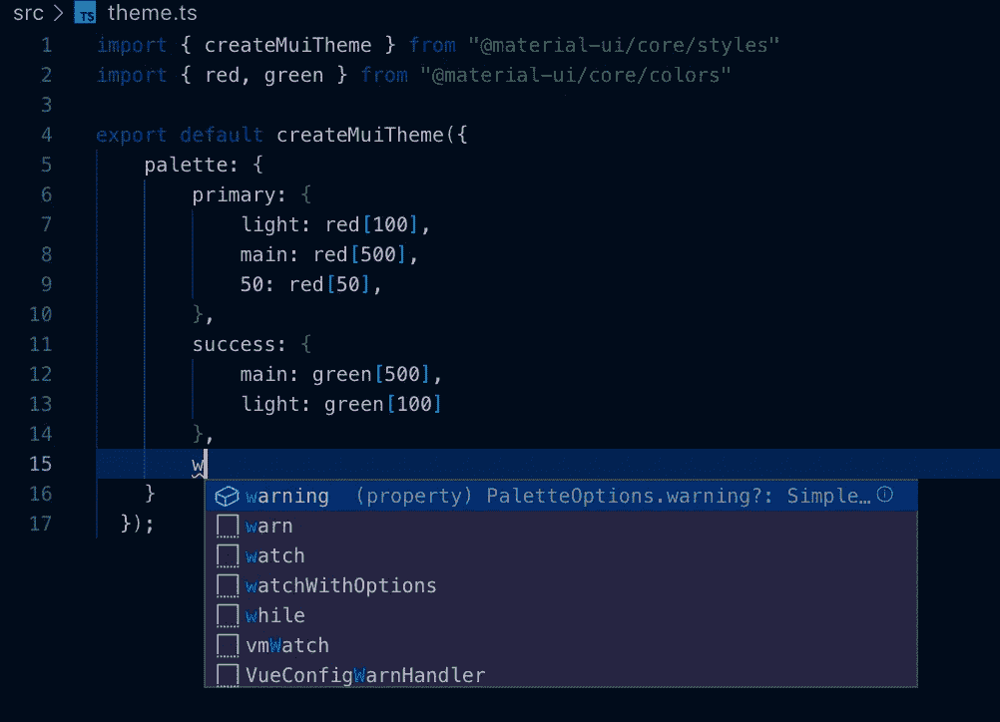

# 如何在 TypeScript 中正确扩展 Material-UI 主题

> 原文：<https://javascript.plainenglish.io/extend-material-ui-theme-in-typescript-a462e207131f?source=collection_archive---------0----------------------->


Material-UI 是世界上最流行的 React 组件库之一，因为它易于使用并且速度很快。最好的事情是看起来很好！另一方面，现在许多 React 用户将 TypeScript 与 React 一起使用，因为它有助于许多潜在的运行时错误，尤其是对于大型应用程序。React 和 TypeScript 的结合超级强大和漂亮。所以他们两个注定要相遇。

随着您的使用，您会知道将 TypeScript 集成到 Material-UI 并不困难。你可以在 Material-UI 网站找到好的文档。但是你遇到的一个困难是关于主题，尤其是调色板。不幸的是，默认的材质界面主题有点有限。因此，本文解释了如何在 TypeScript 中扩展 Material-UI 主题。实际上，如果您掌握了这篇文章，您可以扩展其他类型！

# 材质问题——UI 主题

正如我上面解释的，默认的材质界面主题有点受限，如下所示。

```
theme.tstheme.palette
├──── primary
│      ├──── main: string;
│      ├──── dark: string;
│      ├──── light: string;
│      ├──── contrastText: string;
│      ├──── 50: string;
│      ├──── 100: string;
│      ├──── 200: string;
│      ├──── 300: string;
│      ├──── 400: string;
│      ├──── 600: string;
│      ├──── 700: string;
│      ├──── 800: string;
│      ├──── 900: string;
│      ├──── A100: string;
│      ├──── A200: string;
│      ├──── A400: string;
│      └──── A700: string;
│
├──── secondary
│      ...same as primary
│
├──── error
│      ...same as primary
│
|____ text
│      ├──── primary: string;
│      ├──── secondary: string;
│      ├──── disabled: string;
│      └──── hint: string;
│
|____ divider: string;
│
|____ action
│      ├──── active: string;
│      ├──── hover: string;
│      ├──── hoverOpacity: string;
│      ├──── selected: string;
│      ├──── disabled: string;
│      └──── disabledBackground: string;
|
|____ background
       ├──── default: string;
       └──── card: string;
```

通常将一种颜色分配给一个调色板选项。例如，原色是红色，二次色是蓝色。但是当你创建一个主题时，你可能需要更多的调色板选项，如下所示。

```
theme.palette
├──── primary
├──── secondary
├──── error
├──── grey
|____ text
|____ divider
|____ action
|____ background
|____ success
      green here??
|____ failure
      red more??
|____ warning
      yellow here??
|____ info
      gray here??
```

但是当你尝试的时候，你会得到如下的错误。


关键信息是最后一条。`Object literal may only specify known properties, and ‘success' does not exist in type ‘PaletteOptions’`。这意味着因为 Material-UI 包已经提供了调色板选项的类型声明，所以您不能向它添加额外的键。

那么如何使用额外的钥匙呢？答案是自己扩展 Material UI 主题类型。

※2020 年 1 月 25 日更新

因为 Material UI 4.8.1 版本为`PaletteOptions`添加了成功、警告和信息键，所以您不会再从它们那里得到错误。但是如果你尝试用`failure`来做，你会得到和上面一样的错误。

因为这篇文章是在发布之前写的，所以请把`success`键换成`failure`。

# 在 TypeScript 中扩展材质用户界面主题

如上所述，您应该扩展的目标类型是`PaletteOptions`。所以首先，让我们检查默认声明。你可以在`node_modules/@material-ui/core/styles/createPalette.d.ts`或者最初的 [GitHub](https://github.com/mui-org/material-ui/blob/89687f38cae750650555772ba4d821c9084d8dfc/packages/material-ui/src/styles/createPalette.d.ts) 页面找到它们。

```
node_modules/@material-ui/core/styles/createPalette.d.ts...
import { Color, PaletteType } from '..';
...export *interface* PaletteOptions {
    primary?: PaletteColorOptions;
    secondary?: PaletteColorOptions;
    error?: PaletteColorOptions;
    type?: PaletteType;
    tonalOffset?: *number*;
    contrastThreshold?: *number*;
    common?: Partial<CommonColors>;
    grey?: ColorPartial;
    text?: Partial<TypeText>;
    divider?: *string*;
    action?: Partial<TypeAction>;
    background?: Partial<TypeBackground>;
    getContrastText?: (*background*: *string*) *=>* *string*;
}
```

当然，PaletteOptions 键中没有“成功”。但是现在，你可能会猜想如果你给 PaletteOptions 添加键，你就可以扩展主题了！

## 实施

请随意触摸`createPalette.d.ts`文件。通常，在 src 目录下创建类型目录，并将类型文件放入其中。

并添加 PaletteOptions 和 Palette 类型扩展，如下所示。

```
src/types/createPalette.d.tsimport * as createPalette from '@material-ui/core/styles/createPalette';declare module '@material-ui/core/styles/createPalette' {
    interface PaletteOptions {    
        success?: PaletteColorOptions;
        warning?: PaletteColorOptions;
    }
}
```

当您想要与 primary inside success 相同的键时，您可以只使用用于`primary`的 PaletteColorOptions。所以让我们在 theme.ts 中加入“成功”键吧！



你不会得到一个错误！反之，可以获得推荐！

对于高级用户，您可能需要自定义调色板颜色选项。例如，如果您为每个扩展名定义文件图标主题，如 pdf、csv，您需要为每个扩展名指定特定的颜色。在这种情况下，您可以在`createPalette.d.ts`中创建一个自定义类型。

```
import * as createPalette from '@material-ui/core/styles/createPalette';declare module '@material-ui/core/styles/createPalette' {
    interface IconPaletteColorOptions {
        pdf?: string;
        csv?: string;
    } interface PaletteOptions {    
        success?: PaletteColorOptions;
        warning?: PaletteColorOptions;
        icon?: IconPaletteColorOptions;
    }
}
```

正如您所看到的，您可以创建一个新的类型并将其分配给 PaletteOptions。


## 哎呀！

不幸的是，类型扩展仍然不够。当你试图在每个组件中使用扩展主题时，你会得到一个错误。


因为`theme`是用`Theme`打出来的，这个错误的原因可能在`Theme`和`Palette`附近。再次转到`createPalette.d.ts`。

```
node_modules/@material-ui/core/styles/createPalette.d.ts...
export *interface* Palette {
    common: CommonColors;
    type: PaletteType;
    contrastThreshold: *number*;
    tonalOffset: *number*;
    primary: PaletteColor;
    secondary: PaletteColor;
    error: PaletteColor;
    grey: Color;
    text: TypeText;
    divider: TypeDivider;
    action: TypeAction;
    background: TypeBackground;
    getContrastText: (*background*: *string*) *=>* *string*;
    augmentColor: {
        (
            *color*: ColorPartial,
            *mainShade*?: *number* | *string*,
            *lightShade*?: *number* | *string*,
            *darkShade*?: *number* | *string*,
        ): PaletteColor;
        (*color*: PaletteColorOptions): PaletteColor;
    };
}
...
```

`Palette`和`PaletteOptions`很像。但是`Palette`和`PaletteOptions`都是出口的。并且它们用在`createMuiTheme.d.ts`中。并且可以找到`Theme`类型如下图。

```
node_modules/@material-ui/core/styles/createMuiTheme.d.ts
...
export *interface* Theme {
    shape: Shape;
    breakpoints: Breakpoints;
    direction: Direction;
    mixins: Mixins;
    overrides?: Overrides;
    palette: Palette;
    props?: ComponentsProps;
    shadows: Shadows;
    spacing: Spacing;
    transitions: Transitions;
    typography: Typography;
    zIndex: ZIndex;
}
```

是啊！你找到了！在`Theme`类型声明中，`Palette`用于调色板键。所以你不仅要扩展`PaletteOptions`还要扩展`Palette`。

```
import * as createPalette from '@material-ui/core/styles/createPalette';declare module '@material-ui/core/styles/createPalette' {
    interface IconPaletteColorOptions {
        pdf?: string;
        csv?: string;
    } interface IconPaletteColor {
        pdf: string;
        csv: string;
    } interface PaletteOptions {    
        success?: PaletteColorOptions;
        warning?: PaletteColorOptions;
        icon?: IconPaletteColorOptions;
    } interface Palette {    
        success: PaletteColor;
        warning: PaletteColor;
        icon: IconPaletteColor;
    }
}
```

就是这样。现在你可以完美地使用自定义主题了！你不会得到任何错误！


## 更新于 2020 年 1 月 25 日

[物料 UI 4.8.1 版本](https://github.com/mui-org/material-ui/releases/tag/v4.8.1)中新增了警告、成功、信息！所以不用加了。

但遗憾的是一个真正的产品并不是材质 UI 主题那么简单。我已经将“失败”和“正在处理”添加到我的一个公司服务中。所以知道怎么编辑就好！

本文解释了如何在 TypeScript 中扩展 Material-UI 主题。但是当您通读本文时，您也理解了如何在包中扩展类型声明。如果你理解如何扩展类型，你的打字技巧将会更上一层楼！