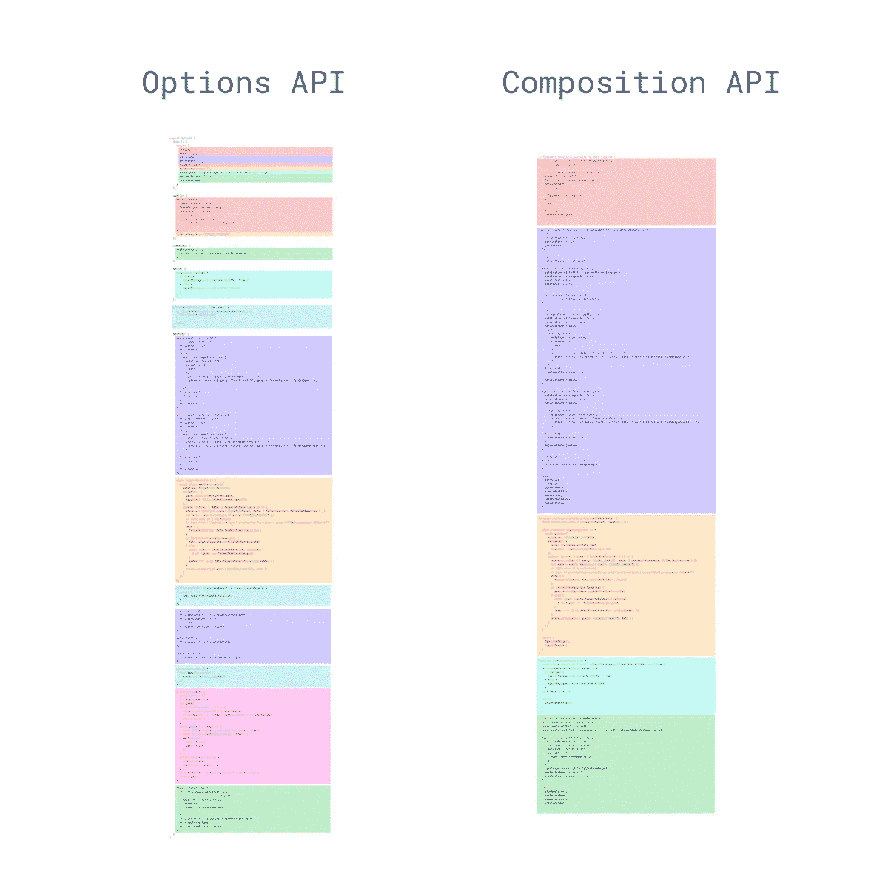

# 提取和重用 Vue 组合 API 中的逻辑

> 原文：<https://javascript.plainenglish.io/extract-and-reuse-logic-in-the-vue-composition-api-25df63410189?source=collection_archive---------6----------------------->


Photo by [Lacey Williams](https://unsplash.com/@travelwithlace?utm_source=medium&utm_medium=referral) on [Unsplash](https://unsplash.com?utm_source=medium&utm_medium=referral)

Vue3 组合 API 允许在大型项目中更好地组织代码。然而，随着从使用几个不同的选项属性到一个单一的设置方法的转换，许多开发人员面临的一个问题是…

> “因为所有东西都在一个方法中，这难道不会更混乱吗”？

虽然乍一看可能很容易想到这一点，但实际上只需要更多一点的计划来编写[可重用和模块化代码](https://learnvue.co/2020/01/4-vue3-composition-api-tips-you-should-know/)。

让我们来看看如何做到这一点。

## 问题是

如果你有使用 Vue 的经验，你会看到[选项 API](https://learnvue.co/2019/12/what-does-vuejs-3-0-mean-for-web-development/) ，这是一种非常直观的分离代码的方式。组件可能看起来像这样:

```
export default {
  data () {
    return {
      articles: [],
      searchParameters: []
    }
  },
  mounted () {
    this.articles = ArticlesAPI.loadArticles()
  },
  methods: {
    searchArticles (id) {
      return this.articles.filter(() => {
        // some search code
      })
    }
  }
}
```

问题是，如果在一个组件中有数百行代码，那么就必须在数据、方法、计算等多个部分中为单个特性(例如搜索)添加代码。

这意味着一个特性的代码可能分散在数百行不同的地方——很难阅读或调试。

这里有一个来自 [Vue Composition API RFC](https://vue-composition-api-rfc.netlify.com/) 的例子，展示了现在如何通过特性来组织代码。



现在，这里是使用新的组合 API 的等价代码。如果你想了解更多关于 [Composition API](https://learnvue.co/2019/12/a-first-look-at-vue3-a-vue-composition-api-tutorial/) 以及如何使用它，我在这里写了另一个教程。

```
import { ref, onMounted } from 'vue'

export default {
  setup () {
    const articles = ref([])
    const searchParameters = ref([])

    onMounted(() => {
      this.articles = ArticlesAPI.loadArticles()
    })

    const searchArticles = (id) => {
      return articles.filter(() => {
        // some search code
      })
    }

    return {
      articles,
      searchParameters,
      searchArticles
    }
  }
}
```

现在，为了解决之前关于组织的问题，让我们来看看一个提取我们逻辑的好方法。

## 提取逻辑

我们的最终目标是将每个特性提取到它自己的方法中。这样，如果我们想调试它，所有的代码都在一个地方。

这非常简单，但是我们必须记住，如果我们希望能够在模板中访问数据，我们最终还是要使用我们的设置方法来返回数据。

因此，让我们创建我们的新方法。我们称它为 useSearchArticles，并让它返回我们在设置方法中返回的所有内容。

```
const useSearchArticles = () => {
  const articles = ref([])
  const searchParameters = ref([])

  onMounted(() => {
    this.articles = ArticlesAPI.loadArticles()
  })

  const searchArticles = (id) => {
    return articles.filter(() => {
      // some search code
    })
  }

  return {
    articles,
    searchParameters,
    searchArticles
  }
}
```

现在，在我们的设置方法中，我们可以通过调用我们的方法来访问属性。当然，我们也要记住从我们的设置方法中返回它们。

```
export default {
  setup () {
    const { articles, searchParameters, searchArticles } = useSearchArticles()

    return {
      articles,
      searchParameters,
      searchArticles
    }
  }
}
```

## 在我们提取的逻辑中访问组件属性

组合 API 的另一个新变化是“this”引用的变化。这种改变意味着我们不能再像道具、属性或发射事件一样。

简而言之，我们将不得不使用 setup 方法的两个参数来访问 props、attributes、slots 或 emit 方法。如果我们只使用 setup 方法，一个快速的虚拟组件可能看起来像这样。

```
export default {
  setup (props, context) {

    onMounted(() => {
      console.log(props)
      context.emit('event', 'payload')
    })
  }
}
```

但是现在我们想要提取我们的逻辑，我们必须让我们的逻辑包装器方法也接受参数。这样，我们可以从我们的设置方法中传递我们的属性和上下文属性，并且逻辑代码可以访问它们。

```
const checkProps = (props, context) => {
  onMounted(() => {
    console.log(props)
    context.emit('event', 'payload')
  })
}
export default {
  setup (props, context) {
    checkProps(props, context)
  }
}
```

## 重用逻辑

最后，如果我们正在编写一些希望能够在多个组件中使用的逻辑，我们可以将逻辑提取到它自己的文件中，并将其导入到我们的组件中。

然后，我们可以像之前一样调用这个方法。假设我们将 useSearchArticles 方法移动到一个名为 use-search-articles-logic.js 的文件中，如下所示

```
import { ref, onMounted } from 'vue'
export function useSearchArticles () {
  const articles = ref([])
  const searchParameters = ref([])

  onMounted(() => {
    this.articles = ArticlesAPI.loadArticles()
  })

  const searchArticles = (id) => {
    return articles.filter(() => {
      // some search code
    })
  }

  return {
    articles,
    searchParameters,
    searchArticles
  }
}
```

使用这个新文件，我们的原始组件看起来会像这样

```
import { useSearchArticles } from './logic/use-search-articles-logic'
export default {
  setup (props,) {
    const { articles, searchParameters, searchArticles } = useSearchArticles()

    return {
      articles,
      searchParameters,
      searchArticles
    }
  }
}
```

## 结论

希望这篇文章能帮助您更好地理解组合 API 将如何改变我们的编码方式。

但是和往常一样，项目的组织依赖于开发人员设计优秀组件代码和创建可重用逻辑的意愿。

请记住，我们的目标是增加可读性，而组合 API 是在 Vue 中实现这一点的好方法。

编码快乐！

如果你有兴趣了解更多关于 Vue 3 的知识，请下载我的免费 Vue 3 备忘单，里面有一些基本知识，比如合成 API、Vue 3 模板语法和事件处理。