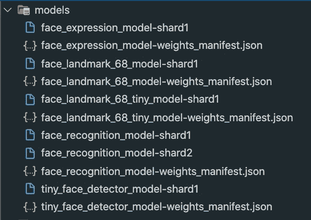
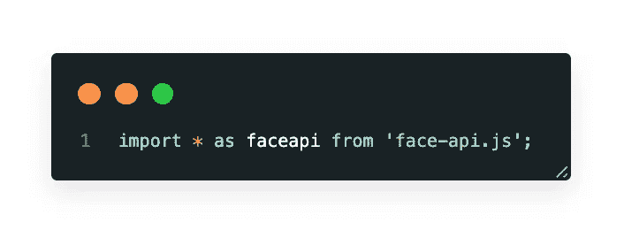
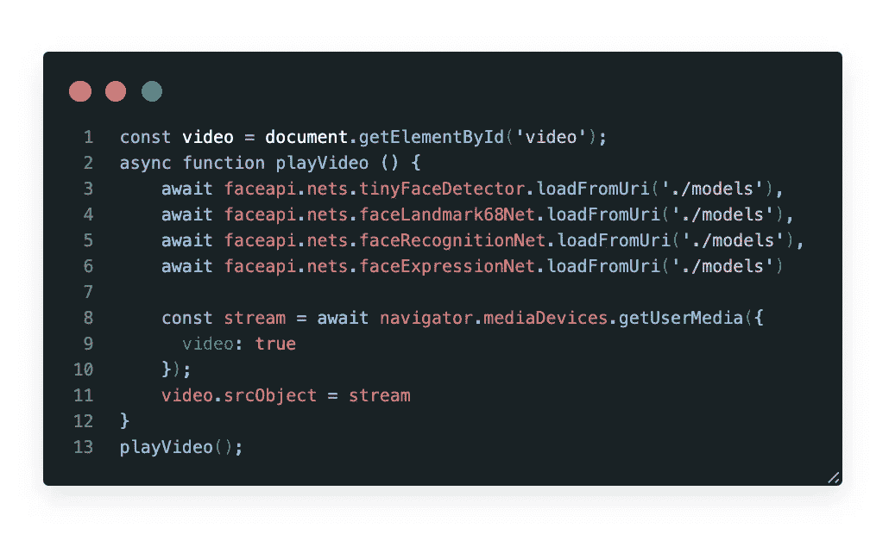
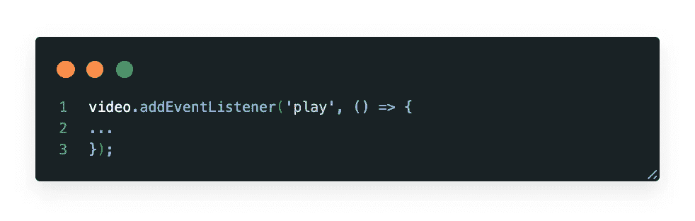
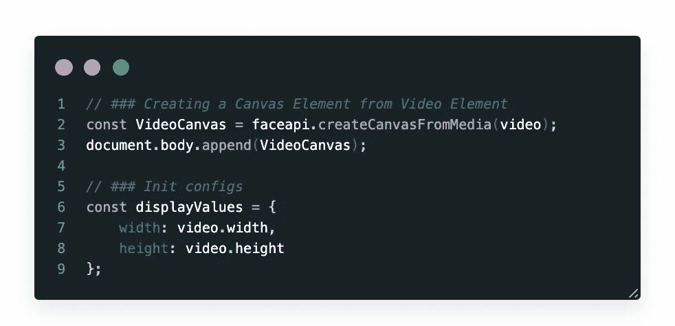
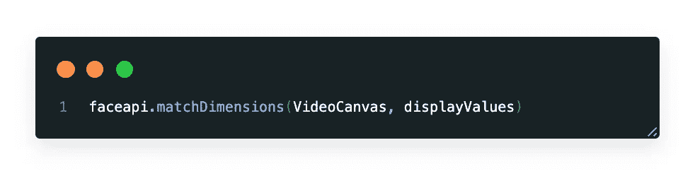
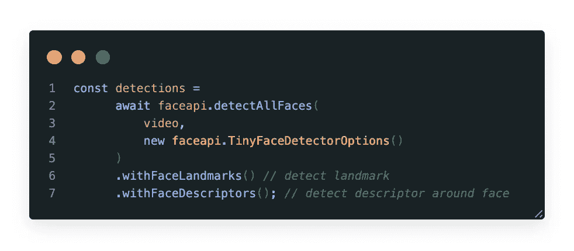
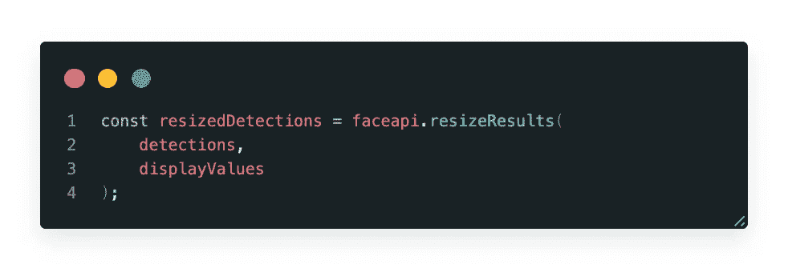

# 使用 FaceApiJS 进行人脸检测📣 😳

> 原文：<https://javascript.plainenglish.io/face-detection-just-using-faceapijs-d03d737e87be?source=collection_archive---------1----------------------->

[https://github.com/rymaruk/app-face-detection](https://github.com/rymaruk/app-face-detection)

在本文中，我们将使用人工智能通过网络摄像头设置实时**人脸检测**。我们将研究一个简单的代码示例，它只需要几行代码就可以让您立即开始使用这个包。

**目标:**

*   通过 HTML 流式传输网络摄像头
*   利用人脸 API 实时检测人脸
*   实时绘制面部标志

我们将使用 TensorFlow 上构建的 [face-api.js](https://github.com/justadudewhohacks/face-api.js/) 库，该库实现了几个 **CNN** s **(** 卷积神经网络)来解决人脸检测、人脸识别和人脸地标检测，针对 web 和移动设备进行了优化。

你可以使用这个库来实时跟踪和检测人脸。

现在让我们深入研究一下💻…

# 自定义您的项目

在开始之前，我们需要设置一个本地开发服务器。使用 WebPack dev 服务器就足够了。

之后，您应该在您的项目中添加一个`models`,并下载位于[https://github . com/WebDevSimplified/Face-Detection-JavaScript/tree/master/models](https://github.com/WebDevSimplified/Face-Detection-JavaScript/tree/master/models)的文件

`models`将看起来像:

在`src`文件夹中创建一个文件`index.js`，这将包含我们所有的逻辑。

**Index.js** 将只包含一个 import 语句作为 **face-api.js** (在 tensorflow.js 核心之上实现的浏览器和 NodeJS 的 JavaScript 人脸识别 api)。

接下来，我们将定义我们的 face-API 模型 URL。只需加载您要用于人脸检测的模型。

> 我使用异步函数来获取模型。这将允许摄像机在模型加载后立即启动。

**media devices . getuser media()**

方法提示用户允许使用产生一个`[MediaStream](https://developer.mozilla.org/en-US/docs/Web/API/MediaStream).`的媒体输入，该流可以包含一个视频轨道。

> 它返回一个解析为一个`[MediaStream](https://developer.mozilla.org/en-US/docs/Web/API/MediaStream)`对象的`[Promise](https://developer.mozilla.org/en-US/docs/Web/JavaScript/Reference/Global_Objects/Promise)`。如果用户拒绝许可，或者匹配媒体不可用，则分别用`NotAllowedError`或`NotFoundError`拒绝承诺。

 [## MediaDevices.getUserMedia()

### 媒体设备。getUserMedia()方法提示用户允许使用媒体输入，这将产生一个…

developer.mozilla.org](https://developer.mozilla.org/en-US/docs/Web/API/MediaDevices/getUserMedia) 

# **实现摄像头捕捉能力<画布>**

首先，需要从 Video 元素创建一个 Canvas 元素并初始化显示值。

## 匹配维度

faceapi.matchDimensions —调整媒体元素大小的辅助函数。

只需传递你的“视频画布”和“显示值”作为参数

## 收到完整的面部描述

神经网络接受 HTML 图像、画布或视频元素或张量作为输入。为了检测输入图像的所有人脸的边界框，我们简单地说:

返回的边界框和界标位置是相对于原始媒体大小的。如果显示的图像尺寸与原始图像尺寸不一致，您可以简单地调整它们的大小:

我们可以通过将边界框绘制到画布中来可视化检测结果:

# 源代码

# **建议**

 [## web dev simplified/人脸检测-JavaScript

### navigator.getUserMedia 现已被弃用，并被 navigator . media devices . get user media 所取代

github.com](https://github.com/WebDevSimplified/Face-Detection-JavaScript)  [## Face-API . js-使用 tensorflow.js 在浏览器中进行人脸识别的 JavaScript API

### 用于人脸检测、人脸识别和人脸标志检测的 JavaScript API

itnext.io](https://itnext.io/face-api-js-javascript-api-for-face-recognition-in-the-browser-with-tensorflow-js-bcc2a6c4cf07)  [## justadudehohacks/face-API . js

### 在 tensorflow.js 核心之上实现的浏览器和 nodejs 的 JavaScript 人脸识别 API

github.com](https://github.com/justadudewhohacks/face-api.js)  [## face-api.js

### 在 tensorflow.js 核心 API 上实现的用于浏览器中人脸检测和人脸识别的 JavaScript API

justadudehohacks . github . io](https://justadudewhohacks.github.io/face-api.js/docs/index.html)  [## 从您的 Web 应用程序中选择摄像头、麦克风和扬声器

### 现代浏览器使得选择输入和输出设备成为可能，包括照相机、麦克风和扬声器。对于…

developers.google.com](https://developers.google.com/web/updates/2015/10/media-devices)