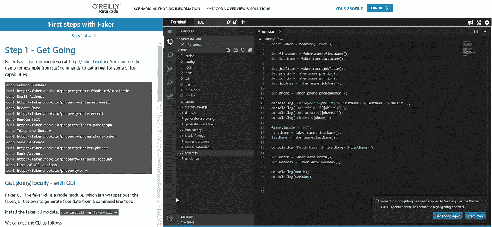
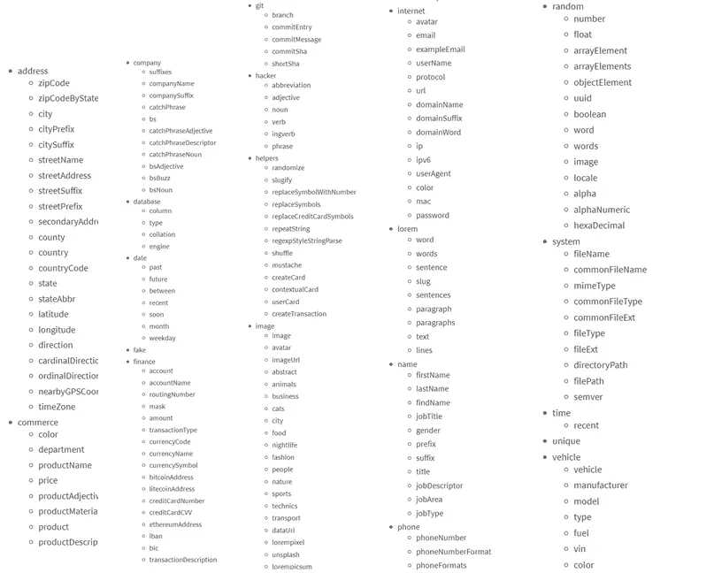
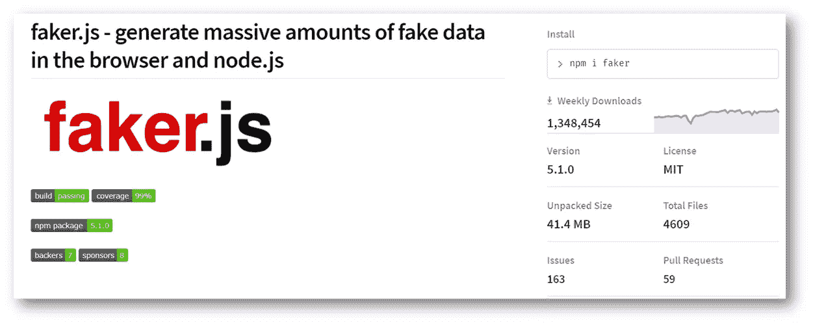
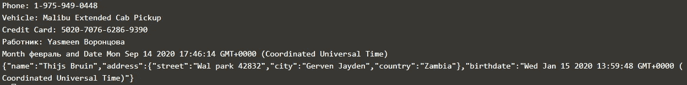

# 如何用 faker.js 生成模拟数据

> 原文：<https://javascript.plainenglish.io/faker-js-npm-module-for-generating-fake-data-5dae437ec3a?source=collection_archive---------3----------------------->

经常需要假数据。在开发和测试期间，以及演示和培训情况下。为此，我花费了太多宝贵的时间来构建哪怕是很小的数据集，通常是依靠家人和朋友的大理石般的名字、地址和出生日期。想出随机数据并不是那么简单。

然而，使用 faker.js 模块，跨多个域和多个地区生成小型或大型数据集变得轻而易举。在这篇文章中，我将简要介绍 faker . js——它能做什么，你如何开始使用它，以及你如何在你的浏览器上试用它。


faker.js 模块支持从 Node.js 应用程序和在 web 应用程序中使用。faker.js 功能的现场演示可在[本现场演示](https://cdn.rawgit.com/Marak/faker.js/master/examples/browser/index.html)中获得。为了更好地了解如何在 Node.js 应用程序中使用 faker.js，请尝试一下[这个 Katacoda 场景](https://www.katacoda.com/lucasjellema/scenarios/introduction-faker-data-generation)，它在您的浏览器中提供了一个动态 Node.js & VS 代码环境，以及一步一步或一点一点地尝试代码示例的说明。faker.js 的 [API 文档也是可用的。](https://fakerjsdocs.netlify.app/)



js 是一个 JavaScript 库，它公开了根据请求生成随机数据的函数。这些函数通常被调用来检索用于生成 JSON 或 CSV 文件的值，也可以在现场演示中使用。该模块相当小，相当快，而且易于使用。

用 faker.js 生成一些假数据的简单例子

```
const faker = require('faker');let firstName = faker.name.firstName();let lastName = faker.name.lastName();console.log(`Employee: ${firstName} ${lastName}`);
```

# 域和区域设置

faker.js 为许多不同的域或名称空间生成数据。每个域都提供一些或许多数据类型。例如，域名会生成以下值:

*   名字
*   姓
*   findName
*   职位名称
*   前缀
*   后缀
*   标题
*   作业描述符
*   工作区域
*   作业类型

faker.js 目前支持的域名有:姓名、地址、公司、日期、时间、商业、金融、电话、数据库、互联网、Git、系统、黑客、随机、唯一、Lorem、图像、音乐。这些加在一起会产生 70 多种数据类型的虚假数据。



Overview of the namespaces supported by faker.js

faker.js 生成的数据可能是假的，但也是正确和合理的数据。我的意思是，数据具有预期的格式和适用的有意义的值。例如，国家名称是随机选择的——但它们并不是真的假的。城市名和街道名看起来足够真实，但是是由模仿真实姓名的元素随机组成的。Internet URLs、电子邮件地址和 IP 地址具有正确的格式，即使它们的实际值是随机生成的。


faker.js generates data in localized form and content

一些数据仅在特定语言或位置上下文中有意义。不同语言的国家名称、星期和颜色不同，邮政编码、电话号码和街道地址的格式也不同。js 支持特定于地区的数据生成。您可以在生成数据之前设置所需的语言环境上下文，这样可以将 faker.js 引导到正确的语言环境以及相应的值和格式。Faker.js 支持近 40 种语言环境——尽管并非所有数据元素都在这些语言环境中完全本地化了。

# faker.js 入门

Faker.js 是 NPM 的一个模块，每周下载量超过 140 万。它于大约 8 年前[在 GitHub](https://github.com/Marak/Faker.js) 上成立，有超过 200 名贡献者。



faker.js on NPM

入门当然非常简单。在任何节点应用程序的上下文中，键入

```
npm i faker --save
```

要安装 faker.js 模块并将其依赖项保存到 package.json。要使用 faker.js，您需要做的就是请求该模块并开始调用其数据生成函数。

值得一提的一个特殊函数是`faker.fake()`函数，它接受一个字符串，该字符串被评估为“小胡子”表达式，这些表达式被扩展为相应的生成的假数据值。这样的小胡子表达式由花括号`{{ and }}`组成，并引用 faker.js 名称空间和数据元素，例如`{{name.firstName}}`。

下面是一个简单的代码片段，它需要 *faker.js* 模块，并从各种名称空间生成假数据:

```
const faker = require('faker');let phone = faker.phone.phoneNumber();console.log(`Phone: ${phone}`);console.log(`Vehicle: ${faker.vehicle.model()} ${faker.vehicle.type()}`)console.log(`Credit Card: ${faker.finance.creditCardNumber()}`)faker.locale = "ru";let firstName = faker.name.firstName();let lastName = faker.name.lastName();console.log(`Pаботник: ${firstName} ${lastName}`);let month = faker.date.month();let recentDate = faker.date.recent();console.log(`Month ${month} and Date ${recentDate} `)faker.locale = "nl";// use faker moustache expressions as placeholders for generated dataconst fakePerson = { "name"      :"{{name.firstName}} {{name.lastName}}", "address"   : { "street" :"{{address.streetName}} {{random.number}}", "city"   :"{{address.city}}", "country":"{{address.country}}"}, "birthdate" : "{{date.past}}"}// feed stringified representation of JSON object to faker.fake to replace moustache expressions with generated dataconst person = JSON.parse( faker.fake( JSON.stringify(fakePerson)))console.log(JSON.stringify(person))
```

这个片段的结果是:



Outcome of fake data generation snippet

每次再次运行这个代码片段，结果都会不同，因为它是随机生成的。有一个选项来设置随机种子，可以在运行中重复使用，这将导致每次运行的相同数据集。对于演示或测试来说，这可能很方便。

faker.js 社区中有一些关于是否应该用助手函数来扩展该模块的讨论，这些助手函数会生成更大的虚假数据集，甚至是复杂的、巨大的充满生成数据的 JSON 文档。虽然这很方便，但一些人认为，将现代 ES 机制与 faker.js 结合使用，就足以简单地生成更大的数据集。下面是一个生成一个数组的小示例，该数组包含 1 到 50 个随机数，每个随机数包含一个伪城市名和 1 到 3 个伪街道名:

```
// create an array with a random number (between 1 and 50) of elementsconst arr = new Array(faker.random.number({min: 1, max: 50})).fill()// define at each position in the Array an element that has two fake generated properties - one a a city and the other a list of up to three street namesconst generatedList = arr.map(() => 
( { city: faker.address.city(),
    streets: new Array(faker.random.number({min: 1, max: 3}))
           .fill().map(() => faker.address.streetName(), 3, true)
  }
))
```