# 如何给现代游戏设计增添趣味

> 原文：<https://javascript.plainenglish.io/family-feud-app-in-react-js-plan-design-f4bf25e2bfa6?source=collection_archive---------4----------------------->

## 第 1 部分:如何设计 React 实现的应用程序

Photo by [Hal Gatewood](https://unsplash.com/@halgatewood?utm_source=medium&utm_medium=referral) on [Unsplash](https://unsplash.com?utm_source=medium&utm_medium=referral)

因此，当我在 Canva 实习的时候，实习生们决定举办一个 Canva 风格的家庭不和游戏。经过无数个小时的谷歌搜索，寻找和寻找怪异的 PowerPoint 演示文稿来玩游戏，我建议我会为晚上制作一个应用程序，并可以用 Canva 定制它。

下面是我如何在 React JS 中开发这个应用的故事(和教程),仅仅是在我一周内乘火车上下班的时候(一天总共 60 分钟)。

这是关于开发游戏的三部分系列的第一部分，你可以在这里查看该系列的其余部分:

 [## 如何在 ReactJS 中设计家庭不和游戏的组件

### 第 2 部分:对组件、功能以及它们之间的关系的概述。

medium.com](https://medium.com/@nivaaz/how-to-design-components-for-a-family-feud-game-in-reactjs-e192952b2f0f)  [## 如何使用 onKeyPress 震动一个 ReactJS 游戏

### 第 3 部分:从头开始实现一个家庭不和游戏！

medium.com](https://medium.com/@nivaaz/how-to-shake-up-a-reactjs-game-using-onkeypress-6b4ad23a7010) 

# 资源:

*   [图玛带设计的文件](https://www.figma.com/file/CRX6l4JykrhFQKnad5DUTI/Family-Feud?node-id=0%3A1)
*   现场[演示](https://family-feud-nivaaz.netlify.app/)
*   [Github 库](https://github.com/nivaaz/canvamily)

# 球场

当你有一个演示、原型和对它如何工作的好的解释时，推销总是会更好。所以我就这么做了。

*   我在 Canva 上做了原型。
*   在 [Codepen](https://codepen.io/nivaaaaaz/pen/eYmwvzg) 上构建前端布局。
*   对它如何工作有一个非常简单的解释(按什么按钮，分数跟踪，下落和可重用性)。

# 设计

使用 Canva 的品牌套件，我得到了所有的 Canva 颜色。但是从黑白开始永远是最好的路。

这是第一个黑白设计，它只关注最重要的部分。它也需要尽可能简单，因为我的时间紧迫，无法构建这个应用程序。

让我们自上而下的解构这个设计。首先，我想尽可能地保持正常游戏的真实性，同时加入一点简单性和我自己的 Canva twist！

## 页眉

*   头球是信息性的，但不是比赛的主要焦点。如果我只是为朋友创建一个普通的家庭不和应用程序，我会把它省去。绝对是多余的。
*   我想让字体比其他字体稍微小一点，但足够大，这样如果有新人走进房间，他们可以很容易地知道正在发生什么，比赛在哪里，谁赢了(最重要的一点)。
*   通常，用户会在右上角寻找通知(我习惯使用 Instagram，这是我看到的地方)。所以在那里显示分数是合适的。
*   不需要写分数这个词，这是两队比赛，在一轮结束时更新，获胜者将被突出显示(如果我们有时间)。
*   标题自然地放在中间，这可以加粗，完成应用程序，并表明这是一个标题。将所有广告都转化为资本。要么效果很好，要么两者兼而有之。

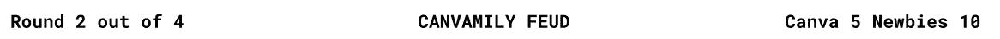

The header

## 问题

*   是游戏的主要部分，所以更大的字体和大写字母(所以我们不必担心输入时怪异的大小写)又是容易的选择。
*   然而，为了确保它真正突出并成为关注的焦点，一点颜色和方框来突出效果会很好。
*   明亮的蓝色在背景的深色中显得格外突出，将人们的目光吸引到游戏的主要部分！

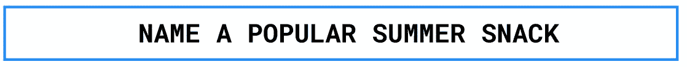

The question

## 当前回合统计

*   只是信息性的，但比跑分更重要，因为任何人都可以偷分。可能是这个领域中最重要的部分，需要强调一下。
*   不熟悉的人需要知道目前是哪支球队在为积分而战。但是它是仅次于分数的第二重要的属性。
*   错误答案的数量也很重要，但也会口头表达出来。所以这只是为了跟踪游戏——保持简单！
*   我想到了两种布局——一种与标题更加一致(替代布局),另一种更加突出信息。我会说我更喜欢第二个。

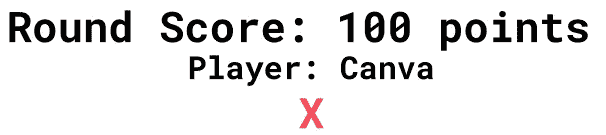

Current round stats.

Alternate Layout

## 卡片

*   用大写字母突出显示，便于阅读。
*   分数在分数旁边，因为它们是不言自明的。所以我们不需要明确声明它们是点。
*   保持按钮的一致性，所以我保留了相同的元素样式。
*   间距均匀，便于阅读，并按照分数从上到下的顺序排列。
*   翻转的卡片清晰突出，因为它们具有更简单、更整洁的样式。

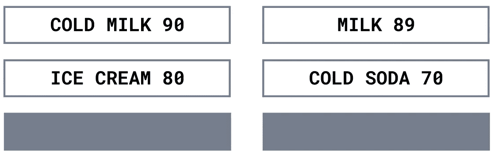

Cards

## 小跟班

*   东道主需要清楚当前的回合。为了做到这一点，我简单地颠倒了颜色来突出它(清晰地)，与默认的按钮样式相反。
*   字体总是会和应用程序的其他部分保持一致，在一个简单的显示最少信息的应用程序中不需要花哨的排版。此外，排版对我来说有点陌生，所以我想保持简单:粗体、斜体和(可能)下划线。

default vs selected

# 这个计划

## **数据**

将有一个 data.js 文件，其中将包含游戏的所有答案、分数和问题。

**该应用中有两种类型的对象:**

*   **回答对象**:有答案和分数。
*   **问题对象**:问题，以及答案对象列表。

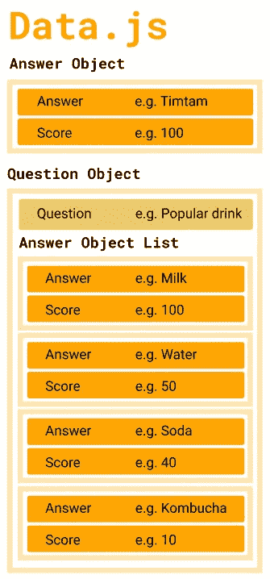

Image of Data JS

## 成分

该应用程序可分为 4 个主要部分:

*   信息标题(分数、标题、回合数)
*   问题面板(显示问题的地方)
*   答题卡(展示答题卡的地方)
*   圆形按钮(每一轮的按钮)

## 功能

**圆形按钮**

*   这些是按钮，按下后会:
    重置所有卡片，
    显示新问题，
    给当前玩家该轮的总分数。

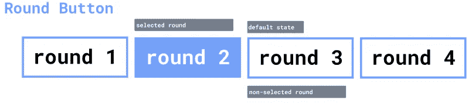

**纸牌**

*   翻牌(显示答案):
    按下键盘上卡片对应的数字
*   这将更新当前回合的分数。

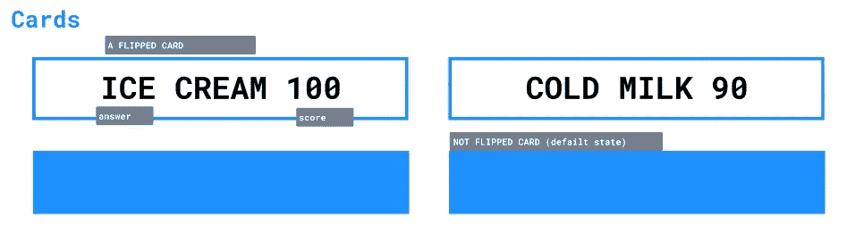

Cards for answers

## 仅供参考(不能点击)

信息标题

*   显示倒圆角。
*   显示标题。
*   显示总得分。

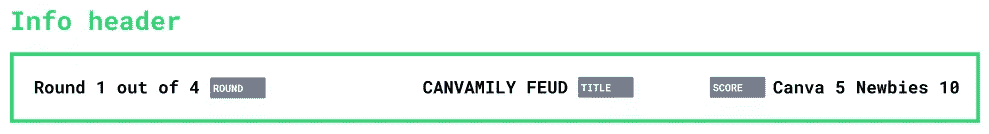

Header at top of page

**问题面板**

*   仅显示当前回合的问题。

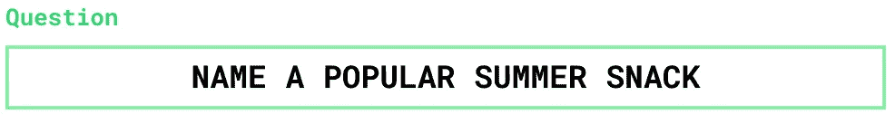

Question Panel

**当前乐谱面板**

*   显示当前回合的分数。
*   显示错误答案的数量。
*   显示当前玩家。

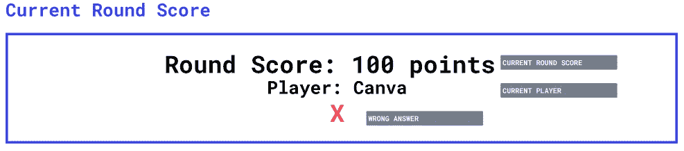

Current Round Score, Player & Wrong Answers

**卡片**

*   显示答案和分数，如果它被翻转。

Cards for answers

# 把它们放在一起

我们得到了看起来有点像这样的东西。

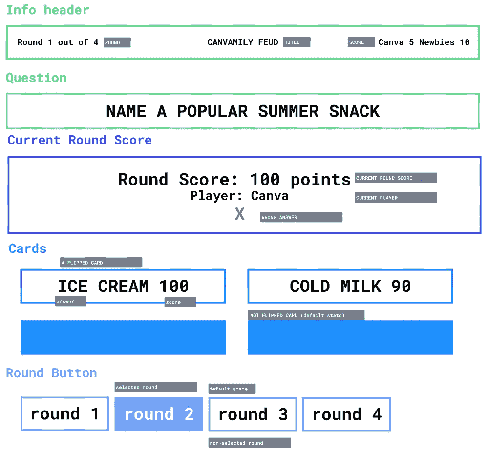

Complete App Outline

请看第 2 部分，在那里我们将用户界面放在了 ReactJS 和 CSS 中。第 3 部分将讨论 ReactJS 事件处理！

 [## 如何在 ReactJS 中设计家庭不和游戏的组件

### 第 2 部分:对组件、功能以及它们之间的关系的概述。

medium.com](https://medium.com/@nivaaz/how-to-design-components-for-a-family-feud-game-in-reactjs-e192952b2f0f) 

你有什么评论吗？我很想听听！我还在学习🤓

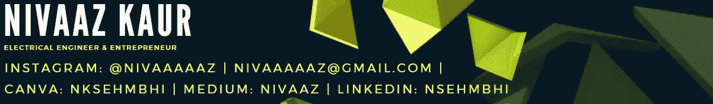