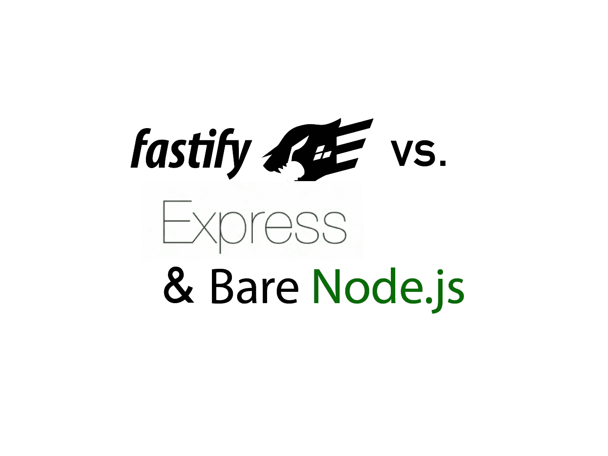

# 我用 Fastify，Express & Bare Node.js 构建了相同的 API，区别如下。

> 原文：<https://javascript.plainenglish.io/fastify-express-benchmark-4c4aebb726d6?source=collection_archive---------0----------------------->

## 让我们看看 Fastify 快了多少



Source: the author

**Fastify** —名字就是座右铭。至少这是 Node.js 框架想要代表的——**速度**。

在上一篇文章中我们已经注意到 bare Node.js 明显不如 Express 之后，我问自己这个问题，不使用节点自己的 HTTP 模块，还有什么可以用来开发快速 web 服务器。

我想到了 Fastify——所以我又写了三次同样的 API 用 pure Node.js，用 Express.js，用 Fastify。现在让我向您展示 Fastify 在竞争中的表现。

让我们从编写 API 开始。

## 让我们先安装 Fastify

像往常一样，我们这样对待 NPM: `npm install fastify`

现在我们可以编写 Fastify 服务器了。在这个框架中有两种开发 web 应用程序的方法。首先，可以构建一个用于输入和输出验证的模式。在 Fastify 的官方网站上，你可以很好地看到这一点:


Source: [Fastify](https://www.fastify.io/)

因此，在这里您可以定义想要接收的内容，例如作为查询参数，并且您还可以使用一个*前置处理程序*函数，它的工作方式有点像中间件——它会在每个请求上执行。

另一个选项不太复杂，更像 Express.js。我将它用于基准测试，因为在理论上，模式变体甚至更慢，这取决于它的复杂性。

所以，不要被上面显示的代码吓跑，这里是我们的 Fastify API:

所有三个 api 都响应 *api* 路由上的请求。它们将名和姓作为查询参数，并在响应中返回这两个参数。

我对基准的要求是:`localhost:4000/api?name=john&lastname=doe`。

## Express.js API

一点也不复杂。这里是 Express.js API，看起来几乎一样:

**注释:**使用 *app.disable* 我停用了头中的两个内容，在响应之前，我将 *content-type* 头设置为*text/plain*——在 Fastify 中这是默认设置。通过这些设置，我们可以在所有三个 API 中获得几乎相同的头。

## Native / Bare Node.js API

最后但并非最不重要的是裸 Node.js 服务器，完全没有任何框架。

**点评:**在 bare Node.js 中没有 res.send，我加了 if-语句是为了公平起见——毕竟另外两个 API 在请求时检查路由。如果没有 if 语句，这个节点服务器将回答每个请求。对于*内容类型*，我必须手动指定 *utf-8* 。使用 Express 和 Fastfiy，这将自动出现在标题中。所以所有的标题都有相同的大小。

# 基准

对于基准测试，我使用的是 MacBook Pro 13 英寸 2018，采用 4 核英特尔 i5 处理器。我确保所有的测试都是在相同的条件下进行。每台服务器都被单独测试，除了负载测试工具之外的所有其他请求源都被关闭。

Node.js 版本是 14.2.0。我只是用 node 命令执行了 API，没有使用 PM2 或 nodemon。

## 负载测试器

上一篇文章，我用的是 ***阿帕奇板凳*** 。但是因为 HTTP 版本，Fastify 有问题，而且 AB 也很旧了。因此我决定用 ***wrk*** 。
在 macOS 上，可以用`brew install wrk`安装。在 Linux 上，可以用`sudo apt-get install wrk`安装。

这是我为每个 API 使用的命令:
`wrk -t12 -c400 -d10s http://localhost:4000/api?name=john&lastname=doe`

12 是我们使用的线程数，400 是并发连接数。整个过程持续了 10 秒钟。

# 结果呢

当然，我已经用负载测试器轰击了每个 API 几次——这里是最平均的结果。

**Express.js**

```
Thread Stats Avg Stdev Max +/- Stdev
 Latency 17.03ms 4.10ms 109.13ms 90.16%
 Req/Sec 1.86k 353.95 2.89k 88.92%
 222514 requests in 10.02s, 32.47MB read
 Socket errors: connect 0, read 248, write 0, timeout 0
Requests/sec: 22207.75
Transfer/sec: 3.24MB
```

**裸露/原生**

```
Thread Stats Avg Stdev Max +/- Stdev
 Latency 11.03ms 3.09ms 77.64ms 85.72%
 Req/Sec 2.77k 542.65 4.38k 86.17%
 331028 requests in 10.01s, 48.62MB read
 Socket errors: connect 0, read 257, write 0, timeout 0
Requests/sec: 33067.32
Transfer/sec: 4.86MB
```

**加速**

```
Thread Stats Avg Stdev Max +/- Stdev
 Latency 9.75ms 3.17ms 79.39ms 87.88%
 Req/Sec 3.13k 729.47 11.94k 87.78%
 375177 requests in 10.10s, 54.74MB read
 Socket errors: connect 0, read 263, write 0, timeout 0
Requests/sec: 37147.37
Transfer/sec: 5.42MB
```

结果很明显——Fastify 比 Express.js 快，甚至比 Bare Node.js 还快，尤其是后者已经让我大吃一惊。但我也在其他基准测试中读到过，尤其是在 Fastify 的官方网站上。它似乎是 Node.js 世界中最快的 web 框架。

# 总结

性能方面，Fastify 更胜一筹。

公平地说，显示这种性能差异的基准通常是非常不现实的情况——实际上，几乎没有任何 web 服务器会同时受到这么多请求的轰炸。

尤其是因为系统的硬件也起着决定性的作用。尽管 Fastify 的性能优越，但我将主要使用 Express。对我和许多其他人来说，Express 提供的已经足够了。

整个生态系统配置更好，表达的资源也更多。这使得它特别适合初学者。

最后，对于许多目的来说，框架之间的差异并不大——特别是对于单个 API，或者服务于静态资产，迁移到另一个框架是很容易的。

喜欢这篇文章吗？如果有，通过 [**订阅获取更多类似内容解码，我们的 YouTube 频道**](https://www.youtube.com/channel/UCtipWUghju290NWcn8jhyAw) **！**

**更多关于 Express.js:**

[](https://medium.com/javascript-in-plain-english/3-express-js-features-you-need-to-know-8f78b0035f33) [## 你需要知道的 3 个 Express.js 特性

### 几乎所有主要的 Node.js 应用都依赖于 Express.js 框架，这里有一些你应该知道的重要特性。

medium.com](https://medium.com/javascript-in-plain-english/3-express-js-features-you-need-to-know-8f78b0035f33) 

[**和我保持联系**](http://eepurl.com/hacY0v)