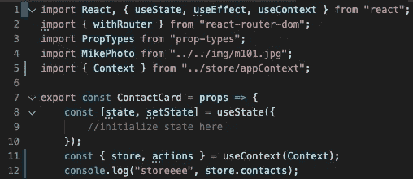
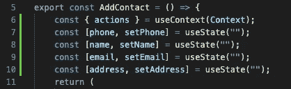
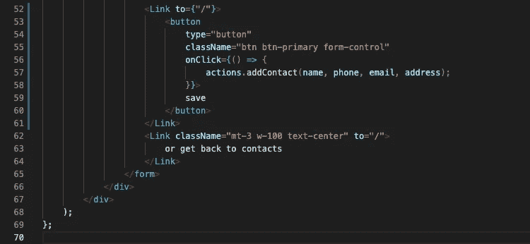

# 在 React 应用程序中使用 GET、POST、PUT 和 DELETE 获取(第一部分)

> 原文：<https://javascript.plainenglish.io/fetch-using-get-post-put-delete-in-react-app-part-i-12d7496262b5?source=collection_archive---------0----------------------->

## 另一个有趣的项目是探索 React 特性及其与 API 的交互。

在上一篇文章中，我们学习了如何从第三方 API 获取数据并将这些数据返回给应用程序。可以在这里查看之前的项目[。](https://medium.com/@jhcxavier/fetching-data-from-third-party-api-with-hooks-1801897e934a)

这一次我们将使用 React 和 explore 特性构建一个联系人列表应用程序，以**创建**、**更新**和**删除**项。这些交互在软件开发人员的日常生活中非常常见。

在开始研究和编写我们的应用程序之前，我想向大家展示一下最终会是什么样子:

h[ttps://youtu . be/ho-yWvLUjPU](https://www.youtube.com/watch?v=ov99iesb0Lw)

对于每一个与外部数据交互的机会，都有不同的步骤要遵循，因此阅读和理解它的文档意味着节省时间和避免以后的错误和意外结果。对于这个项目，我们将访问 API，文档在链接“[https://assets.breatheco.de/apis/fake/contact/](https://assets.breatheco.de/apis/fake/contact/)”处。

要考虑的一件重要的事情是学习看什么和理解期望做什么。考虑到这一点，API 文档中需要强调的主题如下:

首先，我们需要端点来检索数据。**端点**是连接网络并与网络来回通信的远程计算设备。

因此，通过这个端点"[https://assets.breatheco.de/apis/fake/contact/](https://assets.breatheco.de/apis/fake/contact/)"+"议程"使用 Postman，我们可以访问如下数据:

这是阅读文档的重要性，这里的每一项都有一个联系人列表，此时我们只是访问议程而不是联系人。要访问联系人列表，我们将使用此端点"[https://assets.breatheco.de/apis/fake/contact/](https://assets.breatheco.de/apis/fake/contact/)"+" agenda/downtown _ XII "，文档显示如下:

现在，当我们试图从特定的议程中获取数据时，我们得到的是联系人列表:

这就是我们在开始编码之前需要测试和了解的，端点以及它是否正在获取数据。到目前为止，我们只讨论了 GET 方法。

我们即将使用的样板是 4Geeks Academy 在这个[资源库](https://github.com/breatheco-de/exercise-contact-list-context)上提供的样板。风格和组成部分已经创建，我们的任务将只是应用一些功能。为了遵循相同的结构，第一步将更新文件“appContext.js”，如下所示:

右边是你应该如何更新你的文件。这仅仅是因为在之前的文章[星球大战](https://medium.com/@jhcxavier/fetching-data-from-third-party-api-with-hooks-1801897e934a)中我们使用了 Context，并且保持相同的管理状态的方式将会避免一些错误。因此，请确保您的“appContext.js”文件与右侧的相同。

第一步是让它成为我们应用程序中的可用议程，为此，我们将开始使用函数从 API 获取数据。样板文件提供了一个特定的文件来放置一些功能。文件“src/js/store/flux.js”是一个函数组件，它按如下方式返回一个对象:

我们将声明我们的函数来获取“actions”中的数据；

这就是你的“flux.js”在你声明你的函数后应该是什么样子的。

对于第一行，我们声明了一个全局变量，可以随时在组件中调用。第 5 行，指定将接收来自 API 的数据的数组。我们在第 8 行启动函数，在第 9 行我们只需要调用“ *const url* ，并添加“agenda/闹市区 _xii”，因为这是 GET 数据的端点。

上一篇文章我一行一行的解释了 fetch 函数，所以如果有需要的话来点点心看看[这里](https://medium.com/@jhcxavier/fetching-data-from-third-party-api-with-hooks-1801897e934a)。

在声明函数之后，我们需要调用它，这将在“appContext.js”中完成，如下所示:

这个文件唯一的变化将出现在第 31 行。我们将调用函数“state.actions.loadContact()。。

如果正确遵循了这些步骤，现在就应该是运行*NPM run start*的时候了，使用这个检查器我们会得到这个结果:

当我们使用 Postman 检索数据时，我们得到了一个包含三个项目的数组，这三个项目与我们使用检查器返回到这里的内容相同。我们可以通过检查显示的 id 来确保它与邮差收到的 id 相匹配。

该应用程序在浏览器 4 中显示联系人，这些联系人是硬编码的，因为它出现在“src/js/view/contacts . js”中:

我们需要从第 23 行到第 25 行删除，只保留一个<contactcard>，它可以保留第 22 行中的那个。</contactcard>

现在，如果您检查浏览器，它应该只显示一个联系人。

有了这些最后的改变，可以得出结论，ContactCard 是我们应该把 API 数据带到的组件。为此，我们将使用文件“src/js/component/contact card . js”中的 **useContext** 在该组件中提供数据，如下所示 **:**

第 1 行，我们开始添加“useContext”，它接受一个上下文对象(从`React.createContext`返回的值)，并返回该上下文的当前上下文值。然后我们需要导入**上下文**，就像我们在第 5 行所做的那样。最后，在第 11 行，我们将提供存储在“flux.js”中的数据。为了确保一切正常工作，在**控制台上，记录**内联 12，然后是命令*“NPM 运行开始”*并使用检查器，它应该显示两个数组“Get Contact”和“storeeee”，两个数组的值相同。

现在我们绘制地图。第 15 行我们使用“store.contacts &”作为条件渲染。fetch 函数是 Async，它返回一个`[Promise](https://developer.mozilla.org/en-US/docs/Web/API/Promise)`来解析该请求的`[Response](https://developer.mozilla.org/en-US/docs/Web/API/Response)`，不管它是否成功。`**Promise**`对象表示异步操作的最终完成(或失败)及其结果值。简而言之，这意味着数据将在提取结束时立即显示出来。

要进行测试并完全理解上一段，请使用检查器在控制台部分转到浏览器并刷新页面。看到左侧，首先出现的是承诺，一个空数组“storee->[]”，然后是数据和相同的“storee”的“Get Contact ”,但循环已完成。

在关闭 map 函数后，在第 60 行，需要在第 18 行添加 key validation " key = { index } "，并像在第 36、39、47 和 55 行一样输入数据。结果应该是这样的:

我们已经得出结论，我们的应用程序的第一种方法是 GET，它允许我们读取数据。到目前为止还没有什么新的东西，因为我们已经在《星球大战》的文章中讨论了同样的过程。

*现在是提交代码的好时机！

我们项目的下一阶段将是在我们的议程上创建一个新的联系人。为了更好的理解，我们应该回到 API [文档](https://assets.breatheco.de/apis/fake/contact/)；

它说要创建一个联系人，我们需要使用方法 **POST** ，header **application/json** ，我们知道 *application/json* 是 **Content-type** 的值，最后但同样重要的是主体。

在使用 API 时，Postman 应该是您最好的朋友。我们选择 POST 方法，指定主体并选择“raw ”,而测试选项可能是“TEXT ”,它需要被更改为 JSON。

因为是 JSON，所以语法需要是 JSON。您可以在这里验证您的 JSON 代码[。](https://jsonlint.com/)

如果一切正常，将为我们的议程“第十二市区”创建一个新的联系人。

为了验证 POST 请求，我们可以在浏览器中进行检查。

结果应该是 id 为 531 的新联系人。

请注意，这个数据是不断变化的，因为访问是对所有学生开放的，现在是 id 531，但当你检查项目时，可以是任何其他数字。

我们知道端点正在工作，我们可以基于 API 文档创建一个新的联系人，现在是时候回到代码了。

首先要做的是声明将创建新联系人的函数，我将调用 **addContact()** 和it 应该是这样的:

该函数在 **loadContact()** 之后的“flux.js”中声明。记住“actions”是键， **addContact()** 是值，这些值用逗号分隔，如第 18 行所示。

声明函数时，在第 19 行我们传递了 4 个参数，*姓名*、*电话*、*电子邮件、*和*地址。*然后我们声明 **fetch()** 第 20 行，从第 1 行传递“ *const url* ”，这正是创建新联系人对应的端点。接下来，按照 API 文档，我们将方法设置为" **post** "，头设置为"**{ " Content-type ":" application/JSON " }**"以及最重要的部分，即主体。

(我们马上就要回到身体上了)

现在是解释视图 AddContact 的时候了:

当我们添加一个新的联系人时，我们需要指定*姓名*、*电子邮件*、*电话、*和*地址。*在控制台的右侧出现每个联系人的所有键和值。然而，API 文档说我们需要指定这一点:

即**全名**、**电子邮件**、**议程 _ 段子**、**地址、**和**电话。**

让我们开始讨论" *agenda_slug* "因为这是唯一看起来没有意义的事情。

我们需要指定 agenda_slug 来分配联系人将被创建到哪个议程。我们已经知道我们在和“*市区 _xii* 合作，但是 API 不知道。因此，我们将在代码中设置硬编码的值“*市区 _xii* ”，这意味着我们为每个联系人创建的“*议程 _slug* ”将具有正确列表的值。

让我们回到**体**:

主体将首先有一个函数 JSON.stringfy，它具有将我们发送给 API 的对象转换成 JSON 的功能。因为我们知道数据在 **JSON** 或 **Text 中传输。**转换为 JSON 后，我们将参数 *name* (addContact，parameter)赋给 **full_name** (代表名称的 API key)，对于所有其他**电话、**地址和**电子邮件、**将是相同的，除了 **agenda_slug** 。对于这个函数，我们将对值进行硬编码，因此每次我们调用 **addContact()** 函数时， **agenda_slug** 的值都将是“ *downtown_xii* ”。

第 30 行，我们再次用 GET 方法获取数据。这意味着一旦触发 addContact()函数，页面将重新呈现新的联系人。

让我们让函数工作吧！

我们将在“src/js/views/AddContact.js”中工作。首先要做的是在第一行添加**使用状态**和**使用上下文**。第 3 行，我们需要导入**上下文**以使**动作**可用。

第 6 行，它通过**上下文**访问“flux.js”中的动作。对于每个参数，已经使用 [**React 钩子**](https://reactjs.org/docs/hooks-reference.html) 设置了状态，从第 7 行到第 10 行，在一个 const 中，首先需要声明*初始状态*值，它由 **phone** 、 **name、**email、 **address 表示。**然后，这些值可以由接受新值并更新状态的函数来更新。对于**使用状态，**这是*初始状态*值，一个空字符串，原因很简单，为了添加一个新的联系人*初始值*它需要为空。就在我们**改变**状态时，值被更新。

每个输入将保存一个 onChange 事件，该事件在元素的值改变时发生。通过函数 setName，我们为第 8 行中的 *name、*设置了一个新值。

向前看，保存按钮将是创建新联系人的触发器，但这将发生在改变所有变量的*初始状态*(*姓名*、*电子邮件*、*地址*和*电话*)之后。一旦单击了 save 按钮，onClick 函数将被激活，我们将把更改后的状态作为参数传递。这些参数与在 **addContact()，**中的“ *flux.js* ”中声明的参数相同，实际上是相同的函数和相同的参数，顺序需要相同。

电子邮件，无论何时添加，都需要是有效的格式“*email@gmail.com*”。

你可以在这里找到代码。

感谢阅读， [**第二部**](https://medium.com/@jhcxavier/fetch-using-get-post-put-delete-in-react-app-part-ii-e116f8bc69da) 将盖放并删除。