# 在 React 应用程序中使用 GET、POST、PUT 和 DELETE 获取(第二部分)

> 原文：<https://javascript.plainenglish.io/fetch-using-get-post-put-delete-in-react-app-part-ii-e116f8bc69da?source=collection_archive---------0----------------------->

## 该项目的第二部分将致力于探索更新和删除。

在文章的第一部分中，我们讨论了与**API**交互的一些重要方面。我们了解了在开始编码之前理解*文档*的重要性，使用 **Postman** 之类的工具，帮助我们使用 **GET** 和 **POST** 方法与 API 和 **fetch** 函数进行交互。

对于我们的**联系人列表**的第二阶段，要探索的主题是 **PUT** ，它允许我们更新当前数据(联系人)和 **DELETE** ，这是我们可以从最后一种方法中获得的非常直观的结果。

第一步是检查更新数据的文档。在这里查看文档[。](https://assets.breatheco.de/apis/fake/contact/)

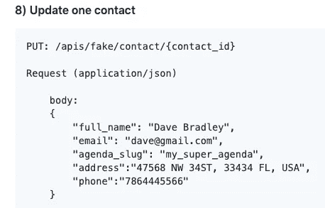

最后一项，编号 8，将引用 PUT 方法。这将是端点“https://assets . breath eco . de/APIs/fake/contact/”+“id”。为了更新联系人，我们将传递联系人 id。

使用 Postman 并选择 GET 方法，我们可以检索数据并检查字段，包括 Id。

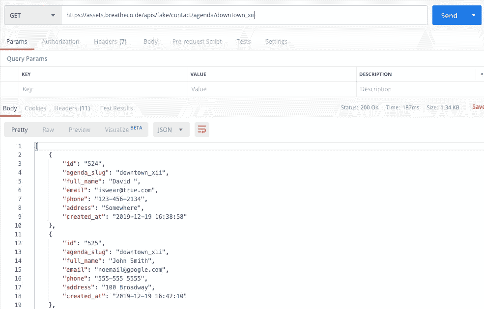

通过访问数据，我们可以获得所有可用于交互的字段，包括 id。现在我们有了 Id、端点和 API 文档。

使用端点+为该联系人选择的 id，我们将更改四个字段，全名、电子邮件、电话和地址。如果请求是正确的，响应应该如下所示:

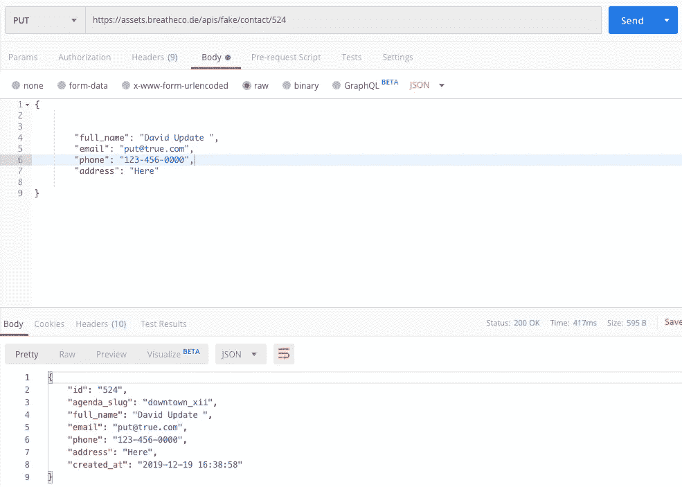

数据被更新，这意味着端点和参数是正确的，我们可以开始编码了！

首先要做的是创建我们的更新函数，因为这个函数将做一些我们要在“flux.js”中声明的事情，如下所示:

这是我声明函数的方式。传递 **id** 、**姓名**、**电话**、**电子邮件**、**地址**。对于获取，我们添加了“const url ”,声明在保存端点值的文件的顶部，加上 id。fetch 函数的第二个参数由逗号分隔，是我们需要传递以完成更新的带有规范的对象。第 53 行，我们再次调用 **GET** 方法，这将确保在更新后我们用新值或更新后的值刷新页面。

下一步，我们将在“src/js/views”中创建另一个文件，我将其命名为“editContact.js”(在本文的下一部分，我们将讨论条件渲染)。对于内容，我们可以复制整个 AddContact.js。

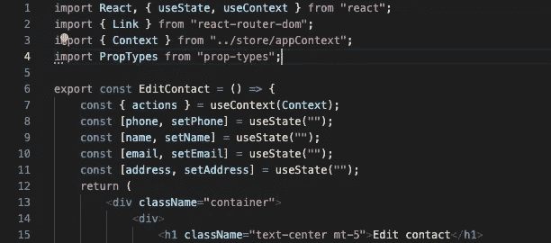

此时的更改非常简单，在第 4 行，我们导入了 **PropTypes** ，在第 6 行，我们将组件的名称改为“EditContact ”,在第 15 行，标题需要改为“Edit Contact”。

我们在视图中创建了 EditContact，这意味着我们希望 Edit 成为一个新的屏幕，为此需要一些导航。

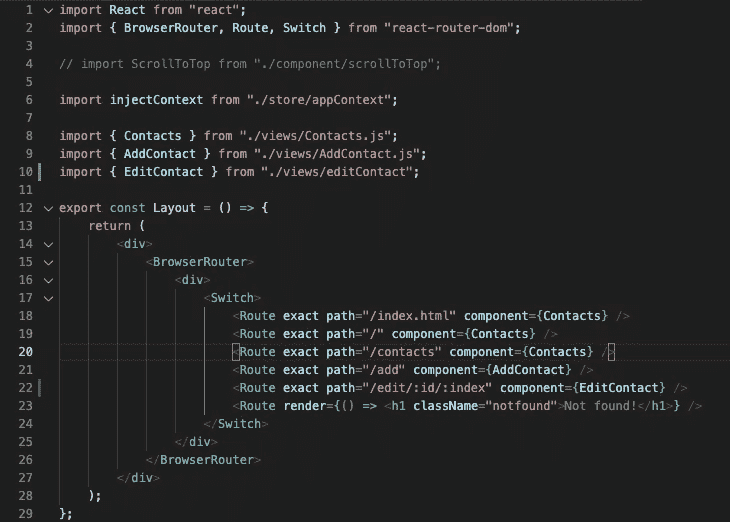

在“src/js/layout.js”文件中，它需要被导入，编辑组件，我在第 10 行做的，同样，在第 22 行，它需要被指定视图的路径，加上联系人的 id，id 将是“:id”，冒号意味着值将通过变量动态传递。稍后我将解释为什么我们将**索引**作为路线**的下一个值。**

如果您运行*“NPM run start”*并添加“/edit”，将出现一个新屏幕，我们将在此更新联系人。

我们有编辑功能，新的组件，我们设置导航。

让我们制作一个带我们到编辑视图的按钮。js 文件有一个按钮，它负责将我们带到视图，我们将在该文件中添加几行代码。

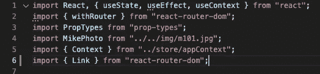

我们开始从 *react-router-dom* 导入**链接**，这允许我们在屏幕之间导航。当我们在 layout.js 文件中指定路线时，在第 22 行中，结合一个包装在<链接中的按钮>标签与<一个>(锚点标签)具有相同的效果。

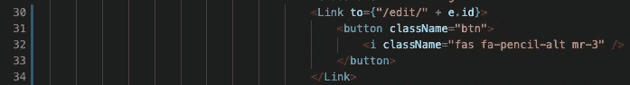

因为我们正在映射组件，所以我们可以动态地指定 id。这意味着我们将使用 API 提供的 id。保存您的更改，转到浏览器并按下我们刚刚用铅笔按钮包裹的按钮。

铅笔按钮应该将您带到编辑视图，但是编辑组件没有更新或显示任何值。那是因为我们还没有编码。请注意，左侧的联系人与我们使用 Postman 更新的是同一个联系人，也是我们将要在浏览器中更新的联系人。

在 ContactCard.js 中，我们有来自 API 的数据，并映射到所有联系人。通过 props，我们将把数据传递给子组件 EditContact。

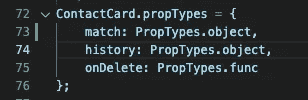

首先，我们在 ContactCard.js 的第 73 行添加将被传递给组件的属性。

然后我们将在“editContacts.js”中进行同样的操作，如下所示:

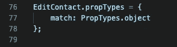

我们即将开始项目中最具挑战性的部分，所以如果有任何疑问，回到正在工作的部分，再试一次。

NOTE = >对于 editContact.js 中的每个更改，要在浏览器中看到，您应该在主页中刷新页面。

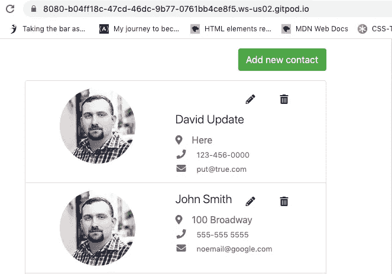

否则，您将得到一个错误，即使更改是成功的，看起来也是无效的。

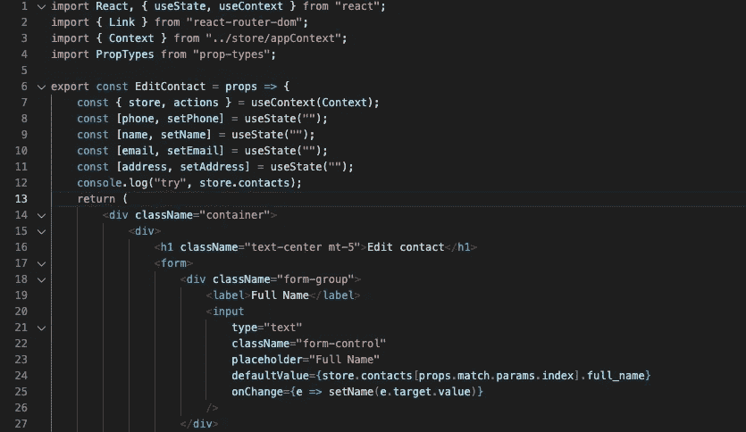

在 editContact.js 上工作，第一步是将“props”作为组件的参数传递，因此前面的 Proptypes 声明将在组件之间传输数据。我在第 12 行添加了一个 console.log，这样我们可以检查数据是否可用。因此，在控制台中，使用检查器，我们应该会得到以下结果:

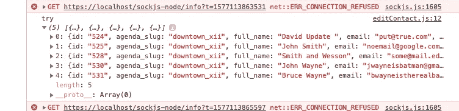

当我们将 id 作为路由传递时，我们基本上是在设置引用该 id 的值。现在看一下图片，在第 24 行，我们确定 name 的默认值是位于 store.contacts 中的值，该位置的键是 **full_name。**

onChange 方法的设置是，在任何变化时，函数 setName 都会将新值赋给变量名。

为了确保正常工作，我们可以使用检查器检查，转到组件；

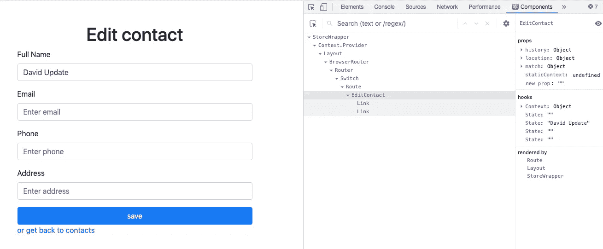

选择 EditContact，在左侧更改全名的值，其中是 David Update。因此，在右边有“David Update”状态的地方，您应该能够看到发生的变化。这就是你知道它是否有效的方法。

回到代码，让我们更新另外三个值，**电话**，**电子邮件，**和**地址。**

请记住，对于 EditContact 中的每个更改，请刷新 **home** 视图中的页面，并再次访问 edit 以查看更改。

如果所有的步骤都做得正确，我们应该会看到编辑联系与每个输入的值，因为它是在左侧。

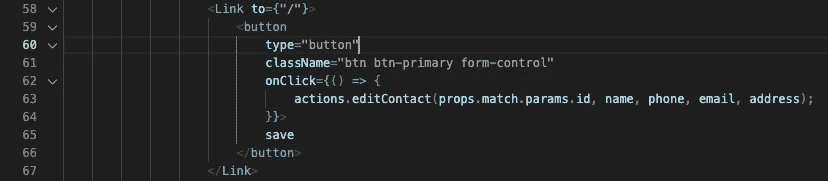

对于 editContact.js 中的下一个也是最后一个步骤，我们将调用我们在" *flux.js* 中声明的函数 **editContact** ，参数将是我们将通过来自父组件的 props 访问的 id 以及我们可以更新的所有变量，这些变量是**名称**、**电话**、**电子邮件**和**地址**。此外，参数需要与我们在 *flux.js.* 中传递的原始函数的顺序相同

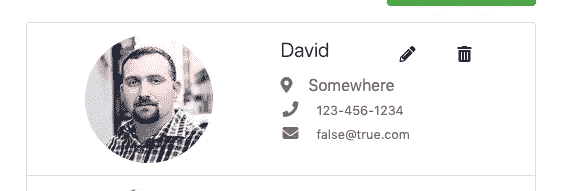

完成后，更新任何联系人，通过单击保存按钮保存并查看结果。

如果一切正常，我们应该已经在更新联系人了。

在实现 DELETE 方法之前，我们需要清理 editContact.js 中的代码。

目前，我们的代码如下所示:

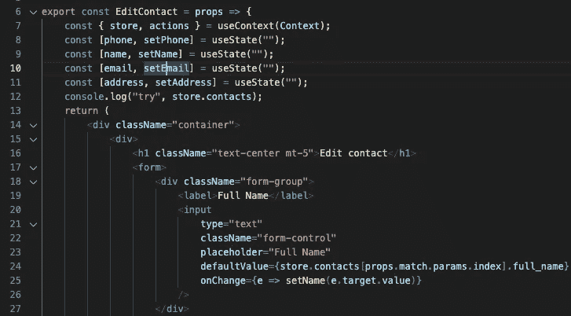

对于每个输入，属性 **defaultValue** 包含一个 *javascript 表达式*,我们将用钩子中的第一个变量替换它，从第 8 行到第 11 行。比如第 9 行，我们有 **const [name，set name]= useState(" ")；**

1.  对于 **name** ，即保存 ***初始值*** 的变量，我们可以同意这与 *javascript 表达式*在第 24 行声明的属性 **defaultValue 的值相同。**
2.  **setName** 是将改变**状态**或变量 **name** 的值的函数。第 25 行，如果输入改变，函数 **setName** 被触发，改变变量 **name** 的值。
3.  现在， **useState** 它将保存*初始值*，其中当前为空，但即使为空，我们也将更新联系人的值。这是因为属性 **defaultValue** 覆盖了 useState 的空值。

现在，我们需要重新组织代码，以便更加清晰易读。它应该是这样的:

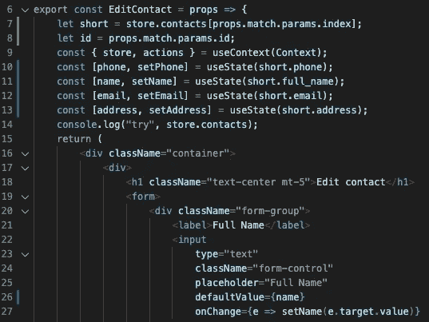

属性 **defaultValue，**的值现在存储在名为 **short，** inline 7 的变量中。我们之前在第 24 行的内容，现在用一种更好的方式在第 11 行声明了。

此外，属性 **defaultValue** 现在采用变量名，该变量名与作为 **useState 的参数传递的变量名相同。**对其他 3 个输入重复相同的过程。

请注意，在第 8 行中，有另一个名为 **id** 的变量保存着 **props.match.params.id** 的值，该值将被第 65 行中的 id 所替代。

至此，我们完成了 PUT 方法。

继续前进并再次访问 *API 文档*，我们将获得如何删除联系人的信息。

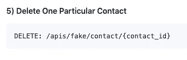

根据文档，我们需要向端点添加一个 id。

这就是我们如何编写删除函数，它也将在" *flux.js* "文件中声明为**动作的值:**

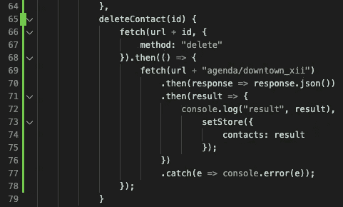

**deleteContact()** 将传递一个参数，即 **id。****fetch()**函数，此时会传递 2 个参数，变量 **url** 加上 **id** (会根据我们要删除的联系人动态传递)和，方法“delete”。

从第 68 行到第 78 行，我们只是触发 get 方法，在删除一个联系人后用新值更新页面。

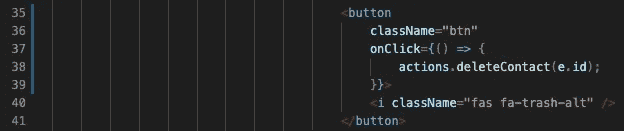

我们将调用*" src/js/component/contact card . js "，*中的 deleteContact()函数，从第 35 行到第 41 行，我们有一个按钮，我们需要添加一个 **onClick** 事件，因为我们正在映射，我们将把 **id** 作为参数传递。这是由 *API 文档*提出的要求。

是时候测试一下了！

如果你按照说明正确操作，你应该可以让联系人列表正常工作！

我将为此项目提供**第三部分**以实现**模式。**

如果你的应用程序不工作，它应该检查我的库[这里](https://github.com/jhcxavier/Contact_List_Medium)。

感谢阅读！