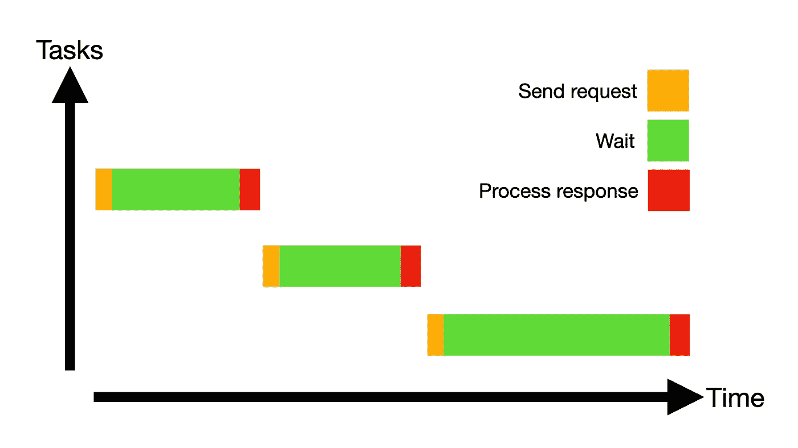
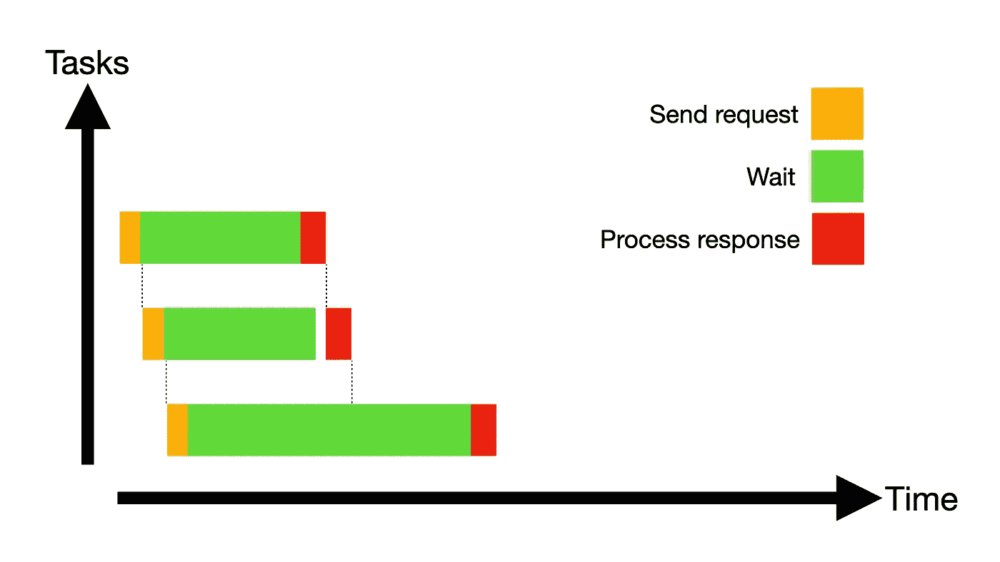

# 同时获取 JavaScript 承诺

> 原文：<https://javascript.plainenglish.io/fetching-javascript-promises-simultaneously-91f17db70c2a?source=collection_archive---------5----------------------->

Fetching Sequentially 🙁

Fetching Simultaneously 😁

## 问题:获取多个文档

假设你正在开发一个新闻应用程序，比如 Medium，在这里你有作者和文章。您决定将作者及其文章保存在 Firebase 的文档数据库中。

当用户打开一篇文章时，需要从 Firestore 获取并显示两个文档:

1.  用户简介文档:用于显示作者姓名和简介图片
2.  文章文档:用于显示文章的实际内容

在我们的例子中，文章和作者文档 id 是预先知道的，因此这两个查询可以独立执行。

# 概念

等待多个提取承诺同时解决(O(1))比等待一个提取承诺在另一个之后完成(O(n))要快得多。

> 但是 JavaScript 不是单线程的吗？如何同时完成多项任务？—你说得对，查看页脚的免责声明。

# 糟糕的解决方案:获取并等待

以`articleID`和`authorId`为参数调用`fetchArticle()`。

该函数通过等待承诺获取`authorSnap`(第 7 行)，然后通过等待另一个承诺获取`articleSnap`(第 7 行)。

从快照中提取数据，并更新状态。

我们正在等待这两个获取按顺序完成。👎

# 好的解决方案:同时获取

再次以`articleID`和`authorId`为参数调用`fetchArticle()`。

这一次，该函数同时执行`authorPromise`和`articlePromise`(注意 await 关键字已从第 7 行和第 8 行中删除)。然后作者和文章承诺被组合起来，我们等待两者都完成(第 12 行)。

然后，我们再次从快照中提取数据并更新状态。

我们正在等待两个获取同时完成。👍

# 感谢阅读👏

更多内容请关注我的 Medium 和 IG:[https://www.instagram.com/antonbegehr/](https://www.instagram.com/antonbegehr/)

## JavaScript 承诺 vs 异步等待

如果您还没有这样做，请务必查看上周关于 JavaScript Promises vs Async Await 的文章，这里有两个在 JavaScript 中使用 Promises 的选项:

 [## JavaScript 承诺 vs 异步等待

### Promise.then()。catch()与异步、等待、尝试、捕捉

medium.com](https://medium.com/javascript-in-plain-english/js-promise-then-catch-vs-async-await-try-catch-4827b07d0373) 

## 声明:JS 是单线程的

单线程意味着 JavaScript 有一个调用栈和一个内存头。简单地说，代码是按顺序执行的:一个操作的执行必须在移到下一段代码之前完成。

因为 JavaScript 是单线程的，所以它一次只能发送一个 HTTP 获取请求。然而，获取数据的大部分时间都在等待响应。在等待承诺解决时，JavaScript 可以执行其他操作。