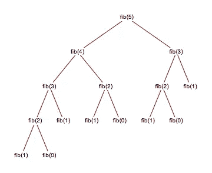
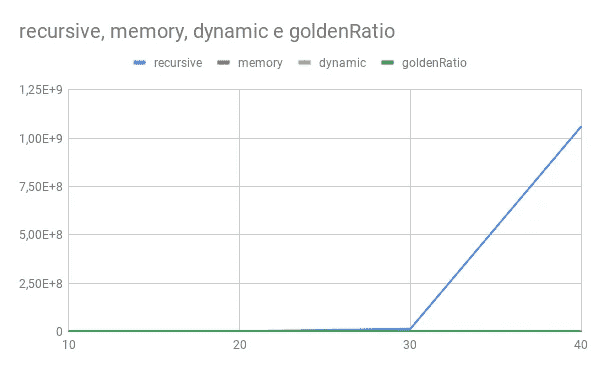
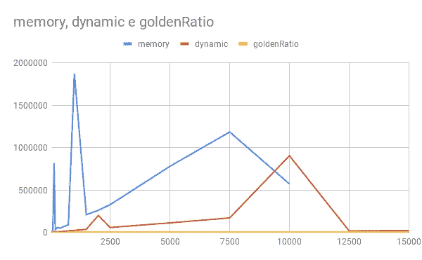
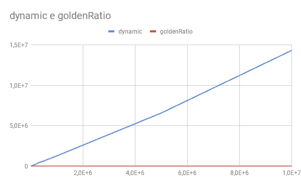

# 斐波那契 JavaScript 算法性能比较

> 原文：<https://javascript.plainenglish.io/fibonacci-javascript-implementations-comparison-fd09190f5b79?source=collection_archive---------4----------------------->

我有一些空闲时间，正在浏览一些编程概念，遇到了著名的[斐波那契数列](https://en.wikipedia.org/wiki/Fibonacci_number)。

虽然我不知道确切的公式，但我知道可以用黄金比例计算出一个特定的数列。当我搜索这个的时候，我没有发现这个实现和“其他”实现之间的任何计算比较。所以我决定花点时间自己做。如果没有别的，我希望这篇文章能帮助某人破解这个永恒的面试问题。

在本文中，我将探索不同的实现，并使用 NodeJS 比较它们的执行时间。这些实现是:

*   递归的
*   记忆递归
*   动态编程
*   黄金比例

# 递归实现

这里没有火箭科学，如果你熟悉递归，这是一个非常简单的方法。然而，一旦输入变得更大，JS 调用栈将开始受到影响。注意，例如，为了执行 fibonacci(5 ),算法执行 fibonacci(3) 3 次。请参见下图。

# 记忆递归

为了缓解前面的问题，我们可以通过添加一个简单的内存状态来改进当前的解决方案，该状态可以防止两次计算相同的值。简单的缓存管理。

这种方法改进了执行时间，但是增加了内存使用，因为我们将所有以前的值存储在内存中。一旦我们开始增加输入，内存分配将不得不增加到一定的阈值，我们将开始开发内存问题。请注意，我们使用递归机制，因此调用堆栈也会受到影响。

# 动态规划

动态编程方法有点不同。它使用自上而下的方式运行。动态编程，因为我们使用了一个变量池，从第一次迭代到最后一次迭代，内存不会增加。

因为这种方法是 100%迭代的，所以没有递归，所以 callstack 不会受到影响。这种方法适用于每一个输入(尽管我们可能会受到最大整数值的限制)。

# 黄金比例

黄金比例计算，顾名思义，允许我们只使用一个计算来计算特定指数的斐波那契数列。这些是我用作来源的一些网站:【Fibonacci.com&[MathIsFun.com](https://www.mathsisfun.com/numbers/golden-ratio.html)[。](https://fibonacci.com/golden-ratio/#:~:text=The%20Golden%20Ratio%20formula%20is,sqrt%205)%2F2%20~%201.618.&text=Therefore%2C%20phi%20%3D%200.618%20and%201%2FPhi.)

这个计算是线性的。我们做同样的计算。尽管执行时间可能会因每次计算而有所不同(记住 javascript 并不适合复数运算)。

# 结果

一个 GitHub 回购与所有这种情况可以找到[在这里](https://github.com/JMGomes/JSFibonacci)。

我使用 NodeJS [process.hrtime()](https://nodejs.org/api/process.html#process_process_hrtime_time) 来计算每个算法的[执行时间。另外](https://github.com/JMGomes/JSFibonacci/blob/a3eb5a5ef647bcc315a4acd0556da70c69dd2027/aux/auxFunctions.js#L7)[将结果导出到。csv 文件](https://github.com/JMGomes/JSFibonacci/blob/a3eb5a5ef647bcc315a4acd0556da70c69dd2027/aux/auxFunctions.js#L12)所以我很容易使用一个简单的谷歌表单创建图表。

还要创建一个[小测试函数](https://github.com/JMGomes/JSFibonacci/blob/a3eb5a5ef647bcc315a4acd0556da70c69dd2027/aux/auxFunctions.js#L41)来保证所有的实现都是正确的。

为了提高可见性，我必须创建 3 个不同的数据集来比较这些实现:

*   40 的输入
*   15k 的输入
*   10M 输入

注意:所有的执行时间值都以毫秒为单位。

## 40 的输入

您可以在这里查看结果

在此图中，我们可以看到简单递归解决方案的执行时间迅速增加。这是意料之中的。让我们看看进一步加大投入会发生什么。

## 15k 的输入

对于这个数据集，我删除了简单的递归实现。

你可以在这里查看结果

内存方法在 1k 输入附近有一个巨大的尖峰，当输入达到 7.5k 时再次出现。另一个是动态方法在 10k 左右，我现在无法解释这些。

但是有一件事发生了，一旦输入达到 12.5k，我们就开始有调用堆栈问题了。我想我可以增加堆栈的大小来允许执行继续进行，但这并不理想。

## 10M 输入

对于这个数据集，我只使用了动态方法和黄金比例计算。这是事情开始变得有趣的时候。结果数据可以在这里找到[。](https://github.com/JMGomes/JSFibonacci/blob/master/inputsTo10M.csv)

动态方法适用于 10M。我相信，只要我们不达到最大整数值，动态方法就会起作用。

但是，比较动态(14334768 毫秒)和黄金比例(614 毫秒)的执行时间，我们观察到减少了 23k 倍！

# 结论

正如我们所料:

*   简单的递归方法只对非常有限的输入有效；
*   **使用缓存的递归方法工作得更好，但是调用堆栈问题将会存在；**
*   **动态方法执行时间随输入线性增加，但仍能为大量数据提供结果**
*   **黄金分割法提供了一种几乎与执行时间成线性关系的解决方案。**

我个人不建议任何人用 JS 做大数运算！

如果你感兴趣的话，我创建了一个 GitHub repo，它包含了创建*的所有实现和辅助功能。csv* 文件，所以任何人都可以玩。看看这个。

 [## JMGomes/JSFibonacci

### JS 斐波那契实现代码库，有 4 个不同的实现斐波那契序列计算器

github.com](https://github.com/JMGomes/JSFibonacci) 

最有可能的是，没有人会要求你开发一个斐波那契数计算器。然而，我不会说谎，我有一些探索的乐趣。

希望你在某种程度上对此感兴趣。

非常感谢。

[Subscribe to Decoded, the official In Plain English YouTube channel](https://www.youtube.com/channel/UCtipWUghju290NWcn8jhyAw)