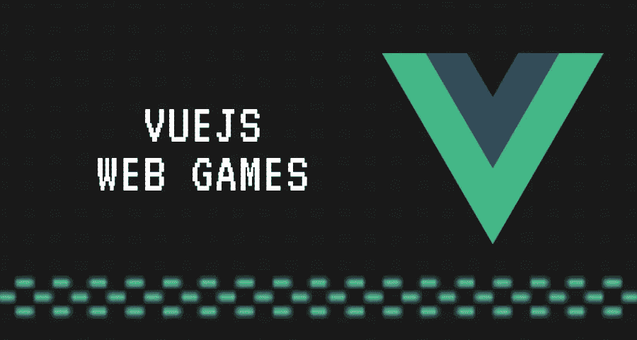

# 用游戏对抗前端疲劳

> 原文：<https://javascript.plainenglish.io/fighting-the-frontend-fatigue-through-games-bde9f9d9eb7c?source=collection_archive---------16----------------------->

## 待办事项列表的有趣替代品

前端技术在不断改进和发展。鉴于已经有[很多东西要学](https://github.com/kamranahmedse/developer-roadmap)，每天都有新的工具、库和框架出现，保持领先变得非常困难，所以我们最终会感到[前端疲劳](https://www.smashingmagazine.com/2016/11/not-an-imposter-fighting-front-end-fatigue/)。

在我们学习这些新技术的过程中，我们偶然发现了几种消费内容的选择，如播客、文章、教程、RSS 提要、youtube、视频培训网站和会议。

做完所有这些后，我们变得兴奋、激动，并准备好自己创造新的东西。然而，在我们日常工作中花了几个小时写表格、按钮、卡片和菜单之后。构建另一个 todo 应用程序，重做我们的博客，或者开始另一个我们无法完成的兼职项目，嗯，有点让人不知所措。

Build Games using Vuejs or any javascript framework

在本文中，我将向您展示如何构建浏览器游戏，这样您就可以玩得开心，发挥您的创造力，并对新技术进行测试。

是的，我们不需要学习任何新的东西，没有画布，没有游戏引擎，没有新的框架，只是你已经知道和喜欢的东西。

# 浏览器游戏

浏览器游戏已经存在了很长一段时间，从老派的[贪吃蛇](https://playsnake.org/)到 [2048](https://play2048.co/) 、[琼脂](https://agar.io/?)、 [**到更多的**](https://fossbytes.com/best-browser-games/) 都涉及到了一些复杂的东西。

2019 年，全球浏览器游戏市场达到 70.12 亿，自疫情启动以来，市场更加繁荣。这个领域有很多大玩家比如 Zynga，King。

底层技术和复杂性可以从使用普通 Javascript 到使用游戏引擎、3D 渲染、单人游戏和多人游戏。

游戏开发涉及不同的编程方法。因此，这是一个提升你技能的好机会，建立技能是一件非常有趣的事情，如果你想的话，你也可以赚钱。

这些概念可以转移到任何框架，因为我是 Vuejs 的超级粉丝，这个演示将使用 Vue。

# Vuejs —火船

Game That we will build

正如你所看到的，这个游戏是一个单独的 Vuejs 组件，它是我作为 [Codepens May 的挑战](https://codepen.io/challenges/2020/may/)的一部分构建的。

# 构建游戏的五个步骤

## 1.定义模型

模型是指游戏中的所有物体，所以在这个例子中，是火箭、行星和子弹。

每个型号都是`object`或`class`并且有自己的属性，最常见的是`x,y`。你可以用`health`、`experience`、`mana`、`money`或者任何适合你游戏的东西来扩展对象属性。

## 2.绘画模型

一旦我们成功地定义了我们的模型，下一步就是绘制它们，这可以通过迭代我们视口中的所有对象并绘制它们来实现。

我们可以利用所有模型都有坐标的优势，从而使用 CSS `position: absolute`属性来绘制它们

## 3.移动模型

开发一个浏览器游戏允许我们使用所有的 I/O 设备，比如鼠标和键盘来移动我们的模型，如果需要的话，我们也可以通过编程来移动对象。

**鼠标** 通过使用`mousemove`、`mousedown`事件，我们能够获得光标的位置并检测用户是否点击了鼠标按钮。

**键盘** 我们也可以利用键盘监听`keydown`事件来知道哪个按钮被按下了。

**程序化** 另一种方法是通过直接改变模型的`x`和/或`y`来基于游戏动作程序化地移动模型。

## 4.设计游戏玩法

前面的大部分步骤在所有游戏中都是标准的或通用的，但这是有趣的地方。这是你获得创造力和定义游戏复杂性的地方

当你移动物体时会发生什么？模特的互动对你的游戏有什么影响？事物会随着时间而变化吗？你有级别吗？你用鼠标吗？是基于文字的游戏吗？

由于这很大程度上依赖于这款游戏，我将快速浏览一下我在游戏中的主要功能。

**发射子弹** 目标是用火箭出来的子弹射击行星。因此，一旦用户按下空格键，我就创建一个新的项目符号，将它沿 Y 轴向上移动，并检查与行星的交点。

**关卡** 

**生命值条** 最后一个生命值条，这样当玩家未能击中一个星球时，火箭的生命值就会减少，最终游戏结束

## 5.游戏循环

这是一切都联系在一起的地方，所以我们现在有了模型、运动机制和一些 Javascript 代码来执行游戏逻辑。

利用`setInterval`我们可以创建一个循环，只要游戏在运行，它就会一直运行。

在游戏循环中，我们执行所有前面的步骤，因此我们在它们的新位置绘制模型，根据用户交互或游戏动作移动它们，应用我们的游戏规则，并重复。

## 进一步的阅读和资源

你可以做的事情有无限的可能性，这里有一个游戏的[列表，可以从中获得灵感，](http://armorgames.com/street-skater-game/18047)[精灵资源](https://www.spriters-resource.com/)，如果你想做得更高级，你可以在这里了解更多[，并开始使用游戏引擎，如](https://developer.mozilla.org/en-US/docs/Games/Introduction) [phaser](https://phaser.io/) 。

我目前正在学习 vue-composition-api 和构建俄罗斯方块，你在学习什么，你能用这些技术制作一个游戏吗？

黑客快乐！