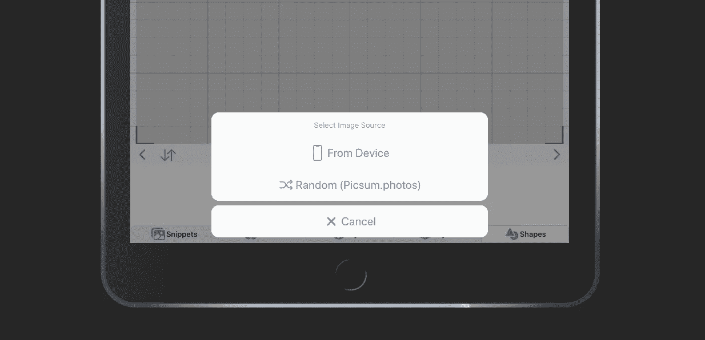

# 使用离子动作表的文件输入

> 原文：<https://javascript.plainenglish.io/file-input-using-ionic-action-sheet-3d9a71d3165c?source=collection_archive---------4----------------------->

Ionic 5 中利用动作表组件的文件输入元素的几种方法。

Ionic Framework 拥有一些最漂亮的 UI 组件。最近，我想在 Ionic 5 / Angular 9 web 应用程序中实现文件输入功能。从 UX 的角度来看，我真的想利用[行动表](https://ionicframework.com/docs/api/action-sheet)按钮，其中一个文件输入选项是从用户的设备上传。

问题是 Action Sheet Controller 只提供带有处理程序的标准按钮，我没有直接的方法向它添加文件输入元素。

# 方法 1:打电话。以编程方式单击不可见输入上的()

我立即想到的一个方法是:

*   在我的 html 模板中创建“不可见”的输入元素:

*   创建绑定到它的 ViewChild 并获取输入的 ElementRef.nativeElement:
*   然后在动作表按钮处理程序中调用 inputElement.click()方法:

这种方法似乎是可行的，但我面临的问题是在一些浏览器中是程序化的。click()没有触发，我无法获得实际的图像文件(Opera 和 Firefox)。此外，这可能是一些移动浏览器的问题。

似乎 element.click()应该总是从用户操作上下文中触发。

所以我试着用不同的方式解决它:

# 方法#2:在动作表创建过程中动态创建输入元素

在高层次上，这种方法如下:

*   创建新输入元素作为动作表控制器创建动作表元素工作的一部分
*   一旦创建了包含所有按钮的 action sheet 元素，我们就将 input 元素附加到正在讨论的按钮上
*   我们对输入进行了设计，使得它的 z-index 更优越，它首先捕获用户点击，然后事件传播并自然关闭动作表。
*   我们将事件的处理路由到另一个方法
*   最后，我们去掉了事件监听器

这样，input 元素由实际的用户操作触发，我们可以毫无问题地处理 event.target.files。它不太“干净”,涉及到 DOM 操作，但是完成了工作。

总之，我觉得在未来的动作表应该以输入文件类型“按钮”为特色，但同时有办法绕过它也是好的。

感谢您的阅读，祝大家安全快乐！

## **简明英语团队的笔记**

你知道我们有四份出版物和一个 YouTube 频道吗？你可以在我们的主页 [**plainenglish.io**](https://plainenglish.io/) 找到所有这些内容——关注我们的出版物并 [**订阅我们的 YouTube 频道**](https://www.youtube.com/channel/UCtipWUghju290NWcn8jhyAw) **来表达你的爱吧！**