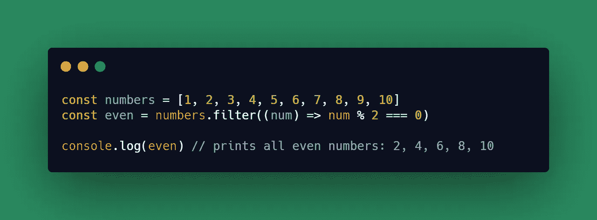
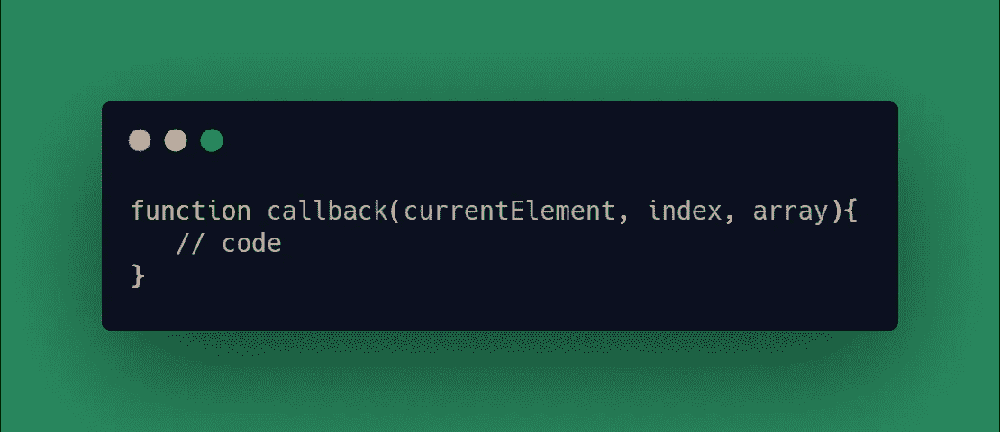
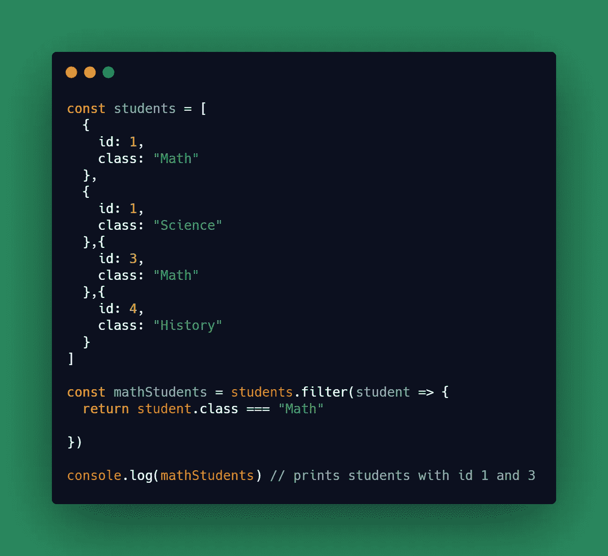

# 从 JavaScript 数组中过滤不需要的值

> 原文：<https://javascript.plainenglish.io/filtering-undesired-values-from-your-javascript-arrays-7ac789e0c58e?source=collection_archive---------6----------------------->

## 用过滤的方法清理你的珍贵数据

Flamenco Searching. Source [Icons8](https://icons8.it/ouch/illustration/flamenco-searching)

使用数组并不总是一件容易的事情。您可能经常会遇到这样的情况:您想要"*清除*"存储在其中的一堆信息。这只是一个像`filter()`这样的函数可能是您最佳选择的例子。

array `filter()`方法是一个内置函数，用于从数组中“*过滤*数据。运行该函数的结果是创建一个包含过滤信息的新数组。

在这个例子中，你可以看到我在一个初始数字数组上调用了`filter()`方法。函数作为参数传递给此方法。该函数中的条件将定义一个值是否在“中被“*过滤”的规则。如果条件通过，处理的值将是新创建的数组的一部分；否则，它将被丢弃。所以最后，每个没有被过滤掉的数字都将成为你在例子末尾看到的`even`数组的一部分。请记住`filter()`根本不会修改原始数组。*

更详细地说，传递给`filter()`方法的函数可以不止有一个参数。

第一个参数表示在整个数组的迭代过程中正在进行“*分析*的当前元素。如您所料,`index`是被处理元素在数组中的索引。而`array`表示被遍历的对象。

注意`index`和`array`参数对于`filter()`是可选的。

## *奖金示例*

如何使用`filter()`的一个简单例子是当你想在屏幕上打印一些东西的时候。假设您只想在一个大学管理应用程序中显示一群数学班的学生。您将从后端调用中收到一个学生列表。但是为了打印数学学生，你必须过滤它。

## 结论

我们的程序并不总是完美的。所以我们处理的数据。本文的目的是向您展示如何使用一个简单的方法来清理您的数据，并使其为其他需求做好准备。

— *皮耶罗*