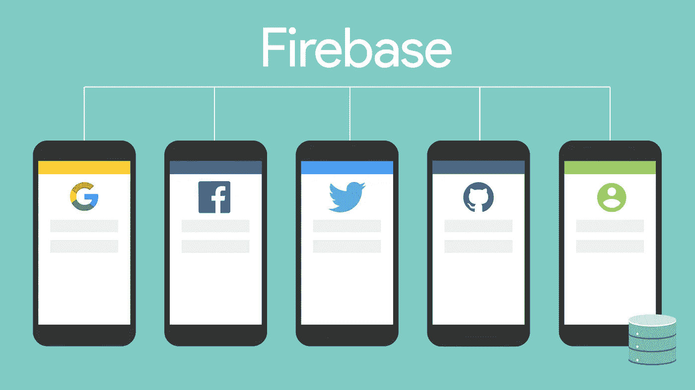

# Firestore 的 Firebase 认证

> 原文：<https://javascript.plainenglish.io/firebase-authentication-with-firestore-database-78e6e4f348c6?source=collection_archive---------1----------------------->

## 如何在云 Firestore 中认证用户并创建相应的文档。

当我最近构建一个 react-native 应用程序时，我决定使用 [Google 的 Firebase 云基础设施](https://firebase.google.com/)来简化诸如身份验证、数据库管理、云功能等事情。在浏览了许多不同的视频教程，阅读了不同的文章和堆栈溢出问题之后，我努力寻找一个简单的例子来说明如何在 Firebase Firestore 中正确使用 Firebase 身份验证(用户名/密码和社交信息)。我决定写一篇简单的中型文章可能会帮助其他人在同一旅程。

Firebase Service offering logos (src: firebase.google.com)

在我们进入细节之前，关于这篇文章，有两个关键点我想讲一下:
1 .我假设你知道如何编码或解释代码，我不会从头开始建立一个项目，但会使用 JavaScript 来演示我是如何做的(用一些伪代码截图)

2.因为 Firebase 的设计提供了惊人的灵活性，所以我将提供我考虑过的两种方法。如果你有任何其他方法，请在评论中提供细节，我会把它们添加到本文中。

**让我们开始** 场景:我们想建立一个应用程序，作为应用程序的一部分，我们想使用 firebase auth 验证用户，在用户成功创建后，我们想在 Firestore 的“用户”集合中创建一个用户记录。我们已经通读了所有的 Firebase 的 Auth 文档，并且非常清楚如何“创建”一个新用户。
我们也通读了 [Firestore 文档](https://firebase.google.com/docs/firestore)，并且知道如何创建新的收藏和存储新的文档——我们似乎不知道何时将两者结合在一起(我遇到的问题)。

A lot of ways to use Authentication — we focus on email/password & google signin (src: firebase.google.com)

以下是对我有效的两种方法:

**选项 1:** 当使用“*createUserWithEmailAndPassword()*”或使用社交登录注册新用户时，当我们知道已在 firebase auth 中成功创建用户时，我们将使用该参考在 firestore 的“用户”集合中创建用户。

用用户名和密码注册

signing up a user with email and password, on success creating a user document in cloud firestore

社交认证——Google
使用 Google(或任何其他认证提供商，如脸书、Twitter、GitHub)时，情况会有所不同，因为注册和登录的过程是相同的，即用户点击登录按钮，我们会去一个提供商那里验证用户的详细信息。如果用户是新的，我们让他们注册，如果他们不是新的，我们让他们登录。
在这种情况下，我们需要先在 firestore 中做一个简单的检查，看看“用户”集合下是否已经存在一个文档，如果是，什么也不做，如果不是，创建一个新的用户文档。

facilitating google sign in and then storing details in a user document in cloud firestore.

**选项 2:** 使用云功能将用户添加到“用户”集合。Firebase Cloud functions 提供了 onCreate 函数，可用于检测在 firebase auth 中创建新用户的时间。一旦触发，我们可以使用用户引用和提供的数据在“用户”文档中创建用户。

creating firestore user document using a cloud function

现在你有两种方法可以在 firebase auth 中创建帐户，然后在 cloud firestore 中创建相应的文档。就个人而言，因为从客户端前端创建文档的开销较低，所以我倾向于选择选项 1 而不是选项 2——但是，我相信两者都可行。如果你觉得有更好的方法，我很乐意在评论中听到你的方法。

否则，我希望这篇文章有所帮助，引导人们朝着正确的方向前进。

**用简单的英语来自 JavaScript 的一个提示:**我们总是对帮助推广高质量的内容感兴趣。如果你有一篇文章想用简单的英语提交给 JavaScript，用你的中级用户名发邮件到[submissions@javascriptinplainenglish.com](mailto:submissions@javascriptinplainenglish.com)给我们，我们会把你添加为作者。