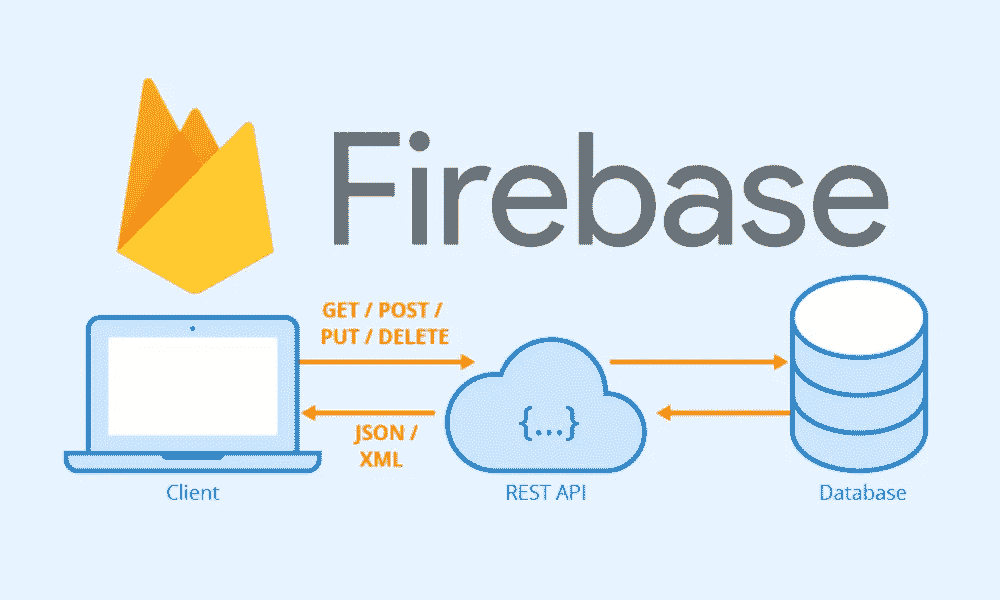

# Firebase 云函数教程—创建 REST API

> 原文：<https://javascript.plainenglish.io/firebase-cloud-functions-tutorial-creating-a-rest-api-8cbc51479f80?source=collection_archive---------2----------------------->



当我发现 [Firebase](https://firebase.google.com/) 时，我对它一见钟情。您可以很容易地启动并运行一个应用程序，几乎不需要后端开发。但是，就像任何语言、技术或框架一样，使用它会有一些缺点。

Firebase 最大的一个问题是，他们的 SDK 迫使你在客户端做大量的后端逻辑工作。这可能会导致性能问题，并导致一些不需要的代码。

另一个问题与数据安全有关。当您从他们的实时数据库或 Firestore 获取节点时，您必须返回所有数据。来自 C#的我习惯于使用[数据传输对象](https://en.wikipedia.org/wiki/Data_transfer_object)(dto)来最小化发送到前端的数据。

幸运的是，我们有 [Firebase 云功能](https://firebase.google.com/products/functions)，可以让我们轻松连接到数据库。而且，如果你熟悉 [Express](https://expressjs.com/) ，你会有宾至如归的感觉。

在这个 Firebase 云函数教程中，我们将看看如何创建一个 [REST API](https://restfulapi.net/) 来缓解上面提到的一些问题。

# 视频教程

Firebase Cloud Function Video Tutorial

# 设置 Firebase

我们需要做的第一件事是在 Firebase 中建立一个项目。前往[https://firebase.google.com/](https://firebase.google.com/)创建一个帐户，然后点击“前往控制台”。接下来，点击“添加项目”按钮，给它起你喜欢的名字。单击其他选项，选择默认值。

接下来，单击左侧菜单中的“数据库”。


Firebase Database

然后，在屏幕顶部单击“创建数据库”。


Firestore

现在，选择在测试模式下启动，并选择默认的服务器位置。


Firestore test mode

# 安装 Firebase CLI

为了创建我们的 Firebase 函数项目，我们需要安装 [Firebase CLI](https://firebase.google.com/docs/cli) 。如果您的机器上没有安装 [NodeJS](https://nodejs.org/en/) ，请现在安装。然后，打开您的终端并运行以下命令:

```
npm install -g firebase-tools
```

# 创建 Firebase 云功能项目

接下来，在您想要的目录中创建一个空文件夹。然后在 Visual Studio 代码中打开该文件夹。打开一个新终端(Terminal -> New Terminal)并运行以下命令:

```
firebase login
```

这将提示您登录到您的 Firebase 帐户，并使用 CLI 进行同步。完成后，运行以下命令:

```
firebase init
```

## 选择以下选项

1.  你准备好继续了吗？(是/否): **Y**
2.  您想为此文件夹设置哪些 Firebase CLI 功能？按空格键选择功能，然后回车确认你的选择: **Firestore 和功能**
3.  请选择一个选项:**使用现有项目**
4.  为这个目录选择一个默认的 Firebase 项目:**我们之前设置的项目**
5.  Firestore 规则应该使用什么文件？(firestore.rules): **回车默认**
6.  Firestore 索引应该使用什么文件？(firestore.indexes.json): **回车默认**
7.  你想用什么语言写云函数？: **JavaScript**
8.  你想使用 ESLint 来捕捉可能的错误并加强风格吗？(是/否): **y**
9.  您想现在安装与 npm 的依赖关系吗？(是/否): **Y**

# 创建 REST API

现在，导航到 functions 文件夹并打开 index.js。您将看到一个如下所示的文件:

您将看到我们有一个示例函数可以使用。但是，现在，我们的 Firebase 函数没有 REST 调用(GET、POST、PUT 等)的概念。).因此，在文件的顶部，让我们导入一些包:

```
const express = require('express');
const cors = require('cors');
```

为了连接到我们的 Firestore，我们需要添加 firebase 管理包并初始化我们的应用程序。在“导入”下，添加以下内容:

```
const *admin* = *require*('firebase-admin');
*admin.initializeApp*();
```

接下来，我们将初始化 Express:

```
const app = express();
```

然后，当我们发出 web 请求时，我们将初始化 cors:

```
app.use(cors({ origin: true }));
```

在本教程中，我们将为用户管理端点创建 CRUD(创建、读取、更新和删除)操作。

## 创造

对于我们的创建，我们将创建一个 POST 端点来将用户添加到我们的 Firestore。您所需要做的就是在我们的请求体中传递一个带有用户属性的对象。

```
*app.post*('/', *async* (req, res) => {
  const *user* = *req.body*;
  *await* *admin.firestore*()*.collection*('users')*.add*(user);
  *res.status*(201)*.send*();
});
```

## 阅读(全部)

对于第一次读取，我们将创建一个 GET 端点来从数据库中检索所有用户。

```
*app.get*('/', *async* (req, res) => {
  const *snapshot* = *await admin.firestore*()*.collection*('users')*.get*(); letusers=[];
  *snapshot.forEach*(doc => {
    letid= *doc.id*;
    letdata= *doc.data*();
    *users.push*({id, ...data});
  }); *res.status*(200)*.send*(JSON*.*stringify(users));
});
```

## 读(一)

更有用的读取操作是从数据库中检索一个用户。我们将创建一个 GET 方法，用 id 的 URL 参数传递用户 id。

```
app.get("/:id", **async** (req, res) => {
  **const** snapshot = **await** admin.firestore().collection('users').doc(req.params.id).get(); **const** userId = snapshot.id;
  **const** userData = snapshot.data();
  res.status(200).send(JSON.stringify({id: userId, ...userData}));
})
```

## 更新

接下来，我们将创建一个更新操作。为此，我们将发出一个 PUT 请求，并传入一个包含更新和 id 的 URL 参数的主体来获取用户。对于这个 Firestore 并不要求我们传递所有的用户属性。只有我们想要更新的内容:

```
app.put("/:id", **async** (req, res) => {
  **const** body = req.body;
  **await** admin.firestore().collection('users').doc(req.params.id).update(body);
  res.status(200).send()
});
```

## 删除

我们最后一个操作是删除，从数据库中删除一个用户。为此，我们将创建一个删除端点，并传递一个 id 为的 URL 参数，将用户 id 传递给它。

```
app.delete("/:id", **async** (req, res) => {
  **await** admin.firestore().collection("users").doc(req.params.id).delete();

  res.status(200).send();
})
```

最后，我们将使用 Firebase 云函数注册我们的 express add，并指定一个函数名 user:

```
exports.user= functions.https.onRequest(app);
```

# 部署

为了将我们的功能部署到 Firebase，我们将在终端中运行以下命令:

```
firebase deploy --only functions
```

部署完这些功能后，您将拥有 5 个新的端点:

POST
[https://us-central 1-](https://us-central1-)<project-id>. cloud functions . net/user

获取
[https://us-central 1-](https://us-central1-)<project-id>. cloud functions . net/user
[https://us-central 1-](https://us-central1-)<project-id>. cloud functions . net/user/<id>

放
[https://us-central 1-](https://us-central1-)<project-id>. cloud functions . net/user/<id>

删除
[https://us-central 1-](https://us-central1-)<project-id>. cloud functions . net/user/<id>

# 测试

为了测试你的新端点，我会推荐邮递员或者失眠。两者都使得测试 API 端点变得非常容易，而不需要制作 web 应用程序来完成。可以看我的[视频教程](https://youtu.be/iIVlRZIo2-c)看看我是怎么用 Postman 测试端点的。

# 结论

我将写另一篇文章，完整地重构这个 REST API。除了认证请求之外，还可以进行大量的改进。所以请关注我的下一篇文章！下次再见，祝编码愉快！

**Git Repo**
[https://bit bucket . org/the diligent dev/firebase-functions-API/src/master/](https://bitbucket.org/TheDiligentDev/firebase-functions-api/src/master/)

## **简明英语笔记**

你知道我们有四种出版物吗？给他们一个 follow 来表达爱意:[**JavaScript in Plain English**](https://medium.com/javascript-in-plain-english)[**AI in Plain English**](https://medium.com/ai-in-plain-english)[**UX in Plain English**](https://medium.com/ux-in-plain-english)[**Python in Plain English**](https://medium.com/python-in-plain-english)**——谢谢，继续学习！**

**此外，我们总是有兴趣帮助推广好的内容。如果您有一篇文章想要提交给我们的任何出版物，请发送电子邮件至[**submissions @ plain English . io**](mailto:submissions@plainenglish.io)**并附上您的中级用户名和您感兴趣的内容，我们将会回复您！****