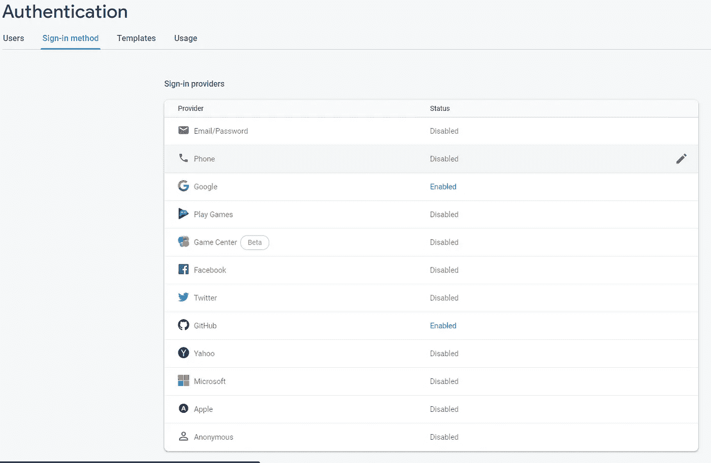
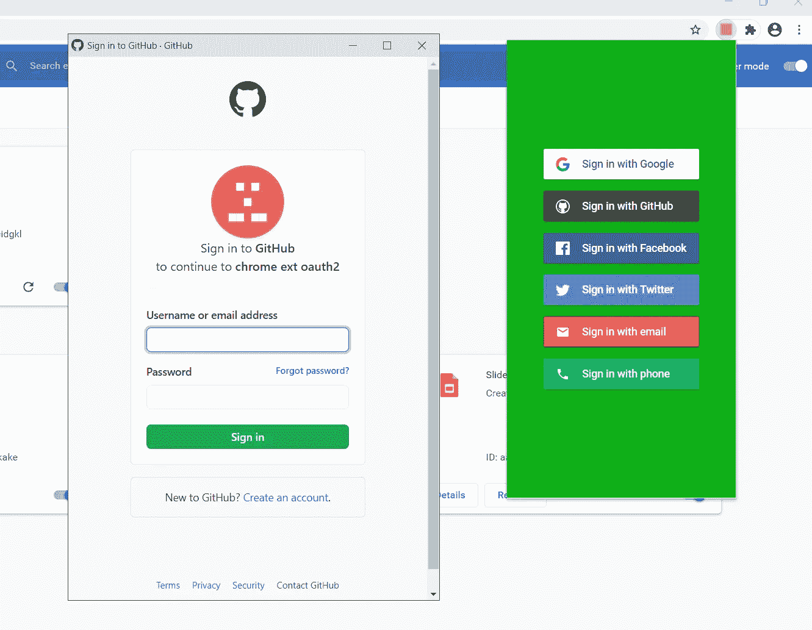

# 谷歌浏览器扩展的 Firebase 登录系统

> 原文：<https://javascript.plainenglish.io/firebase-login-system-for-google-chrome-extensions-27906f973b66?source=collection_archive---------4----------------------->

将您的登录系统卸载到 Google 的 Firebase 身份验证 SDK。

本教程使用了一个简单的谷歌 Chrome 扩展设置。 ***如果你想知道如何得到那个设置，看看我在这里写的:***

[](https://medium.com/@an_object_is_a/how-does-a-chrome-extension-work-web-development-6e85bd2bccc1) [## Chrome 扩展是如何工作的？(网络开发)

### Chrome 扩展有 5 个部分:

medium.com](https://medium.com/@an_object_is_a/how-does-a-chrome-extension-work-web-development-6e85bd2bccc1) 

# 我们开始吧

在接触一行代码之前，我们需要设置我们的开发环境。

导航至'[**https://console.firebase.google.com/**'](https://console.firebase.google.com/')并登录。
点击**创建项目**并命名。

如果您需要'**分析**'功能，请选择此项。

创建项目后，单击“ **Web** ”图标创建一个新的应用程序。


‘Web app’

命名此应用程序。
如果您需要“ **Firebase 托管**”功能，请选择此项。

导航回开发者控制台，点击“**认证**”卡。

点击导航栏中的**登录方式**。

在这里，您可以选择为用户提供哪些登录选项。对于本教程，我们将使用 Google 和 GitHub。



Firebase Sign-in methods

点击 **Google** 选项，启用，提供一个“**支持邮箱**”并保存。
点击 **GitHub** 选项并启用。

从该页面复制'**回调 URL** '。

我们需要从 GitHub 的开发者“控制台”中检索一个'**客户端 ID** '和'**客户端机密**'。

导航到 **GitHub** ，点击你的用户图标并选择**设置**。
点击**开发者设置** > **OAuth 应用** > **创建新应用**。

您可以随意命名应用程序。

**‘主页网址**’可以是你想要的任何东西。

“**授权回调 URL** ”是 Firebase 提供的“**回调 URL** ”。
点击**注册应用**。

复制'**客户端 ID** '和'**客户端机密**'并将它们粘贴到您的 Firebase GitHub 选项中。

向下滚动到'**添加域**'；我们需要将我们的 Chrome 扩展加入白名单。

添加域名，“**chrome-extension://<id>**”，其中 ***< id >*** 是你的 Chrome 扩展 id。

这可以在你的浏览器中找到@ **chrome://extensions/** 。

向下滚动到“**每个电子邮件地址多个账户**”。

如果你愿意，启用这个能力。

我们现在可以从一些实际的编码开始。

## 在开始实际的 Chrome 扩展工作之前，让我们做一些 web 开发工作。

我们需要三页纸。

一个'**popup.html**，我们将使用它给用户'登录'选项。

一个'**welcome.html**，我们将显示它来通知用户他们已经成功登录。

一个'**main.html**'，我们将使用它来给用户选择'注销'。

**注意:**
记下所有附在我们 HTML 文件上的“**脚本**”。我们边走边填。

## 现在我们已经讨论了 Web 开发部分，让我们看看我们的“manifest.json”。

**注意:**
**content _ security _ policy**对于这个 app 来说是必不可少的。它允许 Firebase 下载必要的文件。

## 让我们做一些实际的 Chrome 扩展编程。

我们将从编写应用程序的基本框架逻辑流开始。

在' **main-script.js** '脚本中，当用户点击菱形时，我们将向' **background.js** '脚本发送一条消息，要求“ **sign_out** ”。

如果我们从' **background.js** '中得到一个“ **success** ”，我们就把这个页面改成'**popup.html**'页面。

```
// main-script.jsdocument.querySelector('#sign_out').addEventListener('click', () => {
    chrome.runtime.sendMessage({ message: 'sign_out' },
      function (response) {
        if (response.message === 'success') {
            window.location.replace('./popup.html');
        }
      }
    });
});
```

在' **popup-init.js** '脚本中，我们将检查用户当前是否登录。

如果是，我们将向他们显示'**main.html**'页面；如果不是，我们将向他们显示'**popup.html**'页面。

```
// popup-init.jsfunction init() {
    chrome.runtime.sendMessage({ message: 'is_user_signed_in' }, 
      function (response) {
        if (response.message === 'success' && response.payload) {
            window.location.replace('./main.html');
        }
      }
    });
}init();
```

## “popup-script.js”是我们编写大部分代码的地方。

然而，在此之前，我们需要下载 **Firebase SDK** s.
，所以在“**popup.html**”中，我们将在头部包含一些“**脚本**和“**链接**”。

```
// popup.html<script src="[https://www.gstatic.com/firebasejs/7.19.1/firebase-app.js](https://www.gstatic.com/firebasejs/7.19.1/firebase-app.js)"></script><script src="[https://www.gstatic.com/firebasejs/7.19.1/firebase-auth.js](https://www.gstatic.com/firebasejs/7.19.1/firebase-auth.js)"></script><script src="[https://cdn.firebase.com/libs/firebaseui/3.5.2/firebaseui.js](https://cdn.firebase.com/libs/firebaseui/3.5.2/firebaseui.js)"></script><link type="text/css" rel="stylesheet" href="[https://cdn.firebase.com/libs/firebaseui/3.5.2/firebaseui.css](https://cdn.firebase.com/libs/firebaseui/3.5.2/firebaseui.css)" />
```

让我们来看看“ **popup-script.js** ”。

我们将会复制和粘贴大量来自

*h*[*ttps://firebase . Google . com/docs/auth/web/firebase ui*](https://firebase.google.com/docs/auth/web/firebaseui)

导航到 Firebase Web 应用程序的设置。
向下滚动，直到找到“ **Firebase SDK 片段**”。我们只需要'**配置**'。

复制并粘贴到你的“ **popup-script.js** ”和*确保初始化*。

```
// popup-script.jsconst firebaseConfig = {
    apiKey: "",
    authDomain: "",
    databaseURL: "",
    projectId: "",
    storageBucket: "",
    messagingSenderId: "",
    appId: ""
};firebase.initializeApp(firebaseConfig);
```

接下来，我们将…
初始化' **Firebase Auth UI** '，
设置 UI 的选项，
，然后当用户点击' **Sign In** 按钮时启动 UI。

**注:**
1。在我们的' **uiConfig** '的'***signisuccesswithauthresult:function(authResult，redirectUrl)*** '中，我们向' **background.js** '脚本发送一条消息，通知我们的
扩展用户已经成功登录。

2.在'***ui shown:function()***中，我们确保在按钮中隐藏'**标志。**

3.我们不需要' **signInSuccessUrl** '的值，因为 Chrome 不允许我们重定向回它。

这就是了。Firebase 认证引入谷歌浏览器扩展。



你可以在这里找到所有的源文件。

如果你想要更深入的指导，可以看看我在 YouTube 上的完整视频教程，**一个物体就是一个**。

一定要在 [**Instagram**](https://www.instagram.com/an_object_is_a/) 和 [**Twitter**](https://twitter.com/anobjectisa1) 上关注我们，及时了解我们最新的 **Web 开发教程**。

**带 Chrome 扩展的 Firebase 登录系统| OAuth/OAuth2/OpenID 连接**

*代表*[***plain English . io***](https://plainenglish.io/)*团队，感谢阅读。*