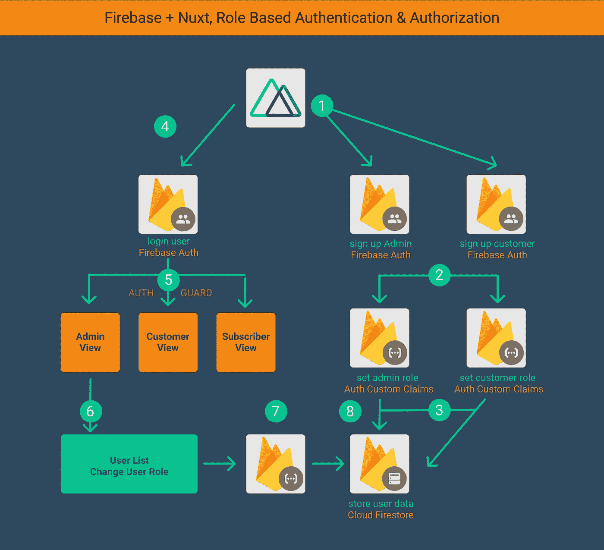
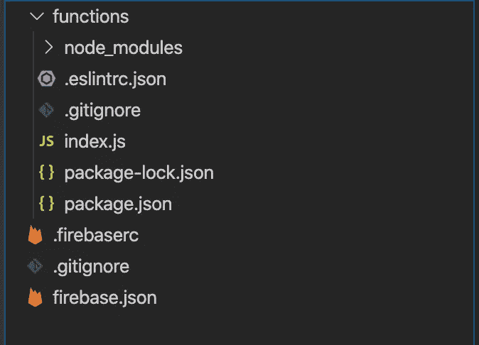
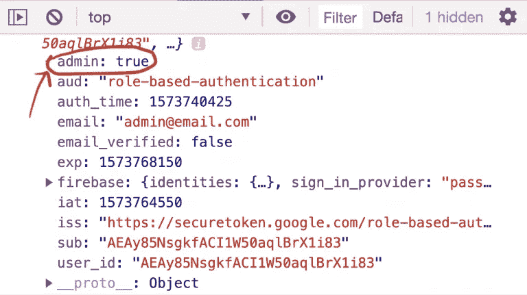

# Firebase + Nuxt，基于角色的认证和授权

> 原文：<https://javascript.plainenglish.io/firebase-nuxt-role-based-authentication-authorization-a2eea9a1a586?source=collection_archive---------1----------------------->



## 在本文中，您将学习如何使用 [Auth 自定义声明](https://firebase.google.com/docs/auth/admin/custom-claims)来设置用户角色，并在创建新的 Firebase 用户帐户时将用户数据存储到云 Firestore。

此外，我将向您展示如何在登录时基于用户角色保护路由。

最后，我将向您展示当登录用户拥有管理员权限时，如何获取所有用户帐户，以及如何使用可调用的云函数来更改用户角色。

**这是我们将要创建的 3 个用户角色:**

*   **Admin** 角色可以访问存储在数据库中的所有用户，并被授予使用安全规则更改用户角色的权限。
*   **客户**角色将有权访问**客户**视图，并且它将被设置为默认角色，因为大多数用户将处于该角色下。
*   **订户**角色将有权访问**订户**视图。

1.  **启动并运行 Nuxt 项目**

我已经使用`npx create-nuxt-app <name>`创建了一个[启动项目](https://github.com/alexkasongo/firebase-nuxt-role-based-auth)，并在 src/pages 文件夹下创建了六个页面。Nuxt 处理所有路由。您可以克隆这个 repo 并一起编码。根据您的特定用例，您还可以将代码添加到现有项目中。

> 如果你想在 Vue.js 应用程序中实现它，请随意在这里克隆代码的 Vue 版本

**2。安装 firebase 并创建一个 Firebase 用户帐户**

```
npm install firebase
```

在 nuxt.config.js 内的插件数组中注册 firebase.js

```
// nuxt.config.js
Plugins = [
  '~/plugins/firebase.js',
],
```

继续在 Firebase 控制台上创建一个项目。在你的 Nuxt 应用程序中，在 **src/plugins** 中创建一个名为 **firebase.js** 的文件，在这个文件中包含你的 firebase 初始化代码。

```
// firebase.js
*import* "firebase/auth";
*import* "firebase/firestore";// Your web app's Firebase configuration
var firebaseConfig = {
  apiKey: "**************",
  authDomain: "**************",
  databaseURL: "**************",
  projectId: "**************",
  storageBucket: "",
  messagingSenderId: "**************",
  appId: "**************",
  measurementId: "**************"
};
// Initialize Firebase
firebase.initializeApp(firebaseConfig);
```

**3。更新 Default.vue**

```
// default.vue
<template>
  <div>
    <nav class="navbar navbar-expand-lg navbar-light bg-light">
      <a class="navbar-brand" href="#">Navbar</a>
      <button
        class="navbar-toggler"
        type="button"
        data-toggle="collapse"
        data-target="#navbarSupportedContent"
        aria-controls="navbarSupportedContent"
        aria-expanded="false"
        aria-label="Toggle navigation"
      >
        <span class="navbar-toggler-icon"></span>
      </button>

      <div class="collapse navbar-collapse" id="navbarSupportedContent">
        <ul class="navbar-nav mr-auto">
          <li class="nav-item">
            <nuxt-link class="nav-link" to="/login">Login</nuxt-link>
          </li>
          <li class="nav-item">
            <nuxt-link class="nav-link" to="/register-customer"
              >Register Customer</nuxt-link
            >
          </li>
          <li class="nav-item">
            <nuxt-link class="nav-link" to="/register-admin"
              >Register Admin</nuxt-link
            >
          </li>
        </ul>
      </div>
    </nav>
    <div class="container mt-5">
      <Nuxt />
    </div>
  </div>
</template>

<style>
html {
  font-family: "Source Sans Pro", -apple-system, BlinkMacSystemFont, "Segoe UI",
    Roboto, "Helvetica Neue", Arial, sans-serif;
  font-size: 16px;
  word-spacing: 1px;
  -ms-text-size-adjust: 100%;
  -webkit-text-size-adjust: 100%;
  -moz-osx-font-smoothing: grayscale;
  -webkit-font-smoothing: antialiased;
  box-sizing: border-box;
}

*,
*::before,
*::after {
  box-sizing: border-box;
  margin: 0;
}

.button--green {
  display: inline-block;
  border-radius: 4px;
  border: 1px solid #3b8070;
  color: #3b8070;
  text-decoration: none;
  padding: 10px 30px;
}

.button--green:hover {
  color: #fff;
  background-color: #3b8070;
}

.button--grey {
  display: inline-block;
  border-radius: 4px;
  border: 1px solid #35495e;
  color: #35495e;
  text-decoration: none;
  padding: 10px 30px;
  margin-left: 15px;
}

.button--grey:hover {
  color: #fff;
  background-color: #35495e;
}
</style>
```

**3。注册客户**

让我们创建一个注册表单。我用 [Bootstrap CDN](https://getbootstrap.com/docs/4.5/getting-started/introduction/) 但是可以随意用你最喜欢的。用户数据将存储在角色集合下的云 Firestore 中。这样，当您拥有管理员权限时，就可以获得所有的用户信息。

> src/页面/注册-客户

```
// src/pages/register-customer<template>
  <div class="row">
    <div class="col-sm-4 off-set">
      <form @submit.prevent="onSubmit">
        <div class="form-group">
          <label for="exampleInputEmail1">Email address</label>
          <input
            type="email"
            class="form-control"
            placeholder="Enter email"
            v-model="email"
          />
        </div>
        <div class="form-group">
          <label for="exampleInputPassword1">Password</label>
          <input
            type="password"
            class="form-control"
            placeholder="Password"
            v-model="password"
          />
        </div>
        <button type="submit" class="btn btn-primary">Register Customer</button>
      </form>
    </div>
  </div>
</template>

<script>
import * as firebase from "firebase/app";
import "firebase/auth";

export default {
  name: "RegisterCustomer",
  data: () => ({
    email: "",
    password: "",
  }),
  methods: {
    async onSubmit() {
      try {
        var { user } = await firebase
          .auth()
          .createUserWithEmailAndPassword(this.email, this.password);
        // signout
        firebase
          .auth()
          .signOut()
          .then((user) => {
            this.$router.push("/login");
          });
      } catch (error) {
        console.log("🤡", error.message);
      }
    },
  },
};
</script>
```

当通过授权自定义声明设置用户角色时，它将在注销并重新登录后变得可用。

出于这个原因，我在创建了一个新的用户帐户后，有了下面的注销功能。

**4。添加 Firebase 云功能**

4.1 **重要:**支持 Node.js、10、12 版本。

```
npm install -g firebase-tools
```

或者

```
sudo npm install -g firebase-tools
```

4.2 **重要提示:**更新 Firebase CLI 和 SDK

```
npm install firebase-functions@latest firebase-admin@latest --save
npm install -g firebase-tools
```

4.2**初始化你的项目**

运行`firebase login`通过浏览器登录并验证 firebase 工具。

运行`firebase init`

对于我们的案例，让我们选择以下内容:

**您想为此文件夹设置哪些 Firebase CLI 功能？** *功能*

**你想用什么语言写云函数？** *JavaScript*

你想使用 ESLint 来捕捉可能的 bug 并加强风格吗？ *是*

T22 您想现在安装与 npm 的依赖关系吗？ *是*

仅此而已！

让 **Firebase CLI** 做项目脚手架，准备好项目文件。

> src/功能



**5。添加管理员授权自定义声明**

如你所知，从客户端设置管理员角色不是一个好主意，所以我将使用 Firebase Cloud 函数来添加它。

创建新的 Firebase 用户帐户时，将触发 AddUserRole()函数。

> 函数/index.js

```
// functions/index.js
const functions = require('firebase-functions');
const admin = require('firebase-admin')admin.initializeApp()const db = admin.firestore()*// trigger function on new user creation.
// when a new user is created this fucntion is triggered. When triggered a defualt
// data object is pushed to the roles collection, this object contains the user's role status*exports.AddUserRole = functions.auth.user().onCreate(async (authUser) => {
  if (authUser.email) {
    const customClaims = {
      admin: true,
    };
    try {
      var _ = await admin.auth().setCustomUserClaims(authUser.uid, customClaims)
      return db.collection("roles").doc(authUser.uid).set({
        email: authUser.email,
        role: customClaims
      })
    } catch (error) {
      console.log(error)
    }
  }
});
```

**重要提示:**将功能部署到 Firebase。

```
firebase deploy --only functions
```

**6。注册管理员**

从客户端设置管理员角色并不是一个好的做法，所以我将使用 Firebase Cloud 函数来完成这项工作。

> src/pages/register-admin.vue

```
// src/pages/register-admin<template>
  <div *class*="row">
    <div class="col-sm-4 off-set">
      <form @submit.prevent="onSubmit">
        <div class="form-group">
          <label for="exampleInputEmail1">Email address</label>
          <input
            type="text"
            placeholder="Email"
            v-model="email"
            class="form-control"
            required
          />
        </div> <div class="form-group">
          <label for="exampleInputPassword1">Password</label>
          <input
            type="password"
            placeholder="Password"
            v-model="password"
            class="form-control"
            required
          />
        </div> <button type="submit" class="btn btn-primary">Register Admin</button>
      </form>
    </div>
  </div>
</template><script>
import * as firebase from "firebase/app";
import "firebase/auth";
import "firebase/functions";export default {
  name: "RegisterAdmin",
  data() {
    return {
      name: "",
      phone: "",
      email: "",
      password: "",
      user: null,
    };
  },
  methods: {
    async onSubmit() {
      let admin = {
        role: {
          admin: true,
        },
      }; await firebase
        .auth()
        .createUserWithEmailAndPassword(this.email, this.password)
        .then((response) => {
          if (response) {
            const setAdmin = firebase.functions().httpsCallable("setAdmin");
            const data = { uid: response.user.uid, role: admin.role };
            setAdmin(data)
              .then((result) => {
                console.log(`index.js - 183 - "🎉"`, result);
              })
              .then(() => {
                // signout
                firebase
                  .auth()
                  .signOut()
                  .then(() => {
                    this.$router.push("/login");
                  });
              });
          }
        })
        .catch((error) => {
          // Handle Errors here.
          console.log("🤡", error.message);
        });
    },
  },
};
</script>
```

6.1 函数/索引. js

添加创建新管理员时调用的云函数。这个函数接收一个 uid 和新的角色数据。

```
// create admin user on signup
exports.setAdmin = functions.https.onCall(async (data, context) => {

    // if (!context.auth.token.admin) return
    if (!context.auth.token) return

    try {
        var _ = await admin.auth().setCustomUserClaims(data.uid, data.role)

        return db.collection("roles").doc(data.uid).update({
            role: data.role
        })

    } catch (error) {
        console.log('🤡', error)
    }

});
```

**重要提示:**将功能部署到 Firebase。

```
firebase deploy --only functions
```

**7。登录**

让我们使用在 register-admin 页面上创建的管理员帐户登录管理员帐户

> src/pages/login.vue

```
<template>
  <div class="row">
    <div class="col-sm-4 off-set">
      <form @submit.prevent="onSubmit">
        <div class="form-group">
          <label for="exampleInputEmail1">Email address</label>
          <input
            type="email"
            class="form-control"
            placeholder="Enter email"
            v-model="email"
          />
        </div>
        <div class="form-group">
          <label for="exampleInputPassword1">Password</label>
          <input
            type="password"
            class="form-control"
            placeholder="Password"
            v-model="password"
          />
        </div>
        <button type="submit" class="btn btn-primary">Login</button>
      </form>
    </div>
  </div>
</template>

<script>
import * as firebase from "firebase/app";
import "firebase/auth";

export default {
  name: "Login",
  data: () => ({
    email: "",
    password: "",
  }),
  created() {
    firebase.auth().onAuthStateChanged((userAuth) => {
      if (userAuth) {
        firebase
          .auth()
          .currentUser.getIdTokenResult()
          .then((tokenResult) => {
            console.log("🍎 ", tokenResult.claims);
          });
      }
    });
  },

  methods: {
    async onSubmit() {
      try {
        const { user } = await firebase
          .auth()
          .signInWithEmailAndPassword(this.email, this.password);
      } catch (error) {
        console.log("🤡", error);
      }
    },
  },
};
</script>
```

**8.1 注册客户**

转到注册客户视图，注册一个新的客户用户。注册成功后，将在云 Firestore 数据库中创建一个名为“角色”的新集合。

**8.2 登录客户**

当您使用已经创建的客户登录时，您应该看到控制台中的自定义声明对象内的客户属性被设置为 true

**8.2 注册管理员**

转到 Register Admin 视图，注册一个新的管理员用户。注册成功后，将在云 Firestore 数据库中创建一个名为“角色”的新集合。

**8.2 登录管理员**

当您使用已经创建的 admin 登录时，您应该看到控制台中的 custom claims 对象内的 customer 属性被设置为 true



**9。客户视图**

这个视图有一个简单的标题，用户电子邮件和注销按钮，驱动程序视图是相同的，除了标题文本。

```
// src/pages/customer
<template>
  <section>
    <div class="ui middle aligned center aligned grid">
      <div class="column">
        <h1>Customer</h1>
        <p v-if="user">Customer: {{ user.email }}</p>
        <button class="btn btn-primary" @click="signout">Signout</button>
      </div>
    </div>
  </section>
</template>
<script>
import * as firebase from "firebase/app";
import "firebase/auth";export default {
  data() {
    return {
      user: null,
    };
  },
  created() {
    var self = this;
    firebase.auth().onAuthStateChanged(function (user) {
      self.user = user;
    });
  },
  methods: {
    signout() {
      firebase
        .auth()
        .signOut()
        .then((user) => {
          this.$router.push("/login");
        });
    },
  },
};
</script>
```

您可能想知道，如果我不想让客户或订户看到仪表板，该怎么办？如果我想将用户角色(如客户)更改为订户，反之亦然，该怎么办？

别担心，我一会儿会讲到的。

**9。授权的授权守卫**

让我们在 src 中创建一个中间件文件夹，并在其中创建一个名为*的文件*

**重要:**在 nuxt.config.js 中注册中间件

```
// nuxt.config.js
router: {
  middleware: ['authenticated']
},
```

在 beforeEach 方法中，我使用 Firebase 中的 onAuthStateChanged 方法检查用户是否登录。

如果有一个用户，那么获取一个 idTokeResult，它包含 claims 对象，我可以在其中获取在创建新用户帐户时设置的用户角色。

src/middleware/authenticated . js

```
import * as firebase from 'firebase/app';
import 'firebase/auth';

export default function ({ app, store, route, redirect }) {

    app.router.beforeEach((to, from, next) => {

  firebase.auth().onAuthStateChanged(userAuth => {

    if (userAuth) {
      firebase.auth().currentUser.getIdTokenResult()
        .then(function ({
          claims
        }) {

          if (claims.customer) {
            if (to.path !== '/customer')
              return next({
                path: '/customer',
              })
          } else if (claims.admin) {
            if (to.path !== '/admin')
              return next({
                path: '/admin',
              })
          } else if (claims.subscriber) {
            if (to.path !== '/subscriber')
              return next({
                path: '/subscriber',
              })
          }

        })
    } else {
      if (to.matched.some(record => record.meta.auth)) {
        next({
          path: '/login',
          query: {
            redirect: to.fullPath
          }
        })
      } else {
        next()
      }
    }

  })

  next()

})

}
```

**11。改变用户角色**

让我们在管理员帐户登录时获取所有用户帐户，以便您可以从前端将角色更改为任何用户。

管理员用户界面

```
<template>
  <section>
    <div class="ui middle aligned center aligned grid">
      <div class="column">
        <h1>Admin</h1>
        <p v-if="user">User: {{ user.email }}</p>
        <button class="btn btn-primary mb-4" @click="signout">Signout</button>
        <table class="table table-hover">
          <thead>
            <tr>
              <th scope="col">Email</th>
              <th scope="col">Role</th>
            </tr>
          </thead>
          <tbody>
            <tr v-for="user in users" :key="user.id">
              <td data-label="Name">{{ user.email }}</td>
              <td>
                <select @change="changeRole(user.id, $event)">
                  <option :selected="user.role.subscriber" value="subscriber">
                    Subscriber
                  </option>
                  <option :selected="user.role.customer" value="customer">
                    Customer
                  </option>
                </select>
              </td>
            </tr>
          </tbody>
        </table>
      </div>
    </div>
  </section>
</template>
<script>
import * as firebase from "firebase/app";
import "firebase/auth";
import "firebase/functions";

export default {
  name: "Admin",
  data() {
    return {
      users: [],
      user: null,
    };
  },
  created() {
    var self = this;
    firebase.auth().onAuthStateChanged((user) => {
      self.user = user;
    });
    this.users = [];
    firebase
      .firestore()
      .collection("roles")
      .get()
      .then((snap) => {
        snap.forEach((doc) => {
          var user = doc.data();
          user.id = doc.id;
          console.log("🌿", doc.data());
          if (!user.role.admin) this.users.push(user);
        });
      });
  },
  methods: {
    signout() {
      firebase
        .auth()
        .signOut()
        .then((user) => {
          this.$router.push("/login");
        });
    },
    changeRole(uid, event) {
      var setUserRole = firebase.functions().httpsCallable("setUserRole");
      var data = { uid: uid, role: { [event.target.value]: true } };
      setUserRole(data)
        .then((result) => {
          console.log("🎉", result);
        })
        .catch((error) => {
          console.log("🤡", error);
        });
    },
  },
};
</script>
```

让我们将安全规则添加到数据库级别。只有 admin 能够查看 created()方法中 roles 集合的所有用户数据。

```
rules_version = '2';
service cloud.firestore {
  match /databases/{database}/documents {
     match /roles/{uid} {
      allow read, write: if request.auth.token.admin == true
    }

  }
}
```

现在，在每个用户旁边添加一个下拉菜单，显示他们可以切换到的角色，并将 uid 和新的角色数据发送到后端的可调用函数 setUserRole()中。

```
*// this function can only be triggered by the admin. This function allows the admin to
// set user roles accordingly.*exports.setUserRole = functions.https.onCall(async (data, context) => {
  if (!context.auth.token.admin) return
  try {
    var _ = await admin.auth().setCustomUserClaims(data.uid, data.role)
    return db.collection("roles").doc(data.uid).update({
      role: data.role
    })
  } catch (error) {
    console.log(error)
  }
});
```

**重要提示:**将功能部署到 Firebase。

```
firebase deploy --only functions
```

首先，检查请求是否是由管理员使用服务器端的自定义声明发出的。然后，使用 uid 为自定义声明对象设置一个新角色，并更新相应的文档以反映角色的变化。

> 如果你有更好的方法来解决这个问题，请在下面的评论区告诉我。

**🍎** [**GITHUB 回购**](https://github.com/alexkasongo/firebase-nuxt-role-based-auth) **🍎**