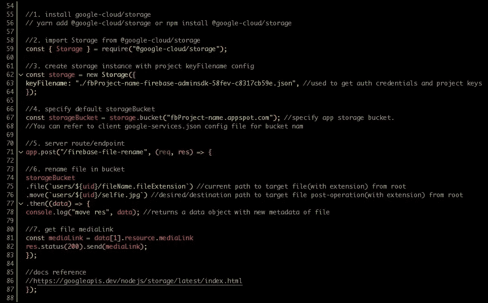

# 用 Node.js 管理 Firebase-Storage 文件

> 原文：<https://javascript.plainenglish.io/firebase-storage-file-management-with-nodejs-server-side-5601ac8785f8?source=collection_archive---------12----------------------->



Preview of entire execution

用 Node.js 执行 firebase-storage 文件管理操作比我想象的要麻烦得多，所以下面是我如何设法让它工作的一个演示。

所有相关的步骤都已经在上面的片段中设置好了，但是我想强调几点

## 1.谷歌-云平台

即使您的项目是一个具有身份验证、数据库、存储等功能的 firebase 项目。firebase-storage 全部来源于 firebase，实际上依赖于***Google-cloud/storage***，需要使用他们的 API 来管理你的 firebase-storage 的内容。

这也是为什么我们需要用第 56 行安装***@ Google-cloud/Storage***，并在第 59 行从其中导入*来设置上面代码片段中的球滚动。*

*~安装 google 云存储包*

```
**yarn add @google-cloud/storage*or*npm install @google-cloud/storage**
```

*~从 google 云存储包导入存储*

```
*const { Storage } = require("@google-cloud/storage");*
```

## *2.设置参考*

*不同于通常的 ***存储()。我们使用客户端，由于 GCP 的参与，这里的引用略有不同。****

*为了在这里创建一个引用，我们首先需要创建一个 GCP 存储类的实例，并传入包含访问 firebase 项目所需的认证凭证和密钥的 ***keyFilename*** 配置(第 62 到 64 行)。*

*~创建存储类实例*

```
*const storage = new Storage({
keyFilename: "./fbProject-name-firebase-adminsdk-58fev-c8317cb59e.json",
});*
```

*在此之后，出现了 ***。ref()*** 方法，我们称之为 ***。bucket()* 这是一个格式为 ***` <项目名称> .appspot.com`*** 的字符串。虽然可以创建定制的存储桶，但是创建的默认存储桶是以 firebase 项目本身命名的(第 67 行)***

*~创建存储包引用*

```
*const storageBucket = storage.bucket("fbProject-name.appspot.com");* 
```

## *3.访问您的文件*

*如果桶就像计算机硬盘驱动器字母 C:/或 D:/，那么。file()方法使用文件在驱动器上的路径来知道要访问什么文件或目录。像第 75 行那样把它作为一个字符串传入，你应该可以在任何你需要运行它的 ***端点/路径*** 中做任何你想做的事情。*

*~指定要访问的文件/目录路径*

```
*const file = storageBucket.file(`users/${uid}/fileName.fileExtension`)*
```

*~运行文件管理方法/操作*

```
*file
.move(`users/${uid}/selfie.jpg`) .then((*data*) => {
console.log("move res", *data*); });*
```

*您可以查看第 86 行的参考链接，了解完整的文档以及可用于管理存储容器内容的方法/操作列表。*

*最后，把所有这些放在一起，*

```
**//1\. install google-cloud/storage
// yarn add @google-cloud/storage or npm install @google-cloud/storage**//2\. import Storage from @google-cloud/storage* const { Storage } = require("@google-cloud/storage");*//3\. create storage instance with project keyFilename config* const storage = new Storage({
keyFilename: "./fbProject-name-firebase-adminsdk-58fev-c8317cb59e.json", *//used to get auth credentials and project keys* });*//4\. specify default storageBucket* const storageBucket = storage.bucket("fbProject-name.appspot.com"); *//specify app storage bucket. You can refer to client google-services.json config file for bucket nam**//5\. server route/endpoint* app.post("/firebase-file-rename", (*req*, *res*) => {*//6\. rename file in bucket* storageBucket
.file(`users/${uid}/fileName.fileExtension`) *//current path to target file(with extension) from root* .move(`users/${uid}/selfie.jpg`) *//desired/destination path to target file post-operation(with extension) from root* .then((*data*) => {
console.log("move res", *data*); *//returns a data object with new metadata of file*//7\. get file mediaLink
const mediaLink = data[1].resource.mediaLink*res*.status(200).send(mediaLink);});*//docs reference
//https://googleapis.dev/nodejs/storage/latest/index.html*});*
```

## *结论*

*Firebase 文档可能非常好，但是挖掘所有这些内容并不像您所期望的那样直接，我个人并不喜欢搜索这些信息并像我必须做的那样解决问题，但是希望这可以为您节省一些时间和精力。*

*干杯:)*