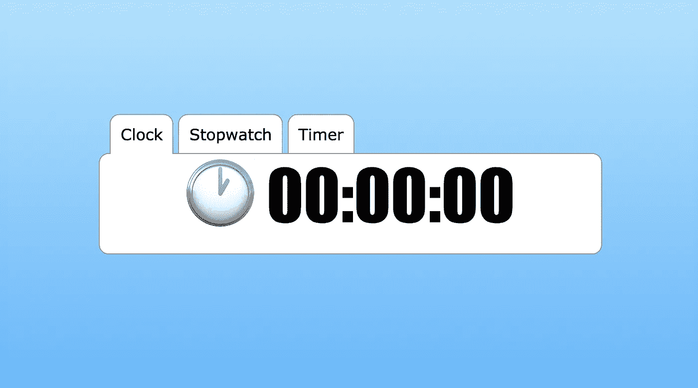

# 在单个 MTU 中安装 Web 应用程序

> 原文：<https://javascript.plainenglish.io/fitting-a-webapp-in-a-single-mtu-4f5b8309f3e6?source=collection_archive---------0----------------------->

你可能听说过术语“MTU”又名。“最大传输单位”。这是一个网络术语，描述了一个信息包中可以容纳的最大字节数。该数据包将从您的计算机完整无缺地传送到收件人，而不会进一步分解成更小的部分(大多数情况下)。仅供参考，典型的 MTU 大小为 1500 字节。

这意味着，如果我们设法将所有有用的信息都放在一个 MTU 中，我们将达到最大可能的传递速度。所以你认为，我们能在这么小的空间里放些有用的东西吗？


Photo by [Hal Gatewood](https://unsplash.com/@halgatewood?utm_source=medium&utm_medium=referral) on [Unsplash](https://unsplash.com?utm_source=medium&utm_medium=referral)

# 提供有用的东西

首先，我们来定义一下“有用”。我想提高我们的标准。尽可能高。所以，我想传达:

*   一个网站
*   反应灵敏，适合我的手机或台式机屏幕
*   它有很好的背景、颜色和图形
*   这是动态的，做一些有用的事情
*   让我们假设这个“有用”的东西是一个 3 标签的网络应用程序，带有秒表、计时器和时钟！

# 我们到底能装多少？

在我们继续之前，让我们先来计算一下我们的规模预算:

*   **1500 字节**的 MTU(网络上的原始非结构化数据)
*   IPv4 报头减去 20 字节的
*   **减去 TCP 报头的 20 字节的**
*   ****对于一个简单的 HTTP 响应，减去大约 91 个字节****
*   ****我们的网站还剩 **1369 字节**！****

****如果我的计算是正确的，我们将在 CSS 样式中浪费大部分空间，所以让我们从这里开始。大师，放音乐…****

# ****做一些基本的造型****

****我梦想着一个如丝般平滑的渐变背景，以及一个漂浮在页面中间的白色面板。我认为天蓝色是一个好的开始。我打开我可信赖的[终极梯度发生器](https://www.colorzilla.com/gradient-editor/)并输入我的值。****

****哦，我假设我们是在 2020 年的时代这样做的，所以不再有特定于浏览器的后缀，或旧技术！（🤣耶！浪费的字节更少！)****

```
**body, html {
  background: #b2e1ff;
  background: linear-gradient(to bottom,  #b2e1ff 0%,#66b6fc 100%);
  height: 100%;
  overflow: hidden;
}**
```

****那一定很好看！但是没有一个内容是如此的空…让我们添加一个面板。我们肯定要用 flexbox！哦，我们尽量少用班级名。对你来说是 1 个字节:****

```
**.c {
  display: flex;
  justify-content: center;
  align-items: center;
  height: 100%;
}.b {
  background: #fff;
  border: solid 1px #999;
  width: 70%;
  padding: 20px;
}**
```

****到目前为止，我们做得很好，我们只有 362 字节深****

********

****根据我出色的 UI 技能，我们在设计中将需要一些组件:****

*   ****标签按钮****
*   ****时钟的大文本****
*   ****一些媒体询问更小的屏幕分辨率****

****几个 CSS 定义之后，我们得到了下面的结果。可以在下面的 gist 中查看完整的 CSS:[https://gist . github . com/wavesoft/6e 33858 Bab 9149 B9 f 1834 a 590 f 56 c 085 # file-style-CSS](https://gist.github.com/wavesoft/6e33858bab9149b9f1834a590f56c085#file-style-css)****

********

****让我们把这个放在一边，让我们看一下它的功能。****

# ****实现我们的业务逻辑****

****为了强调我的局限性，我将使用一个虚拟 DOM 库来呈现我们的动态应用程序。如果你不知道这是什么，看看 React 和[它的内部](https://reactjs.org/docs/faq-internals.html)。但是对于我来说，我将使用一个特殊的小库(字面上的意思)😉****

****在过去的几年里，我一直在完善最小的、功能最全的虚拟 DOM 库，它能容纳 512 字节！女士们先生们，我向你们介绍[网络项目:](https://github.com/wavesoft/dot-dom)[https://github.com/wavesoft/dot-dom](https://github.com/wavesoft/dot-dom)****

******。dom** 是一个全功能的虚拟 dom 库，支持适当的协调、高阶组件、生命周期挂钩、键控更新等等！****

****首先，我打开了库的[缩小版，并复制了一个我保存为`app.js`的空白新文件。现在是时候开始写我们的逻辑了。](https://github.com/wavesoft/dot-dom/blob/master/dist/dotdom.min.js)****

# ****使用编写 web 应用程序。数字正射影像图****

****我将从主要的应用程序组件开始:****

```
**// Extract accelerators
**const** { div } = H;// The main application component
**function** App() {
  **return** div.c(
    div.b("Some Content")
  );
}// Render the app
R(H(App), document.body);**
```

****让我们为您分析一下…****

## ****HTML 标签加速器****

****首先，我从`H`函数中提取一些加速器。这个函数与其他虚拟 DOM 库中的`createElement`相同，但是它也能够自动将自己绑定到一个名为被访问属性的标签上。****

```
****const** { div } = H;**
```

****因此，实际上，每次你调用`div(...)`时，你都隐含地调用了`H("div", ...)`。整洁，对不对？为什么？因为您现在可以以自然的方式编写一个完整的 HTML 页面，如下所示:****

```
****return** div(
  div("Some Content")
);**
```

****自然，这就渲染到了`<div><div>Some Content</div></div>`。但是现在造型呢？****

## ****造型加速器****

******。dom** accelerator 提供了另一个惊人的特性:如果你试图更深入地访问属性，而不是调用它们，它们会自动将相应的类名附加到类属性上。****

****所以，像以前一样，当你调用`div.a(...)`时，你隐式地调用了`H("div", {className: "a"}, ...)`。现在你知道这是干什么的了:****

```
****return** div.a(
  div.b("Some Content")
);**
```

****没错，这个渲染到`<div class="a"><div class="b">Some Content</div></div>`。太棒了。****

# ****组件，组件，组件！****

******的另一个漂亮特征。dom** 和虚拟 dom 引擎的其余部分就是你可以多么容易地创建可重用的 HTML 组件。在我的例子中，我也遵循这个模式。****

****首先，我将创建一个可重用的组件来呈现活动选项卡的标题和主体:****

```
**const **Tabs** = ({t}, {a=0}, setState) => {
    const names = Object.keys(t);
    return div.b(
      // The tab header contains the tab buttons
      div.t(
        // Create a button for each tab
        names.map((tabName,i) =>
          // Make sure to add the 'a' class on the active tab
          div.n[a == i ? 'a' : '']({
            onclick: () => setState({a:i})
          },
          tabName)
        )
      ),
      // Render the active tab component
      H(t[names[a]])
    );
  }**
```

****这个 tabs 组件是我们应用程序的主路由器，所以我们现在可以将我们的主类改为:****

```
**const **App** = (props, state, setState) => {
  return div.c(
    H(Tabs, {t: {
      Clock: ClockTab,
      Stopwatch: StopwatchTab,
      "1h Timer": TimerTab
    }})
  );
}**
```

## ****高阶组件****

****现在，像任何其他虚拟 DOM 库一样，我们需要一个触发器来呈现属性更新。由于我们所有的组件都是基于时钟节拍的，因此创建一个更高阶的组件来以固定的时间间隔重新呈现组件可能是一个好主意:****

```
**const **WithInterval** = (Component) => {
  **return** (props, state, setState, hooks) => { // Register a hook that starts a timer when the component 
    // is mounted
    hooks.m.**push**(() => {
      // The `state` object can also be used for local storage`
      state.t = setInterval(
        () => {
          // Update the component, by updating the 'i' variable with
          // the number of milliseconds passed since mount
          setState({i: (state.i || 0) + 60})
        },
        60
      )
    }); // Register a hook that resets the timer when unmounted
    hooks.u.**push**(() => {
      clearInterval(state.t);
    }); // Call-out to the higher-order component, and share our
    // state with it. Alternatively we could have used the H
    // function and pass the state as property, like so:
    //
    // H(Component, { i: state.i })
    //
    **return** Component(props, state, setState, hooks);
  }
}**
```

****现在我们可以将我们的主要功能改为:****

```
**const **App** = (props, state, setState) => {
  **return** div.c(
    H(Tabs, {t: {
      Clock: **WithInterval**(ClockTab),
      Stopwatch: **WithInterval**(StopwatchTab),
      "1h Timer": **WithInterval**(TimerTab)
    }})
  );
}**
```

****然后，我们可以再花几分钟，为我们的时钟、秒表和计时器编写实现。我不会用这些细节来烦你，但是你可以[检查最终结果的要点](https://gist.github.com/wavesoft/6e33858bab9149b9f1834a590f56c085#file-app-js)😉****

# ****把它们放在一起****

****相反，我让你快进到最后一点。压缩！(记住我们的规模预算。我们需要在 1369 字节中适应这个项目)****

****到目前为止，我们已经创建了 2 个文件。包含样式和应用程序的`style.css`和`app.js`。(我作弊了，还创建了一个`index.html`来为你呈现截图，但这是我们之间的秘密)****

****对于我们的“生产”页面，我们必须保持简洁。这意味着我们必须将所有内容嵌入到一个页面中。我们还知道 HTML 隐式地关闭了开放标签，所以我们可以通过不关闭`<body>`和`<html>`标签来节省更多的字节。****

****但是让我们首先缩小我们的 javascript:****

```
**npm install uglify-es -g
uglifyjs <page.js >page.min.js**
```

****我们的 CSS:****

```
**npm install uglifycss -g
uglifycss <style.css >style.min.css**
```

****现在，我们可以一段一段地编写我们的页面了:****

```
**echo '<!DOCTYPE html><html><head><title>Clocks</title><style>' > page.html
cat style.min.css >> page.html
echo '</style><body><script>' >> page.html
cat app.min.js >> page.html
echo '</script>' >> page.html**
```

****在我们做`ls`并对结果感到极度失望之前，让我们先`gzip`一下我们的页面****

```
**gzip -9 page.html**
```

****现在我们可以用最终的结果敲敲自己的后背，因为我们还有 108 字节的空间💪****

```
****~$** ls -l page.html.gz
-rw-r--r--  1 user  staff  **1261** Aug 22 23:26 page.html.gz**
```

****现在我们唯一要做的事情，就是用下面的 HTTP 响应来服务它(需要 91 个字节):****

```
**HTTP/1.1 200 OK
Content-Type: text/html
Content-Encoding: gzip
Content-Length: 1270** 
```

****我们准备好享受结果了****

********

****女士们先生们，这就是你如何创建一个适合 MTU 的 web 应用程序！🎩****

****这一个特别简单，但是我打赌你已经为你的情况想到了更复杂的东西。是的，它会非常小！****

# ****让事情变得更小****

****假设我们对目前的规模不满意，我们想更进一步。你能做什么？****

****以下是给你的一些建议:****

*   ****减少缩小后仍存在的变量的名称****
*   ****将公共代码移动到单独的函数中****
*   ****将函数声明为 ES6 lambda 函数****
*   ****尽可能多地重复你自己****

****我知道最后一点和第二点有点矛盾，但是这对 GZip 压缩很有帮助。****

## ****帮助 GZip****

****不涉及太多的技术细节，压缩算法通过删除重复的部分使东西变得更小。句号。****

****一个算法的好坏，很大程度上取决于它对哪些部分要组合的启发。****

****GZip 也不例外。如果你帮助它，它就帮助你。怎么会？简单地重复你的逻辑。****

****请看下图，由[广州热电](https://encode.su/threads/1889-gzthermal-pseudo-thermal-view-of-Gzip-Deflate-compression-efficiency)出品。它很好地显示了每个片段被压缩的程度。红色代表不好，蓝色代表好。****

********

****正如你所看到的，你重复一个字符或者一个模式越多，它被压缩得越好。那么我们如何利用这一点呢？这里还有一些提示:****

*   ****坚持使用特定的数组迭代函数，即使它不适合你的情况(比如坚持使用`array.map()`)****
*   ****如果你在重复一些代码(例如，获取一个变量的默认值，或者共享一些公共的 CSS 定义)，将尽可能多的代码分块在一起，这样 GZip 将会两次找到相同的字节块。****
*   ****避免使用大写字母作为变量/函数/键名。不要惊讶，记住你的代码的其余部分是小写的。****
*   ****避免在代码中混合模式。例如，不要同时使用 javascript 怪癖来改变变量的类型(例如`''+number`)和冗长函数(例如`number.toString()`)。****

****有了这些小技巧，在 gzthermal 的帮助下，我成功挤到了 [**。dom** 👏](https://github.com/wavesoft/dot-dom)****