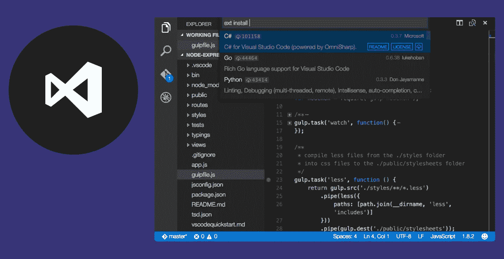
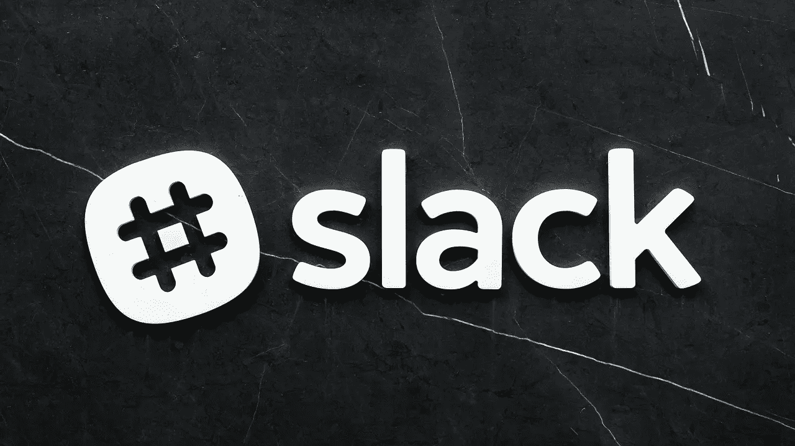
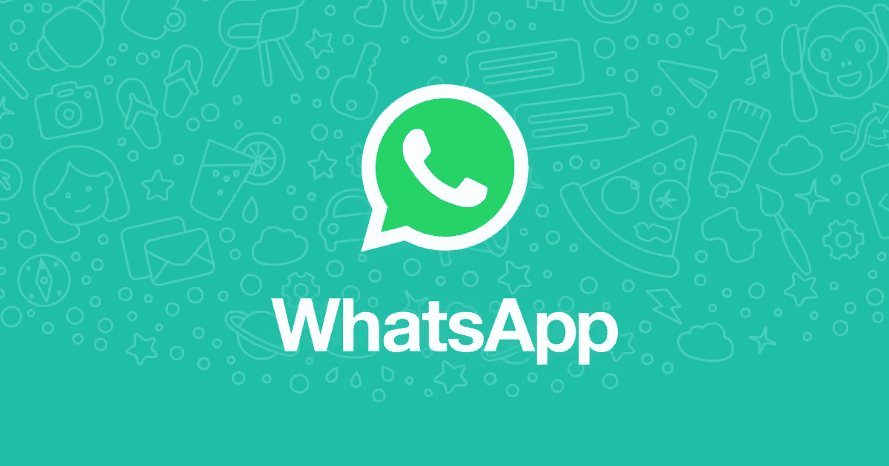
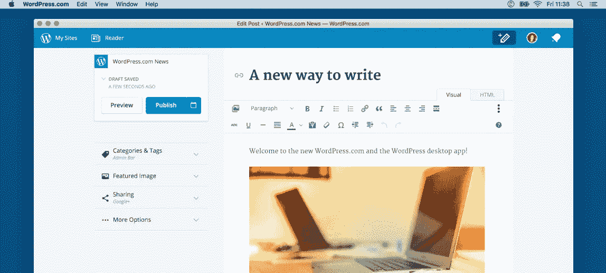

# 五个你不知道的神奇应用是用 Electron.js 做的

> 原文：<https://javascript.plainenglish.io/five-amazing-apps-you-didnt-were-made-with-electron-js-2cb1778a3648?source=collection_archive---------8----------------------->

Photo by [israel palacio](https://unsplash.com/@othentikisra?utm_source=medium&utm_medium=referral) on [Unsplash](https://unsplash.com?utm_source=medium&utm_medium=referral)

Electron.js 是一个惊人的框架，用于从现有的组件开始构建 GUI 桌面应用程序，最初是为 web 应用程序开发的。今天，我在这里试着给你一个**简短的展示**关于神奇的桌面应用程序，你 p **可能不知道在哪里使用这个神奇的工具开发的！**

这不仅对你来说是一个有趣的列表，而且对所有开发人员来说也是一个鼓舞，让他们开始用这个框架进行**试验**，以便自己构建令人惊叹的跨平台应用程序！
我们开始吧。

# Visual Studio 代码

我在以前的一篇文章中已经提到过这个令人惊奇的文本编辑器。这主要是因为我真的相信这个工具有多神奇。自从发布以来，**这个强大的代码编辑器已经成为软件开发人员首选的工具。**它不仅提供了成千上万个优秀的软件包供您下载，使您的体验根据您的需求定制(也使它成为一个完全打包的 ide)，而且它基本上也非常适合每种类型的任务或语言！从 Javascript 到 Python，经历了 Java 和 C++。

# 松弛的

如果你是一名开发人员，那么你可能已经在使用 Slack 了。这种交流工具是行业中的一种标准，适用于希望随时了解项目工作流程中发生的事情的开发人员。多亏了这个工具，也多亏了电子，交流和互动变得容易了！Slack 实际上是一个电子应用程序，使用这个框架是为了提供这个平台的桌面版本。这使得 Slack 背后的团队能够提供一种更专注、更有组织的方式来使用该应用程序。

# WhatsApp 桌面

能够让下载量最大的消息应用程序之一在桌面上使用？你当然可以用电子设备做到这一点，这也正是 WhatsApp 桌面所发生的事情。Electron 允许该软件背后的团队将已经构建好的组件打包，并使用它们为用户实现新的体验。

Whatsapp logo

# Pexels 桌面应用程序

作家、设计师和公关人员的神奇产品。由于该应用程序的一些内部功能，Pexels 背后的团队决定将其制作成桌面应用程序版本，当然，这要归功于 Electron.js

# WordPress 桌面

内容管理系统的标准。每一个像 WordPress 这样优秀可靠的软件都值得拥有一个桌面应用程序，它可以进一步增加可用性和整体体验，同时保持真正的跨平台性！

# 结论

电子是这个令人惊奇的工具，我希望它能在我们开发人员的未来生活中占据重要的位置。这篇文章的目标是让你意识到这个工具可以提供多少可能性，即使你可能不知道，这个工具基本上已经无处不在了！