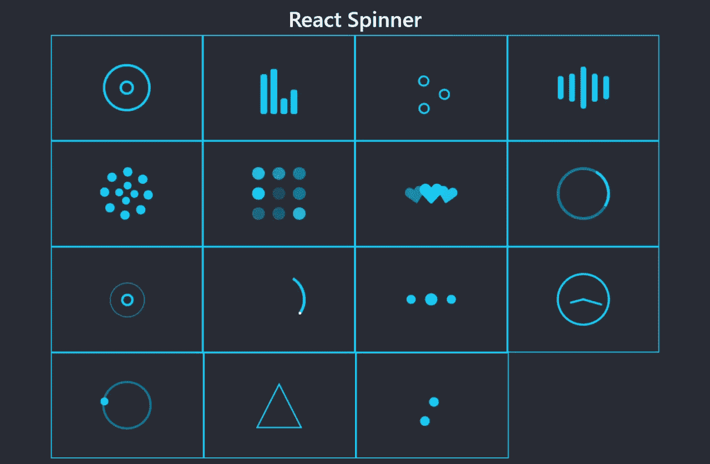
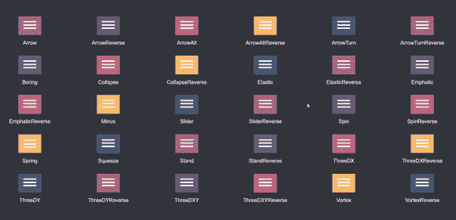
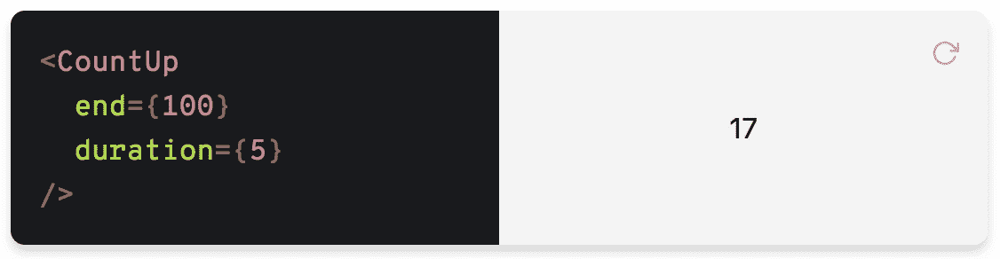
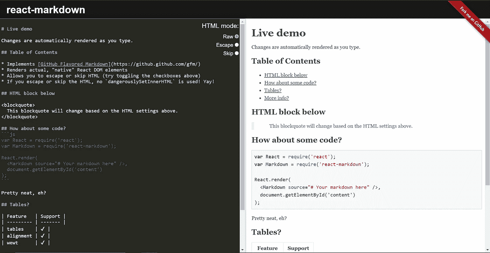

# 五个牛逼的 React 包来看看

> 原文：<https://javascript.plainenglish.io/five-awesome-react-packages-to-check-out-1ee42f2c19f7?source=collection_archive---------1----------------------->

## 这些包将帮助你做一些小的(但强大的)改变，帮助你的应用从竞争者中脱颖而出

# 1.反应装载机旋转器

没有人喜欢等待。用户现在期望一个快速的网站作为最低要求。如果你的应用程序很重或很慢，在你的内容加载时显示这些现代加载动画之一。除了提高你的应用的美观度，还有助于留住用户。

All the different loading animations offered by this package

直接从`npm`或`yarn`安装:

现在添加所需的导入语句:

并将其添加到项目中:

有关更多信息，请参考文档:

 [## 反应装载机旋转器

### react-spinner-loader 提供了简单的 React SVG spinner 组件，可以实现异步等待操作…

www.npmjs.com](https://www.npmjs.com/package/react-loader-spinner) 

# 2.反应动画汉堡

这个包是用来给导航栏添加动画菜单图标的。它有无数的图标和动画。定制和添加到您的项目中真的很容易——我已经愉快地使用它很多次了。

A few of the different animations offered by the react-animated-burgers package

像所有的`npm` / `yarn`包一样，它可以通过一行代码轻松安装:

要将它添加到您的项目中，只需选择一个动画图标并导入它:

然后，您可以轻松地将它添加到页眉或导航栏中:

与往常一样，请参考软件包的文档以获得最准确和最新的信息。

 [## 反应动画汉堡

### 安装 NPM I-S react-animated-burgers style-components 或 yarn add react-animated-burgers…

www.npmjs.com](https://www.npmjs.com/package/react-animated-burgers) 

# 3.反应响应转盘

许多网站在他们的网站上有旋转木马，无论是展示他们的产品，他们的团队成员，还是关于公司的一般信息。如果你有兴趣在你的站点上添加一个 carousel，你可能会遇到很多半成品或者不合格的包。不像其他的，这个包是强大的，轻量级的，完全可定制的。

A working demo of the carousel (unfocused)

安装软件包:

要将其添加到项目中，请添加以下导入语句:

然后，您可以轻松地将其添加到您的网站:

这个软件包提供了很多控制和自由。为了充分利用这个项目的范围，请访问 GitHub 资源库获取示例。

 [## 反应-响应-旋转木马

### React 应用程序的强大、轻量级和完全可定制的轮播组件。响应式移动友好滑动到…

www.npmjs.com](https://www.npmjs.com/package/react-responsive-carousel) 

# 4.反应计数

在您的网站上显示公司统计数据从未如此简单。这个包允许你突出和突出你的令人印象深刻的数字与动态计数器(相比，静态文本融入)。

安装软件包:

要将其添加到项目中，请将这些内容添加到项目文件的顶部:

这里有三个简单的用例:

如需更多高级功能和自由度，请参考软件包页面。

 [## 反应计数

### CountUp.js 周围的 React 组件包装

www.npmjs.com](https://www.npmjs.com/package/react-countup) 

# 5.反应降价

对于喜欢 Markdown 语言提供的效率和简单性的人来说，您会很高兴知道在 React 代码中使用 Markdown 有一种简单的方法:只需使用这个包！

用`npm`安装:

Note: Unfortunately, this package does not support installation with yarn

将所需的语句添加到代码中:

并开始使用它！

记得查看官方页面，获取最准确和最新的信息。

 [## 反应-降价

### 将 Markdown 渲染为纯 React 组件。https://rexxars.github.io/react-markdown/ react-markdown 提供演示…

www.npmjs.com](https://www.npmjs.com/package/react-markdown) 

我希望你能发现这篇文章是有帮助的，并找到至少一个你想添加到你的应用程序中的有趣的包。

本文(以及其他文章)中使用的所有代码都可以在[我的 GitHub repo](https://github.com/VarunChilukuri/Medium-Examples) 中找到。

如果您觉得这篇文章很有帮助，可以考虑关注我的更多 React.js 文章，并在下面留下任何反馈或评论！

## 简单英语的 JavaScript

你知道我们有三份出版物和一个 YouTube 频道吗？在 [**找到一切的链接 plainenglish.io**](https://plainenglish.io/) ！