# 编写优秀的“parseUrl”函数的五个步骤

> 原文：<https://javascript.plainenglish.io/five-steps-to-write-an-excellent-parseurl-function-799f3a57f45b?source=collection_archive---------4----------------------->

## 掌握这个经典的面试问题，让你在面试中脱颖而出。


Photo by [Kon Karampelas](https://unsplash.com/@konkarampelas?utm_source=medium&utm_medium=referral) on [Unsplash](https://unsplash.com?utm_source=medium&utm_medium=referral)

我们知道查询字符串是 URL 的重要组成部分，出现在`?`之后，通常是`key1=value1&key2=value2`的格式。

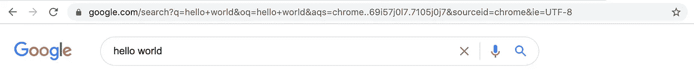

在上图中，`q=hello+world&oq=hello+world&aqs=chrome..69i57j0l7.7105j0j7&sourceid=chrome&ie=UTF-8`就是我们所说的查询字符串。

查询字符串往往包含很多信息，但这种字符串不方便直接使用。为了方便使用，我们需要将字符串转换为对象格式。

```
let str = 'key1=value1&key2=value2'; // not goodlet obj = {key1: 'value1', key2: 'value2'}; // good
```

那么如何编写一个优秀的‘parse URL’函数将查询字符串转换成对象格式呢？

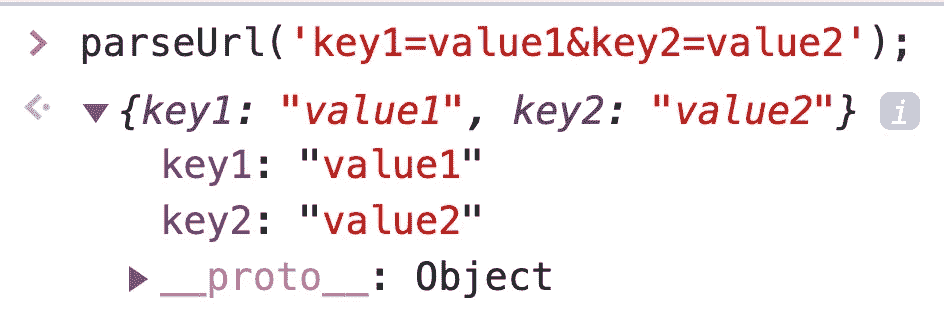

We need to implement this function

## 基本实现

显然，我们可以通过使用`&`来拆分字符串，然后使用`=`来拆分子串，从而获得每个键和值。

示例:

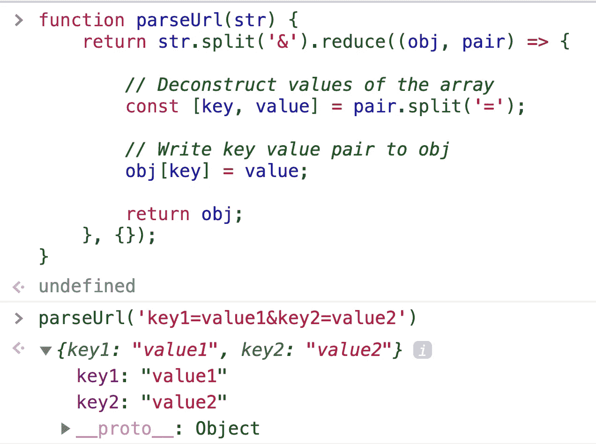

## 修复一个错误

但有时，查询字符串并不严格遵循`key=value`的格式。我们必须考虑这种情况。

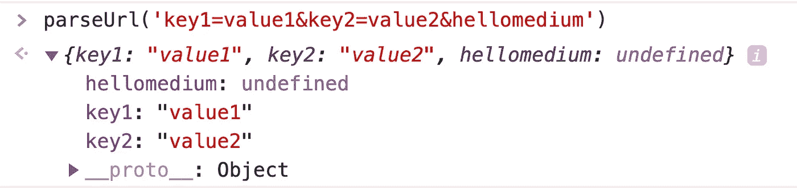

我们可以在代码中增加一个额外的判断语句:如果一个字段不符合`key=value`的格式，或者只有 key 没有 value，那么我们将忽略这个字段。

示例:

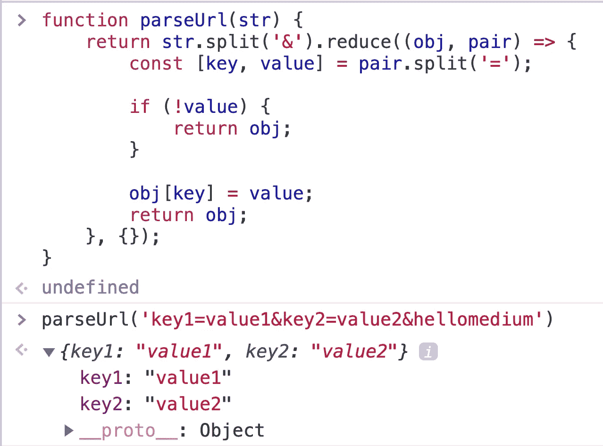

## 考虑对象类型

在上面的例子中，我们只考虑简单的查询字符串格式。其实查询字符串也可以这样写:`name[firstname]=Rock&name[lastname]=Lee&sex=man`。

如果我们使用前面的 pareUrl 函数，我们只会得到以下结果:

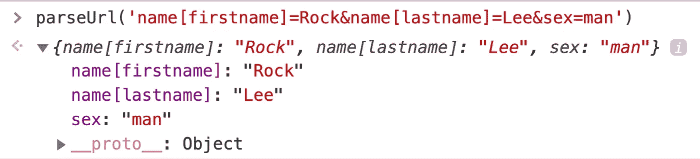

但事实上，我们希望得到这样的结果:

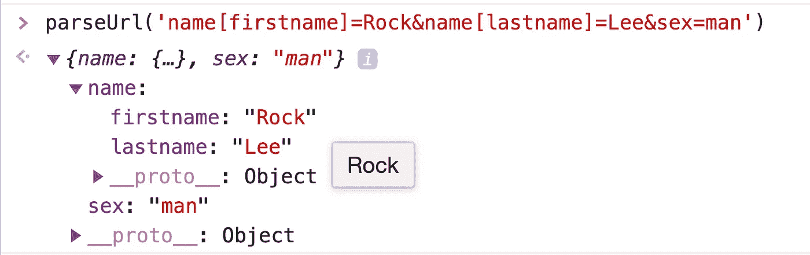

那么我们该如何改进我们的“parseUrl”函数呢？

实现并不复杂。我们可以用正则表达式匹配`[`和`]`，然后把字符串解析成对象格式。应该注意，这种对象格式的字符串可能有多个嵌套层次，我们需要在代码中考虑这一点。

示例:

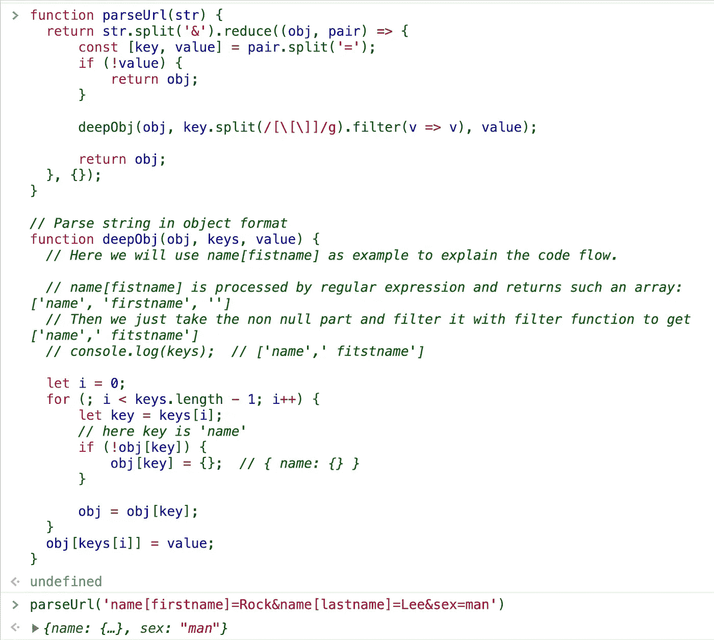

## 考虑数组

查询字符串不仅可以是对象格式，也可以是数组格式:`firend[0]=Tom&firend[1]=Jerry`。

本例中的代码与上一步中的代码很相似:如果键是一个数字，我们就把它当作一个数组。

示例:

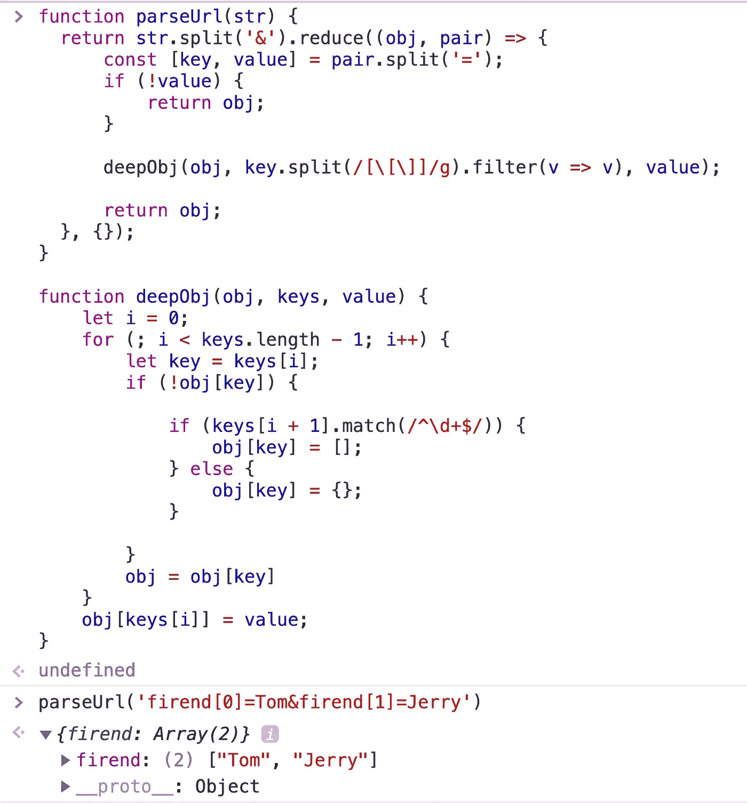

## 考虑编码

最后，我们知道像`+` `%`这样的特殊字符被编码在 URL 中。

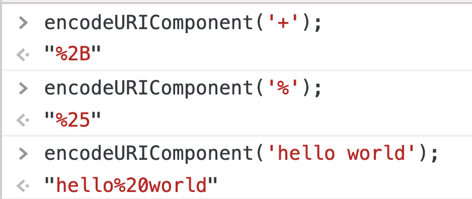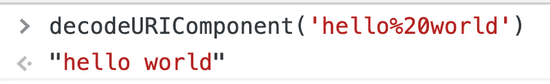

所以在代码中，我们还需要解码输入的查询字符串。

```
function parseUrl(str) {
   //...
}
function deepObj(obj, keys, value) {
    //...
    obj[keys[i]] = decodeURIComponent(value);
}
```

## **用简单英语写的 JavaScript 笔记**

我们已经推出了三种新的出版物！请关注我们的新出版物:[**AI in Plain English**](https://medium.com/ai-in-plain-english)[**UX in Plain English**](https://medium.com/ux-in-plain-english)[**Python in Plain English**](https://medium.com/python-in-plain-english)**——谢谢，继续学习！**

**我们也一直有兴趣帮助推广高质量的内容。如果您有一篇文章想要提交给我们的任何出版物，请发送电子邮件至[**submissions @ plain English . io**](mailto:submissions@plainenglish.io)**，并附上您的 Medium 用户名，我们会将您添加为作者。另外，请让我们知道您想加入哪个/哪些出版物。****