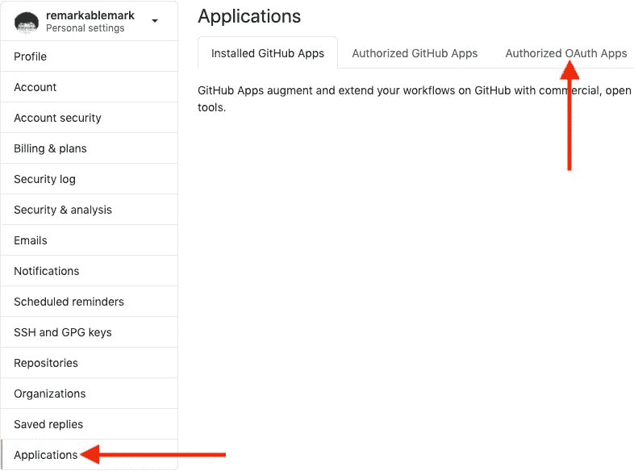

# 如何修复 GitHub 上的“丢失 Travis CI 构建”

> 原文：<https://javascript.plainenglish.io/fix-missing-travis-ci-build-on-github-3fcd1508411b?source=collection_archive---------12----------------------->

# 背景

[Travis CI](https://travis-ci.org/) 不再出现在我的 [GitHub](https://github.com/) PR(拉取请求)中。我所做的是重新设置 Travis CI 应用程序对我的 GitHub 帐户的访问，以使构建再次显示出来。

# 撤销访问权限

打开 [**设置**](https://github.com/settings/profile) :

然后进入 [**申请**](https://github.com/settings/applications) > **授权 OAuth 申请**:

从 **Travis CI for Open Source** 下拉列表中点击 **Revoke** :

# 重新授权申请

注销 [Travis CI](https://travis-ci.org/) ，重新登录，并重新授权应用程序访问 GitHub 帐户:

打开一个新的 PR 后，我可以看到 Travis CI 构建在**合并拉取请求**按钮旁边。

[*本文原载于《remarkablemark.org》2020 年 11 月 14 日。*](https://b.remarkabl.org/32N8CkC)