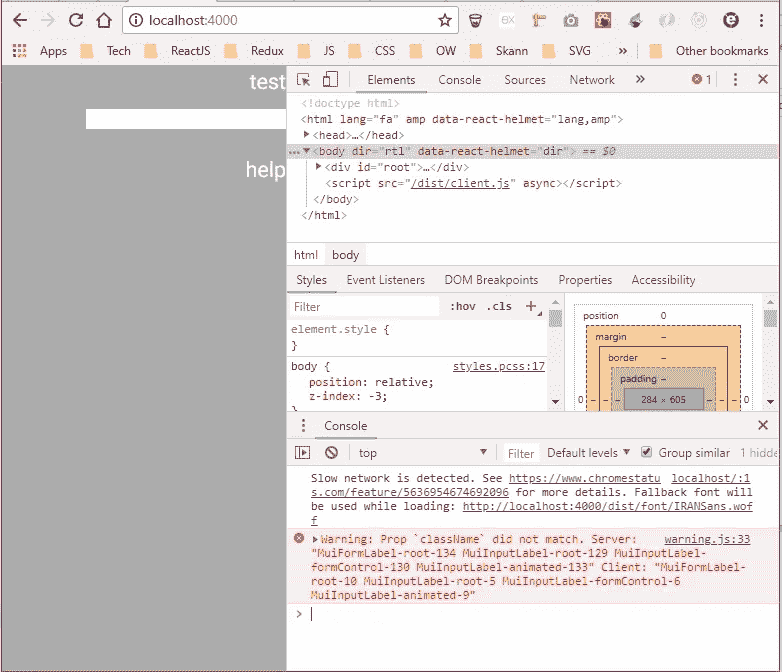

# 修复 React 的材质 UI 的类名不匹配

> 原文：<https://javascript.plainenglish.io/fixing-material-uis-classname-mismatch-for-react-75c6c2a2c409?source=collection_archive---------1----------------------->

## 使用材质 UI 修复 React 项目中不匹配类名的快速方法



Warning on browser about client and server having mismatched classNames

如果您曾经使用 React 的 Material UI 并试图测试它或覆盖某些类，您可能会遇到由于类名不匹配或注意到您在本地/开发服务器上看到的类名与您在另一个环境中看到的不同而导致快照失败的问题。

虽然有解决这个问题的方法(重新渲染你的快照，忽略它，声明一些对根类名重要的东西),但是解决方法非常简单。

**你需要什么:**

*   反应应用程序
*   @material-ui/core 至少 4.9 的版本(我不确定这对老版本是否有效，但试试也无妨)
*   两者都有一定的知识，React，使用材质 UI 等。

**理解为什么会这样:**

根据相关的 UI 文档，这是因为类名是不确定的，并且依赖于类名生成器。这就是为什么当您在浏览器中检查一个组件时，您会看到在 dev 中类名看起来像这个`.makeStyles-root-123`,而在 prod 中完全不同，或者一个版本在客户端，另一个版本在服务器上。

对于每个环境，生成类名的规则是不同的，这就是导致差异的原因。

```
Rules for developmentconst sheetName = 'makeStyles';
const ruleName = 'root';
const identifier = 123;

const className = `${sheetName}-${ruleName}-${identifier}`;
//generates .makeStyles-root-123Rules for Productionconst productionPrefix = 'makeStyles';
const identifier = 123;

const className = `${productionPrefix}-${identifier}`;//generates .makeStyles123
```

为了解决这个问题，我们需要使类名生成器具有确定性，并且是有意义的(即去掉那些生成的随机数，使类名成为我们想要的)。

关于这个话题的更多细节可以在这里找到[](https://material-ui.com/getting-started/faq/)****和[**这里**](https://material-ui.com/styles/advanced/#class-names)****

****让我们开始吧！****

1.  ****您需要将您的应用程序根包在`ThemeProvider`或`StylesProvider`中，我使用主题提供者。您还需要确保在整个应用程序中只使用其中一种。****
2.  ****此外，对于造型，你需要使用`withStyles/createStyles`****

```
**// Example of a simple style
const styles = createStyles({
  root: {
    display: 'flex',
    flexDirection: 'column',
  },  
  headerTitle: {
    fontSize: '14px',
  },
  label: {
    fontSize: '14px',
    width: 100
   },
 });**
```

****3.然后，您必须检查您的应用程序，并为您创建的每个样式添加一个名称，如下所示。名字**得用梅这样的**打头****

```
**// Example of a simple style with name
const styles = createStyles({
  root: {
    display: 'flex',
    flexDirection: 'column',
  },  
  headerTitle: {
    fontSize: '14px',
  },
  label: {
    fontSize: '14px',
    width: 100
   },
 }, 
{ name: 'MuiHeaderComponent' });**
```

****这将导致生成的组件去掉随机生成的数字，如果需要，类名将被标准化并可重写。它们看起来会像这样****

```
**.MuiHeaderComponent-root { /* … */ }
.MuiHeaderComponent-headerTitle { /* … */ }
.MuiHeaderComponent-label { /* … */ }**
```

****这就是解决此问题所需做的全部工作。如果这对你有用，请告诉我。如果没有，你找到了另一个解决方案，我很想听听。****

## ****简单英语的 JavaScript****

****你知道我们有四种出版物吗？通过 [**plainenglish.io**](https://plainenglish.io/) 找到他们——通过关注我们的出版物和 [**订阅我们的 YouTube 频道**](https://www.youtube.com/channel/UCtipWUghju290NWcn8jhyAw) **来表达爱意吧！******