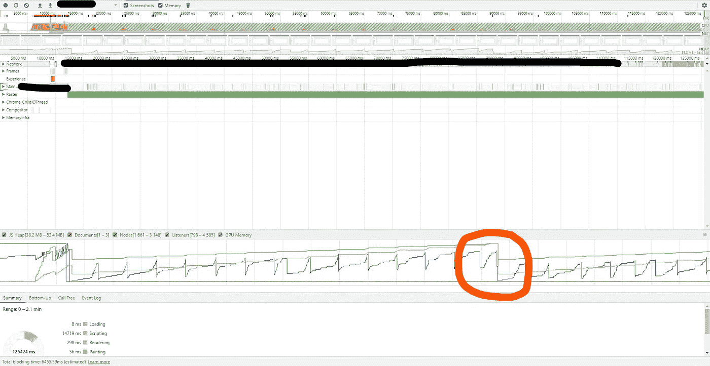
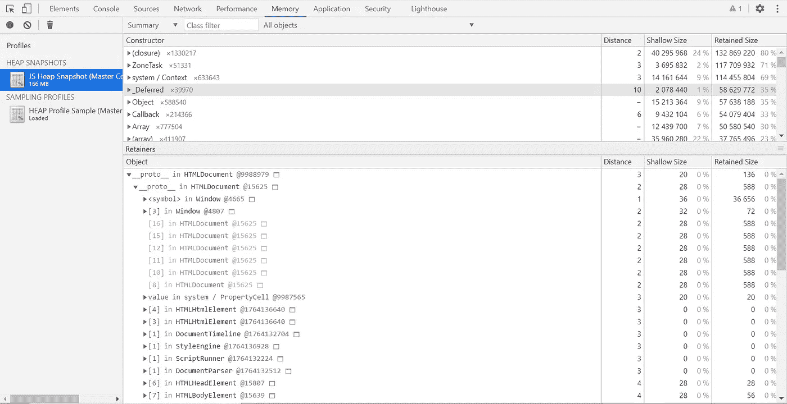
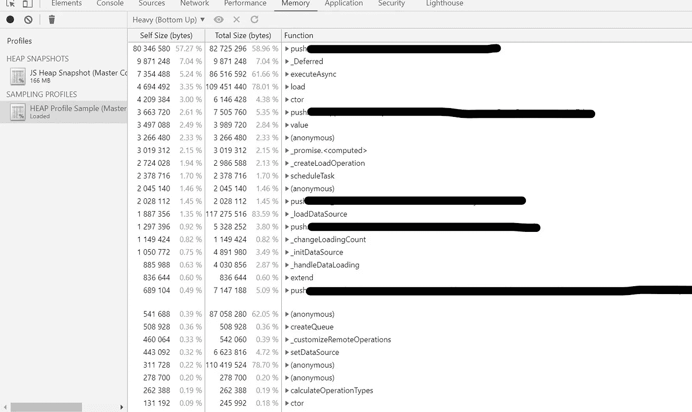

# 修复 JavaScript 中的内存泄漏

> 原文：<https://javascript.plainenglish.io/fixing-memory-leak-in-javascript-fa5fc8abd42a?source=collection_archive---------4----------------------->

Memory costs

内存泄漏是指应用程序使用的内存即使在使用后也没有释放的情况。这可能会导致操作系统分配给应用程序的内存比所需的多得多。在内存泄漏的情况下，内存分配是渐进的。应用程序的这种内存消耗将不断增加，直到操作系统耗尽它。

想象一下，你邀请一些客人来吃晚饭，他们拿走了你漂亮的陶瓷盘子，吃完饭后还不肯放手。然后非常优雅地继续拿更多，直到他们拥有一切。这基本上是内存泄漏。让我们看看 JavaScript 中内存泄漏的不同之处。

# JavaScript 中的内存管理

一般来说内存管理有 3 个过程:
1。分配
2。用法
3。收集/释放

你创建的每个对象/变量都要经历这三个阶段。这里我们关注的是最后一个过程:收集/释放。在 JavaScript 中，这个过程是隐式的，称为垃圾收集。

不幸的是，这种便利让我们忽略了应用程序的内存使用，导致 web 应用程序使用了比它实际应该使用的更多的内存。更糟糕的是，这使得即使是最简单的应用程序也更容易发生内存泄漏。

那么，如何识别内存泄漏呢？

# 识别内存泄漏

1.  **内存泄漏初步测试:** 当您导航到 web 应用程序中的某个页面时，性能会在一段时间内逐渐下降，这可能是内存泄漏的迹象。然而，这不是决定性的，因为这只是一个严重资源消耗的迹象，也可能是糟糕的网络或严重的 CPU 消耗。
2.  **内存泄漏的二次测试:** 你可以简单地在 chrome 中打开任务管理器，观察这个特定标签的内存占用情况。如果它持续增加，很有可能存在内存泄漏。
3.  **内存泄漏的决定性测试:** 前两个测试虽然有效，但只能检测到中度到重度的内存泄漏。有时内存泄漏真的很小，并且只有在很长一段时间后才会显示出它们的影响。这种方法甚至可以检测到最小的内存泄漏。因此，这是推荐的方法，以确保你的客人不会拿走你所有的盘子。这涉及到使用 Chrome inspector 的性能功能。

# **1。使用性能可视化泄漏**

以下是记录演奏的步骤:
1。打开 Chrome 检查器并导航到性能选项卡。
2。确保选中内存复选框。
3。单击录制按钮。
4。执行您怀疑导致内存泄漏的操作。
5。等待一段时间(30-60 秒)并停止录制。

现在是检查内存图的时候了。你会在屏幕上看到许多图表。您需要寻找下图所示的蓝色图表:

Normal JS Heap Performance

上图蓝色阶梯图就是你的 JS 堆。通常情况下，当页面加载时，随着对象的分配，您会期望内存增加，并且在垃圾收集时会发生下降(*标有橙色圆圈*)。当页面完全加载后，您会看到在内存消耗方面达到了平衡。该图将随时间在该最大值和最小值之间振荡。如果你的图表像这样，你的应用程序没有内存泄漏。万岁！让我们来看一个内存泄漏案例:

Memory Leak

JS 堆的这个阶梯图清楚地表明您的应用程序中存在内存泄漏。这里，dip 再次表示垃圾收集，但是，在这种情况下，内存分配随着时间的推移不断增加。最终，页面性能会显著下降。这证实了你的应用有内存泄漏。

有时候，图表不是很清晰。在这种情况下，您需要记录更长时间的性能，以查看长期趋势。现在我们知道我们有一个内存泄漏，是时候修复它了。

# 2.修补漏洞

“Debugging is a crime scene where you are the detective, the victim and the criminal”

我们需要从确定导致内存泄漏的嫌疑人开始。Chrome Inspector 中的内存标签将帮助我们做到这一点。

单击内存选项卡。这里，您有三个选择来拍摄内存快照:

1.  [**JS 堆快照**](https://developers.google.com/web/tools/chrome-devtools/memory-problems/heap-snapshots) **:** 显示 JS 对象和 DOM 元素的内存分布。
2.  **时间线上的分配检测:**显示特定时间间隔内的 JS 对象内存分配。这用于隔离内存泄漏。
3.  [**分配采样**](https://developers.google.com/web/tools/chrome-devtools/memory-problems/allocation-profiler) **:** 按 JS 执行任务分解内存分配。具有最少的性能开销。

这里我们主要关注 JS 堆快照和分配采样。您可以选择它们中的每一个并记录快照。

# JS 堆快照

JS Snapshot of a page

这里可以看到哪个 DOM 元素占用了最多的内存。这样，您就可以隔离内存泄漏嫌疑并进一步调查。正如您在图像中看到的，我们列出了对象和距离、浅尺寸以及保留尺寸。

距离是从 DOM 中的根节点开始的元素长度。浅层大小指的是对象本身的大小，如数组、JS 对象、变量等。保留尺寸是删除对象后*可以保留的尺寸。如果嫌疑对象是一个重复出现的 DOM 元素或一个不断增加的 JS 对象，这可以大大缩小搜索范围。*

# 分配抽样

Allocation Sampling example

在分配采样中，您可以看到基于单个函数的内存分布。你可以在顶部按权重排序，这样可以列出占用内存最多的函数。一旦知道了函数名，就可以调查该函数所属的代码片段，并找出导致泄漏的原因。

# 结论

这是调试内存泄漏的一种非常有效的方法，可以解决 web 应用程序中大多数严重的内存泄漏问题。是时候拿回你的陶瓷盘子了！

如果这篇文章对你有帮助，请关注我，我写代码，讲故事。干杯！