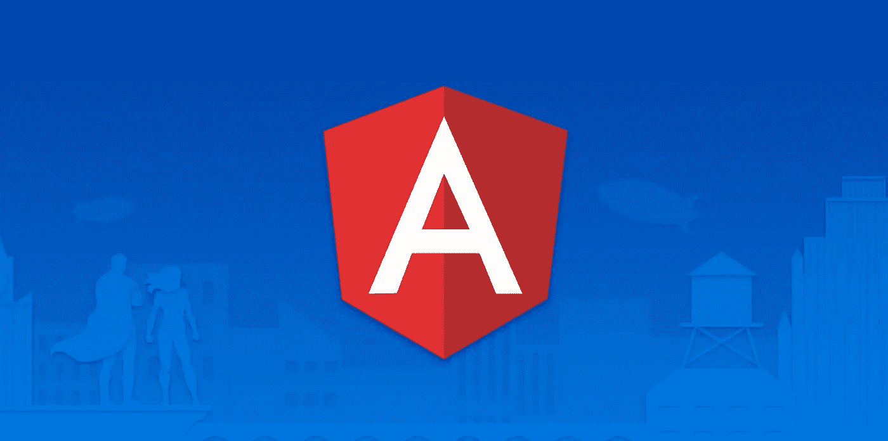

# 使用角度 DI 修复“无法解析所有参数”异常

> 原文：<https://javascript.plainenglish.io/fixing-the-cant-resolve-all-parameters-exception-with-angular-di-1091af1b080?source=collection_archive---------1----------------------->

## 昨天，在应用程序中实现一个新服务时，我偶然发现了一个令人困惑的问题

在本文中，我将解释它是什么以及如何解决它…

# 问题是

创建角度服务是我经常做的事情，不会忘记如何做。正如我在上一篇文章中所解释的，我通常更喜欢为我的服务定义接口和实现。

多亏了一个[注入器](https://angular.io/api/core/InjectionToken)允许我注入接口，但更重要的是，在我的测试中很容易模拟出依赖关系。我并不是说这是不可能的，但是我发现这种方法更加简洁明了。

这正是我所做的，只是意识到在应用程序启动期间出现了依赖注入错误。显然，安格尔找不到我新定义的服务。很奇怪，因为我只是用了同样的方法。

错误如下所示:

无法解析 QuillConfigurationDirective 的所有参数:[对象对象]，(？).

(？)表示 Angular 无法解析构造函数的第二个参数:

像往常一样，我在使用 Angular 的 [Inject](https://angular.io/api/core/inject) 装潢师的注射令牌。没有什么不寻常的事情…

所以我检查了所有的东西。多次……但找不到原因。

我的注射令牌定义正确，将字符串映射到类型:

我的服务正确设置了[可注射](https://angular.io/api/core/Injectable)装饰器:

在我的模块的 forRoot 静态方法中正确声明了一个提供程序:

在我的应用程序的根模块中正确调用了 forRoot 方法:

那会是什么呢？？！

很明显，错误在于上面的代码示例。

# 快速(臭虫丑陋)的解决方法

在花了一点时间试图了解根本原因后，我决定尝试其他的方法。

通过删除 InjectionToken 并简单地使用 providen:root，问题确实得到了解决。

但这不是解决方案，只是一种变通方法。

虽然，它给了我一个提示:问题实际上是在注射层面，无论是在“声明”方面，还是在注射方面。

# 根本原因和正确的解决方案

在谷歌了一会儿后，我偶然发现了下面的 [SO 问题](https://stackoverflow.com/questions/37997824/exception-cant-resolve-all-parameters)，这(像往常一样)给了我解决方案:这是进口的问题！

该错误确实是由我的核心模块中的以下导入引起的:

```
import { CORE_QUILL_EDITOR_CONFIGURATION_SERVICE } from "@app/core";
import { QuillEditorConfigurationServiceImpl } from "@app/core";
```

事情是模块中的**元素应该使用属于同一个模块的元素的相对导入；它们永远不应该通过模块的公共 API 桶**导入。

这个导入的问题是，如果依赖于服务的东西首先被加载到桶中(直接或不直接)，那么 DI 系统将会失败，因为服务还没有被声明，因此不能被解析…

我被不正确的汽车进口咬了好几次，更普遍的是，被桶咬了。也难怪棱角队不再那么喜欢桶了(阿发克)。

所以最终，固定进口只是相对的:

```
import { CORE_QUILL_EDITOR_CONFIGURATION_SERVICE } from "./services/quill-editor-configuration.service.constants";
import { QuillEditorConfigurationServiceImpl } from "./services/quill-editor-configuration.service";
```

从那以后，再也没有注射的问题了！唷。

请注意，此解决方案可能并不适用于所有情况。如果两个元素之间存在循环依赖，那么解决方案可能是使用一个 [forwardRef](https://angular.io/api/core/forwardRef) 。

# 结论

在本文中，我们已经看到了导入问题有多隐蔽，造成了像这样难以理解的问题。

我的总体建议是，总体上要非常小心进口和桶。不要盲目相信你的 IDE 不幸的是，有时它会在不应该的时候从桶中导入元素，从而产生问题。

今天到此为止！

PS:如果你想学习大量关于 TypeScript、Angular、React、Vue 和其他酷主题的其他酷东西，那么不要犹豫[拿一本我的书](https://www.amazon.com/Learn-TypeScript-Building-Applications-understanding-ebook/dp/B081FB89BL)并订阅[我的简讯](https://mailchi.mp/fb661753d54a/developassion-newsletter)！

## **用简单英语写的 JavaScript 笔记**

我们已经推出了三种新的出版物！请关注我们的新出版物，表达对它们的爱:[](https://medium.com/ai-in-plain-english)**[**UX**](https://medium.com/ux-in-plain-english)[**Python**](https://medium.com/python-in-plain-english)**——谢谢，继续学习！****

****我们也一直有兴趣帮助推广高质量的内容。如果您有一篇文章想要提交给我们的任何出版物，请发送电子邮件至[**submissions @ plain English . io**](mailto:submissions@plainenglish.io)**，并附上您的 Medium 用户名，我们会将您添加为作者。另外，请让我们知道您想加入哪个/哪些出版物。******

************